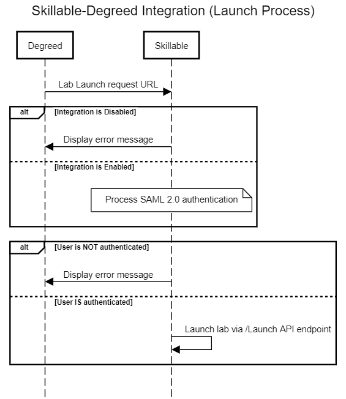
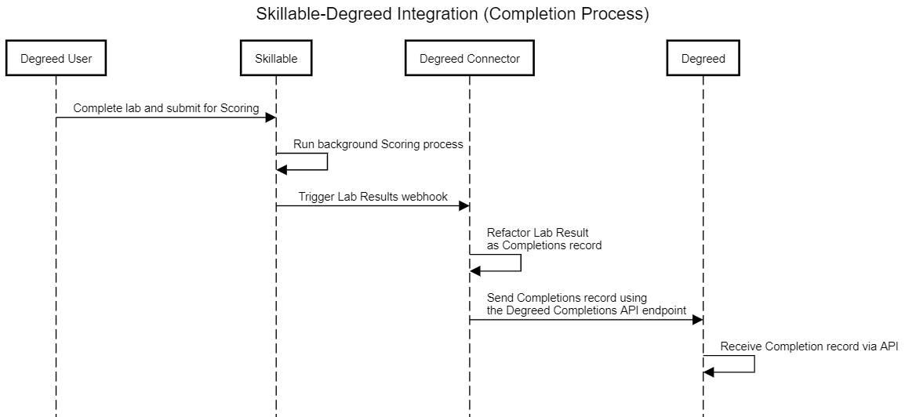

(**This is intended to be an INTERNAL document**)

The Degreed Connector has been developed as a tightly coupled integration between the Degreed platform and Skillable Labs. This custom connector allows Degreed customers to be easily configured to receive a daily catalog of updated labs that is used to automatically create and maintain courses on the Degreed platform. It also allows Degreed customer's users to launch labs directly from courses and receive basic completion records. This article will outline the specific steps required to fully onboard and configure a Degreed customer to use the Degreed Connector.

## In This Article 

- [Required Permissions](#required-permissions)
- [Best Practices](#best-practices)
- [Skillable Insights Configuration](#skillable-insights-configuration)
- [API Consumer Configuration](#api-consumer-configuration)
    - [Requesting an API Consumer](#requesting-an-api-consumer)
    - [Configuring the Results Webhook](#configuring-the-results-webhook)
- [Degreed Connector Processes](#degreed-connector-processes)
    - [The Catalog Process](#the-catalog-process)
    - [The Lab Launch Process](#the-lab-launch-process)
    - [The Lab Results Process](#the-lab-results-process)
- [Next Steps](#next-steps)
- [Reference Materials](#reference-materials)

This article will cover the basic processes enabled through the Degreed Connector including an overview of the various connector processes as well as the configuration of the Customer in Insights and the setup of an API Consumer with the definition of the Results Webhook.

## Required Permissions

To use the Skillable Studio features described in this article, the user account must be granted specific permissions. If you are unable to access these features, you may not have the proper permissions, please reach out to our [customer support team](http://www.skillable.com/customer-support/) for assistance. 

Permissions are required for
- Accessing the Skillable Insights Control Panel for administrating customers
- Creating and configuring API Consumers
- Defining a results Webhook

## Best Practices

The Degreed Connector has been designed to be as simple to configure and use as possible. To ensure that a customer is configured properly it is important to follow these best practices.

- Each API Consumer can only be configured for use in a single Degreed environment. Although this is typically the primary geographic location that the customer operates in it is important to confirm with the customer which environment they are configured for within the Degreed platform.

- The Degreed Client ID and Secret are required for returning Lab Completion results to the Degreed platform. Ensure that the Degreed Client Secret is only communicated using secure methods like **Password Pusher** (See: [https://pwpush.com/](https://pwpush.com/ "Password Pusher")).

- The customer's catalog of labs must be published to a Skillable API Consumer. Ensure that the API Consumer is appropriately configured for simple lab launch capabilities.

- The Degreed Results Webhook, configured as part of the API Consumer, is required to properly return lab completion results to the Degreed platform. Follow the instructions in the **Configuring the Degreed Results Webhook** document for details on how to define the correct Webhook configuration.

## Skillable Insights Configuration

Skillable Insights is the administrative location for the Degreed Connector. This is where an API Consumer will be associated with a Degreed Customer and the required customer information can be recorded to enable the Catalog, Launch, and Results processes for the customer.

**NOTE**: A customer account must exist in Skillable Insights in order to create the Degreed Connector configuration. If you are unable to create a customer account within Skillable Insights, please reach out to our [customer support team](http://www.skillable.com/customer-support/) for assistance.

The following are the instructions for configuring the Degreed Connector for a customer:

1. From within the Skillable Insights Control Panel, select **Customers** from the left menu.

1. Search for the customer that will be configured for the Degreed Connector and select the **Info** link in the **Customer Info** column on the right of the customer record to open the Administration Dashboard.

1. Below the customer Address and Description sections select the **STUDIO** tab and navigate down to the **API Consumer(s)** section.

1. Find the API Consumer that you wish to configure for the Degreed Connector and enter the following values gathered from the customer: **NOTE**: The customer can be provided with the ** Obtaining the Required Degreed Connector Information** document for gathering the required information.

    | Field | Notes |
    |:---|:---|
    | **Degreed Customer ID** | • This value is supplied by Degreed. • This is generally the numeric value displayed in the Browser URL Address when logged in to the **Manage** section of Degreed. • Example: https://companyABC.degreed.com/orgs/**123456**/settings. • Clearing this value will archive the customer's Skillable content in Degreed as well as disable Lab Launch and Lab Results processes. |
    | **Degreed Environment** | • This value is supplied by Degreed. • This value will generally correspond to the customer's primary geographic location. • Possible values include: &nbsp;&nbsp;&nbsp;• US Production &nbsp;&nbsp;&nbsp;• EU Production &nbsp;&nbsp;&nbsp;• CA Production (Canada) &nbsp;&nbsp;&nbsp;• US Beta (for testing) &nbsp;&nbsp;&nbsp;• EU Beta (For testing. Not common.) |
    | **Degreed Client ID** | • This is created as part of a Degreed Provider Key. • See **API Keys** in the Degreed Authentication Guide. &nbsp;&nbsp;&nbsp;• See: [https://developer.degreed.com/docs/authentication](https://developer.degreed.com/docs/authentication "Degreed Authentication Guide") |
    | **Degreed Client Secret** | • This is created as part of a Degreed Provider Key. • The Client Secret is only displayed once when the Provider Key is created. • It is recommended that the customer send this value to Skillable using **Password Pusher** or another secure method. &nbsp;&nbsp;&nbsp;• See: [https://pwpush.com/](https://pwpush.com/ "Password Pusher") |
    | **Degreed SAML Metadata URL** | • This value is supplied by Degreed. • This field identifies the SAML authentication for Lab Launch and Lab completion services. |
    | **Last Degreed Catalog Generation Date** | • This *read-only* field contains the date/time value when the customer's lab catalog was last generated and transferred to Degreed for processing. |

Once the Degreed Connector has been configured for a customer's API Consumer the Catalog process will compile a list of all the Lab Profiles that have been published to the API Consumer and, once every 24 hours, send this information to Degreed where it will be used to create and/or update Courses with direct launch links to the corresponding Labs.

## API Consumer Configuraton

The API Consumer is the heart of many Skillable Lab Launch activities. The Degreed Connector makes use of API Consumers by creating Lab Catalogs for each Customer's API Consumers and validating Lab Launches against valid API Consumers. As well, A webhook must be manually configured on the customer's API Consumer to be used to initiate the user's Lab Completion record.

### Requesting an API Consumer

API Consumers are a powerful feature of the Skillable platform. As such the are tightly controlled by permissions. If you have the ability and are familiar with the process to create and configure an API Consumer then only a minimal configuration is necessary for Lab Profile publication, Webhook creation and billing. Please refer to other documentation for instructions on creating and configuring a Skillable API Consumer (**NEED DOCUMENT REFERENCE**).

**NOTE**: If you are unable, or unfamiliar with the process, to create an API Consumer, please reach out to our [customer support team](http://www.skillable.com/customer-support/) for assistance.

### Configuring the Results Webhook

In order for the Degreed Lab Results process to correctly send user's Lab Completion records to Degreed a Lab Results Webhook must be defined and properly configured on each API Consumer that the customer wishes to use for the Degreed Connector. Refer to the document **Configuring the Degreed Results Webhook** for details on how to define the correct Webhook configuration.

**NOTE**: If you are unable to create a Webhook  API Consumer, please reach out to our [customer support team](http://www.skillable.com/customer-support/) for assistance.

## Degreed Connector Processes

The Degreed Connector provides a seamless route for many more users to experience skills based learning through Skillable Hands-On Labs. This is accomplished by providing Degreed customers a clear pathway for access to Skillable labs with the following functions:

- A daily automated update of Degreed courses encapsulating Skillable Labs.
- Authenticated Lab Launch from the Degreed Courses secured with SAML 2.0 authentication.
- Direct user lab completion reporting with basic lab results.

### The Catalog Process

Once a customer has been configured in Insights, an API Consumer has been created, and labs have been published to the API Consumer, a daily Catalog file will be created and sent to Degreed for processing to create, update or archive Degreed courses. 

Once each day Skillable Insights will be automatically queried to obtain the full list of customer organizations and their associated API Consumers that have been configured to use the Degreed Connector. This process will create customer specific catalog files and automatically upload them to Degreed for processing. The following automated process is used:

- For Each Customer (configured in Insights)
    - Create an empty Customer Content File
    - For Each API Consumer
        - Run the /Catalog API Endpoint to gather the list of labs
        - For each InstructionSset for each Lab in the list
            - Determine the Content Id (custom Lab Identifier) **NOTE**: Content Id consists of Lab ID + Internal Instructions ID + Degreed Connector ID
            - Build the Launch URL specific to this lab/Instruction set
            - Transform the Instruction Set/Lab data into the correct CSV format
            - Add the Instruction Set/Lab record to the Customer Content File
    - If a Customer Content File exists at Degreed
        - Remove the Customer Content File from Degreed
    - Securely upload the current Customer Content File to Degreed

Also, once each day Degreed will examine the existing Customer Content Files and add, update or archive the Degreed customer Course catalog appropriately.

- If an Course does not exist for a customer that corresponds to an Instruction Set/Lab record it will be created.
- If any information for a given Customer's Course has changed the corresponding Instruction Set/Lab record will be used to update the course.
- If an Instruction Set/Lab record can not be found for a specific Customer's Course then the Customer's Course will be archived.

**NOTE**: In all cases each Content File record will correspond to an unique Lab Profile's Instructions Set and Language combination and represents a specific course within a customer's Degreed catalog.

### The Lab Launch Process

The Degreed Connector - Lab Launch process is responsible for verifying the status of the Degreed Connector configuration, authenticating the user using SAML 2.0, and handling lab launch requests in a single, self-contained, service.

### The Lab Results Process

The Degreed Connector - Lab Results process involves receiving a lab ending notification from the Lab Results Webhook, converting the lab results to a Degreed Completion record and sending the user's Completion record to Degreed using the Degreed Completions API.

**NOTE**: For details of the Degreed Completions API refer to the Degreed documentation ([https://developer.degreed.com/reference/post_api-v2-completions](https://developer.degreed.com/reference/post_api-v2-completions "Completions API")).

## Next Steps

- For details on how to define a Webhook for the Degreed Connector refer to the **Configuring the Degreed Results Webhook** document for details.

- Forward the **Obtaining the Required Degreed Connector Information** document to the customer to expedite the retreival of important customer information.

### Reference Materials

- If this document is not part of a multi-step process, provide links to documents that could be a potential next step or a document that could be related.
