# Cloud Slice Guide - AWS

[Return to the Cloud Slice guide][back]

This document explains how to give the OneLearn Lab on Demand (LOD) platform permissions to each Amazon Web Services account that it will use, enabling labs to use those accounts when creating Cloud Slices.

The following are required to use AWS Cloud Slice with LOD:

- AWS account: must be a **root** account that can be set up as an organization. It cannot be a sub-account from an existing organization. 
- Billing must be set up on the account
- An IAM User Account must be created

## Enable Cloud Slice support in your AWS Account(s)

To enable Cloud Slice support, you must perform the following tasks once in each AWS Account that you want to use with OneLearn Lab on Demand:

1. Navigate to the [AWS Portal](https://aws.amazon.com/).

1. Click **sign in to the console**.

    

1. If you already have an AWS account, enter your **credentials**. If you do not have an account, click **Create a new AWS account**. 

1. Go to **My Organization** by clicking on your username in the upper-right corner.

    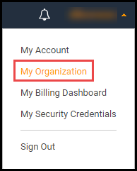

1. Click **Create Organization** and create an organization. 

1. Once the organization is set up click on **Organize Accounts** tab at the top of the page.

1. Click the checkbox next to **Root** in the center of the screen. 

    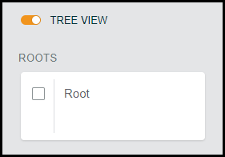

1. On the right side of the page, click **Enable** next to _Service control policies_. 

### IAM User Creation 

1. Click the **AWS icon** in the upper-left corner to return home. 

1. Under **Find Services**, search for **IAM**. 

    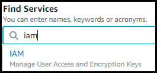

1. Click **IAM**.

1. Click **User** on the left side of the page. 

1. Click **Add User**. 

1. Enter a name for the user. I.E. _LODAPI_. The naming doesn't really matter, as long as the lab author will recognize it later. 

1. Next, select **programmatic  Access**. This enables an access key ID and secret access key for the AWS API, CLI, SDK, and other development tools. 

    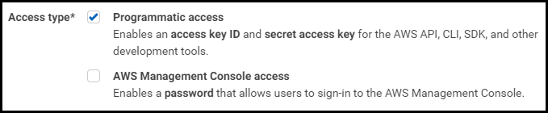
    
1. Click **Next: permissions**. 

1. Under Set Permissions, select **Attach existing policies directly**. 

1. In the _Filter Policies_ field, search for **Org**.

1. Click the checkbox to select **AWSOrganizationsFullAccess**. AWSOrganizationsFullAccessbe being assigned is required, so that the LOD service account can manage the organization created in previous steps. 

    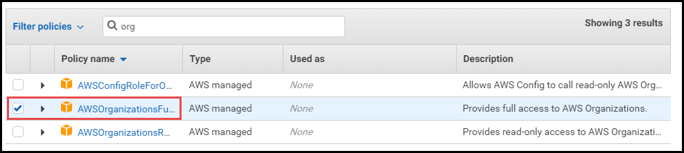

1. In the _Filter Policies_ field, search for **Admin**

1. Click the checkbox to select **AdministratorAccess**. This will allow LOD service account full access to manage the root AWS Account.

    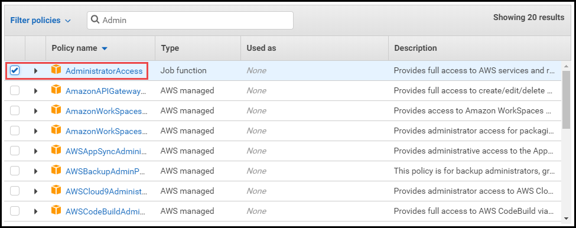

1. Click Next: tags.

1. Click Next: review.

1. Click **Create user**. 

    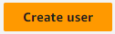

>[!alert] Record your access key ID and secret access key in a secure location. Once this page is closed, you will not be able to obtain this information again. If it is lost, the access key must be recreated from the user account settings. 

### Increase Maximum Amount of Accounts

Next, we need to increase the maximum amount of accounts that can be created. If you expect 20 lab users, you will need 20 accounts. It is a good idea to increase this amount to allow more accounts than needed, to ensure future events will be supported, or if more lab users join the event. A new ticket with AWS will need to be created each time this needs increased. 

>[!Knowledge] Over 1500 accounts requires additional correspondence on the ticket from AWS. They may want justification or more information about why so many accounts are needed.

To increase the maximum amount of accounts that can be created:

1. Click **Support** in the upper-right corner of the page. 

1. Click **Support Center**. 

    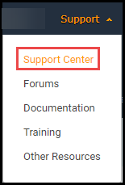

1. Click **Create Case**. 

    

1. Click **Service Limit Increase**. 

1. Under Case Classification; Limit Type, select **Organization**

    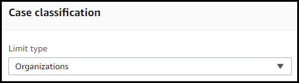

1. Under Requests; Limit, select **Number of accounts**. 

    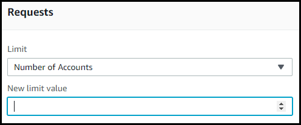

1. Enter the number of accounts for the upper limit to be increased to.

1. Under Case Description, enter a justification, or explanation of why you are increasing the number of accounts.

1. Under Contact Options, select **web**. If you prefer, you may selet a different language. 

    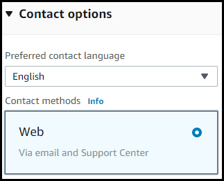

1. Click **Submit**. 

AWS generally responds within 24 hours, notifying that the case has been completed and limits are increased. The ticket confirmation is needed before setting up AWS Cloud Slice in Lab on Demand.
 
Once you have completed the above steps, and AWS has confirmed the maximum amount of accounts has been increased, you will need to [set up your Cloud Slice labs in LOD](aws-setup-cloud-sub-pool-in-lod.md). 

[Back to top][back-to-top]

[Return to the Cloud Slice guide][back]

[back-to-top]: #cloud-slice-guide---AWS "Return to the top of the document"
[back]: ../cloud-slice.md#enable-cloud-slice-support-in-your-cloud-platform "Return to the Cloud Slice guide"

