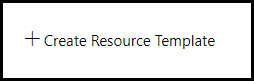
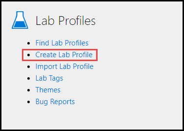
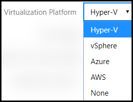

# Cloud Slice Guide

This guide will walk you through how to create a lab that provisions dynamically created cloud subscriptions to each student using that lab. These subscriptions may contain one or more cloud resources (virtual machines, networks, databases, websites, etc.). Each student will have access to the cloud subscription that is provided to them, along with the resources contained within that subscription, for the duration of the lab. The combination of one of these subscriptions with the resources contained within it is collectively referred to as a Cloud Slice.

There are two ways that cloud resources are made available within a Cloud Slice: as managed cloud resources and as unmanaged cloud resources.

Managed cloud resources are cloud resources that are more tightly integrated with the OneLearn Lab on Demand (LOD) user experience. They do not require the definition of Cloud Resource Templates to deploy them into a Cloud Slice, and instead use a more traditional user interface to configure the cloud resource options. At this time there are only two types of managed cloud resources: virtual machines and virtual networks. Managed virtual machines can also be displayed to students as tiles within the LOD UI, allowing students to easily view and interact with the desktop of those machines from directly within LOD.

Unmanaged cloud resources are cloud resources that are created during the deployment of a Cloud Slice as part of a Cloud Resource Template. Unmanaged cloud resources may also include any cloud resources that are created directly by a student or an event within a Cloud Slice. These resources are not directly integrated with the LOD user experience. To view and interact with unmanaged cloud resources, students must use the appropriate portal for the cloud platform that they are using in the lab.

The Cloud Slice feature allows you to create labs in the cloud that are pre-configured with compute, networking, and storage cloud resources, and/or that allow students to create their own compute, networking, and storage cloud resources as part of the steps they must complete within that lab. Before adding Cloud Slice support in your labs, there are several tasks you must perform. These tasks are listed below and any optional ones are appropriately marked with "(Optional)". As you work through these tasks, you can use the list below to navigate to the one you are currently working on and then return to the list to continue with another task.

1. [Enable Cloud Slice support on the cloud platform of your choice](#enable-cloud-slice-support-in-your-cloud-platform).
1. [Configure resource capacity limitations to allow your labs to scale](#configure-resource-capacity-limitations).
1. [(Optional) Upload any virtual hard disks that you want to use as a template into the appropriate storage container in your cloud platform](#upload-template-vhds-into-your-cloud-platform).
1. [Setup your cloud subscription(s) in OneLearn Lab on Demand](#setup-your-cloud-subscriptions-in-onelearn-lab-on-demand).
1. [(Optional) Create a Cloud Resource Template for each template that you want to use during the deployment of your lab(s)](#create-cloud-resource-templates-in-onelearn-lab-on-demand).
1. [Add Cloud Slice support to your lab profile(s\)](#add-cloud-slice-support-to-your-lab-profiles).

## Enable Cloud Slice support in your cloud platform

To expose the Cloud Slice capability to your lab(s), you must first grant the OneLearn Lab on Demand (LOD) platform access to the cloud platform that your students will be using within your lab(s). The steps required to grant this access depend on the cloud platform that you are working with.

> #### Lab scalability in a cloud platform
>
> LOD will automatically load balance Cloud Slices across the pool of subscriptions that Cloud Slice labs are configured to use. To take advantage of this load balancing functionality so that your cloud resources are managed properly, you may have to repeat several tasks on each cloud platform where you will be provisioning Cloud Slices. You also need to ensure that any limits on resources that are imposed by your cloud platform are configured appropriately to support your lab requirements. The combination of load balancing and appropriately configured resource limits are essential to allow your Cloud Slice labs to scale to support all students registered for your labs. See the documentation specific to the cloud platform you are using for more details on how to set that up.

Select one of the following cloud platforms to learn how you can grant the required access to that platform. If the platform listed is not a hyperlink, that platform is not yet supported for Cloud Slice labs.

1. [Microsoft Azure](microsoft-azure/azure-cloud-slice-setup.md)
1. [Amazon Web Services](aws/aws-cloud-slice-setup.md)
1. Google Cloud Platform (coming soon)

[Back to top][back-to-top]

## Configure resource capacity limitations

By default, cloud subscriptions come pre-configured with relatively low resource capacity limitations. These limitations are necessary for cloud platform providers to ensure that they are able to meet the demand of all customers, and they also help customers manage cost by preventing something or someone from creating too many of a certain type of resources. Resource quota increase requests may take extended periods of time for the cloud provider to fulfill, with times varying from hours to days, depending on the resources requested and the region the resources will be consumed in. To properly deal with these limits when creating one or more Cloud Slice labs that may need to scale to a large number of learners, it is imperative that lab authors determine the maximum number of resources that are simultaneously required within a single Cloud Subscription Pool and then scale the Cloud Subscriptions within that Cloud Subscription Pool accordingly well in advance of training events or classes to avoid running into resource limitations during the use of a Cloud Slice lab.

Select one of the following cloud platforms to learn how you can request for resource quotas to be increased on that platform. If the platform listed is not a hyperlink, that platform is not yet supported for Cloud Slice labs.

1. [Microsoft Azure](microsoft-azure/azure-capacity-limitations.md)
1. Amazon Web Services (coming soon)
1. Google Cloud Platform (coming soon)

[Back to top][back-to-top]

## Upload template VHDs into your cloud platform

*This is optional and should only be done if you want to include managed virtual machines that are running in your cloud platform within your Cloud Slice lab(s).*

If you want your students to be able to interact with the cloud virtual machines included in your Cloud Slice lab directly from within the OneLearn Lab on Demand (LOD) user experience, you need to include managed cloud virtual machines in your lab. Managed cloud virtual machines are provisioned as part of the Cloud Slice deployment process. They are dynamically created in the cloud platform you are using from a template virtual hard disk that is stored in the master cloud subscription in your subscription pool. The virtual hard disk file that they will access when launched is stored inside of the Cloud Slice. The specific location of the template virtual hard disk and the deployed virtual hard disk are defined using the optional settings on the Storage tab in the master subscription (see the next section, Create a Cloud Subscription...).

To prepare for the deployment of managed virtual machines in your Cloud Slice lab, you must upload the template virtual hard disk(s) that will be used by your managed virtual machines into your cloud platform. Select the cloud platform you are using with your lab from the list below to learn how to upload template virtual hard disk(s) into that cloud platform. If the platform listed is not a hyperlink, managed virtual machines are not yet supported on that platform.

1. [Microsoft Azure](microsoft-azure/cloud-slice-upload-template-vhds.md)
1. Amazon Web Services (coming soon)
1. Google Cloud Platform (coming soon)

[Back to top][back-to-top]

## Setup your cloud subscription(s) in OneLearn Lab on Demand

Once you have enabled Cloud Slice support in the cloud platform of your choice (see previous section), you need to create a Cloud Subscription Pool that contains one or more cloud subscriptions in OneLearn Lab on Demand (LOD). Each cloud subscription that you will be managing with this platform must be added to a Cloud Subscription Pool.

Cloud Subscription Pools are used by labs to provision Cloud Slices in a load balanced fashion. As users launch a Cloud Slice lab, they will be given access to a slice of one of the available subscriptions in the subscription pool associated with the lab. Even if you are only using one managed Cloud Subscription, you still must create a Cloud Subscription Pool. This setup allows you to add additional subscriptions to your subscription pool later, at which point you will gain the benefits of the load balancing support that the platform provides.

Load balancing evenly distributes Cloud Slices across subscriptions in a Cloud Subscription Pool. When a user launches a Cloud Slice lab, they are provided with a slice of whichever subscription in the pool has the lightest load (the lowest number of users) at the time. This load balancing distributes resource load across all of the subscriptions in the pool, which can help keep resource counts lower, avoiding any maximum limits that the subscriptions in the pool have on specific resource types. 

The first Cloud Subscription you add to a Cloud Subscription Pool is the master Cloud Subscription for that pool. The master subscription is the subscription that is used when creating managed virtual machines in Cloud Slices from template virtual hard disk files that are in the master subscription. 

To create a cloud subscription pool and configure it in LOD, select the cloud platform you are using with your lab from the list below to learn how to create and configure a subscription pool for use with that cloud platform. 

1. [Microsoft Azure](/guides/cloud-slice/microsoft-azure/azure-setup-cloud-sub-pool-in-lod.md)
1. [Amazon Web Services](/guides/cloud-slice/AWS/aws-setup-cloud-sub-pool-in-lod.md)
1. Google Cloud Platform (coming soon)

## Create Cloud Resource Templates in OneLearn Lab on Demand   

When you create a Cloud Slice lab, you can provide students with an empty cloud subscription from which to work, or a cloud subscription that includes resources that were provisioned when the student launched their lab. In order to set up the latter, you must define Cloud Resource Templates within OneLearn Lab on Demand (LOD) that you will later include in one or more lab profiles.

A Cloud Resource Template contains a template document that defines the resources that will be deployed in a Cloud Slice along with some parameter metadata. This metadata configures how parameters within that template document will be exposed to a lab profile. Each cloud platform uses a different template format. In Microsoft Azure, Azure Resource Manager (ARM) templates are used to deploy resources into an Azure subscription. In Amazon Web Services, CloudFormation templates are used. Cloud Deployment Manager templates do the same thing in the Google Cloud Platform. Regardless of which cloud platform you use, you need to create Cloud Resource Templates in LOD if you want to provision cloud resources as part of the lab deployment process.

Before you get started creating Cloud Resource Templates, you need at least one cloud platform template that you want to use in a Cloud Slice lab. If you haven't already identified templates that you want to use in your lab, select the cloud platform you are using with your lab from the list below to learn how to find templates for that cloud platform. If the platform listed is not a hyperlink, Cloud Resource Templates are not yet supported on that platform.

1. [Microsoft Azure](microsoft-azure/azure-cloud-slice-find-resource-templates.md)
1. Amazon Web Services (coming soon)
1. Google Cloud Platform (coming soon)
<!--
1. [Amazon Web Services](aws/aws-cloud-slice-find-resource-templates.md)
-->

Once you have identified one or more cloud platform template documents you want to use, you can create a Cloud Resource Template in LOD by logging on to the Lab on Demand portal and completing the following steps:

1. Click **Cloud Resource Templates** in the Cloud Services tile.

   

1. In the Cloud Resource Templates view, click **Create Resource Template** to create a new Cloud Resource Template.

   

1. In the Create Resource Template view, populate the following required fields in the **Create Resource Template** form:

   | Tab                   | Field Name                               | Description                              |
   | --------------------- | ---------------------------------------- | ---------------------------------------- |
   | **Basic Information** | **Name**                                 | The name you want to use to identify your cloud resource template. |
   |                       | **Use External Template** with **Template URL** | If you are referencing an external template document, check the Use External Template field and provide the URL to the external document in the Template URL field. |
   |                       | **Template**                             | If you are *not* referencing an external template document, paste the contents of your template into the Template field and leave the Use External Template field unchecked. |

   You may also provide values for the following optional fields:

   | Tab                   | Field Name               | Description                              |
   | --------------------- | ------------------------ | ---------------------------------------- |
   | **Basic Information** | **Description**          | Text used to describe the Cloud Resource Template that you are setting up. |
   |                       | **Organization**         | The organization in LOD where the Cloud Resource Template will be used. |
   |                       | **Enabled**              | Indicates whether or not the Cloud Resource Template is enabled. |
   |                       | **Required For Display** | When checked, indicates that the resource(s) provisioned by the template must be deployed before the lab will be made available to a student. When left unchecked, the resources will be provisioned in the background while the student begins their lab. |

   Below is a screenshot showing what the Basic Information tab might look like when you have finished.

   

1. If your Cloud Resource Template has parameters whose values you want displayed to students, or whose values must be set when the Cloud Resource Template is added to a lab profile, click the **Parameters** tab. From this tab you can either add individual template parameters by clicking the **Add Template Parameter** button, or you can add a set of template parameters by clicking the **Import From Json** button to import a JSON document that defines the parameters. In either case, you will end up with one or more parameters defined for your Cloud Resource Template. Each parameter has the following properties:

   | **Property Name**      | **Description**                          |
   | ---------------------- | ---------------------------------------- |
   | **Name**               | The name of the parameter. This must exactly match the name of a parameter that is defined in the template document (external or pasted into the basic tab). |
   | **Display Name**       | The display name of the parameter. This is the name that will be displayed to students using the Cloud Slice lab in the LOD Cloud Resources tab. |
   | **Description**        | The description of the parameter. This is displayed in a lab profile when a lab author reviews the parameters available to a resource template they are adding to a lab. |
   | **Required**           | When checked, a value must be provided for this parameter in each lab profile where the Cloud Resource Template is used. |
   | **Display To Student** | When checked, the parameter display name and value will be displayed to students in the Cloud Resources tab in the LOD UI. |

   Here is what the Parameters tab might look like once you have it configured for a Cloud Resource Template:

   

   If you want to remove a parameter that you mistakenly added, you can click the **Delete** button to the right of the parameter you want to remove.

1. Once you have configured your Cloud Resource Template, click **Save** to save it in LOD.

[Back to top][back-to-top]

## Add Cloud Slice Support to your lab profile(s)

Once you have configured your cloud platform to allow OneLearn Lab on Demand (LOD) to create Cloud Slices, configured one or more Cloud Subscription Pools, and optionally loaded template virtual hard disks into your cloud platform and/or loaded Cloud Resource Templates into the LOD platform, you are ready to add Cloud Slice support to your lab profile. If you feel you are missing any of the items that were just mentioned that you want to use in your lab, please review previous sections in this document to see if you missed any steps.

If you have not created a lab profile yet, create a lab profile now by clicking **Create Lab Profile** in the Lab Profiles tile. Otherwise, open the lab profile to which you want to add Cloud Slice support.

In a lab profile, there are many configurable options; however, only a small set of those options are directly related to Cloud Slice support. Once you have your lab profile opened, review the following options to ensure that you have them configured properly for your Cloud Slice lab.

### Virtualization Platform - Basic Information tab

The **Virtualization Platform** setting defines the platform used to launch managed virtual machines. If you have template virtual hard disks loaded into your master Cloud Subscription that you want provisioned and launched when the lab is launched, select the cloud platform where those template files are located (e.g. Azure). If you instead want your students to use virtual machines running in a Learn on Demand Systems datacenter while working with their Cloud Slice, select the virtualization platform that will be used to launch those VMs (e.g. Hyper-V or vSphere). If you don't have any managed virtual machines in your lab, select None.

> #### Best Practice: Setup support contacts for your Cloud Slice labs
>
> You should make sure that you have set the **Owner Name** and **Owner E-mail** fields correctly for this lab so that the right person can be contacted if there are problems with this lab during a scheduled class.

### Virtual Machines tab

If you have virtual machines that you are launching in your cloud platform when this lab is provisioned, open the **Virtual Machines tab** and click **Create Virtual Machine** to create a virtual machine profile for the template virtual hard disk in your cloud platform. This will open the Create Virtual Machine Profile view. When creating a virtual machine profile for a virtual machine provisioned in a cloud platform, there are only a few differences from the standard virtual machine profile creation process:

1. On the **Basic Information** tab, ensure that the **Platform** field is set to the cloud platform where the virtual machine will be provisioned.
1. In the **Machine Type** field on the same tab, select the size of the VM that you want provisioned when the VM is created. When choosing a VM size, pay close attention to the cost and the number of cores required for that VM. You must ensure that you have enough resources available in your subscription for all students taking your lab to provision VMs of the size you choose.
1. On the **Hard Disks** tab, click **Add Hard Disk** and type in the name of the template virtual hard disk file that you uploaded into your cloud subscription that you want to use as a template when provisioning this virtual hard disk.
1. On the **Network Adapters** tab, if you want a network adapter provisioned for the virtual machine, click **Add Network Adapter**, give that network adapter a name in the **Name** field, and configure the other options you want for your network adapter.

Those settings aside, the remaining settings for the virtual machine profile should be familiar to you if you have already created virtual machine profiles in LOD. Once you have finished creating the virtual machine, click **Save** to save it and then return to the **Create Lab Profile** view.

### Orchestration  - Cloud tab

To enable Cloud Slice support in your lab profile, open the **Cloud** tab, and in the **Orchestration** section, click **Choose** and select the Subscription Pool that will be used for your Cloud Slice lab. Once you have finished that, you should see something that looks like this:

### Cloud Resource Groups - Cloud tab

If you want cloud resources other than managed virtual machines to be provisioned as part of your Cloud Slice lab, you need to define one or more Cloud Resource Groups in Azure or an AWS Region in AWS, where those resources will be provisioned, and you need to add the Cloud Resource Template(s) that you want provisioned as part of your lab to the appropriate Cloud Resource Group(s).

The first step is to define a Cloud Resource Group. Click **Add Cloud Resource Group** if using Azure, or **Add Region** if using AWS, to add a resource group to your Cloud Slice. This will show you a form that allows you to define how the resource group should be created. The fields on that form are defined as follows:

| Field Name             | Description                              |
| ---------------------- | ---------------------------------------- |
| **Name Prefix**        | This is the prefix that will be applied to the resource group when it is created. All resource groups are created using the name prefix, followed by the lab instance id, and then the lab profile id. |
| **Region**             | Indicates the region where the resource group will be created. |
| **Permisisons**             | Select the permission level of the user account(s) added. Select the user, and then select the permission level to be given to that user.
||Reader: read-only access|
||Contributor: read-write access |
||Owner: read-write access with the ability to manage permissions |
| **Resource Template** | Resource templates define the cloud resources that will be provisioned in the cloud slice lab. To do this, click **Add Template**, use the Choose Cloud Resource form to find the Cloud Resource Template you want to add, and click **OK**. If the Cloud Resource Template you choose has parameters, an Edit Parameters window will appear allowing you to provide values for required parameters and for optional parameters as well if you want to. |
| **access control policy** | Some cloud platforms support using an access control policy to limit the operations that can be performed within a Cloud Slice subscription. These cloud platforms typically include a tool to define the access control policy for a subscription. For example, in Microsoft Azure, you can browse into the Subscriptions service, select a subscription, click Policies, and then click Add to create an access control policy that you can copy and paste into this field in your lab profile. You can learn more about Azure Resource Manager Policies by reviewing this <a href="https://docs.microsoft.com/en-us/azure/azure-resource-manager/resource-manager-policy" target="_blank">external document</a>. As a best practice, you should apply an access control policy that limits what students can create/manage to properly control your subscription costs and keep students focused on the work required for them to complete their lab. |

Use the steps above to add as many Cloud Resource Groups as you need in your Cloud Slice lab.

> #### Best Practice: Provide support contact information in the Errata
>
> You should share contact information for the person who should be contacted if subscription resources run out for a lab in the Errata for the lab. This will give students and instructors an easier method of recovery if all resources in a cloud subscription are consumed before a student tries to launch the lab.
>

[Back to top][back-to-top]

<!--
## Add a Cloud Exam to your lab profile(s)

If you want to add an exam to a Cloud Slice lab, the process is the same as adding an exam to a lab that does not include cloud resources. The only difference is in how you enable scoring of the Cloud Slice itself. To add an exam to the lab profile, open the **Exam** tab, check **Has Exam**, and select **Automated** in the **Scoring Type** field.

Once you have indicated you want an automated exam in your lab, you can add scoring items that can be used to score a Cloud Slice by doing the following:

1. Click **Add Scoring Item** in the **Scoring Items** section.
1. Optionally assign a different value to the **Score Value** field if you want that scoring item to be worth more than 1 point.
1. In the **Type** field, select **Cloud Subscription Scoring** from the list of options.
1. In the **Scoring Script** field, enter the PowerShell script you want to use to determine whether the student completed the work required to receive the value for that scoring item. This script will be run automatically against each student's Cloud Slice subscription. To include values relative to the specific Cloud Slice lab being scored, create a `param` block at the top of the script and include the parameters you want to reference from within your script. The parameters you can choose from are listed below.

### Parameters optionally sent to Cloud Slice PBT scoring scripts

| Parameter Name            | Sample Value                          |
| ------------------------- | ------------------------------------- |
| $TemplateName             | Complex network with multiple subnets |
| $TemplateId               | 15                                    |
| $LabProfileId             | 18122                                 |
| $LabInstanceId            | 294781                                |
| $SubscriptionName         | My Subscription                       |
| $SubscriptionId           | f162ec58-a25b-4996-9e47-277951ae52d1  |
| $TemplateStorageContainer | template-vhds                         |
| $InstanceStorageContainer | deployed-vhds                         |
| $SourceStorageAccountName | cloudslicestorage                     |
| $DestStorageAccountName   | cloudslicestorage                     |
| $PoolId                   | -1                                    |
| $StartTime                | 2017-08-10T18:32:03.26Z               |
| $ExpirationTime           | 2017-08-11T04:38:01.79Z               |
| $UserFirstName            | Jeff                                  |
| $UserLastName             | Smith                                 |
| $UserId                   | 12873                                 |
| $Username                 | jsmith                                |
| $UserEmail                | jsmith@example.com                    |

The screenshot below shows what adding a scoring item looks like. Note how the lab instance ID can be used by the script by including it in the `param` statement.

This screenshot shows you what you might see once you have added a scoring item to an exam for a Cloud Slice lab:

-->

[back-to-top]: #cloud-slice-guide "Return to the top of the document"
