## **Azure Resource Capacity Limitations**

[Return to the Cloud Slice guide][back]

Microsoft Azure has resource capacity limitations that should be considered in advance of training events or classes, to avoid running into limitations during the use of the Cloud Slice lab. After the class or event is scheduled, it is a good idea to estimate the amount of resources that will be needed during the event based on the number of lab users and the amount of resources that each lab user will need.

A support request must be made to Microsoft to adjust the amount of resources that are available to use in the Azure subscription. Depending on the resources requested, the region requested and severity of the request, it may take an extended amount of time for the support request to be fulfilled by Microsoft. To learn more about Azure quotas, click here [Azure Quotas](https://docs.microsoft.com/en-us/azure/azure-subscription-service-limits).

Requests are typically fulfilled by Microsoft within a few hours, depending on the amount of resources requested and the region requested. In some cases, it can take Microsoft several days or weeks to fulfill some requests, based on demand for the resources requested.

### **Submitting a Support Request to Microsoft** 

1. Click the **'?'** in the upper-right corner of the Azure portal

  

2. Click **Help + support**

  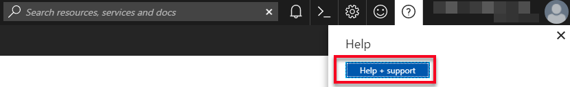

3. Click **New Support Request**

  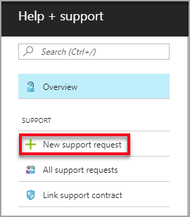

4. Select **Issue type**, then select **Quota**

  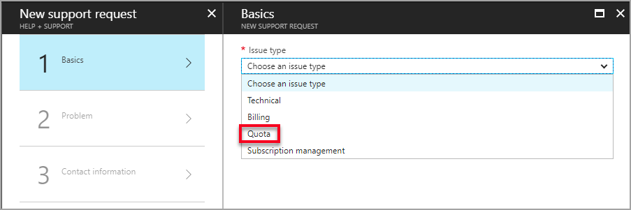

5. Select **Subscription** (if there are multiple subscriptions listed, be sure to select the appropriate subscription)

  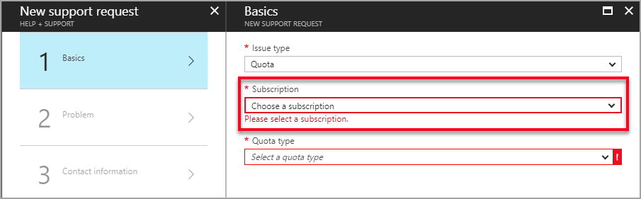 

6. Select **Quota type**. For example, you can choose Cores to increase the number of CPU cores that you want to be able to support in each region. See <a href="https://docs.microsoft.com/en-us/azure/azure-stack/azure-stack-quota-types">Azure Quota Types</a> for more information.

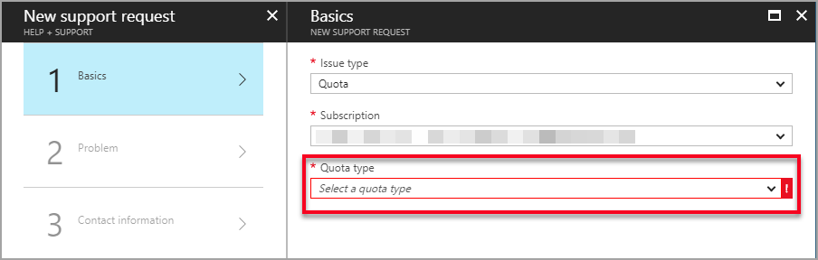

7. Select **Support plan**

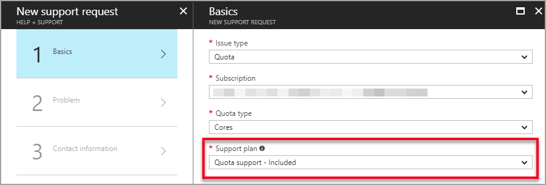
> - the 'i' icon reveals additional information. Clicking the icon enables the text to become stationary and easier to move the mouse to. 
>
>   

Click **Next** to proceed

9. 8. Select **Severity** 

> - Severity has 3 options; A - Critical impact, B - Moderate impact and C - Minimal impact.
> - Microsoft will downgrade requests marked with A Severity to B Severity, after the request is submitted.

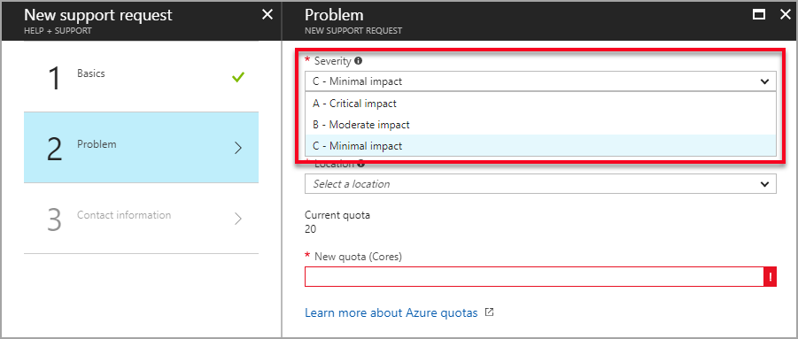

9. Select **Deployment** model
> - Typically **Resource Manager** should be selected for Cloud Slice labs.

10. Select **Location**
> - select the location geographically closest to the location where Azure resources will be used.
> - If the closest region is known to be busy, select the next closest region. 

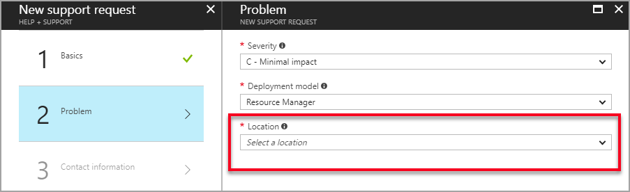

11. Select **Sku** 
> - For more information about Azure SKU families, see [here](https://azure.microsoft.com/en-ca/pricing/details/virtual-machines/series/).

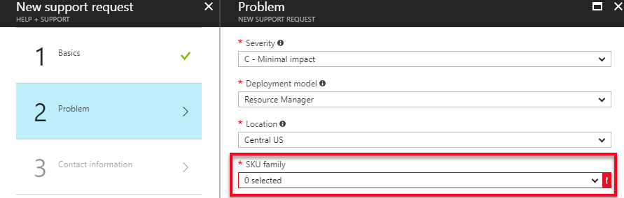

12. Enter **New limit** amount
> - increases should only be requested for the amount of resources needed, to avoid overconsumption that could result in resources becoming unavailable to other users. 

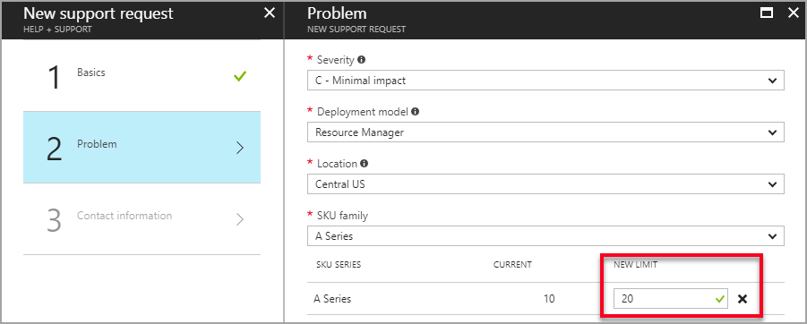

13. Complete **Contact information** details

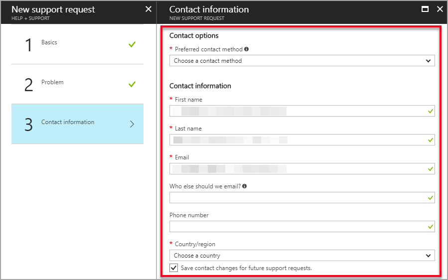

14. Click **Create** to submit the request

---
[Back to top][back-to-top]

[Return to the Cloud Slice guide][back]

[back]: ../cloud-slice.md#configure-resource-capacity-limitations	"Return to the Cloud Slice guide"
[back-to-top]: #cloud-slice-guide---microsoft-azure-setup "Return to the top of the document"
