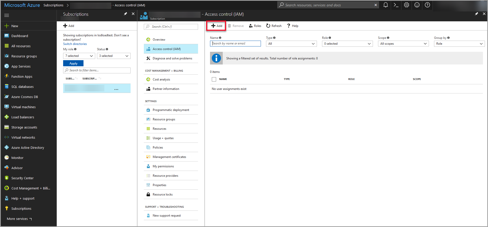

# Azure Resource Providers

[Return to the Cloud Slice guide][back]

Resources in Azure are made available by a Resource provider, registered to the subscription. When attempting to create certain types of resources in Azure, an error may occur, preventing the resource from being created. This may happen because the Resource Provider for the type of resource that is being created has not been registered to the subscription. 

The Error will look something like this:

> The subscription [subName] does not have permissions to register the resource provider(s): [ProviderNamespace]

The provider name space is a name that looks like this: 

> Microsoft.Cache or Microsoft.Search.

Azure subscriptions come with a default set of Resource Providers to support creating various resources. For example, if you want to create a virtual machine, the *Microsoft.Compute* Resource Provider needs to be registered to the subscription to successfully create a virtual machine. 

To create resources that use Resource Providers that are not included in the default set provided with a new subscription, will need to be registered to the subscription by a user with subscription-level access, using one of the following methods:

- Pre-register all available or a specific Resource Provider to the subscription.
- Create custom role-based access control to permit registrations of Resource Providers as-needed.

With both methods, Resource Providers are registered to the subscription using  Powershell commands. The additional Resource Providers are typically registered to the subscription in 1-10 minutes, after the Powershell commands have been executed.

---
## Pre-registering all available or a specific Resource Provider to the subscription 

The first two commands will register all available Resource Providers at the time of running the Powershell command. Every time a new service is added to Azure including Azure Marketplace, these commands will need to be ran again to register new providers for the new services. The third command is used to register a specific Resource Provider. 

1. To see a list of all available resource providers run the following **PowerShell command:** 

   `get-AzureRmResourceProvider -ListAvailable | select ProviderNamespace, RegistrationState`

   **note:** you must be logged into the subscription with a user account with sufficient privileges to register Resource Providers while running these Powershell commands.

1. To see a list of resource providers that are not registered, run the following **PowerShell Command:**

    `Get-AzureRmResourceProvider -ListAvailable | where {$_.RegistrationState -eq  "NotRegistered"} | Select ProviderNamespace, RegistrationState`

1. To register all available resource providers in the current subscription run the following **PowerShell command:**

   `Get-AzureRmResourceProvider -ListAvailable | where {$_.RegistrationState -eq  "NotRegistered"} | Register-AzureRmResourceProvider`

    >[!ALERT] Be aware that by issuing the above command, all resource types can be deployed by your lab developers and lab users. If you subsequently want  to prevent a resource type from being provisioned, you must unregister a resource provider to prevent a particular from being provisioned in your subscription. This might not be so easy if these are resource types have already been deployed and are being used.

1. To register a specific resource provider (e.g. the one required for provisioning virtual machine resources) run the following **Powershell command:**

`Register-AzureRmResourceProvider -ProviderNamespace ResourceProvider.Name`

Replace "*ResourceProvider.Name*" with the name of the Resource Provider you wish to register. Refer the the Azure portal error message received when attempting to create resources, if you are not sure which Resource Provider is needed.

>[!KNOWLEDGE]    For more information, the following articles provide more information on how to view and register resource providers and resolve errors:
>
>[Azure Resource providers and types](https://docs.microsoft.com/en-us/azure/azure-resource-manager/resource-manager-supported-services)
>
>[Resolve errors for resource provider registration](https://docs.microsoft.com/en-us/azure/azure-resource-manager/resource-manager-register-provider-errors)

## Create custom role-based access control to permit registrations of  Resource Providers.

This will allow Resource Group Owners to have the ability to register Resource providers using custom role-based access control. This custom role will grant **only** registration rights on the subscription. This role should be assigned in-addition to the built-in Resource Group Owner role.

1. **Create a JSON file** with the role definition below and name the file **MycustomRole.JSON**. Note the directory where the file is saved. 

   `{"Name": "Register Microsoft providers","Description": "Can register Microsoft providers","Actions": [ "*/register/action" ],"AssignableScopes": [ "/subscriptions/[SUBSCRIPTION1_ID_GOES_HERE]","/subscriptions/[SUBSCRIPTION2_ID_GOES_HERE]","/subscriptions/[SUBSCRIPTION3_ID_GOES_HERE]" ]}`

   Replace ‘[SUBSCRIPTION1_ID_GOES_HERE], SUBSCRIPTION2_ID_GOES_HERE]…etc.’ with all subscription ids that you would like this role to be associated to.

   **Note:** custom role definition objects span subscriptions and sit on the AAD tenant level. That means you can only have uniquely named custom roles defined across all subscriptions in a single tenant. So make sure you include all the subscriptions ids you want to include in the above custom role definition in the assignable scopes section.

1. Run the following **Powershell command:** 

   `New-AzureRmRoleDefinition -InputFile C:\MycustomRole.json`

   If your file is not saved at C:\, change the directory in Powershell to the directory where your file is saved (from step 1) and update the Powershell command with the correct directory.

1. Navigate to https://portal.azure.com/ and assign the custom role to individual users or groups.

   - Click **Subscriptions** on the left-side navigation pane. If Subscriptions is not listed, click More services. 

     

   - Click the **subscription** that the new role will be added to

       

   - Click **Access control (IAM)**

       

   - Click **Add**

     

     - Select **Register Microsoft providers** and click Ok.

     - **Type the name of the user or group** to add the role to, **select the user or group** and then click select.

     - Click **Ok** to add the role to the user or group. 

[Back to top][back-to-top]

[back-to-top]: #Azure-Resource-Providers "Return to the top of the document"
[back]: ../cloud-slice.md#enable-cloud-slice-support-in-your-cloud-platform "Return to the Cloud Slice guide"
