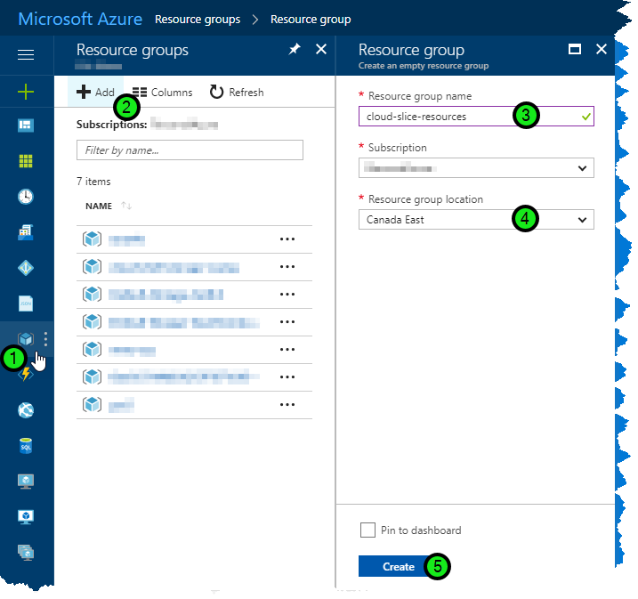
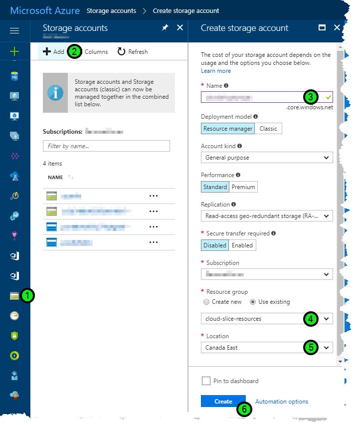
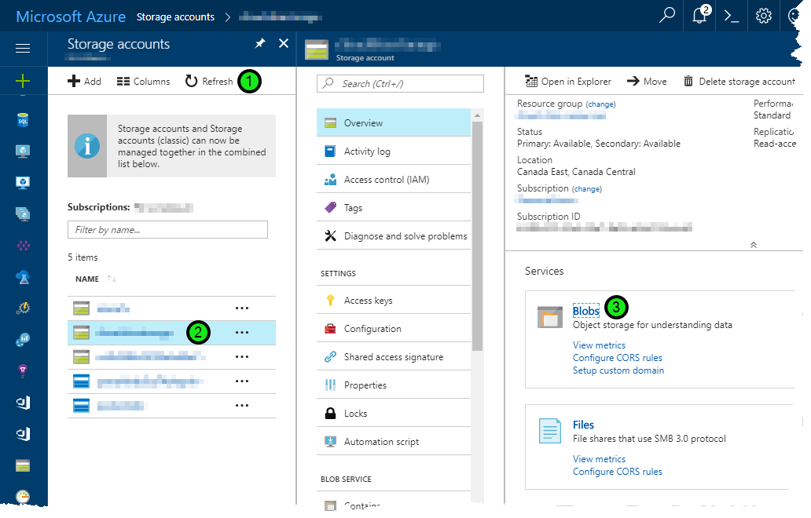
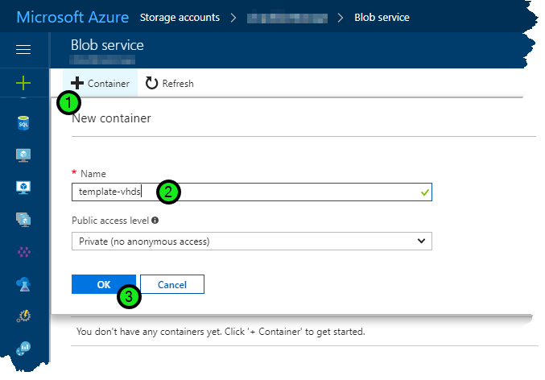
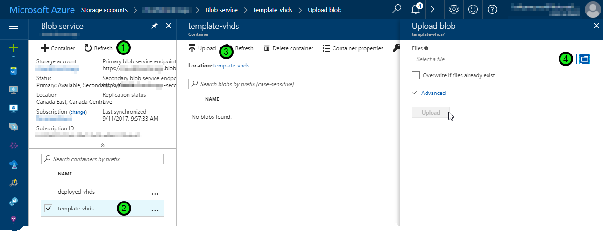

# Cloud Slice Guide - Upload to Microsoft Azure

[Return to the Cloud Slice guide][back]

This document describes how to upload template virtual hard disks (VHDs) into a Microsoft Azure subscription.

## Uploading template VHDs into a Microsoft Azure subscription

Template VHDs are used as part of the deployment of managed virtual machines in a Cloud Slice lab. You only need to upload your template VHDs into one Microsoft Azure subscription per Cloud Subscription Pool. This subscription is referred to as the master subscription in OneLearn Lab on Demand, and it must be the first subscription that is added to a subscription pool.

There are multiple supported methods that can be used to upload template VHDs into a Microsoft Azure subscription, but the primary methods are using the  <a href="https://portal.azure.com/" target="_blank">Microsoft Azure Portal</a>, using the <a href="https://azure.microsoft.com/features/storage-explorer/">Microsoft Azure Storage Explorer</a>, using Microsoft PowerShell, or using some combination of the three. In this document we will focus on uploading template VHDs using the Microsoft Azure Portal. To upload template VHDs into a Microsoft Azure subscription using the Microsoft Azure Portal, you must perform the following tasks:

1. [Create a resource group where you will store VHDs][create-resource-group].
2. [Create a storage account inside of your resource group where template VHDs will be stored in a storage blob][create-storage-account].
3. [Create a container inside of the blob service in your storage group][create-container].
4. [Upload each template VHD you want available to your Cloud Slice labs][upload-vhds].

[create-resource-group]: #create-the-resource-group-where-you-will-store-vhds "Create a new resource group in Microsoft Azure"
[create-storage-account]: #create-a-storage-account-inside-the-new-resource-group "Create new storage account inside of your new resource group"
[create-container]: #create-a-container-inside-of-the-blob-service-in-your-storage-account "Create a new container in the blog service in your new storage account"
[upload-vhds]: #upload-each-template-vhd-you-want-available-to-your-cloud-slice-labs "Upload one or more template VHDs into the Microsoft Azure subscription blob service container you created"

### Create the resource group where you will store VHDs

To create the resource group where you will store template and deployed virtual hard disks in your Microsoft Azure subscription, open the <a href="https://portal.azure.com/" target="_blank">Microsoft Azure Portal</a>, and then do the following:

1. Browse into the **Resource Groups** service.
2. Click on **Add**. This will open the Create Resource Group blade.
3. Enter a resource group name (e.g. cloud-slice-resources) into the **Resource group name** field. Save this name in a document because you will need it later on.
4. Select the region where you want the resource group to be created in the **Resource group location** field.
5. Click the **Create** button to create the resource group.

[Back to top][back-to-top]

### Create a storage account inside the new resource group

Once you have created the resource group for your virtual hard disks, you need to create a storage account where those VHD files will actually be stored as storage blobs. To accomplish this, you must do the following:

1. Select the **Storage Accounts** service.
2. Click the **Add** button to add a new storage account. This will open the Create storage account blade.
3. Enter a name for your storage account in the **Name** field. This name must be globally unique, so it is a good idea to choose a name that is meaningful to you and that will be unique. Prefixing the name with a company prefix (e.g. msft if you work for Microsoft) may make this easier. Save this name in a document because you will need it later on.
4. Select the **Use existing** option to use the resource group you created in the previous task, and select that resource group in the list of resource groups available.
5. Choose the region where you want to store your storage account from the list of regions available in the **Location** field.
6. Click **Create** to create the storage account.

[Back to top][back-to-top]

### Create a container inside of the blob service in your storage account

Once you have created a resource group and a storage account within it, you need to create a container inside of the blob service in your storage account. This can be done from within the <a href="https://portal.azure.com/" target="_blank">Microsoft Azure Portal</a>, by following these steps:

1. If you don't see the storage account that you created in the previous task, click **Refresh** to refresh the list of storage accounts.
2. Click on the storage account that you created in the previous task. This will open the storage account blade.
3. Click on the **Blobs service** in the storage account blade. This will open the blob service blade.

4. Click on the **Container** button to create a new storage container.
5. In the **Name** field, enter the name that you would like to use for your storage container (e.g. template-vhds for the container for template virtual hard disks, or deployed-vhds for the container for deployed virtual hard disks). Save this name in a document because you will need it later on.
6. Click on **OK** to create the container.
7. Repeat steps 4-6 to create a second storage container, this time for deployed virtual hard disks.

[Back to top][back-to-top]

### Upload each template VHD you want available to your Cloud Slice labs

At this point you should have a resource group that contains a storage account, and within that storage account you should have two containers in your storage blob: one for template VHD files, and another for deployed VHD files. If you are missing any of these items, please review the steps in the previous tasks to make sure you didn't accidentally skip anything important.

Now you need to upload each template virtual hard disk that you want to make available to your Cloud Slice labs. If you are continuing this task immediately after completing the previous task, you should still be looking at the Blob service blade in the <a href="https://portal.azure.com/" target="_blank">Microsoft Azure Portal</a>. If not, navigate within the portal to the blob service blade for the storage account where you will store your VHD files. To upload a VHD file from the blob service blade, do the following:

1. Click on the **Refresh** button if you don't see the container that you created to store template virtual hard disk files.
2. Select the container where you want to store template virtual hard disk files.
3. Click on the **Upload** button to start uploading VHD files into your storage blob.
4. Click on the **Folder** icon to select the file you want to upload. Browse to the file you want to upload and click on **OK** to select that file.
5. Click on the **Upload** button to upload the VHD file into Microsoft Azure. Note that at this time, Microsoft Azure only supports fixed-size VHD files for Generation 1 virtual machines.
6. Repeat steps 3-5 for each template VHD file that you want to upload into your template container.

[Back to top][back-to-top]

## Review Checklist

By now you should have completed the following:

- Created a resource group where you want to store virtual hard disk files that will be used by Cloud Slice labs.
- Created a storage account in that resource group for storage of the actual files.
- Created two containers in the storage account blob: one for template VHD storage and another for deployed VHD storage.
- Uploaded one or more VHD files into your template VHD storage container.

You should also have captured the following pieces of information:

- Resource group name
- Storage account name
- Template virtual hard disk storage container name
- Deployed virtual hard disk storage container name

These values are required for the OneLearn Lab on Demand platform to be able to provision managed virtual machines into Microsoft Azure for your Cloud Slice labs. If you are missing one or more of those values, or if you feel you did not complete one of the tasks listed above, review the steps in this document to find out what you missed.

[Back to top][back-to-top]

[Return to the Cloud Slice guide][back]

[back-to-top]: #cloud-slice-guide---upload-to-microsoft-azure "Return to the top of the document"
[back]: ../cloud-slice.md#upload-template-vhds-into-your-cloud-platform "Return to the Cloud Slice guide"

