# Learn on Demand Systems Integrated Digital Lab (legacy) Authoring Guide 

<!--
## Introduction

This guide provides information on the Integrated Digital Lab (IDL legacy)
platform, the various elements that comprise a lab that uses this
platform, the steps for converting a traditional document-based lab to
an IDL (legacy)-based lab, and some tips and best practices.

### Intended Audience

This guide assumes that the reader:

- Has a developer account with sufficient permissions to create a lab
guide and modify select properties of a lab profile.

- Has existing labs hosted by LODS.

- Has a help desk support contract to pay for additional custom
contract work.

The guide further assumes that a document-based lab manual already
exists and needs to be converted to the IDL (legacy) format.

-->

## Overview of the Integrated Digital Lab IDL (legacy) Platform

The IDL (legacy) platform integrates the exercises with the virtual machines
(VMs) in the lab environment to guide the users in completing the lab.
Although lab users have the option to print and display a separate
document containing the lab exercises and tasks, the IDL platform allows
users to view the lab instructions in line with the VMs. The following
is an example of typical lab task that a user would see while they were
performing lab steps.


Figure 1: IDL (legacy) user interface

An advantage of this presentation format is that the lab steps take up
only a relatively small amount of screen real estate. This removes the
need to switch back and forth between the lab document and the lab's
virtual machines or for a second monitor. These activities distract from
performing the lab and can take focus away from the lab steps and goals.

A successful lab that is well-received by users usually contains more
than simply a set of basic lab steps or tasks. It will have significant
explanatory content to provide context, background information, tips,
cautions, and other useful and relevant information. Additionally,
visual elements such as screenshots and videos can add clarity and
reduce the likelihood of error on the part of the user. The IDL (legacy) platform
has the ability to include text and visual content in a way that ensures
the focus remains on the lab tasks and the context in which those tasks
occur.

The following provides a summary of the elements that go beyond the lab
steps and assist in the learning experience.

### Advertising Campaigns and Introductory Content

A lab launch may take from a few seconds to a couple of minutes to fully
launch, depending on the size and number of VMs. During this time, a
progress indicator shows by default. However, while the lab is
launching, it is possible to include useful information, web pages,
interactive graphics, or videos. In the example below, an introductory
video is playing while the lab is launching in the background.

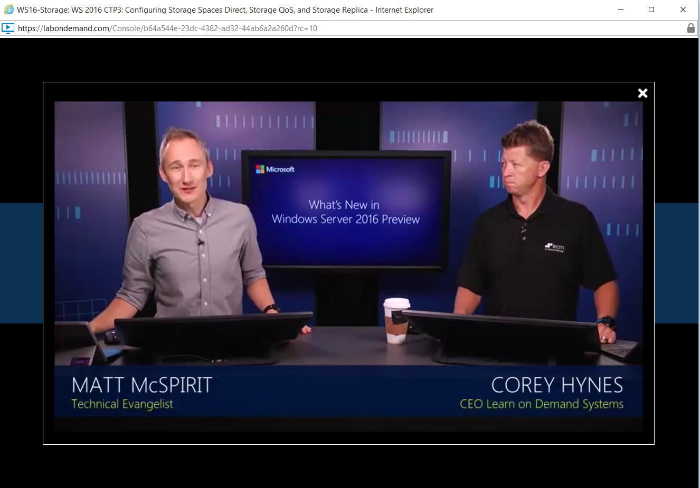

Figure 2: Introductory video playing during lab launch

There are two ways to provide this introductory content. One way is to
use a feature called an Advertising Campaign. This allows you to provide
introductory content across multiple labs that are grouped by lab
series, organization or event. The second way is to configure a
lab-specific introduction within the lab profile itself, which contains
various settings for the lab. You will learn about how to set up both
these kinds of introductory content later in this document.

The introductory video (or other introductory presentation) can serve
many different purposes. For example, you could use the advertising
campaign feature to provide:

- General information on your products, services, and offerings,

- A specific introduction to the lab (as a replacement for the
objective and scenario text described below),

- Tutorials,

- Information and cautions about upcoming lab step challenges,

- Other kinds of content, such as Demo Mates, static web pages,
PowerPoint presentations and so on.

The only requirement for your introductory content is that it be
accessible from a URL.

### Objective and Scenario Introductory Page

The IDL (legacy) platform can provide the user with an introductory page that
appears when the user launches a lab. The introductory page contains the
objectives or goals that the user will achieve and a scenario that
provides contextual information to assist the user to gain a deeper
understanding of the lab. The introductory page only appears if a lab
author provides the objectives and a scenario.
[<sup>1</sup>](#1)

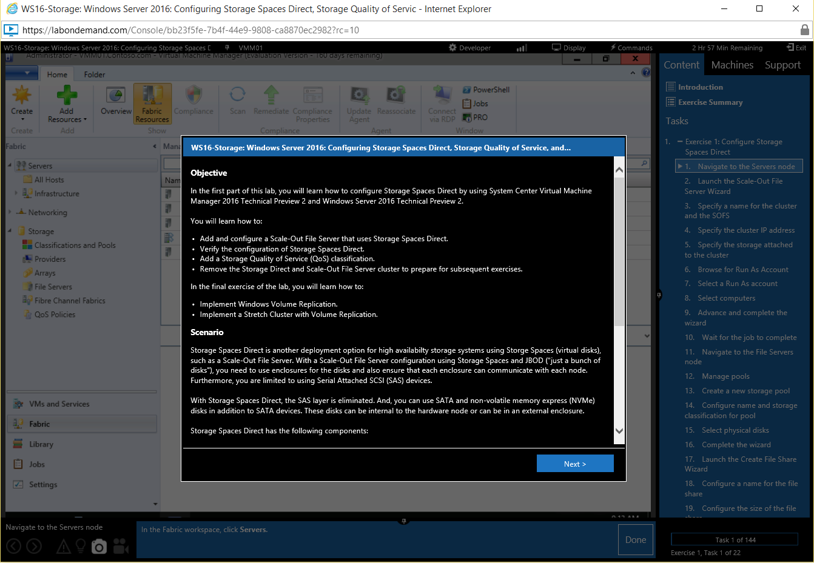

Figure 3: Objective and scenario

The objective and scenario, if present, are mandatory from the users'
perspective. Upon lab launch, a text box appears showing the content.

### Exercises

A lab is organized into one or more exercises that represent a set of
logically related tasks that result in the completion of some goal. Each
exercise in the lab has an introductory element that can be used to
provide context or a statement of goals that are specific to the
exercise.


Figure 4: Exercise introduction

Each exercise introduction is automatically rolled up into an Exercise
Summary that users can review at any time in the lab by clicking
Exercise Summary in the top right navigation.

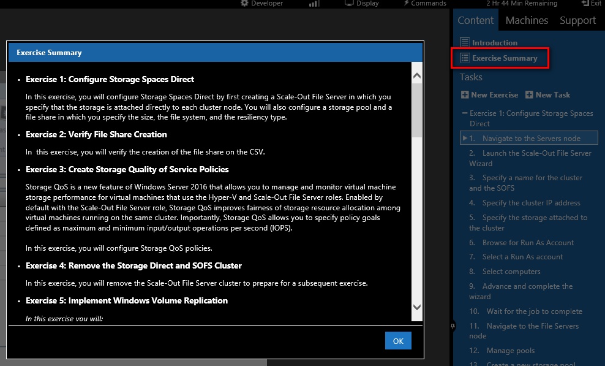

Figure 5: Exercise summary

You can add rich media content delivered from external sources (URLs)
that cause a video to play at the beginning of the exercise, after the
exercise introduction.


Figure 6: Video in exercise introduction

Each lab exercise also has a concluding element that can be used to
summarize the accomplished goals and to provide information on the next
exercise. You can also include rich media content from an external
source, such as a video that will play at the completion of an exercise.

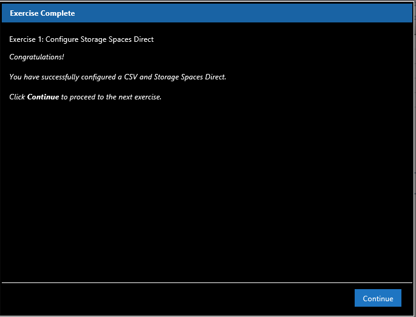

Figure 7: Exercise conclusion

### Tasks

Each lab exercise comprises a sequential series of tasks. A lab task is
usually a single step or a small set of closely related steps that form
a unit. For example, a task might provide all the steps that a user must
perform to complete a dialog box.

Each task consists of a title and a step or small set of steps, and,
optionally, one or more enhancements. These enhancements include Alerts,
Knowledge, Screenshots, or Videos. Additionally, a task may also contain
a link to allow quick navigation to a different VM or drive.


Figure 8: Task with enhancements and link to VM

Task enhancements are briefly discussed below.

#### Alerts

Alerts are useful whenever you want the users to pause and take note of
additional and important information. When a user clicks on a task that
has an alert, the caution icon lights up and a text box pops up with the
text you want the user to read. From the user's perspective, alerts are
mandatory because they will appear by default when they advance to a
task that contains an alert.


Figure 9: Alert task enhancement

#### Knowledge

The Knowledge task enhancement provides additional information and
context. Also, it can be used to provide alternative instructions or
store commands that you want people to enter as part of a task
instruction. One of the chief benefits of the Knowledge task enhancement
is that it is an optional element from the users' perspective. When the
user clicks on a task that contains a Knowledge item, the Knowledge icon
lights up and bounces to indicate its presence. The user can stay
focused on the lab step, or choose to read the contents of the Knowledge
text box by clicking on the icon.


Figure 10: Knowledge task enhancement

#### Screenshots

Screenshots can be stored with tasks to provide additional clarity and
to mitigate the risk of configuration errors. Screenshots are also
beneficial for people who are visual learners or who do not speak
English as a first language. When a user clicks on a task that has a
screenshot, the camera icon lights up and bounces to indicate the
presence of the screenshot. When the user clicks the screenshot icon and
hovers over the screenshot, a transparent title will appear, along with
a link to open the screenshot in a new window. Opening the screenshot in
a new window is useful if the screenshot is large. If the screenshot is
particularly important or noteworthy, you can make it a mandatory
element by causing it to appear automatically when the user arrives at
the task.


Figure 11: Screenshot task enhancement

#### Videos (Rich Media Content)

The videos task enhancement is used to provide rich media content, such
as short, step-specific videos, that can serve a variety of purposes: to
demonstrate a series of steps, to assist visual learners, to provide
clarity, to provide additional information and others. When the user
clicks on a task that has a video element present, the video icon (movie
camera) lights up and bounces to indicate the presence of a video.

The video can be any video compatible file or a URL that points to a
video. Note that videos can also be DemoMates and computer screen
recordings. The screenshot below shows a video displayed in line with
the lab tasks. However, you can also configure the video to show in its
own separate window. Furthermore, you can configure the video to be a
mandatory element that plays automatically when the user arrives at the
task containing the video.

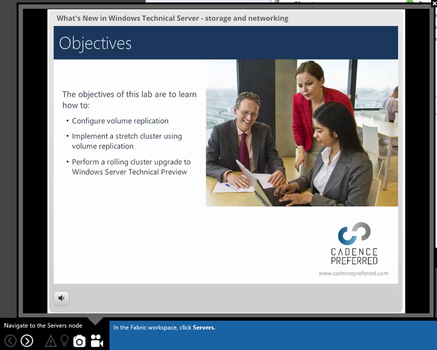

Figure 12: Video task enhancement

#### Virtual Machine Select

During a lab, a lab user may be required to perform configuration steps
on two or more VMs. A common source of errors in labs is performing lab
tasks on the wrong VM. The IDL (legacy) platform mitigates this risk by providing
the means to change to the correct VM within a task step, as shown
below.


Figure 13: Virtual machine select

#### Load Media

The IDL (legacy) platform allows lab user to load either virtual floppy disks or
ISO files directly from a task, as shown below.


Figure 14: Load optical media

#### Actions

To further mitigate risk of error and to enhance the overall experience
of the lab, the IDL (legacy) platform supports running commands directly inside a
VM. The commands can perform any action that is possible to do from a
command or Windows PowerShell prompt. For example, the command could
open File Explorer at a particular location within a directory
structure, open dialog boxes, start scripts, open documents and web
pages, and many others. To initiate the action, the lab user clicks on
the Action icon (lightning bolt), as shown below.


Figure 15: Perform an action

### Exams

Each lab, regardless of whether it has content, can provide an optional
exam at the end of lab. This appears on the right side of the lab
interface on the Content/Exam tab and can serve a number of purposes: to
reinforce learning, to measure retention of concepts, to provide metrics
on effectiveness of lab delivery, etc. Exams are categorized by the type
of scoring used; there are three to choose from:

1.**Assessment** - Traditional multiple choice test that is scored
automatically.

1. **Manual** - Screenshots (the user submits a screenshot of the VM
configuration) or saved environments (the user configures the VMs as
per requirements and saves the environment). The screenshots or
saved states are later evaluated and marked by an examiner.
[<sup>2</sup>](#2)

1. **Automated** - Performance-based test (the user has to make
required configuration changes on the VMs based on directions in the
exam questions) that are evaluated using scripts to verify correct
configuration within the VMs or in code. For example, a question
instructs a user to make a change to a firewall rule in a VM. The
question is scored by running a WMI query against the virtual to see
if the firewall configuration matches the desired state.

The screenshot below shows an exam that uses an assessment format to
evaluate retention and to reinforce learning.


Figure 16: Exam example using the assessment scoring type

## Overview of the Lab Interface

This section describes the top and right side of the lab interface.
The bottom of the lab interface is for individual tasks and will be
covered later.

### Task Navigation

Within the lab interface on the right side, the exercises and tasks are
displayed in their sequential order. When each task is performed, the
user clicks Done. The lab interface keeps track of tasks that have been
performed and shows the current progress at the bottom of the pane.

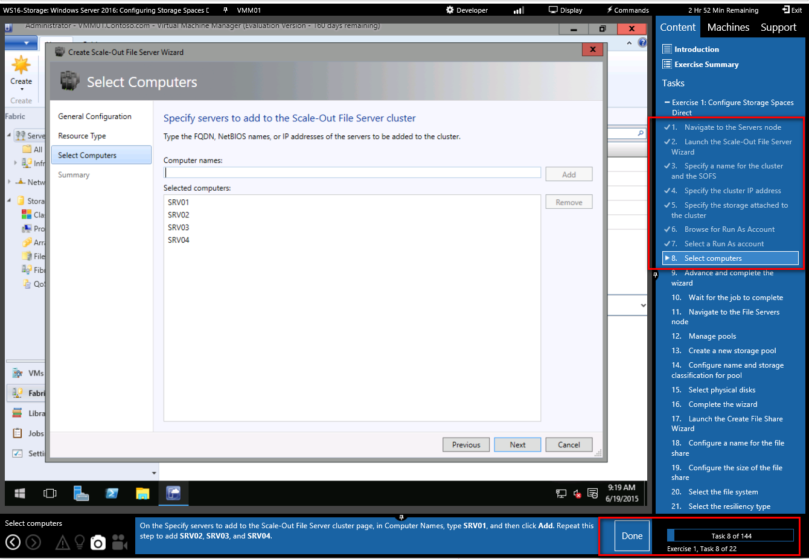

Figure 17: Task navigation showing progress

The right navigation pane allows users the ability to explore forward or
backward from the current task they are performing. If a user navigates
away from the current task, the lab interface provides a prompt to
return.

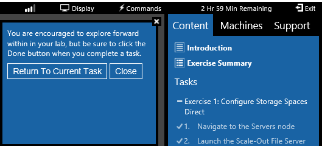

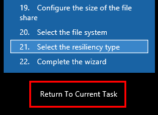

Figure 18: Navigation pane showing current progress and prompts to
return to current task

### Commands Menu

The Commands menu at the top of the lab interface provides important
functionality for interacting with VMs. From it, a lab user can send
Ctrl + Alt + Delete and Windows Key commands to Windows VMs. Users can
also use a virtual keyboard or turn off and restart VMs from the Power
fly out menu.


Figure 19: Commands menu showing power fly out sub-menu

The Paste fly out menu, shown below, allows users to paste text into the
VM. [<sup>3</sup>](#3) This functionality can be leveraged with the
Knowledge enhancement to make it possible to paste a series of Windows
PowerShell or other scripting commands into a VM. For example, a task
can instruct the users to open the Knowledge task enhancement, copy the
commands there and then, using the Commands &gt; Paste &gt; Paste
Clipboard Text menu, paste the commands into the VM.


Figure 20: Commands menu showing paste fly out sub-menu

### Machines Tab

The Machines tab allows the user to change which VM is active as well as
to interact with that VM in several ways. For instance, the user can
load files from their hard drive directly to the VM, load a floppy or
ISO into the VM's drives, and, if enabled, switch the VM to another
network adapter. It also provides an alternative for pasting the user
name and password into the VM's Sign In dialog box, as shown in the
figure below.

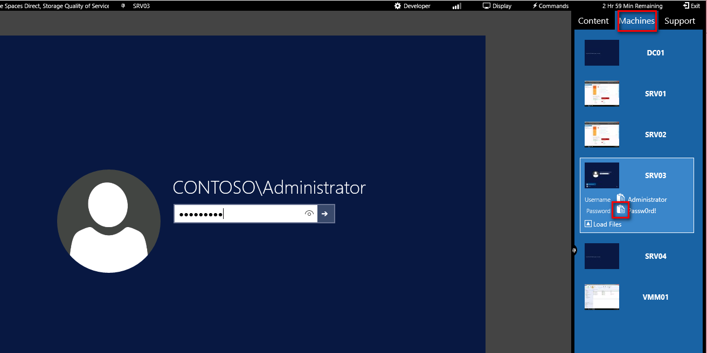

Figure 21: Machines tab showing paste command for username and password

### Support Tab

The Support tab gives users the ability to select the Machine Remote
Controller and a Theme. In addition, users can open a printable HTML
version of the lab manual and easily gain access to FAQs for assistance.

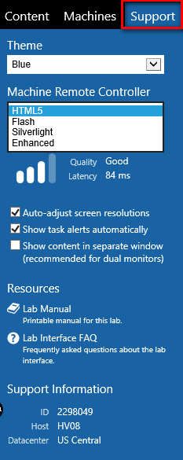

Figure 22: Support tab

## Adding Lab Content Manually

This section describes the lab profile Basic Information tab and how to
manually add content to the lab profile in the Learn on Demand Systems
(LODS) platform. The next section will cover how to add your content to
a lab profile using either the XML or Word template provided by LODS.

### Using the Edit Toolbars

When you enter text into the lab profile or IDL (legacy) content, you may use the
editing tool bars to format text and create lists in rich text fields.
These fields provide a simple WYSYWG editor experience. In the rich text
fields in the lab profile, you can use the toolbar pictured below to
perform simple text formatting.


Figure 23: Edit toolbar for lab profile

The toolbar provides the following controls, from left to right, to
format selected text as follows:

- **Bold**. Toggle the bold formatting.

- **Italic**. Toggle the italic formatting.

- **Bulleted list**. Create or remove a bulleted list.

- **Numbered list**. Create or remove a numbered list.

- **Decrease indent**. Decrease the indent.

- **Increase indent**. Increase the indent.

- **View source** (). View and modify the underlying
HTML code. This is particularly useful to ensure that formatting,
especially numbered and bulleted lists, appear as expected or if you
want to include a link to an external website using an "a href" HTML
tag.
[<sup>4</sup>](#4)

In the rich text fields in the IDL (legacy) content, the Edit toolbar is
expanded to allow you an easy way to add additional formatting to your
content.


Figure 24: Edit toolbar for lab content fields

The additional controls provide drop-down lists to apply font, font size
and paragraph formats to the selected text.

---

 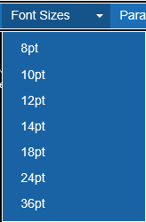 

---

Figure 25: Formatting drop-downs

### Create Introduction

If you want users to be presented with the lab objectives and a scenario
on an introduction page when the lab is launched, you must add text to
these features on the Basic Information tab of the lab profile Edit page
as shown in the following steps.

1.Sign in to the Learn on Demand portal, and locate the lab profile to
which you want to add objectives and a scenario.

1. On the lab profile page, click **Edit**, as shown below.

    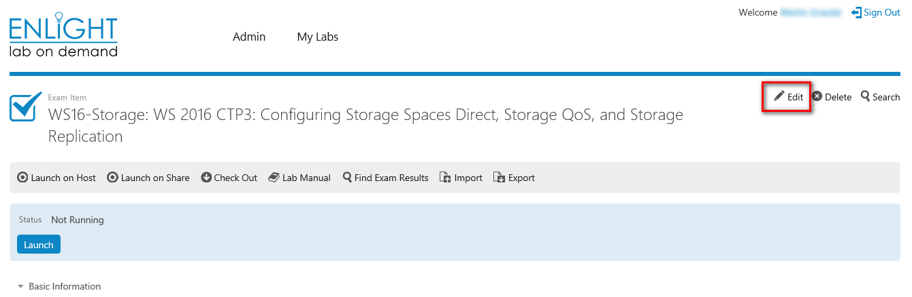

    Figure 26: Lab profile page

1. Fill in the Objective and Scenario boxes with the desired information.

    - If you leave these text boxes empty, users are not presented with an
    introduction.
    - The Description does not appear in the lab. However, it serves as a
    lab abstract and could be used to describe a lab that is used for a
    particular event.

    

    Figure 27: Adding lab objective and scenario content

#### Objective and Scenario Best Practices and Guidelines

The Objective text box is used to provide specific information about the
lab. It should include a summary of the lab exercises and a list of
specific goals that the lab is intended to meet. In contrast, the
scenario serves a more general purpose. It can, for example, be used to
establish the context in which the lab exercises are performed or to
provide more general background information.

- Use bulleted or numbered lists to emphasize lab goals and objectives.

- Ensure lists are expressed in parallel grammatical format and start
with verbs to provide greater emphasis and clarity.

- Provide a summary of the entire lab.

- Ensure that you list all the exercises the lab covers.

- Ensure that goals are focused on what the user gains from doing the
lab.

- Use the scenario area to provide more general background information
and context.

### Enable Lab Profile for IDL (legacy)

For a lab to display IDL (legacy) content, content must be enabled in the lab
profile. To enable content in a lab profile, you need to perform the
following steps.

1. On the Basic Information tab of the lab profile Edit page, check
**Has IDL Content**.

    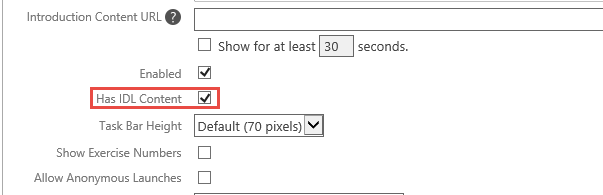

    Figure 28: Enabling IDL (legacy) Content

    - Note that you also have the option to adjust the height of task bar.
    Although you can make the task bar larger or smaller than the
    default values, consider the tradeoffs. If you make it larger, you
    lose valuable screen real estate for the VMs. If you make it
    smaller, users may have to scroll to see the entire task direction.
    Users can resize the task bar, according to their own preferences
    and can pin/unpin it.

1. Optionally, check **Show Exercise Numbers** to have the exercises
numbered automatically.

### Advanced Settings

In addition to the Basic Information tab, the Advanced tab has settings
that are relevant to lab manual creation and display.

To gain access to the Advanced settings, on the lab profile page, click
**Advanced**.

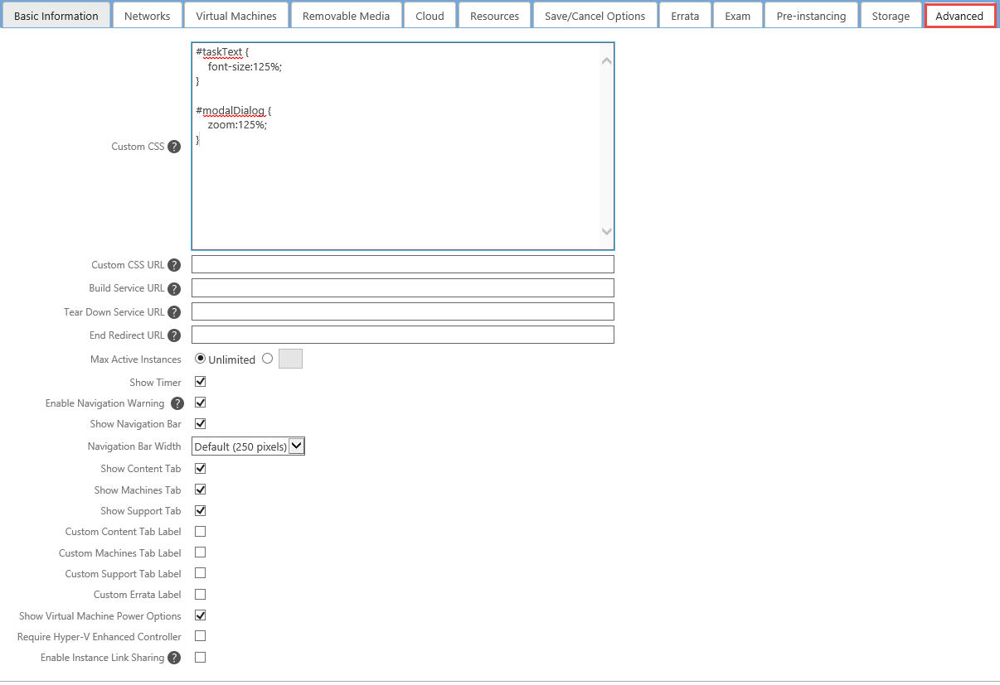

Figure 29: Advanced settings

The advanced settings tab allows you to configure the following:

- **Custom Cascading Style Sheets (CSS).** You can use CSS to modify
the appearance of the lab text in the navigation and task bars. You
can either enter the CSS directly as shown above or you can point to
a CSS file URL.

- **Build and tear down service URLs**. You can use these fields for
build and tear down operations that must take place outside of the
lab environment itself.

- **End Redirect URL.** You can set a URL to which the user will be
redirected when the lab closes. This can be useful if you want to
direct users to specific sites for additional information or if the
lab is part of an external workflow.

- **Show Timer**. This allows the user to see how much time is
remaining in the lab. If you disable this setting, the timer will
still run for the lab but the user will not be able to see the time
he or she has remaining in the lab. Only rarely would there be a
valid use case for removing the timer display. One likely use case
is if a 3^rd^ party wanted to "wrap" the lab application with its
own UI that also included a timer, such as an exam provider.

- **Enable Navigation Warning**. The navigation warning is on by
default and is intended to help prevent users from accidently
navigating away from the client or from trying to end the lab by
closing the browser. However, for certain workflows, it may not be
desirable to display this warning.

- **Show Navigation Bar**. This controls whether the navigation bar is
displayed.

- **Navigation Bar Width**. This controls the width of the navigation
bar. Although you can make the navigation bar larger or smaller than
the default values, consider the tradeoffs. If you make it larger,
you lose valuable screen real estate for the VMs. If you make it
smaller, the IDL (legacy) outline may wrap unnecessarily. Users can resize
the navigation bar, according to their own preferences and can
pin/unpin it.

- **Show Content, Machines and Support Tabs**. This controls whether
the Content, Machines, or Support tabs are available to the user.

- **Custom Content, Machines, and Support Tabs labels**. These
settings allow you to provide custom labels for the respective tabs.

- **Show Virtual Machine Power Options**. This controls whether the
users can shut down or start up virtual machines (VMs) using the lab
interface.

### Access IDL (legacy) Edit Modes

You are now ready to add lab exercises and lab tasks directly into the
IDL (legacy) user interface. As mentioned earlier, to add or edit content, lab
content must be enabled for the lab profile (the Has Content check box
must be checked).

#### Check Out IDL (legacy) Manual

Once lab content is enabled, you must the check out the IDL (legacy) manual.
Checking out the IDL (legacy) manual ensures that only one person at a time can
make changes to the content.

To check out the IDL (legacy) manual, navigate to the lab profile page, and then
click **Check Out**.

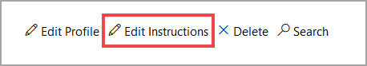

Figure 30: Lab profile action menu showing check out option

#### Choose Edit Option

Once you have checked out the IDL (legacy) manual for editing, you can choose
between two options for adding and editing content:

**IDL Studio**. When using this option, the manual appears with the
running VMs used in the lab environment. This option gives you the
ability to create screenshots of the lab environment and to verify lab
steps. To use IDL Studio mode, click **Launch in IDL Studio**, as shown
below.

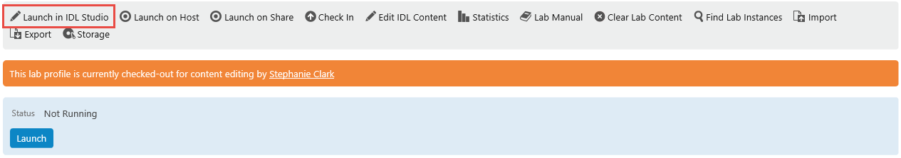

Figure 31: Edit content with running VMs

1. **Edit IDL (legacy) Content**. In this mode, only the manual opens for
editing; no VMs are running. This editing mode is good for copy
editing or other tasks that do not require running VMs. To use this
mode, click **Edit IDL (legacy) Content**, as shown below.

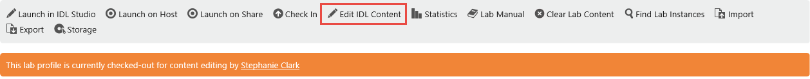

Figure 32: Edit content mode

### Create Exercises

Content is broken into exercises and tasks. Once invoking either of the
two IDL edit modes, you must create an exercise. To do this, click **New
Exercise**. This causes the New Exercise dialog to appear, as shown
below.


Figure 33: New exercise dialog box

The following topics describe the New Exercise dialog box controls and
fields in order. Once you have completed them, click **OK** to save the
exercise.

#### Load from Template / Save As Template

Templates give you the ability to reuse content across multiple labs. If
you create labs on a regular basis, you may find that some exercises are
repetitive across labs. If this is the case, you can save an exercise as
a template, and then use the exercise content in other labs.

#### New Exercise Placement

You have the option of creating the new exercise after the current
exercise, if present, or as the last exercise in the lab.

- Note that if you have multiple exercises, you can change the order
of the exercises from within the user interface. To change the order
of an exercise, hover over the exercise, and click the up or down
arrow, as appropriate.


Figure 34: Moving exercise position

#### Name

This is the title of the exercise. If you have checked the option to
automatically number exercises, do not include the exercise number in
the title. For exercise titles, you should use title case (see Common
Style Guidelines for a definition of title case).

#### Introduction Message

The introduction message provides information about the goals of the
exercise, what the lab user will accomplish in the exercise, and puts
the exercise tasks into a context. This field has the Edit toolbar
described earlier. You can use it to add bold or italic formats, change
font attributes, create lists, and increase or decrease indents as shown
below.


Figure 35: Edit toolbar for introduction message field

#### Introduction Content URL

The introduction content URL field allows you to link to an external
rich media source, such as a video, that will be launched as part of the
exercise introduction.

#### Completion message

The completion message provides a brief summary and congratulatory
message to the lab user. As a best practice, you should indicate that
the user should click Continue to proceed to next exercise.

#### Completion Content URL

The completion content URL field allows you to link to an external rich
media source, such as a video, that will be launched as part of the
exercise conclusion.

### Create Tasks

You cannot have an exercise without at least one task and you cannot
have a task without an exercise. Therefore, when the exercise is saved,
an empty Edit Task dialog box appears.


Figure 36: Edit task dialog box

The following topics describe the Edit Task dialog box controls and
fields in order.

#### Load from Template /Save As Template

Templates give you the ability to reuse content across multiple labs. If
you create labs on a regular basis, you may find that some tasks are
repetitive across labs or within the same lab. For example, instruction
to log on using specific credentials. If this is the case, you can save
a task as a template, and then use the task template content in the same
or other labs.

#### Name

This is the title of the task. For task titles, you should use sentence
case (see Common Style Guidelines for a definition of sentence case).
The maximum number of characters for the title field is 50. Your titles
should be as concise as possible. The following are some best practices
for task titles:

- Keep title under 50 characters

- Start with a verb

- Use telegraphic style. Remove words, such as "a", "an", "the", "is"
or "are", that are not required to convey accurate meaning. For
example, write "Verify account listed", rather the "Verify account
is listed."

#### Text

The Text box is the lab step or short series of steps that are executed
as a single task. The following are some best practices for creating
tasks:

- Make sure that only one step or small series of closely related
steps is included in the text box. The goal here is to ensure that
the entire instruction will fit into the vertical space provided for
the task at the bottom of the lab user interface. If the task is too
long and users have to scroll in the task box, there is a risk they
may miss part of the task.

- Avoid creating a single task for actions such as completing wizards
that use multiple screens. Try to limit tasks to actions performed
in single screens, pages, or dialog boxes.

- If the task requires users to type in a long command or series of
commands, place the commands in the Knowledge task enhancement. In
the task, ask users to open the Knowledge task enhancement and
follow the instructions for executing the commands.

- Use bolding to:

    - Emphasize the user interface elements the user interacts with,

    - Highlight what the user types into a field.\
    For example, "Type **Passw0rd!**" or "Click **Submit**." Please note
    that this guideline does not strictly conform to the guidelines for
    bolding in the Microsoft Manual of Style (MSTP).

#### Alert

The Alert box provides information that you consider mandatory for the
user to know. When the user advances to a task in which an alert is
present, the Alert box will open.

#### Knowledge

When a lab user advances to a lab step that includes content in the
Knowledge box, the icon lights up and will bounce once to indicate the
presence of content. The Knowledge box can:

- Include additional explanatory information to provide greater
context;

- Provide a series of commands or steps to avoid scrolling in the text
box for a task.

- If you use the Knowledge box for lab steps or a series of commands,
please make sure you include a note directing users to execute the
steps or commands there. (For example, "At the PowerShell prompt,
type the commands listed in the Knowledge box, pressing ENTER after
each one.")

#### Screenshots

Screenshots add clarity by providing a visual representation of what a
completed task looks like. To create a screenshot, you can take a
screenshot using the Developer menu on the UI, as shown below.

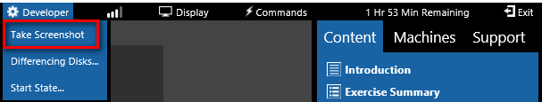

Figure 37: Taking screenshot form IDL (legacy) UI

If you use this method, the screenshot is automatically added to the
task you are on. Please keep in mind that when you take a screenshot
using this method, you take a screenshot of the entire desktop of the
VM, which may not be desirable. Alternatively, you can use a screen
capture tool of your choice, save the screen capture and upload it using
the controls on the Screenshot field.

The following are some best practices for incorporating screenshots into
your lab:

- Compose the various elements (dialog boxes, etc.) before taking the
screenshot so that all the important fields are visible.

- Avoid taking screenshots of the entire desktop. For example, if the
focus of interest is a dialog box or a page, maximize the element to
avoid including too many other elements in the screen that may
distract from the object being configured in the task.

- Try to keep the screenshot smaller than 800 x 600. If it is larger
than this, consider resizing it to these dimensions so that users do
not have to scroll to see all the elements of the screenshot.

- Do not cover menu labels with context menus that appear when you
right-click.

- Consider highlighting elements in the screenshot that are of
particular importance.

- Make sure that titles of items, dialog boxes, pages, etc. are
clearly visible.

- For screenshots that are particularly noteworthy or can serve as
cautions, consider enabling the option to show the screenshot
automatically.

#### Video

Videos showing the steps in the task are particularly useful for
difficult and complex tasks as well as assisting those users who are
visual learners. Also, they add a polish to your lab and make it stand
out from other labs. You may upload an .mp4 file to attach to the lab
task. Alternatively, you can link to an externally available rich media
source by selecting the Externally Hosted option and providing a URL.
Furthermore, for especially noteworthy videos, you can cause them to
play automatically when the user reaches the task.

Videos must be in mp4 file format to play back. The following are some
guidelines for creating videos that are attached to lab tasks:

- Keep the video short, between 30 – 60 seconds at most.

- Make sure the video covers only the relevant step.

#### VM Select

The VM Select control provides the user an icon to make a different VM
active. From the drop-down, you set the VM attached to the icon.
Although this functionality is also available from the Machines tab, the
advantage of the using the VM Select control is that the lab user can
switch the active VM from with the task itself.


Figure 38: VM select control

#### Floppy Drive

The Floppy Drive control provides an icon for the lab user to insert a
virtual floppy disk into (or eject from) the VM. The advantage of using
the control is the user can insert the virtual floppy disk from within
the task itself.

#### DVD Drive

The DVD Drive control provides an icon for the lab user to insert a
virtual DVD (ISO file) into (or eject from) the VM. The advantage of the
using the control is the lab user can insert the virtual DVD from within
the task itself.


Figure 39: DVD drive control

#### Commands

The Commands control provides the option to execute a command shell or
Windows PowerShell command in the VM from within the task. A key
advantage of this control is that it can reduce a complex series of
steps to single actions. For example, you can use the Commands control
to reduce the multiple steps required to open a Control Panel dialog box
to a single action.

Although potentially any task could be reduced to an action that can be
executed as a command shell or Windows PowerShell command, you should
use this feature judiciously. Users should still know how to open File
Explorer and perform other basic actions in the Windows UI. This feature
is most useful for a complex task that involves numerous steps, opening
file locations deep down in directory structures, opening specific Web
pages, and other similar activities.


Figure 40: Command control

There are 4 different kinds of commands that you can configure:

- **Type Text**. This is not a command per se. Rather, this command
type allows the user to copy a predetermined string to the VM.

- **PowerShel**l. This allows the user to execute a PowerShell command
in the background. The user does not see the execution of the
command.

- **PowerShell will UI**. This opens a command prompt window in the VM
and shows the command execution.

- **Shell**. This causes a command to be executed in the background.
The user does not see the execution of the command.

- **Shell with UI**. This command opens a command prompt window in the
VM and shows the command execution

> **NOTE:** All of the Command types except Type Text require the Lab
> on Demand Hyper-V Integration service to be installed on the VM. The
> integration service is installed in the VM during lab development
> from the Developer menu, as shown below. Installing the Lab on
> Demand Integration Service also provides support for automatic
> screen resizing and automated performance-based scoring.

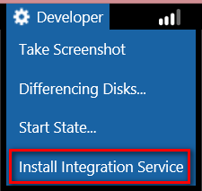

Figure 41: Developer menu

##### Command examples

The following screenshots show some of the commands that are possible
using the Command control.

- These commands:

    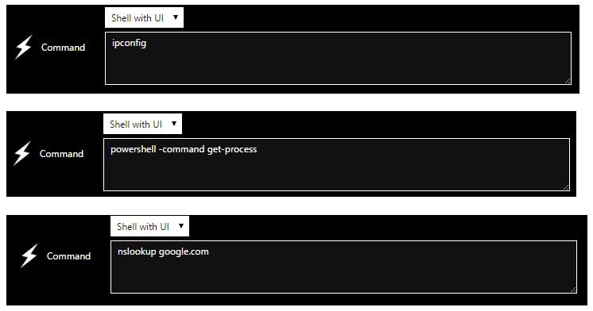

    Figure 42: Sample commands

- Have these results:

    

    Figure 43: Sample commands result

### Add Review Questions as an Assessment Exam to a Lab

Review questions can be added to a lab as an assessment. The assessment
will appear when the user has completed all the lab steps. It is created
on the Exam tab of the lab profile. To create an assessment, click the
**Exam** tab, and then check **Is Exam**.
[<sup>5</sup>](#5)


Figure 44: Add assessment

To create a multiple choice review, in the Scoring Type drop-down,
select **Assessment**, set the **Passing Score**, and then click **Add
Page**. Pages provide a way to organize the review content into
categories that, for example, might follow the lab exercises or topics.
Enter a page name and click **Add Question**. Type the question, add the
multiple choice selections, select the correct answer(s), and set the
**Score Value** so that the exam can be scored.

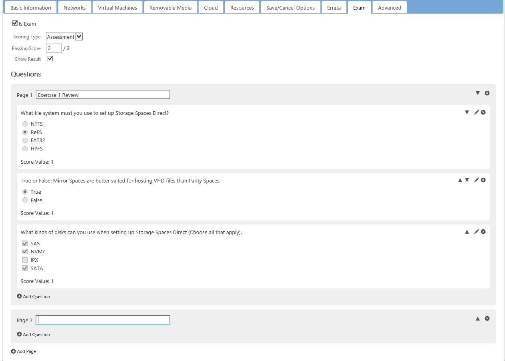

Figure 45: Creating multiple choice tests

## Adding Lab Content Using XML or Word Templates

In some cases, it might be desirable to use existing lab content in new
labs. In other cases, it may be desirable to create the exercise and
task steps in an XML or Word document and import the content. The
controls for importing and exporting lab content are shown below:


Figure 46: Import and export lab content links

### Export Content

When you export lab content, you are given the choice to export the full
lab profile, the IDL (legacy) content only, or the VMs.

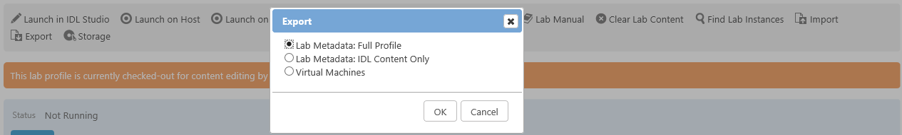

Figure 47: Export dialog box

Exporting the IDL (legacy) content causes a compressed (.zip) file containing an
XML file and screen images to be downloaded to your local computer. The
structure of the zip appears below.
[<sup>6</sup>](#6)


Figure 48: Export zip archive internal structure

The following shows a sample of XML-based exported lab content:


Figure 49: XML format lab content

For advanced users who have an understanding of XML-formatted documents,
these XML documents can be modified and imported in the lab user
interface. For example, assume you are releasing a new version of a lab
that uses different VM names. You could export the current lab as an
XML-based document, open the document in an XML editor, perform find and
replace operations to change machine names, save the document, and then
import it to the new lab profile.

### Import Content

When you click **Import**, you are given the choice to import the **IDL (legacy)
content** or the **VMs**.


Figure 50: Import options

You can then can import a content zip bundle (usually created by
exporting content from an existing lab, a content XML document, or a
Microsoft Word Docx file. Once you have selected the file to import, you
can append lab content to existing content of the lab (this is the
default) or replace the existing content with new content (explained
later). To finish the process, click **Import** to add the content. The
XML and Word templates are described below.

#### Use an XML Document Template

If you do not have existing content, you can download the XML template
from the Import link (see below).


Figure 51: Open XML template

You can then use the template to add content directly into an XML file
or use another document format that you can convert to the accepted XML
format. The following shows the current XML template:

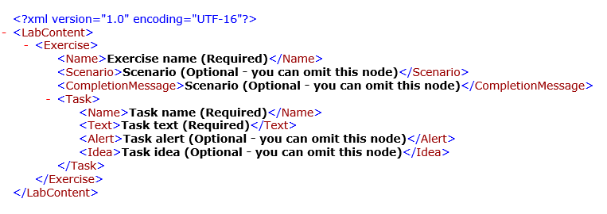
Figure 52: XML template

#### Use a Word Template

You can download and save the Word template from the Import link and
create your IDL (legacy) manual directly in it (see below).

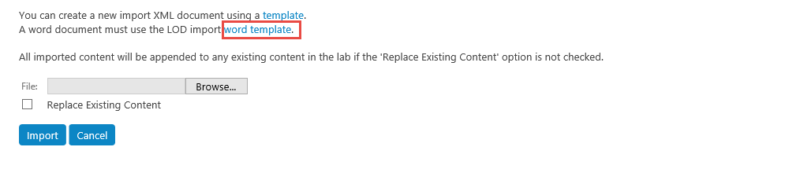

Figure 53: Open Word template

You can then use this template to create your lab manual in Word.
However, not all of the manual will be imported. The system uses the
style formats to determine what is imported and where. The following
shows the part of the current Word template that is imported into the
lab:


Figure 52: Word template

In the following areas, replace the placeholder text (shown in bold
below) with your text. You must leave the style formatting as is on
these areas to have them import:

- You can add bold formatting in the task detail area only. In
addition, bullets, italics, underlines, and other formatting will
not be imported into any areas.

1. **Exercise Title** – Your exercise title.

1. **Text located here will appear as the exercise scenario** – Your
scenario.

1. **Task Name** – The title you will give that step.

1. **Task detail** – The instructions for that step.

1. **Alert Text Example** – Any information you want displayed in the
Alert enhancement for that step.

1. **This is a good idea** – Any information you want displayed in the
Knowledge enhancement for that step.

You can copy the above elements to add to additional exercises and
tasks. For the Alert and Knowledge enhancements, copy those elements to
the tasks that will need them. When you have completed all the elements
for your manual, delete any extra elements you do not want imported such
as empty steps and the initial Alert and Knowledge elements.

#### Clear and Replace Lab Content

Content developers might find it desirable in some circumstances to
clear lab content quickly. For example, you copy a lab profile and wish
to use new lab steps in the lab profile copy. There are two ways to
clear lab content.

1. Using the quick link, Clear Lab Content, on the lab profile page.
When a lab profile is enabled for lab content, the Clear Lab Content
link appears in the quick links section.

    

    Figure 54: Clear lab content

1. Using the lab import function. When you import lab content, you are
given the choice to replace the existing content, overriding the
default behavior to append content.

    

    Figure 55: Clear lab content during import

## Additional Features

### Create and Incorporate Advertising Campaigns

An advertising campaign allows you to provide introductory content
across multiple labs that are grouped by lab series, organization or
event. This topic describes how to add an advertising campaign to a lab
profile or a lab series. The advertising campaign must first be
configured from the Learn on Demand Management page, as show below.

_You will require special permissions to see this tile_.


Figure 56: Advertising campaign tile

To create an advertising campaign, click **Create Advertising
Campaign**. On the edit, enter a name for the campaign, as shown below.


Figure 57: Advertising campaign information

Click the **Intros** tab and enter the URL source for the video,
graphics presentation, or other information you wish to display.
Multiple URLs can be entered on separate lines and will display
randomly. If wanted, check the box and set the minimum amount of time to
show the content. With this configured, the users will not be able to
close the presentation early.


Figure 58: Configure advertising campaign URLs

The advertising campaign can be associated with a lab series or a lab
profile. The following screenshot shows the configuration page for an
example lab series.


Figure 59: Advertising campaign lab series configuration

To configure a lab profile with an advertising campaign, on the lab
profile page, click **Edit**.


Figure 60: Edit lab profile

Beside Advertising Campaign, click **Choose**, then locate and select
the advertising campaign.


Figure 61: Add advertising campaign to lab profile

### Incorporate Rich Media Content as Part of Lab Introduction

Although you can use Advertising Campaigns at the level of the lab
profile, it is more practical and easier to use the Introduction Content
URL to provide a lab-specific video or other rich media content.

To do this, on the Edit Lab Profile page, scroll down and type the URL
for the rich media content in the **Introduction Content URL** field.
Like the advertising campaign, you can also force the rich media to be
display for a minimum amount of time by checking the box to Show for at
least ***n*** seconds.

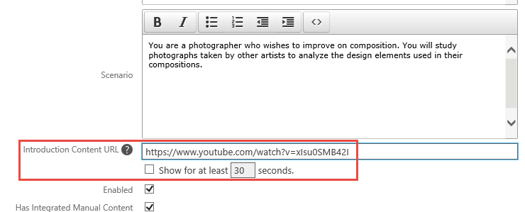

Figure 62: Add introduction URL to lab profile

## Common Style Guidelines

This section includes guidelines for preventing common errors in word
choice and sentence formation. The list contains some of the most common
errors in grammar, language, style, and formatting. Use this section as
a quick reference as you write or edit. For more comprehensive
information on, and guidelines for writing about technical information,
please see the Microsoft Manual of Style (MMS), 4^th^ edition.

|Use|Do Not Use|Comments|
|--|--|--|
|VMs|VM's|Do not use an apostrophe when you mean plural.<br/><br/>This is the possessive form.|
|Red, white, and blue|Red, white and blue|Always include the serial comma, which is the comma before a coordinating conjunction such as "and" or "or."|
|In Server Manager, click **Manage**, and click **Add Roles and Features**.|In Server Manager, click **Manage**, then click **Add Roles and Features**.|*Then* is not a coordinate conjunction and thus cannot correctly join two independent clauses. Use *and* or another coordinate conjunction or *then* with a semicolon or another conjunctive adverb to connect independent clauses in, for example, two-part procedural steps.<br/><br/>This is one of the most common grammatical errors in lab documents.|
|Some applications are unable to use expanded memory.|Some applications are unable to utilize expanded memory.|Do not use *utilize* as a synonym for *use*. *Utilize* means "to find a practical use for."|
|On the File menu, click **Open**.|On the File menu, select **Open**.|Use *click* rather than *choose* or *select* to refer to the user action of issuing a command or setting an option.||
|On the View menu, point to **Toolbars**, and then click **Formatting**.|On the File menu, choose **Open**.<br/><br/>Click on **Save**.|When dealing with menus and submenus, do not use *click on*, only *click*.||
|Check the **Print all pages** check box.|Check the **Print all pages** checkbox.|If using the term check box, this is two words.|
|For more information about...|For information on...|In cross-references, use *about*, not *on*.|
|To ..., click ….|Click … to....|Begin the sentence with "To".|
|web, website|Web, web site|Change to MMS, 4^th^ edition, is web in lower case, and website all one word.|
|All caps for A.M., P.M., and key names, such as CTRL, ALT, and DELETE|Small caps, or title case.|Note use of periods in A.M. and P.M., per MMS.|
|The **Save as** dialog box appears.|The **Save as** dialog box displays.|Do not use *display* as an intransitive verb. Use *appears* or, only if necessary, the passive *is displayed*.|
|Type the following code, and then press ENTER.|Type the following code, and then press ENTER:|End the introductory sentence with a period, not a colon. This is a recent change to the MMS.<br/><br/>Sentences introducing code samples are now always ended with a period, not a colon.|
|To install the program, do the following:|To install the program, perform the following steps:|If *following* is the last word before what it introduces, follow it with a colon.<br/><br/>This is a recent change to the MSTP.|
|Use Intense Emphasis style for user interface elements with which a user interacts.|Do not use bold for emphasis.|See the relevant section in this style guide for complete guidelines regarding bold font.<br/><br/>Do not use bold for UI elements that are used as reference.|Note that the MSTP uses bold for all UI elements. This style guide only uses bold for items you interact with. This guides the user's eye to the critical UI elements.|
|Spell out acronyms at first mention|None|You can find references to product names and acronyms in the MMS, on [www. Technet.microsoft.com](http://www.microsoft.technet.com), or on <https://worldready.cloudapp.net/StyleGuide/Read?id=1413> (requires Microsoft credentials)|
|computer|machine|Do not use *machine* when you mean *computer*. While this term is common among software developers and IT Pros, it is not acceptable per MMS.|
|You will need to supply information about applications that you want to run with Windows.|You will need to supply information about applications which you want to run with Windows.|*That* and *which* are often confused. Be sure to use the appropriate word. *That* introduces a restrictive clause, which is a clause that is essential for the sentence to make sense. A restrictive clause often defines the noun or phrase preceding it and is not separated from it by a comma. In general, do include the word *that* in restrictive clauses, even though in some clauses the sentence may be clear without it. Including *that* prevents ambiguity and helps translators understand the sentence.|
|Your package contains the subsidiary information card, which you can use to obtain device drivers or local technical support.|You will need to supply information about applications you want to run with Windows.|*Which* introduces a nonrestrictive clause, which is a clause that could be omitted without affecting the meaning of the sentence. It is preceded by a comma. Nonrestrictive clauses often contain auxiliary or parenthetical information.|
|Type your password, and then press ENTER.|Enter your password, and then click **OK**.|Do not use as a synonym for *type* except to indicate that a user can either type or click a selection from, say, a list in a combo box.|
|Wait for the computer to restart, and then log on as **Administrator** with the password **Passw0rd**.|Wait for the computer to restart, and then logon as **Administrator** with the password **Passw0rd**.|The verb form is two words, *log on* or *log off*. As a noun or adjective, use one word, no hyphen: *logon* or *logoff*.|
|Windows Server® 2008 R2 Hyper-V™|Note the use of ® and TM. Once this has been spelled out correctly, you can then reference Hyper-V, or Windows Server Hyper-V.|Refer to the Trademarks section for a link to how to use MS trademarks.|
|cloud|Cloud|The MMS now has a detailed section on cloud technology. Note that cloud is lower case.|
|On the Start menu, navigate to **All Programs\\Microsoft Forefront UAG\\Forefront UAG Management**.|On the Start menu, navigate to **All Programs/Microsoft Forefront UAG/Forefront UAG Management**.|Do not use / for Start menu commands.|
|In the Navigation pane, expand **contoso.com/branch offices/Vancouver/sales**, and then in the Details pane, click **Tom**.|In the Navigation pane, navigate to **contoso.com\\branch offices\\Vancouver\\sales**, and then in the Details pane, click **Tom**.|In a Management Console, use *expand* for navigating tree structures, and use a /.<br/><br/>Make sure you reference the Navigation pane and the Details pane.<br/><br/>Do not use a \\.|
|On the File menu, click **Open**.|On the File menu, click **Open...**.<br/><br/>On the File menu, click **Open(...)**.|In the user interface, an ellipsis is typically used to show truncation, as in a program name, or to indicate on menus and in dialog boxes that a dialog box will appear to obtain more information from the user. Do not use an ellipsis in this context in documentation.|
|Right-click **XXX**, and then click **Properties**.|Right-click **XXX**, and then select **Properties**.<br/><br/>Right-click **XXX**, and then choose **Properties**.|When you right-click something, you are presented with a context menu. You *click* items on a context menu, rather than choosing or selecting them.|

### Acronyms and Initialisms

The term, acronym, is used when the letters can be pronounced as a word.
Initialism is the correct term to use when the first letters cannot be
pronounced as a word. HOL or ILL can be either.

Spell these out at first mention, for example: System Center Virtual
Machine Manager (VMM). Note that, in this example, the Microsoft
initialism is VMM, not SCVMM. One often sees both, but by visiting
Microsoft TechNet pages, you can see that the correct initialism is VMM.
Additional common Microsoft acronyms can be found in the MMS.

### Trademarks

You can confirm trademarks on the [Microsoft Trademark & Brand Guidelines](
https://www.microsoft.com/en-us/legal/intellectualproperty/trademarks/usage/general.aspx) site.

### Bold Formatting

In this document style, only UI elements that a user interacts with
should be bold. Ensure that the UI element is bold, but any punctuation
following the UI term is not bold.

### Initial Caps

Initial caps mean capitalizing the first letter of a word. Use initial
caps for:

- File names. Internal caps are OK for readability, as in MyFile.doc.
Use what is in the VM. The file extension should be lowercase.

    Examples: MyTaxFile.doc, Oleaut.dll.

- Agenda items in slide presentations

- Folder names (internal caps are OK for readability)

- Mode names (Break mode)

- Named views (Gantt view)

- Named windows (the Edit window)

- Proper names (the Insert menu)

- "Web" when referring to the World Wide Web and to a corporate Web
(intranet)

- "Wizard" when used as part of a proper name of a wizard (for
example, the Answer Wizard)

### Sentence Case

In sentence case, you capitalize only the first letter in a sentence or
phrase. Use sentence case for all task titles.

### Title Case

Use this for the exercise titles and lab titles.

- Capitalize all nouns, verbs (including *is* and other forms of
*be*), adverbs (including *than* and *when*), adjectives (including
*this* and *that*), and pronouns (including *its*).

- Capitalize the first and last words, regardless of their parts of
speech ("The Text to Look For").

- Capitalize prepositions that are part of a verb phrase ("Backing Up
Your Disk").

- Do not capitalize articles (*a*, *an*, *the*) unless the article is
the first word in the title.

- Do not capitalize coordinate conjunctions (*and*, *but*, *for*,
*nor*, *or*, *yet*, *so*) unless the conjunction is the first word
in the title.

- Do not capitalize prepositions of four or fewer letters unless the
preposition is the first or the last word in the title.

- Do not capitalize "to" in an infinitive phrase ("How to Format Your
Hard Disk") unless the phrase is the first word in the title.

- Capitalize the second part of a hyphenated compound if it would be
capitalized without the hyphen. Always capitalize the second part of
a hyphenated compound if it is the last word of a heading or title.

### Describing the User Interface

Refer to the user interface section of the Microsoft Manual of Style for
examples of how to describe user interface elements.

## Appendix A: Upcoming Features

The Integrated Digital Learning platform is constantly improving as a
result of customer feedback. Here are some upcoming features that are
currently in development.

<a name="myfootnote1">1</a>: In future releases of the IDL (legacy) platform, it
will be possible to substitute a video for the text-based objective and
scenario sections.

<a name="myfootnote1">2</a>: The Manual and Automated types of exams are
advanced topics and are outside the scope of this introductory manual.
For more information on how to create advanced exam types, please contact
Learn on Demand Systems for additional guidance.

<a name="myfootnote1">3</a>: Please note that this functionality depends
on the use of the HTML5 controller specified in the Support tab of the
IDL (legacy) user interface (this is the default configuration).

<a name="myfootnote1">4</a>: Although links to external web sites are
supported, please note that, by default, clicking these links will cause
the user to navigate ***away*** from the lab page, disruptively
interrupting the lab. As a best practice, if you want to link to external
web site in any of the lab text, include the **target="\_blank"**
attribute to cause a new web page to open when the link is clicked.
Consider the following HTML:

```HTML
<a href="https://www.learnondemandsystems.com" target="\_blank">Learn on Demand Systems</a>
```

This code will cause the LODS website to open in a new web page when
the link is clicked.

<a name="myfootnote1">5</a>: The other exam types are advanced topics.
For information on them, please contact Learn on Demand Systems for
additional guidance.

<a name="myfootnote1">6</a>: Please note that you can import either an
uncompressed or a compressed version of the XML file.
