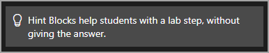
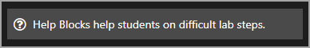
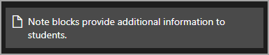
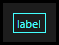
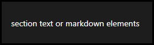
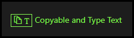

# Markdown Syntax

Markdown is an easy to use markup language to format text, that offers multiple ways to achieve the same result. Markdown was designed to be easy to learn as well as be easy to read and write. Markdown allows the author to keep their hands on the keyboard and focus on writing content. Markdown supports HTML, and HTML syntax can be used in combination with Markdown.

## Markdown supports the following types of formatting

[Headings](#headings)  
[Text formatting](#text-formatting)  
[Link formatting](#link-formatting)  
[Page formatting](#page-formatting)  
[Embedded content](#embedded-content)  
[Task and List formatting](#task-and-list-formatting)  
[Table formatting](#table-formatting)  
[Special formatting](#special-formatting)  

## Headings

Markdown allows for text to be resized by typing 1-6 # (hash or pound) symbols in front of the text that is to be resized, followed by a space. One # renders the largest text size, while six # symbols renders the smallest text size.Typically this is used at the beginning of a paragraph or section in a document, to make the title stand out from the rest of the text. 
> - `# Heading 1`
> - `## Heading 2`   
> - `### Heading 3`  
> - `#### Heading 4`
> - `##### Heading 5`
> -  `###### Heading 6` 

[Return to Markdown formatting](#markdown-supports-the-following-types-of-formatting)

## Text Formatting

- **Indent size**: pressing the tab key will indent 4 spaces.

- **Single space**: pressing the tab key at the end of a line will single space the next line. Alternatively, pressing the space bar four times will single space the next line. 

- **Double space:** leaving no spaces at the end of the line will double space the next line. 

- **Bold**: used to show emphasis. Type two * (asterisk) symbols on each side of the text that is to be bolded.

  > \**Bold text**

- **Italic**: used to show emphasis or distinction. Type two _ (underline) on each side of text that is to be emphasized.

  > \_Italic text_

- **~~Strikethrough~~**: used to mark text that should not be included, but should not be removed from the document. Type two ~ (tilde) symbols on each side of text that should show a strikethrough.

  > \~~Strikethrough text~~ 

- **Escape character**: used to prevent text from being formatted into Markdown. Type a \ (backslash) at the beginning of the text that is to be escaped. 

  > \escaped text

- **Bullet**: used to separate and order  items in a list without using numbers

  > `-`

- **Inline code block**: used to provide a snippet of code that can be copied and pasted. Type a ` (backtick) on each side of the text that is to be displayed in the code block. The backtick is located above the tab key, to the left of the 1 key on the keyboard.

  > <code>`code block`</code> 
  >
  > 

- **Fenced code block**: used to provide a programming language-specific code snippet. Type three ` (backticks) on each side of the text that should be displayed in the fenced code block. This should consume at least 3 lines in the text editor; the first line should display three backticks followed by the programming language name, the second line should display the code snippet, and the last line should only display three backticks. Markdown allows for more than one line to be used to display the code snippet. 

  > ~~~Fenced_code_block
  > ```PowerShell
  > get-service | stop-service -whatif
  > ```
  > ~~~
  >
  > 

- **Code Block Modifiers**

    Code block modifiers change the way that code blocks are displayed. The below syntax can be used with or without a language directive. Simple leave out the language directive and only include the code block modifier.
    
    - Prevents code from being highlighted.

    ~~~
      ```powershell-nocolor
      Code Block
      ```
    ~~~
    
    - Prevents the code block from rendering with a tab that displays the language used.

  ~~~
   ```powershell-notab
   Code Block
   ```
   ~~~

    - Prevents the code block from being highlighted, no language tab and is not copyable.
    ~~~
    ```powershell-nocode
    code block
    ```
    ~~~
    
    - Code is highlights but is not copyable.

    ~~~
   ```PowerShell-nocopy
   code block
   ```
   ~~~
   

    - Multi line commands wrap to the next line.

    ~~~
   ```PowerShell-wrap
   code block
   ```
   ~~~
   
    - Adds line numbers in the code block.
    
    ~~~
   ```PowerShell-linenums
   code block
   ```
   ~~~
   

[Return to Markdown formatting](#markdown-supports-the-following-types-of-formatting)

## Link formatting

>[!KNOWLEDGE] You should enter alt text and title to the link, so that when a user mouses over it, a description will appear. You can add alt text and a title with the following syntax: `!IMAGE[image alt text](Image.jpg "image title text")` 

- **Internal link**: Used to link to a specific section within a document. Internal links must be all lower-case, alphanumeric and separated by hyphens. Any characters that are not alphanumeric should be omitted, and spaces should be replaced with a hyphen. 
  > \[text to display](#heading-to-link-to "optional link title")

- **External link**: Used to link to a page outside of the document.  

  > \[text to display](url "optional link title)

- **Relative link**: used to link to a page in the same directory without the need to display the full URL of the page.

  > \[text to display](../folder/file.htm "optional link title")

- **Reference link**: used to provide a link that will be referenced multiple times. The link can be referenced by typing the text value between the [ ] (square brackets). It is not necessary to include the full URL, as long as the text value in both sets of brackets is the same.   

  - **_Text lookup_**: 
    > \[Reference link text value]
    > \[Reference link text value]: URL "Optional link title"
  - **_Label lookup_**:
    > \[Reference link][Name of URL]
    > \[Name of URL]: URL "Optional link title"
  - **_Footnote style_**:
    > \[Reference link][1]
    > \[1]: URL "Optional link title"
    
- **Help Link**: used to provide a link that will help the student with the section of the lab they are working on. 

        > help[help text here](https://URL.com)

- **Hint Link**: used to provide a hint that will help the student with the section of the lab they are working on. This is most effective as a dialog (see [Link Behavior Prefixes](#link-behavior-prefixes)).
       
        > hint[hint text here](https://URL.com)

- **Knowledge Link**: used to provide a link, that will give the student additional knowledge about with the section of the lab they are working on.

        > knowledge[knowledge text here](https://URL.com)

### Link Behavior Prefixes

- **Open in a Dialog**: used to open a link in a dialog window, that will overlay on the lab. This is useful to show students information, without leaving the lab environment.

    > `^[link text](https://URL.com)`

- **Open in portal window** (or a new window if there is no portal window): used to open a link in a the Portal window of the lab, or a new window if there is no portal window in the lab. 

    > `<[link text](https://URL.com)`

- **Open in a New Window**: used top open a link in a new window.

    > `[link text](https://URL.com)`
## Page formatting

- **Page break**: Used to separate content into pages. Separating into pages creates a next button that the student must click to navigate to the next page. This is useful for displaying small sections of instruction to the student at a time, rather than all instructions on the same page within the lab. Type three = (equals) symbols on the line where the current page should end. The new page will begin on the line following the three = symbols.

  > \===

- **Horizontal Line**: Used to separate content on the same page. Type three --- (dash or hyphen) on the line where the horizontal line should appear. 

  > \---

- **Block quote:** Used to quote information from other sources. Block quote text appears indented from other content in the document. Type a > (greater-than sign) before text that should appear in the block quote. Most Markdown syntax will render inside of block quotes.

  > \> text here
  >
  > \> additional text 
  
[Return to Markdown formatting](#markdown-supports-the-following-types-of-formatting)
 
## Embedded content

>[!KNOWLEDGE] You should enter alt text and title to the embedded content, so that when a user mouses over it, a description will appear. You can add alt text and a title with the following syntax: `!IMAGE[image alt text](Image.jpg "image title text")` 

- **Image**: Used to embed an image inline with other content. When images are clicked, they will open in a new window and display at the images full resolution.

  > \![text to display]\(url)

- **Image Dimensions**: You can specify image dimensions in your lab. Dimension values are in pixels and are placed inside curly braces, immediately after the end of the link URL syntax. Height and width are separated by a "x" in this format:{widthxheight}
It's also possible to simply supply the width: {width}. In this case, the height is automatically calculated for you to be proportional to the provided width.

  > `{heightXwidth}` or `{height}`

- **Video:** Used to embed an image inline with other content. The syntax format should look the same as an image, except the video should begin with a ! (explanation mark), followed by the word VIDEO. 

  > \!video[text to display]\(url)
  
- **Audio:** Used to embed an inline audio player, or a link to an audio recording.The syntax format should look the same as a video, except the audio should begin with a ! (explanation mark), followed by the word audio.

  > \!audio[text to display](URL)

- **Image with link:** Used to embed an image that can be clicked to navigate to a specific URL (internal or external). 

  > \[![text to display]url or filepath "Optional image title")]url "Optional link title")

- **Portal Link:** used to launch a hyperlink in the lab client window. In the Cloud Client, this will open the hyperlink in the left window. In the traditional virtualization client (vm-based labs), this will open the hyperlink in a new local browser window.

  > `<[text to display](URL)`

- **Image Link:** used to display a link with a camera icon, to suggest that the hyperlink opens an image

  > `image[text to display](URL to image)`
  >
  > 

- **Video Link:** used to display a link with a videocamera icon, to suggest that the hyperlink opens a video

  > `video[text to display](URL to video)`
  >
  > 
  
  [Return to Markdown formatting](#markdown-supports-the-following-types-of-formatting)

## Task and List formatting

- **Unordered list:** Used to list items in no particular order, separated by bullets rather than numbers. Type a - (dash or hyphen) followed by a space and then the text to be listed. Pressing enter at the end of the text will start the next line with a bullet. 

- **Ordered list:** Used to list items in a particular order, separated by numbers rather than bullets. Type the number 1, followed by a space and then the text to be listed. Pressing enter at the end of the text will start the next line with number 2.

- Both Unordered and Ordered lists can contain Task Checkboxes for the student to check off steps as completed. Both list types can be combined in the same list. Task Checkboxes are used track and report lab progress to LOD and TMS, as well as a visual marker for students. Lab progress is calculated by the percentage of Task Checkboxes that are checked in the lab instructions.

```Unordered_Task_List
- [] Item 1
- [] Item 2
- [] Item 3
- [] Item 4
- [] Item 5
```

```Ordered_Task_List
1. [] Item 1
1. [] Item 2
1. [] Item 3
1. [] Item 4
1. [] Item 5
```

## Table formatting
- Tables can be aligned left, right or center by placing a : (colon) on the head row of the table. Placing a colon on the left side, right side or both sides of the dashes in the header row, will align the text in the table accordingly. 

**Left-aligned text**

```
| column 1 | column 2 |
|:---------|:---------|
| data 1   | data 2   |
| data 3   | data 4   |
```

**Right-aligned text**
```
| column 1 | column 2 |
|---------:|---------:|
| data 1   | data 2   |
| data 3   | data 4   |
```

**Center-aligned text**
```
| column 1 | column 2 |
|:--------:|:--------:|
| data 1   | data 2   |
| data 3   | data 4   |
```

[Return to Markdown formatting](#markdown-supports-the-following-types-of-formatting)

## Special formatting 

- **Variables**: Used to store information that is not known at the time of lab authoring. Variables use two Replacement tokens; **&commat;lab.textbox(name)** and **&commat;lab.Variable(name)**. **Use &commat;lab.texbox(name) to define** the variable in the (name). **Use &commat;lab.Variable(name) to recall** the information store in the variable. For example, you could create a variable with &commat;lab.textbox(studentPassword) and ask the student to enter a password in the field. Later in the lab you could call back the student's password with &commat;lab.Variable(studentPassword). This prevents the student from having to remember or write down their password, since it is stored in the lab by a variable. 

  - Defining Variable in lab instruction editor view:
  
   
  
    - Defining Variable in lab from Student view in the lab:
  
   
  
    - The student enters their password in the lab:
  
    
  
   The password is recalled in later lab steps using the Replacement Token below
  
    - Calling Variable in lab instruction editor view:
   
    
  
    - Calling Variable in lab from Student view in the lab:
  
    

- **Knowledge Block:** Used to provide additional information, to help students better understand lab steps or lab content. Knowledge blocks are limited to only show 4 lines of the lab content. After 4 lines, a _more_ link will be shown, allowing the student to expand the knowledge block and review additional information.

    > \> [!knowledge] knowledge text here.
    >
    > 

- **Alert Block:** Used to draw attention to important issues, such as showing additional information or steps that the student may need complete to avoid other issues. 

    > \> [!alert] alert text here.
    >
    > 

- **Hint Block:** Used to provide a hint for the for the section of the lab that the student is working on.  

    > \> [!hint] hint text here.
    >
    > 

- **Help Block:** used to provide help, such as showing additional about the section of the lab that the student is working on.

    > \> [!help] help text here.
    >
    > 

- **Note Block:** used to provide additional information, similar to a knowledge block, with the only difference being that notes do not collapse and show a _more_ link to expand the section. 

    > \> [!NOTE] note text here.
    >
    > 

- **Key Combo:** used to generate a button that sends a combination of key codes to the active VM. The key codes used are standard Javascript event key codes. Characters supported for key combo labels include: A-Z, 0-9, underscore, dash and plus. Other special characters will not work. 

    >[!alert] Some key codes may not function as expected when using vSphere. It is highly recommended to test each key combo before publishing the lab instructions for production use. 

        > \> @lab.KeyCombo(label)[keyCode1,keyCode2].
        >
        > 
       


- **Sections:** used to group lab instructions and elements together so they may be called up on and manipulated as one. This is done by assigning a lab variable that has been set via LCA, ABA, an IDLx textbox  or an IDLx drop-down menu.

    > :::sectionName(variableName-variabelValue)

    > section text or markdown elements

    > :::

    > 
  
- **Dialog:** Used to open a dialog popup, to display additonal information. This can be useful to make additional information available to the student. Dialogs **should not be used to display websites that are in an iFrame**, as this can cause some abnormal page rendering in the dialog. 

    >```^[Text to display in lab  instructions][Reference Link]```
    >
    >\>[Reference Link]:
    >
    >\>This appears in the Dialog

- **Instruction Dialog:** Used to open a dialog popup, to display rendered Markdown or IDLx content that is located anywhere on the internet and accessible from a URL. This can be useful to provide additional information, from external sources on the internet.

    >```^INSTRUCTIONS[text](url)```
  
- **Commands:** Used to target the current resource in the Resource Portal to input commands. To mitigate risk of error and to enhance the overall experience of the lab, the IDLx platform supports executing commands directly in the area of focus of the Resource Portal. Clicking the text in the lab instructions will input the command into the item in focus, on the Resource Portal. Commands can be a single line (shown below) or multi-line. 

There are 4 different kinds of commands that you can configure:

   - **Type Text**. This is not a command per se. Rather, this command type allows the user to input a predetermined string. To use this, simply add ```+++``` on each side of the text that you wish to have typed.

   - **PowerShell**. This allows the user to execute a PowerShell command in the background. The user does not see the execution of the command. To use this, simply add ```{PowerShell}``` to the end of the command.

   - **PowerShell with UI**. This opens a command prompt window in the VM and shows the command execution. To use this, simply add ```{PowerShell visible}``` to the end of the command.
    
   - **Shell**. This causes a command to be executed in the background. The user does not see the execution of the command. To use this, simply add ```{Shell}``` to the end of the command.

   - **Shell with UI**. This command opens a command prompt window in the VM and shows the command execution. To use this, simply add ```{Shell visible}``` to the end of the command.

Commands require Integration Services to be installed on the VM. After installing Integration Services, you must save a differencing disk for Integration Services to be installed on all future launches of the lab.

   - **Single Line Command:**
       
  <!-- The following code block _must_ be indented instead of wrapped in ~~~ to prevent
     our preprocessor from preprocessing the code. Do not change this formatting. -->
     
    @[Text to display][`command`]
    
  - **Multi Line Command:**
  
  <!-- The following code block _must_ be indented instead of wrapped in ~~~ to prevent
     our preprocessor from preprocessing the code. Do not change this formatting. -->

    @[Text to display][multi-line-command]

    Multi-line-command-id:
    ```
    Multi-line-command-id
    Command-goes-here
    ```
    
Below is an example of how a multi line command would look for a **PowerShell cmdlet, with no UI**. Shell commands can be executed the same way, by replacing ```PowerShell``` with ```Shell```.

    @[Click this to run the get-service cmdlet][Get Service]{PowerShell}

    [Get Service]:
    ```PowerShell
    get-service | stop-service -whatif
    ```
    
Below is an example of how a multi line command would look for a **PowerShell cmdlet with UI**. Shell commands can be executed the same way, by replacing ```PowerShell visible``` with ```Shell visible```.

    @[Click this to run the get-service cmdlet][Get Service]{PowerShell visible}

    [Get Service]:
    ```PowerShell
    get-service | stop-service -whatif
    ```
> [!KNOWLEDGE] PowerShell commands are executed in a CMD prompt, in the lab. The command will still function as intended.

Commands can perform any action that is possible to do from a command or Windows PowerShell prompt. For example, the command could open File Explorer at a particular location within a directory structure, open dialog boxes, start scripts, open documents and web pages, and many others. 

Although potentially any task could be reduced to an action that can be executed as a command shell or Windows PowerShell command, you should use this feature judiciously. Users should still know how to open File Explorer and perform other basic actions. This feature is most useful for a complex task that involves numerous steps, opening file locations deep down in directory structures, opening specific Web pages, and other similar activities.
   
- **Include:**  used to input text from a GitHub raw link. This is useful to use to pull in content hosted on GitHub. Navigate to the GitHub page containing the content to be used, click the Raw button, then copy the URL of that page and include it in the below syntax. 
 
  >  `!INSTRUCTIONS[](url)`

  **Note**: GitHub hosted content can be changed by the repo maintainer of the content and will change the instructions displayed in the lab using the _Include_ syntax. 

- **Reference Instruction Blocks:** Used to reference content multiple times throughout the lab instructions. First, Define the content, then reference the content using the syntax below. Defined content can be text, links, copyable text, code blocks or rich media content such as images and videos. Defined content will not appear in lab instructions until it is referenced using the Reference Content syntax. 

    <!-- This image MUST be placed before the HTML code below it in order for it to be properly recognized as a child of the list item before it. -->
    

  <!-- This code must be indented by only two spaces in order for it to render the HTML. Indenting by 4 spaces will show the HTML in a code block, which is not what we want. -->
  <pre><code title="Copy to clipboard" class="prettyprint prettyprinted" style="">&#33;INSTRUCTIONS[][label]<span class="pln">

  </span><span class="pun">&gt; [label]:</span><span class="pln">
  </span><span class="pun">&gt; These instructions are injected in the statement above.</span></code></pre>

- **Copyable Text:** used to make text copy to the local clipboard when the student clicks the text. Type two + (plus) symbols on each side of the text that should be made copyable. 

  > \++Click to copy to clipboard++
  >
  > 
  

- **Type Text:** used to target the Portal window to input text. Clicking the text in the lab instructions will input text into the item in focus, on the Portal Window Type three + (plus) symbols on each side of the text that should be made into Type Text. 

  > \+\+\+Click to type in to your managed VM+++
  >
  > 

- **Copyable and Type Text:** used to make text copy to the local clipboard and type into a virtual machine when the student clicks the text. Type four + (plus) symbols on each side of the text that should be made copyable and type text. 

  > \++Click to copy to clipboard and type into a VM++
  >
  > 
  
- **Embed YouTube video:** used to embed a YouTube video inline with the lab instructions. URLs from YouTube.com automatically embed. Videos from any other URL will not embed.

  > `!VIDEO[text to display](url)` 

- **Replacement Token:** used to replace text in lab instructions with a variable that is unknown at the time of authoring the lab instructions. These variables may not be generated or created until the lab is launched by the student. These can include usernames, user first name, user last name, running lab instance ID number, etc. To apply a Replacement Token, in the parameter value field, simply enter "&commat;lab", and the press the period key. The moment you type the period you will be presented with all available replacement tokens for your lab. 

  > |Lab Replacement Token|Description|
  > |--|--|
  >|`@lab.Activity(Automated1)`|Inserts activity Automated1 into the instructions.|
  >|`@lab.Activity(Question1)`|Inserts activity Question1 into the instructions.|
  >|`@lab.LabInstance.Id`|The unique ID of the running lab instance.|
  >|`@lab.LabInstance.GlobalId`|The globally unique ID of the running lab instance.|
  >|`@lab.LabInstance.StartDate`|The UTC start date of the running lab instance. Format: yyyyMMdd|
  >|`@lab.LabProfile.Id`|The unique ID of the lab profile.|
  >|`@lab.User.Id`|The unique ID of user running the lab.|
  >|`@lab.User.FirstName`|The first name of the user running the lab.|
  >|`@lab.User.LastName`|The last name of the user running the lab.|
  >|`@lab.User.Email`|The e-mail address of the user running the lab.|
  >|`@lab.User.ExternalId`|The external ID of the user running the lab (if launched via    API).|
  >|`@lab.User.Organization.Id`|The ID of the organization the user belongs to.|
  >|`@lab.User.Organization.Name`|The name of the organization the user belongs to.|
  >|`@lab.Tag`|The tag associated with the lab instance (if specified when launched via    API).|
  >|`@lab.CloudSubscription.Id`|The unique ID of the subscription backing the lab    instance.|
  >|`@lab.CloudSubscription.Name`|The name of the subscription backing the lab instance.|
  >|`@lab.CloudSubscription.TenantName`|The tenant name of the subscription backing the    lab instance.|
  >|`@lab.CloudResourceGroup(1).Name`|The instance name of the ResourceGroup1 resource    group.|
  >|`@lab.CloudResourceTemplate(Template1).Name`|The instance name of the VNET resource.|
  >|`@lab.CloudResourceTemplate(Template1).DeploymentLink`|A deployment link for the    VNET resource.|
  >|`@lab.CloudResourceTemplate(Template1).DeploymentUrl`|A deployment URL for the VNET    resource (rendered as text, not a link).|
  >|`@lab.CloudResourceTemplate(Template1).Parameters[complex-VNETName]`|The value sent    for the complex-VNETName parameter when creating the VNET resource.|
  >|`@lab.CloudPortalCredential(User1).Username`|The username of the User1-* cloud    portal user account.|
  >|`@lab.CloudPortalCredential(User1).Password`|The password of the User1-* cloud    portal user account.|
  >|`@lab.CloudCredential(PoolName).Username`|The Username assigned from the PoolName credential pool.|
  >|`@lab.CloudCredential(PoolName).Password`|The Password assigned from the PoolName credential pool.|
  >|`@lab.CloudCredential(PoolName).TenantName`|The TenantName assigned from the PoolName credential pool.|
  >|`@lab.CloudCredential(PoolName).TenantPrefix`|The TenantPrefix assigned from the   PoolName credential pool.|
  >|`@lab.CloudPortal.Link`|A link to the cloud portal.|
  >|`@lab.CloudPortal.Url`|The cloud portal URL (rendered as text, not a link).|
  >|`@lab.CloudPortal.SignInLink`|A cloud portal sign-in link.|
  >|`@lab.CloudPortal.SignInUrl`|The cloud portal sign-in URL (rendered as text, not a    link).|
  >|`@lab.CloudPortal.SignOutLink`|A cloud portal sign-out link.|
  >|`@lab.CloudPortal.SignOutUrl`|The cloud portal sign-out URL (rendered as text, not a    link).|
  >|`@lab.TextBox(name)`|A text box that allows the user to set the value of a named    variable. This variable value can then be displayed elsewhere using @lab.Variable(name)   .|
  >|`@lab.DropDownList(name)[val1,val2]`|A dropdown list that allows the user to set the    value of a named variable. This variable value can then be displayed elsewhere using    @lab.Variabl(name).|
   >|`@lab.KeyCombo(title of button)[key combo]`|Generates a button that sends a combination of key codes to the active VM.|

  *(VM-ID) should be replaced with the unique ID of the virtual machine in use.

---

[Return to Markdown formatting](#markdown-supports-the-following-types-of-formatting)
