# Embedding Lab on Demand content into edX courses

[Learning Tools Interoperability (LTI)](http://www.imsglobal.org/activity/learning-tools-interoperability) is a standard defined by the IMS Global Learning Consortium that allows learning systems (e.g. a training management system, or TMS) to consume content provided by external tools or services. This standard enables rich integration between different learning services and platforms, combining their strengths to offer more value to students of those learning systems.

EdX and OneLearn Lab on Demand are two learning systems that support the LTI standard. These systems can be used together to provide enhanced learning experiences for students, allowing them to learn how to use software inside of live lab environments without leaving the scope of an edX course that they are enrolled in.

Here’s an example showing this integration in action:

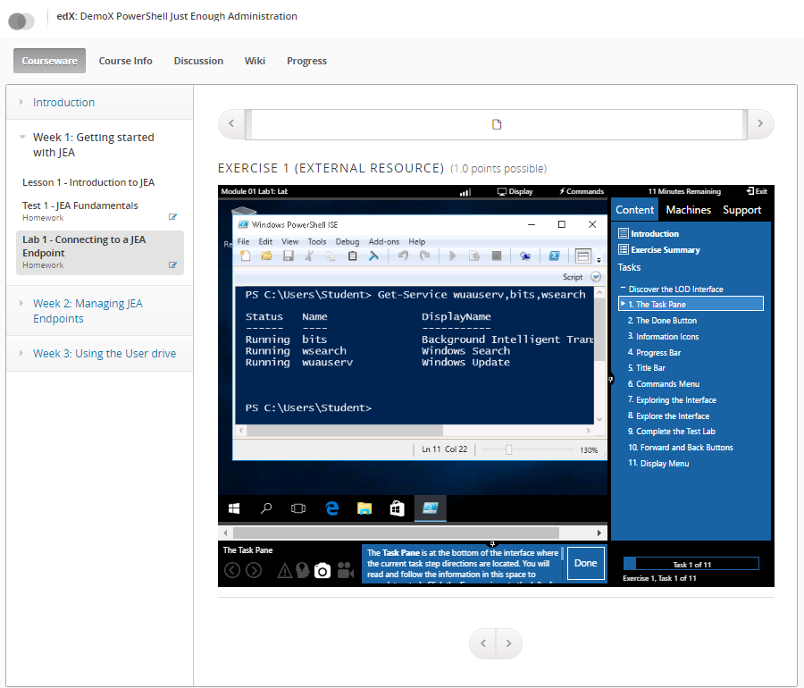

This screenshot shows the student view of an edX course they are participating in with an integrated Lab on Demand environment embedded directly inside of their course user experience. In labs that are integrated this way, students can apply their knowledge first hand to give them more learning opportunities and optionally be graded on the work that they do in the lab as well. In addition to instructional content, quizzes, and assignments, edX course authors can now include labs in the courses they design to provide the ultimate learning experience for students of technology-focused courses.

## How it works

In LTI, the learning system being used by a student is referred to as the LTI Consumer, and the external tool or service that is being integrated into that learning system is referred to as the LTI Provider. OneLearn Lab on Demand supports the LTI standard as an LTI Provider, and edX supports the LTI standard as an LTI Consumer (and an LTI Provider as well, but that support isn’t necessary to perform this integration). This LTI support is what allows edX course authors to integrate rich Lab on Demand content directly into their learning solution. LTI support is not limited to edX either. Since LTI is a standard protocol, Lab on Demand content can be integrated into any learning system that supports the LTI standard as an LTI Consumer.

To integrate content from an LTI Provider into an LTI Consumer, the following information is required:

- LTI Client Key – this is the account identifier for the LTI Provider, which allows LTI Consumers to identify the account needed to access LTI Provider content; for OneLearn Lab on Demand, this is referred to as the LTI Key
- LTI Client Secret – this is the password/passcode used to authenticate to the LTI Provider account; for OneLearn Lab on Demand, this is referred to as the LTI Secret
- Content URL – this is the URI that exposes the content to be integrated into the LTI Consumer training materials; for OneLearn Lab on Demand, this is referred to as the LTI Launch URL

If you are an existing customer of Learn on Demand Systems and you want to launch your labs via LTI, request the LTI Key and LTI Secret for your lab(s) from [support@learnondemandsystems.com](mailto:support@learnondemandsystems.com).

Once you have these pieces of information in hand, you can begin integrating your Lab on Demand lab into an edX course.

## Integrating a Lab on Demand lab into an edX course

Inside of edX Studio, click on the course where you want to integrate an online lab, as shown below.

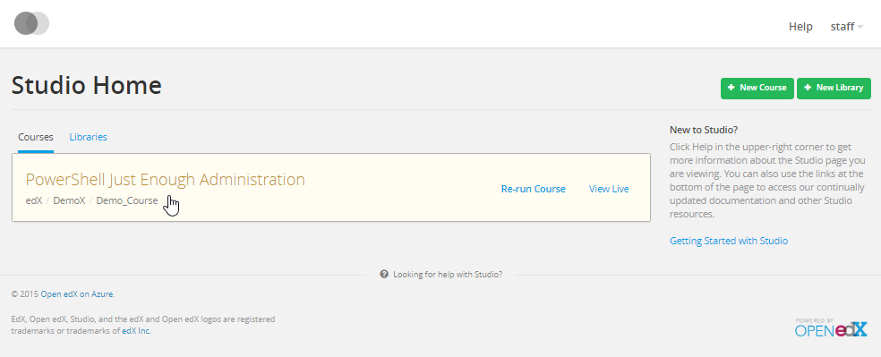

Once you are inside of the course editor, click Settings, then Advanced Settings to enable the course as an LTI consumer.

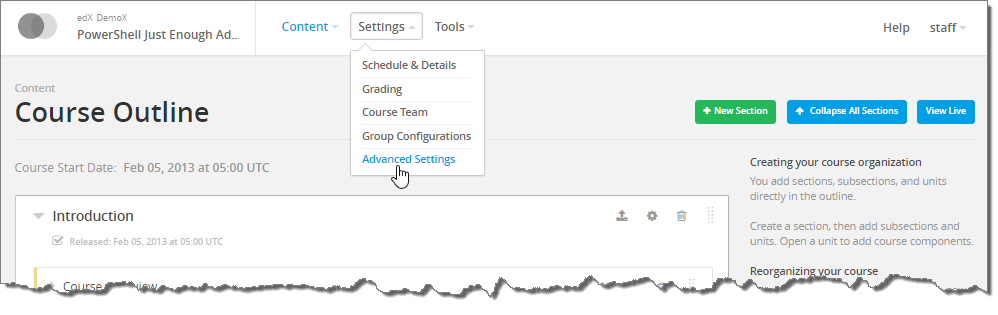

Enabling the course as an LTI consumer allows content from your Lab on Demand course to be embedded in the edX course you are editing. To achieve this, you must make two modifications. First, in the Advanced Module List, add "lti_consumer" to the list of advanced modules.

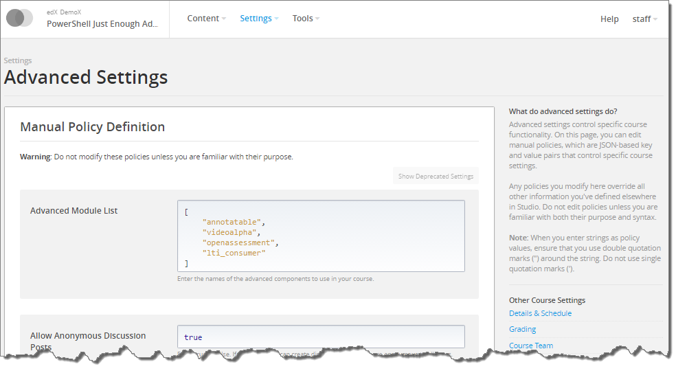

Further down the same page, add a string that defines the passport for your OneLearn Lab on Demand course to the LTI Passports section.

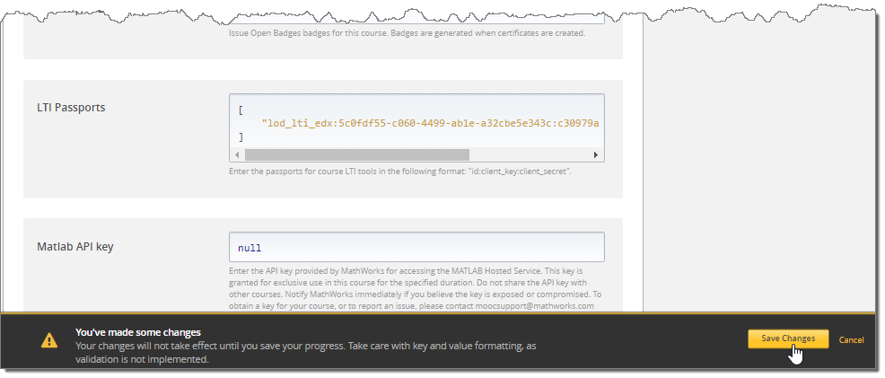

LTI Passports are simply strings composed of three values: a passport id of your own choosing, the LTI Client Key for the lab you are integrating, and the LTI Client Secret for the lab you are integrating (e.g. “lod_lti_edx:5c0fdf55-c060-4499-ab1e-a32cbe5e343c:c30979a2-44d3-43c3-a866-96289be2e83f”). Click on the Save Changes button to save the settings you just changed. Then click on Content, then Outline to return to the course content editor.

In the course content editor, either create a new unit or click on an existing unit where you want to show an integrated lab.

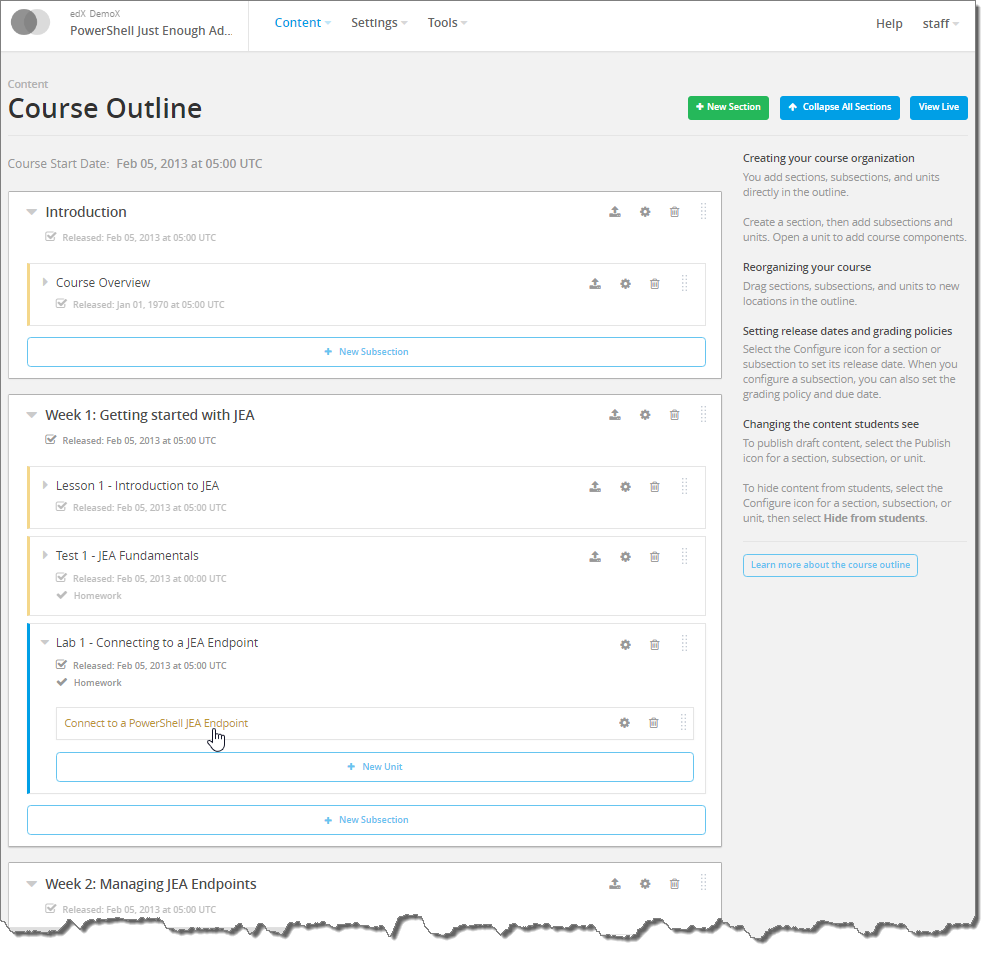

In the Unit editor, click on the Advanced button, and then select LTI Consumer to add an LTI Consumer component.

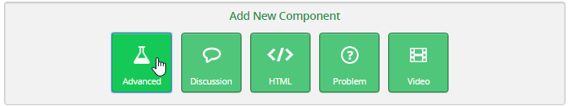

Click Edit to add the LTI Provider details to the new LTI Consumer component you just added.

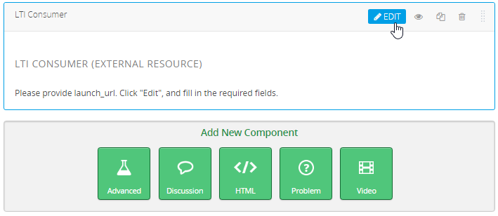

Inside the LTI Consumer editor, you must set the LTI ID to the id that you chose when you defined the LTI Passport in the course settings, and you must set the LTI URL to the content URI that is associated with the Lab on Demand course that you are integrating.  

 and the Launch URL")

There are three different methods that can be used to display the content of the LTI URL in an edX course: inline, modal, or in a new window. By default, the LTI content will render inside of an inline IFrame in the current page.  When using this default, it is recommended that you set the value of Inline Height in the LTI Consumer editor to 600. If you prefer to display the LTI content in a modal dialog box or on a new tab in your browser, select Modal or New Window in the list of LTI Launch Target values as shown below.

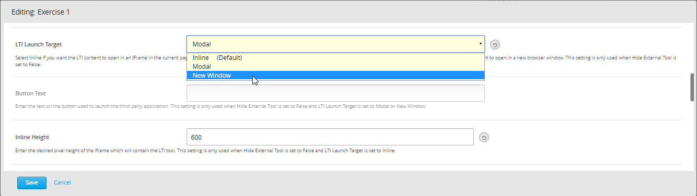

If you choose Modal in this list, then it is also recommended that you set the Modal Height property to 768 and the Modal Width property to 1024.

Regardless of which method you choose to display the LTI content, you can optionally use the Scored and Weight properties to enable scoring and define the weight of the scoring in the overall course, respectively. When you have finished making changes to these settings, click Save.

At this point, if you entered all of the information properly you should see the Lab on Demand course loading directly inside of the LTI Consumer unit where you added it. When you are satisfied with the integration, you can click on the Publish button as shown below, allowing students to begin working with an online lab as part of their learning experience.

Here is a screenshot showing the lab in the edX Studio authoring environment with the LTI content displayed inline in an IFrame:

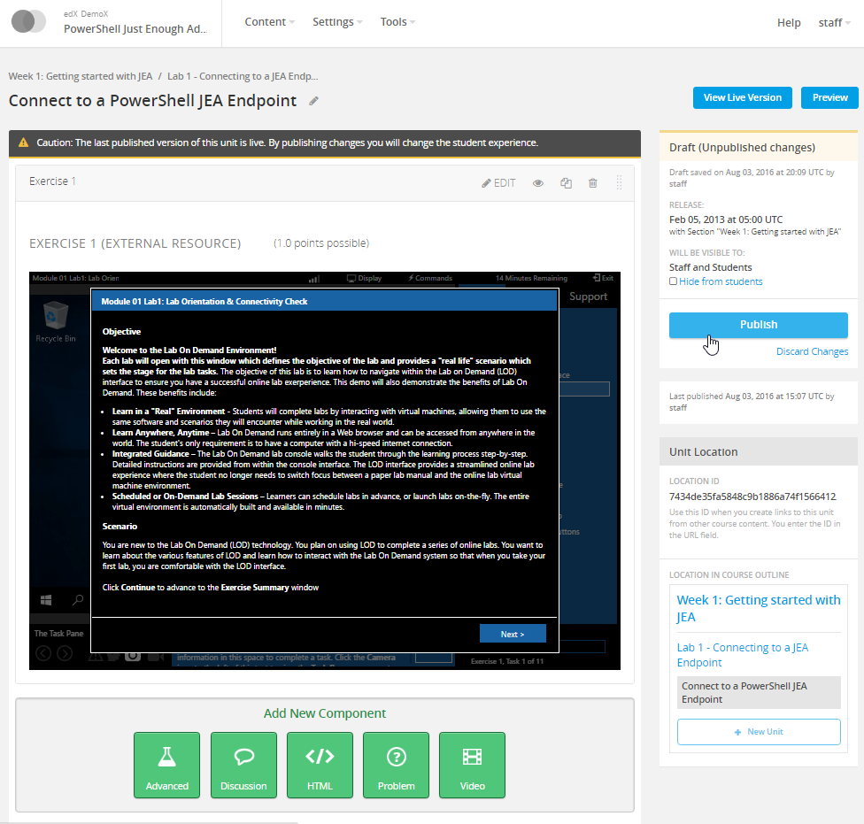

Below you can see the same lab in the edX Studio authoring environment when the LTI content is configured to be displayed in a new window (i.e. on a new tab in your web browser):

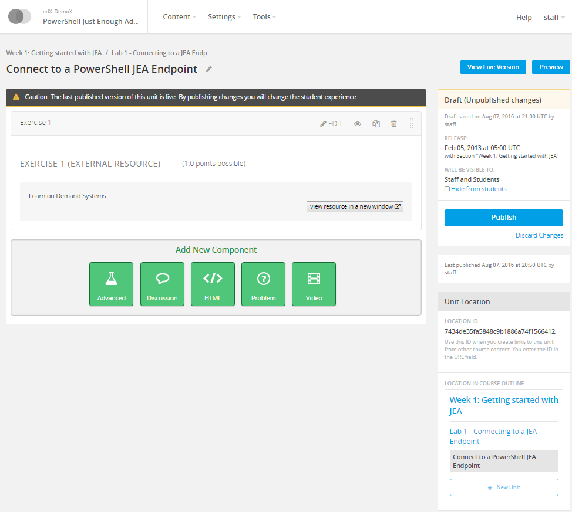

Lastly, here is the same lab from the perspective of a student with the integrated LTI content displayed for them in a modal dialog:

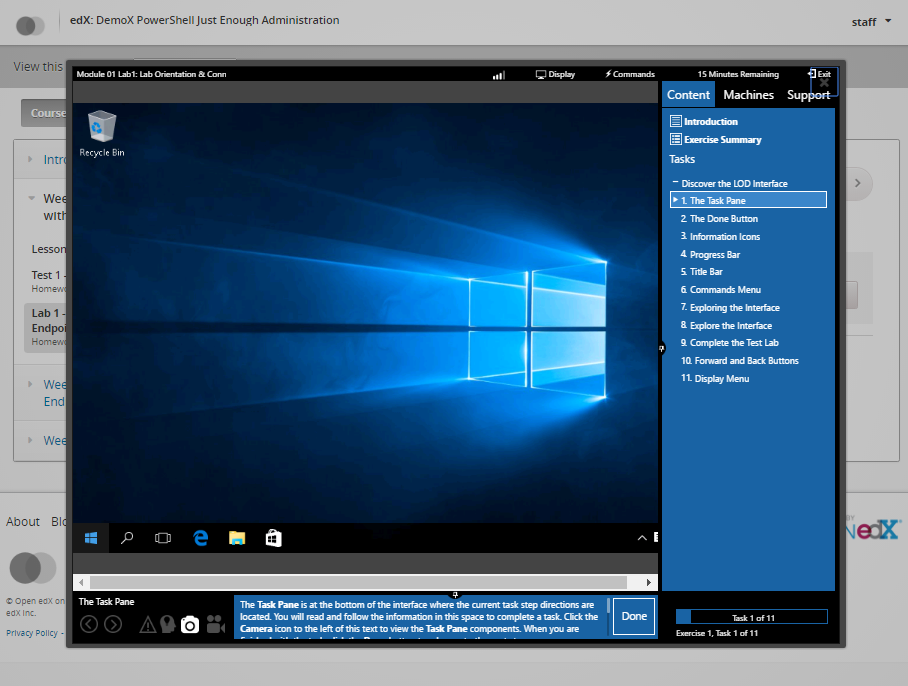

As you can see, regardless of which display method you choose, LTI support in these two great learning solutions makes it very easy to offer more value to students of the courses that you offer through edX.

## LTI Scoring

LTI Scoring allows the lab to be scored based on the LTI scoring policy in the lab profile. The LTI scoring policy is configured on the Launch URLs tab of the lab profile. 

There are multiple options available for LTI Scoring. These can be changed at anytime from the lab profile, if necessary.

Click the **Advanced** tab of your lab profile to get started.

You will see either one or two options in the **Scoring Policy** drop-down menu, depending on whether or not the lab has IDL content: **Time Spent** (always present) or **Tasks Complete** (only present for labs that have IDL content).

- You can see these options in the screenshot below.

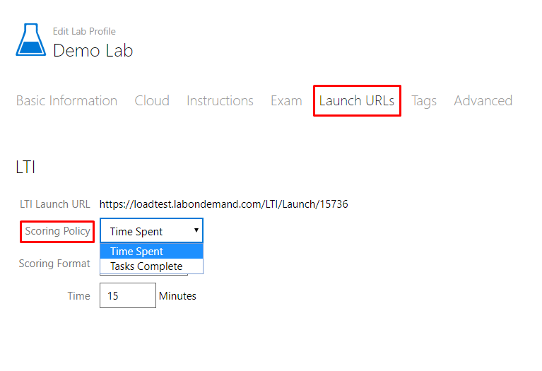

If you select **Time Spent**, the scoring will be based on how much time the student spends in the lab. The **Scoring Format** can be:

- **% Complete**, with the **Time** a student needs to spend in the lab to receive a score of 100%.

  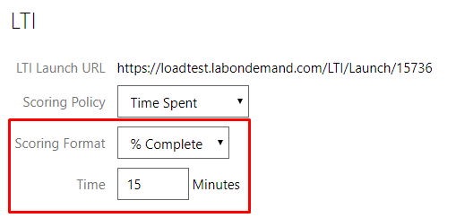

- **Pass/Fail**, with the **Minimum Time** a student needs to spend in the lab to pass the lab.

  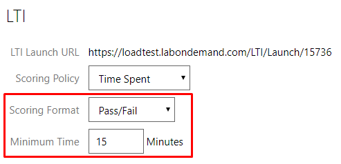

If you have IDL Content in the lab and select **Tasks Complete**, the scoring will be based on the number of tasks the student marks as complete by clicking **Done** on the task. The **Scoring Format** can be:

- **% Complete**, where the score is the exact percentage of the tasks the student marks complete.

  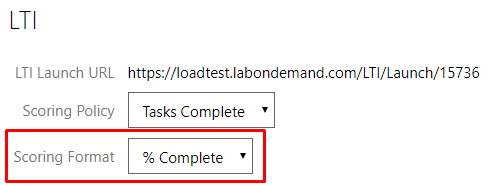

- **Pass/Fail** with **Minimum Tasks Complete**, which represents the percentage of tasks the student needs to mark complete (click **Done**) to pass the lab.

  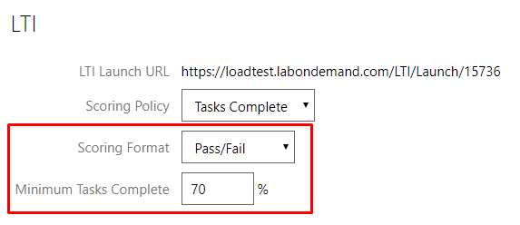

If you would like more information, please contact [sales@learnondemandsystems.com](mailto:sales@learnondemandsystems.com).
