**Learn on Demand Systems Performance Based Testing Guide**

**Revision History**

| Version | Date        | Edited By       | Comments                |
| ------- | ----------- | --------------- | ----------------------- |
| 1     | August 11, 2017 | Stephanie Clark | Release 1 |

**Disclaimer**

This document supports a release of a software product
that may be changed substantially in the future. It is
provided for informational purposes only and Learn on Demand Systems,
LLC, makes no warranties, either express or implied, in this document.
Information in this document, including URL and other Internet Web site
references, is subject to change without notice. The entire risk of the
use or the results from the use of this document remains with the user.
Unless otherwise noted, the companies, organizations, products, domain
names, e-mail addresses, logos, people, places, and events depicted in
examples herein are fictitious. No association with any real company,
organization, product, domain name, e-mail address, logo, person, place,
or event is intended or should be inferred. Complying with all
applicable copyright laws is the responsibility of the user. Without
limiting the rights under copyright, no part of this document may be
reproduced, stored in or introduced into a retrieval system, or
transmitted in any form or by any means (electronic, mechanical,
photocopying, recording, or otherwise), or for any purpose, without the
express written permission of Microsoft Corporation.

Learn on Demand Systems, LLC may have patents, patent applications,
trademarks, copyrights, or other intellectual property rights covering
subject matter in this document. Except as expressly provided in any
written license agreement from Learn on Demand Systems, the furnishing
of this document does not give you any license to these patents,
trademarks, copyrights, or other intellectual property.

Copyright 2017 © Learn on Demand Systems, LLC. All rights reserved.

All other trademarks are property of their respective owners.

**Introduction**

This guide provides information on building Performance-Based Testing
(PBT) exam labs in Lab on Demand.

**Intended Audience**

This guide assumes that the reader:

-   Has a developer account with sufficient permissions to create a lab
    guide and modify select properties of a Lab Profile.

-   Has existing labs hosted by LODS.

-   Has a help desk support contract to pay for additional custom
    contract work.

The guide further assumes that the reader has knowledge of how to build
labs in LOD and knowledge of performance-based testing design.

**Getting Started**

Lab on Demand supports performance-based exams in addition to Integrated
Digital Lab (IDL) content. Our Performance Based Testing platform
enables you to create multiple types of assessments including automated
VM Scoring of Windows and Linux, scoring of Azure subscription
configuration, multiple choice exploration assessments, and even exam
sessions which include screenshots of user work. You can deliver exams
as a standalone offering or integrated as part of a lab or larger exam
delivery engine.

**Designating a Lab as an Exam**

For a lab to be an exam, it needs to be designated as an exam on the
Exam tab in the Lab Profile.

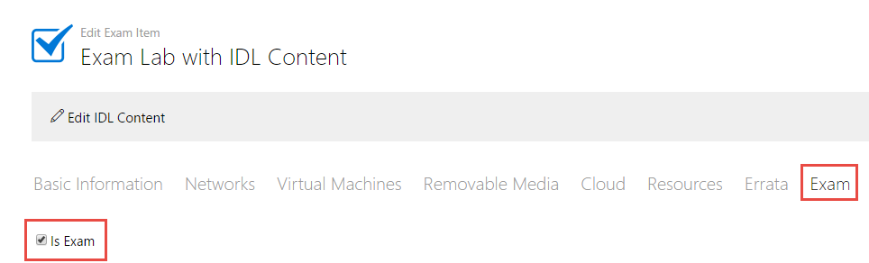

This can either be done in an already created lab or from the Admin
page, click Create Exam on the Exams tile.

Once you have marked the lab as an exam, you will be presented with new
options regarding the type of scoring the lab will use. There are
currently three types of scoring exams available in LOD:

-   Assessment – Used for multiple choice exams and is fully automated.

-   Manual – Used for exams where a scorer needs to evaluate what the
    user has done in the VM environment. There are two types of
    submissions for these exams:

-   Screenshots – users are asked to take screenshots of the VM desktop
    > at predetermined points. These screenshots are submitted for
    > manual scoring by a grader;

-   Saved Environment – users are asked to perform any number of actions
    > and then asked to submit their exam for grading. This saves the
    > exam for up to 30 days. During this time, a grader can find user’s
    > submitted exam item and grade it.

-   Automated – Used for exams where a user is asked to do or fix
    something and submit the exam for grading. The system will then
    automatically verify that the work was done correctly through a
    script written by the exam author.

Each of these will covered in their own sections.

**Setting Save/Cancel Options**

Lab profiles by default allow a user to save, cancel, or extend the lab.
These choices may not be appropriate for your exam lab profile. You can
change these choices on the **Advanced** tab of the Lab Profile under
**Save/Cancel Options** towards the bottom of the page:

1.  Uncheck **Allow User to Cancel** **Labs** if you do not want the
    user to be able to cancel a running exam.

2.  Uncheck **Allow User to Save Labs** if you do not want the user to
    be able to save a running exam that they can resume later.

3.  Uncheck **Allow User to Extend Time Remaining** if you want do not
    want the user to be able to extend the time of the running lab.

**Creating Exam Content**

**Creating an Assessment Exam**

An assessment exam has pages that can contain the following types of
questions: single or multiple-answer multiple choice or open-ended
questions looking for either exact matches or various possible (regular
expression) answers. One page of questions will be presented at a time
to the end user.

**Adding Pages and Questions**

To create an Assessment exam, follow these steps:

1.  On the **Exam** tab, set **Scoring Type** to **Assessment** and
    under **Questions** click **Add Page**.

> 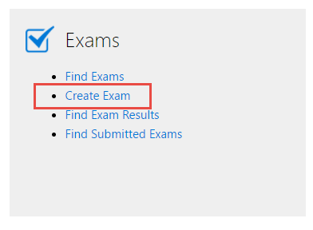 

1.  In the **Page 1** field, type the name you would like to give the
    page. This is optional and will be used as the Tab title in the lab
    interface.

2.  Click **Add Question**.

> 

1.  In the Text field, enter the first question.

2.  From the **Format** dropdown, select the format for the answer:

    a.  **Multiple Choice, Only One Answer**

    b.  **Multiple Choice, Multiple Answers**

    c.  **Text Response, Exact Match**

    d.  **Text Response, Regex Match**

> 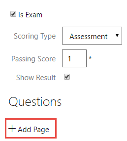 

1.  Click **Add Answer**.

**Adding Multiple Choice Answers**

1.  []{#_Hlk487019805 .anchor}In the field that appears, type the first
    multiple choice possible answer and click **Add Answer**.

2.  Repeat for additional answer options. The answers can be rearranged
    or deleted using the buttons to the right of each answer.

> 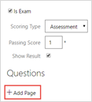

1.  Select which answer(s) is/are correct.

> 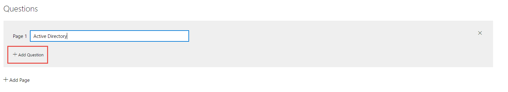

[]{#_Hlk487020097 .anchor}**Adding Text Match Answers**

1.  In the field that appears, type the:

    a.  Exact answer wanted

> 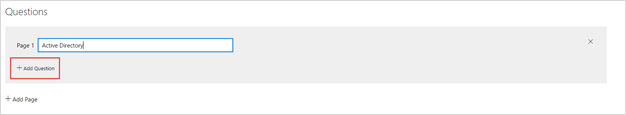 
>
> - OR -

a.  Regular expression the answer must match

    i.  Start the regular expression with the \^ character

    ii. Put the possible answers in parenthesis with the | character
        separating them
    
    iii. End the expression with the \$ character

>  
>
> Note: The answers are not case sensitive.

**Setting Scoring Value, Explanation, and Reference**

1.  Set the **Score Value** for the question. This is how many points
    the question is worth.

2.  Provide an optional **Explanation** for the answer and an optional
    **Reference URL**. These will be displayed in the exam results
    report.

3.  Click **OK**.

> 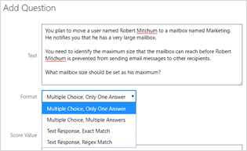 

**Completing the Exam Structure**

1.  Repeat this process for the number of pages and questions you need.

2.  When you finish adding the pages, at the top of the **Exam** tab,
    enter the score the user needs to pass the exam in the **Passing
    Score** field. It will show the total number of points available
    automatically.

3.  Uncheck **Show Results** if you do not want the results to be shown
    to the student when the exam is graded.

> 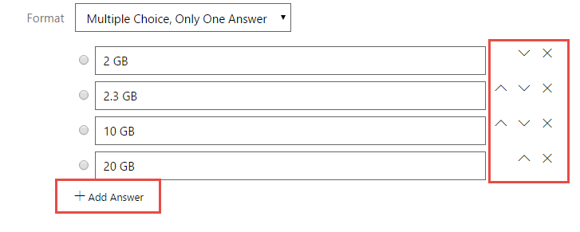 

1.  Save the lab profile to save the exam structure.

**Creating a Manual Exam**

A manual exam contains scoring items with instructions for a user to
manipulate the environment. The user then either takes screenshots after
each set of instructions or submits the saved lab for grading, depending
on the Submission Type set.

**Submission Type: Screenshots**

To create a Manual – Screenshots exam, follow these steps:

1.  On the **Exam** tab, set **Scoring Type** to **Manual** and
    **Submission Type** to **Screenshots**.

2.  Under **Scoring Items**, click **Add Scoring Item**.

> 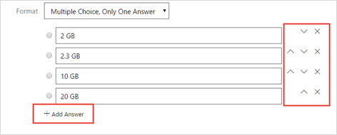 

1.  In the **Add Scoring Item** dialog, enter an optional name for the
    item.

2.  Under **Instructions For User**, enter the details of how the user
    is to manipulate the exam environment to be captured by the first
    screenshot. Ensure to include the name of the machine the student
    should use.

3.  Under **Scoring Instructions (Optional)**, provide any guidelines
    such as a rubric for the person who will be grading the screenshot.

4.  Set the total **Score Value** for this scoring item.

5.  To provide the grader with a reference screenshot image for what to
    look for when grading, click **Choose File** under **Reference Image
    (Optional)** and select a picture file. This will be displayed in
    the exam results report.

6.  Click **OK**.

> 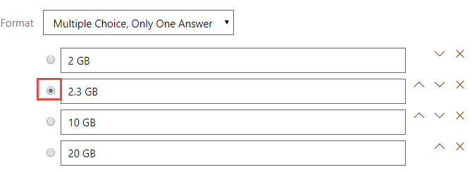 

1.  Repeat this process for the number scoring items you need.

2.  When you are done adding the scoring items, at the top of the
    **Exam** tab, enter the score the user needs to pass the exam in the
    **Passing Score** field. It will show the total number of points
    available automatically.

> 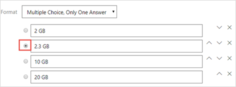 

1.  Save the lab profile to save the exam structure.

**Submission Type: Saved Environment**

To create a Manual – Saved Environment exam, follow these steps:

1.  On the **Exam** tab, set **Scoring Type** to **Manual** and
    **Submission Type** to **Saved Environment**.

2.  Under **Scoring Items**, click **Add Scoring Item**.

> 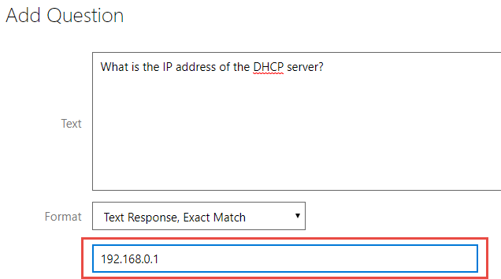 

1.  In the **Add Scoring Item** dialog, enter an optional name for the
    item.

2.  Under **Instructions For User (Optional)**, enter the details of how
    the user is to manipulate the environment for this scoring item.
    Ensure to include the name of the machine the student should use.

3.  Under **Scoring Instructions**, provide guidelines such as a rubric
    for the person who will be grading the saved environment.

4.  Set the total **Score Value** for this scoring item.

5.  To provide the grader with a reference screenshot image for what to
    look for when grading, click **Choose File** under **Reference Image
    (Optional)** and select a picture file. This will be displayed in
    the exam results report.

6.  Click **OK**.

> 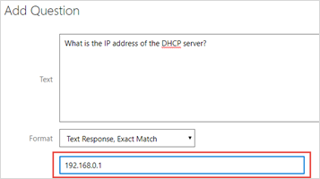 

1.  Repeat this process for the number scoring items you need.

2.  When you are done adding the scoring items, at the top of the
    **Exam** tab, enter the score the user needs to pass the exam in the
    **Passing Score** field. It will show the total number of points
    available automatically.

3.  Check **Allow User Notes**, if appropriate. This allows the user to
    include a note when submitting the exam for grading.

> 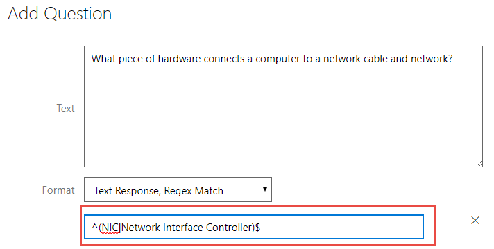 

1.  Save the lab profile to save the exam structure.

**Creating an Automated Exam**

An automated exam is similar to a manual exam. However, it does not need
someone to grade it; it uses scripts to check if the user manipulated
the environment as directed. It is graded automatically upon submission
for grading. One major difference however is that for the scoring
scripts to work, the VMs in the exam that the scripts will run against
*must* have the LOD integration service installed on them.

**Installation of LOD Integration Service on VMs**

This service should be installed before you build your exam questions.
To do this follow these steps after you have created the lab profile,
added the VMs and networks, and save it:

1.  Click **Launch** on the **Lab Profile** page.

> 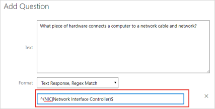 

1.  When the lab is running, sign into the first VM that will have a
    scoring script ran against it.

2.  Once at its desktop, click the **Developer** icon in the lab
    interface and click **Install Integration Service**.

> 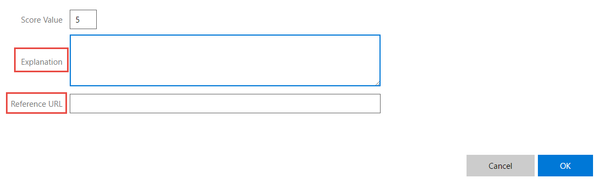

1.  The Install Integration Service dialog box will appear with an
    explanation of the service and its requirements. Click **Yes** to
    continue with the installation.

> 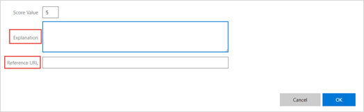 

The service will briefly show it is loading and then the dialog box will
close.

1.  Repeat steps 2 through 4 on each machine that will have a scoring
    script ran against it.

You will now need to save differencing disks of the VMs.

1.  Click the **Developer** icon in the lab interface and click
    **Differencing Disks**.

> 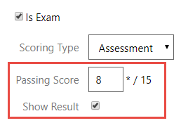

1.  The Save Differencing Disks dialog opens with an explanation. Select
    whether you want to create a new lab profile or update the current
    VMs and click **Next**.

> 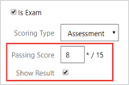

1.  Select the VMs to which to add a differencing disk, set a short name
    for the disk, and add a note of the changes made in the differencing
    disk and click **Next**.

>  

1.  Wait for the Saving Differencing Disks banner to close. In the
    **Save Successful** dialog, click **OK**.

> 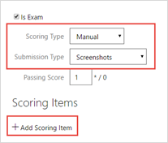

1.  Click the **Exit** icon and click **Cancel** **Lab**.

> 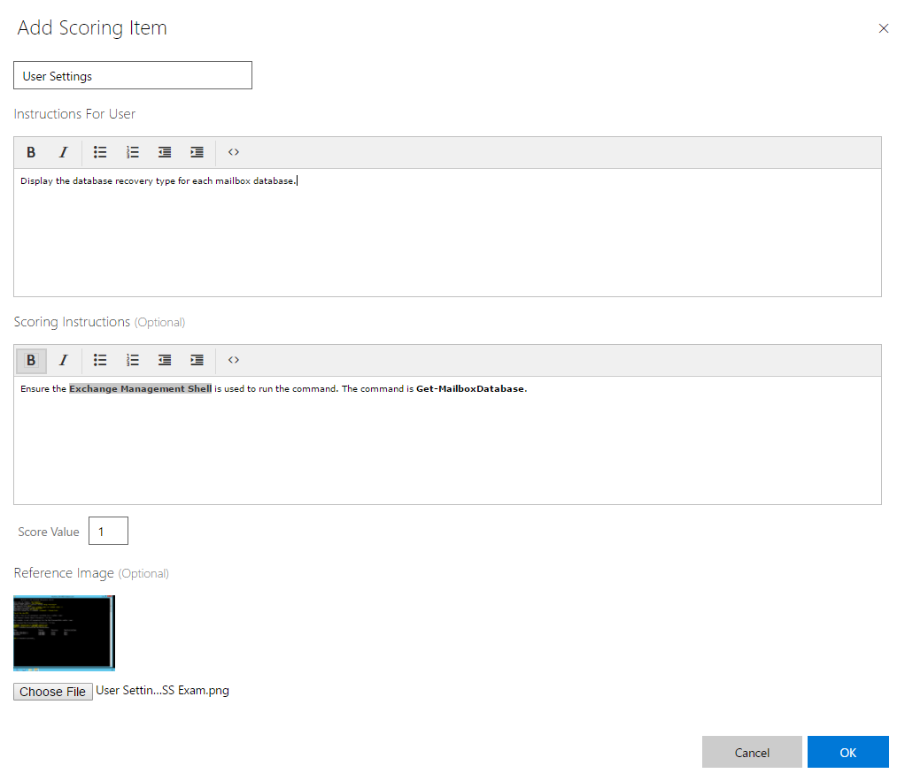 

1.  In the **Cancel Lab** dialog, click **Yes, cancel my lab** and close
    the lab window.

> 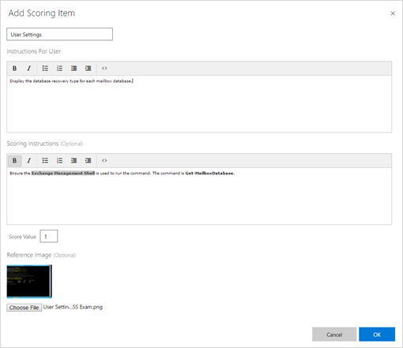 

**Creation of Automated Exam**

To create an Automated exam, follow these steps:

1.  On the **Exam** tab, under **Scoring Items** click **Add Scoring
    Item**.

> 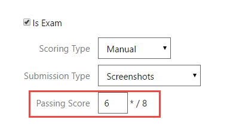 

1.  In the **Add Scoring Item** dialog, enter an optional name for the
    item.

2.  Under **Instructions For User (Optional)**, enter the details of how
    the user is to manipulate the environment for this scoring item.

3.  Set the total **Score Value** for this scoring item.

4.  Select the VM to run the script against from the **Machine**
    dropdown. Note: The script will fail and the grading will time out
    if the wrong machine is chosen.

5.  Select the type of script from the **Type** dropdown:
    **PowerShell**, **Shell**, **Visual Studio Unit Test**.

6.  In the **Scoring Script** field, enter the script to run against the
    VM to grade the scoring item.

7.  Click **OK**.

> 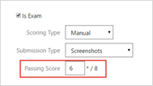 

1.  Repeat this process for the number scoring items you need.

2.  When you are done adding the scoring items, at the top of the
    **Exam** tab, enter the score the user needs to pass the exam in the
    **Passing Score** field. It will show the total number of points
    available automatically.

3.  Check **Allow User Notes**, if appropriate. This allows the user to
    include a note when submitting the exam for grading.

4.  Uncheck **Show Results** if you do not want the results to be shown
    to the student when the exam is graded.

> 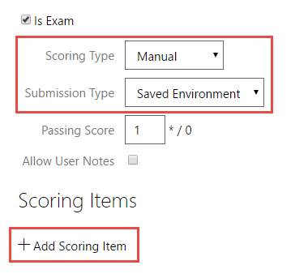 

1.  Save the lab profile to save the exam structure.

Best Practice: You should launch the lab to test/edit your scoring
scripts. To do this,

1.  Click **Launch** on the Exam profile page.

> 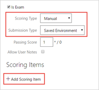

1.  Proceed through the lab and take the exam as if you were a student.

<!-- -->

1.  For each question,

    a.  Click **Test This** to test the scoring script

> 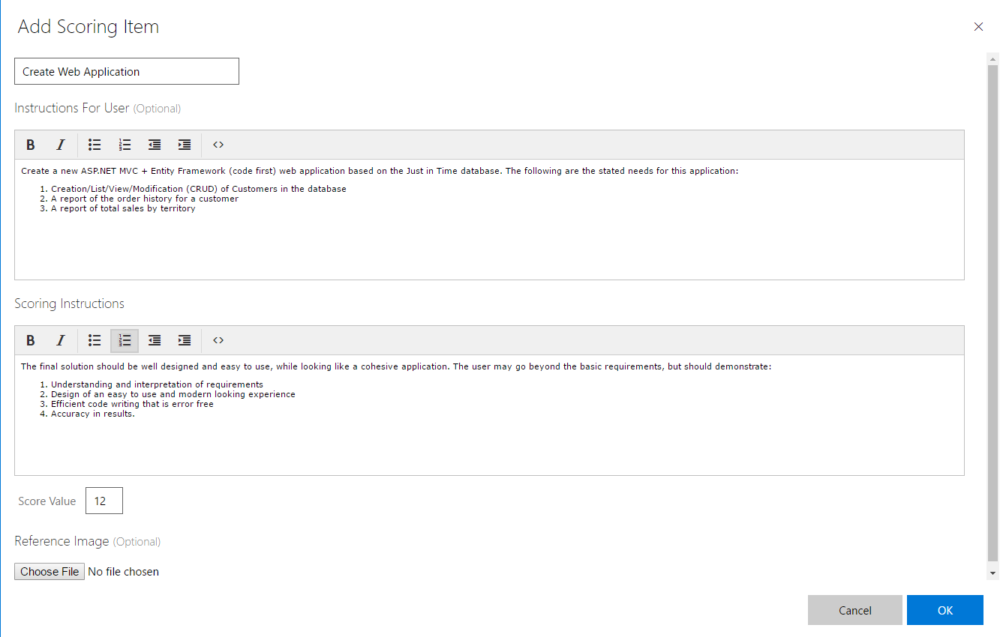 

a.  The Test Scoring Item dialog will appear and will show a progress
    bar during testing.

>  

a.  When the testing is complete, a dialog will show the scoring script
    output. After reviewing the script to ensure it worked as planned,
    click **Close**.

> 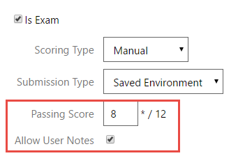 

a.  If necessary, click **Edit Scoring Script** to make changes to your
    script and then click **OK**.

> 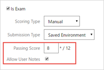 

1.  After you have tested the script for each question, on the **Exit**
    menu, click **Cancel Exam**.

>  

1.  In the **Cancel Exam** dialog, click **Yes, cancel my exam**.

> 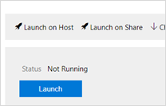 

**Taking an Exam (Student Perspective)**

All exams will launch as normal labs; the exam content will be at the
end of any existing content such as the Objective/Scenario information
and/or IDL content. The following section will show what a student will
experience with each type of exam. Any options made available in the
Exam profile will be noted.

**Taking an Assessment Exam**

The exam’s first page will appear on the Content tab. To take the exam,
the student will follow these steps:

1.  For multiple choice questions, select the answer(s) to each
    question.

    a.  When there are multiple correct answers, the student must select
        all correct answers and no incorrect answers to receive the
        points for the question. No partial points are awarded.

> 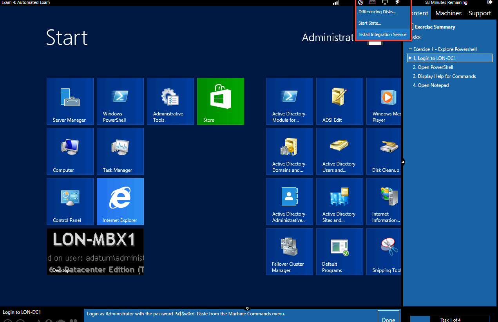
>
> NOTE: In the above image, the numbers designate the following
> components of the exam:

a.  Page title

b.  Questions and answer choices from that page

<!-- -->

1.  For text match questions, type the answer to the question in the
    answer box. The answers are not case-sensitive.

    a.  When the question is set to the format of Text Response, Regex
        Match, the student must enter only one of the possible answers
        to receive the points for the question. No partial points are
        awarded.

>  

1.  If the exam has more than one page, click the **&gt;** arrow at the
    bottom to advance to the next page or the **&lt;** arrow to go back
    to a previous page.

2.  When finished with the exam, click **Submit for Grading**.

> 

1.  In the **Submit For Grading** dialog, select **Yes** if ready to
    complete exam or **No, not yet** to go back and possibly change any
    answers.

> 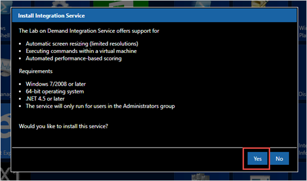
>
> Once **Yes** is clicked, the exam is submitted. If you had selected
> the **Show Results** option on the **Exam** tab of the lab profile, a
> scoring message will appear notifying the student whether they passed
> or not and their score.
>
> 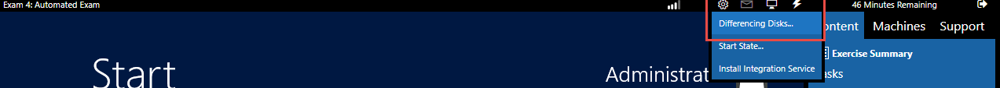 
>
> If you chose not to **Show Results**, they would receive the following
> message:
>
> 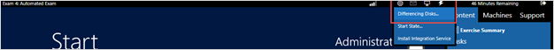

**Taking a Manual – Screen Shot Exam**

The exam’s instructions for the first screenshot will appear on the
Content tab. To take the exam, the student will follow these steps:

1.  Follow the instructions and when ready, click **Take Screenshot** to
    take a screenshot of the active VM.

> 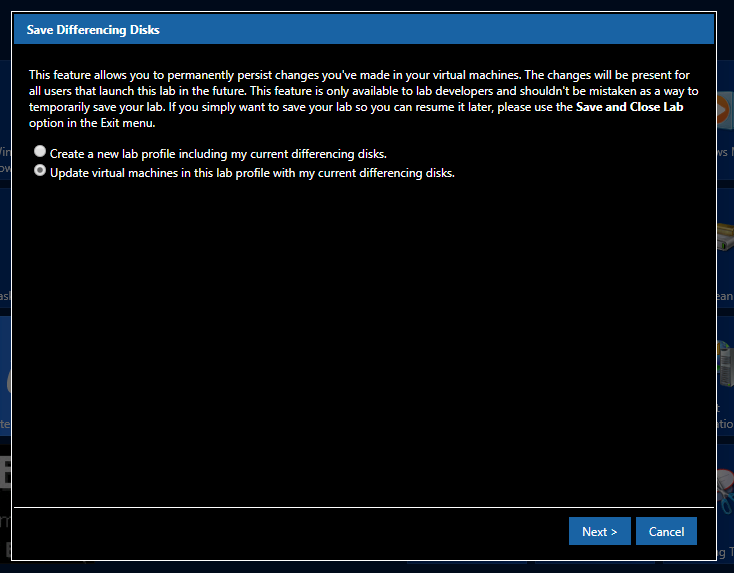

1.  A dialog will open showing the screenshot that was taken. Review the
    screenshot and either click **Cancel** to go back to the VM or add a
    note in the **Note (optional)** field to include a note with the
    screenshot, if wanted, and click **Use this screenshot** to keep the
    screenshot.

> 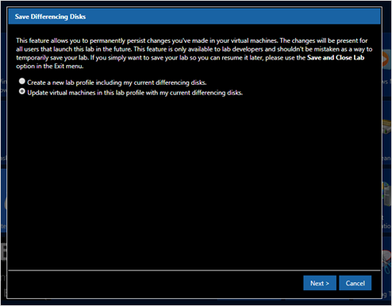

1.  The lab interface will return to the first instructions. Select
    **Discard / Retake** to receive another opportunity to make changes
    and take another screenshot or click the **Advance** arrow to get to
    the instructions for the next screenshot.

> 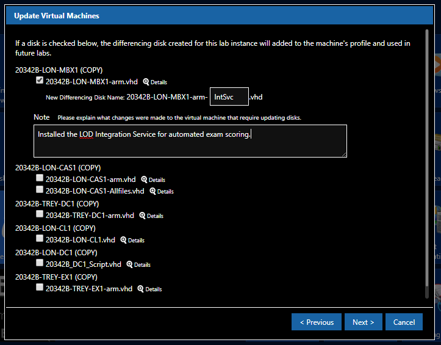

1.  When finished with the exam, click **Submit for Grading**.

> 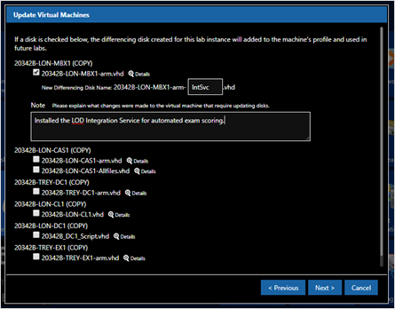

1.  In the **Submit For Grading** dialog, select **Yes** if ready to
    complete exam or **No, not yet** to go back and possibly change any
    screenshots.

> 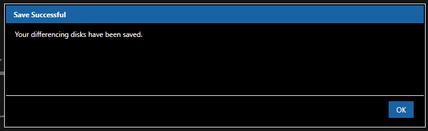 
>
> Once **Yes** is clicked, the exam is submitted for grading.
>
> 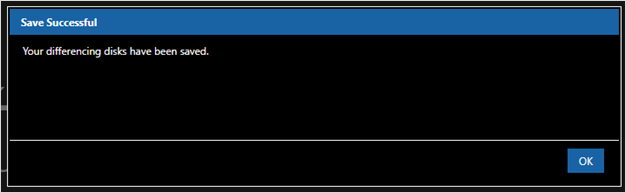

**Taking a Manual – Saved Environment Exam**

The exam’s instructions for the first scoring item will appear on the
Content tab. To take the exam, the student will follow these steps:

1.  Follow the instructions, add an optional note in the **Note
    (optional)** field, and click **&gt;** to advance to the next
    scoring item.

2.  When finished with the exam, click **Submit for Grading**.

> 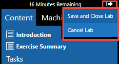 

1.  In the **Submit For Grading** dialog, select **Yes** if ready to
    complete exam or **No, not yet** to go back and change something.

>  
>
> Once **Yes** is clicked, the exam is saved and submitted for grading.
>
> 

**Taking an Automated Exam**

The exam’s instructions for the first scoring item will appear on the
Content tab. To take the exam, the student will follow these steps:

1.  Complete the tasks in the instructions and click **&gt;** to advance
    to the next scoring item.

2.  When finished with the exam, click **Submit for Grading**.

> 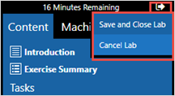 

1.  In the **Submit For Grading** dialog, select **Yes** if ready to
    complete exam or **No, not yet** to go back and change something.

> 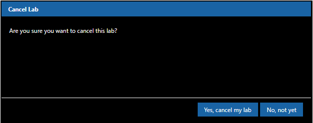 
>
> Once **Yes** is clicked, a dialog will appear while the exam is being
> graded by the scripts.
>
> 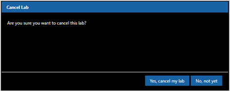 
>
> Once the grading is complete, if you had selected the **Show Results**
> option on the **Exam** tab of the lab profile, a scoring message will
> appear notifying the student whether they passed or not and their
> score.
>
>  
>
> If you chose not to **Show Results**, they would receive the following
> message:
>
> 

**Grading a Manual Exam**

When a Manual exam is submitted for grading, it can be found from two
locations:

-   Click **Find Submitted Exams** link on the **Exams** tile on the
    **Admin** page.

> 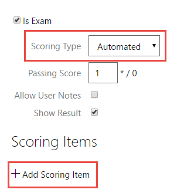 
>
> This shows all submitted exams for your organization.
>
> 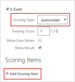
>
> -OR-
>
> Click **Find Submitted Exams** link on the **Exam Item Profile** page.
>
> 
>
> This will only show submitted exams for this exam.
>
> 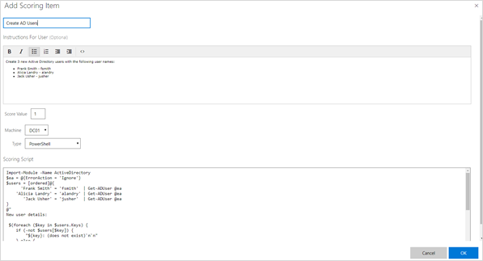
>
> Grading is done from the Exam Result page. To open this page, click
> **Details** for the exam instance you want to grade.
>
> 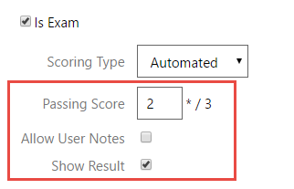

**Grading a Screenshot Exam**

1.  On the **Exam Result** page, in the **Scoring** section, review each
    scoring item’s description, **Reference Image**, **User Notes** (the
    notes submitted by the student), and **Scoring Instructions**.

> Description
>
> 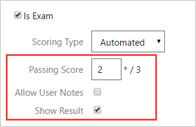 
>
> Reference Image
>
> 
>
> User Notes
>
> 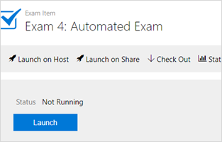
>
> Scoring Instructions
>
> 

1.  Compare the **Submitted Image** to the **Reference Image** and the
    **Scoring Instructions**.

> 

1.  Click **Correct** or **Incorrect** in the upper right corner of the
    scoring item.

> 

1.  Repeat this process for each scoring item.

> The Passing Score, Score, and whether the student Passed is displayed
> at the bottom of the Exam Result page.

1.  When finished scoring, click Save Score at the bottom of the page.

>  
>
> Once an exam is scored, the score can still be edited. To do this,
> click **Edit Score** on the **Exam Result** page.
>
> 

**Grading a Saved Environment Exam**

1.  On the **Exam Result** page, click the **Grade Environment** button.

>  
>
> The exam will resume. The Content tab will contain the scoring items.

1.  Review the information under **Application** including any **User
    Notes**.

>  

1.  Read the **Scoring Instructions** and then evaluate the saved
    environment.

2.  Add an optional **Scoring Note** to be included with the Exam
    Results. This note can be used to help explain the score given or
    for other uses.

> 

1.  At the top of the **Content** tab, click **Correct** or
    **Incorrect**.

>  

1.  Repeat this process for each scoring item.

> The Passing Score, Score, and whether the student Passed is displayed
> at the bottom of the Exam Result page.

1.  When finished scoring, click **Save Score** at the bottom of the
    page.

>  

1.  In the **Save Score** dialog box, select **Yes** if ready to save
    the score or **No, not yet** to go back and change something. NOTE:
    You cannot edit a score once it is saved. The environment will be
    torn down and no longer available for reference.

>  
>
> Once **Yes** is clicked, the exam score is submitted.
>
>  

**Reviewing Exam Results**

Once an exam is graded, you can review the exam results from two
locations:

-   Click **Find Exam Results** link on the **Exams** tile on the
    **Admin** page.

> 
>
> This shows all graded exams for your organization.
>
> 
>
> - OR-

-   Click **Find Exam Results** link on the **Exam Item Profile** page.

> 
>
> This will only show graded exam results for this exam.
>
> 
>
> You can look at individual exam results to see the student’s answer to
> each question. To do this click **Details** to open that Exam Results
> instance.
>
> 

The following are examples of scoring results you will see:

-   *Assessment exam*: Correct answers are underlined in green. Selected
    wrong answers are underlined in red.

> 

-   *Manual exams (Both Screenshot and Saved Environment)*: The
    Correct/Incorrect buttons will be highlighted to indicate the score
    on each question.

> 
>
> 
>
> Note: You can edit the score of a Screenshot exam from the Exam
> Results page. To do this, click Edit Score in the upper right corner.
> This is the only exam where the score can be edited after it has been
> submitted.

-   *Automated exams*: The Correct/Incorrect buttons will be highlighted
    to indicate the score on each question.
