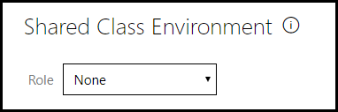
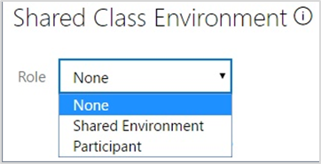
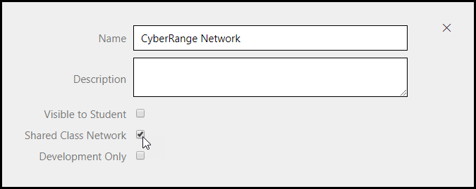
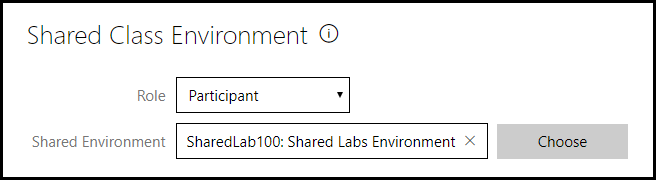
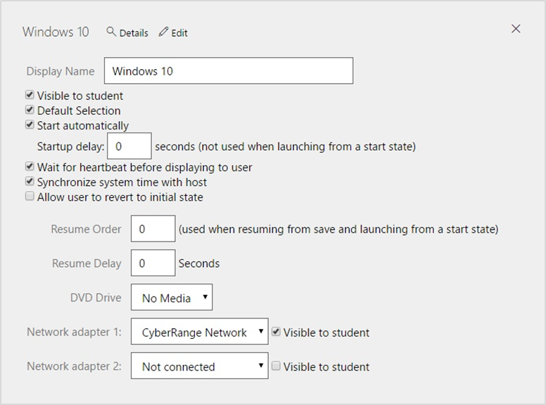
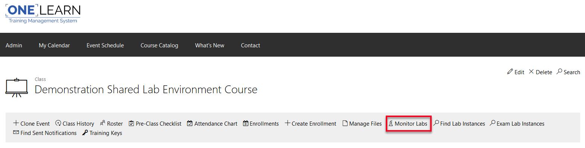
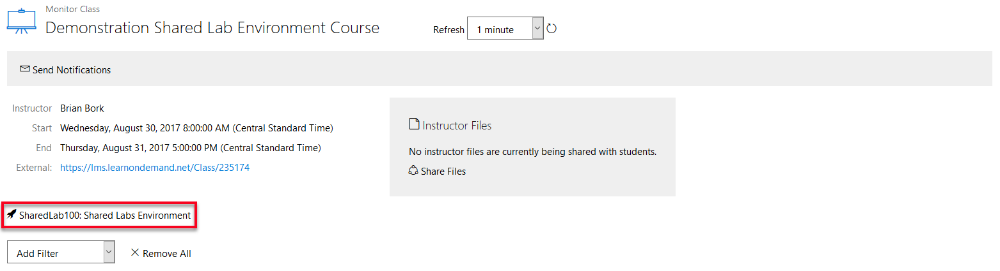

# Shared Labs

Shared Labs is a tool used in LODS to create environments which share
their networks with each other to allow machines to communicate between
a Shared Lab Environment and a Participant (or Participants). This can
be done with any current or new Lab Profile with the correct
permissions.

-   **Shared Class Environment** – the section on a lab profile where
    you can designate the role the lab will have in the group of shared
    labs.

-   **Shared Environment role** – the lab profile that will supply the
    shared class networks and the shared VMs

-   **Participant role** – the lab profile(s) that will participate in
    the shared lab group and use a Shared Environment lab profile for
    its networks and the shared VMs. These lab profiles will have their
    own VMs to interact with the shared labs group.

## Process to create environment, course, and class:
For a lab to be part of shared labs it either needs to be designated as
a Shared Environment or a Participant. Always start with the lab that
will be designated as the Shared Environment. To do this, on its lab
profile page:

1.  Click the Advanced tab and click the dropdown under the Shared Class
    Environment section and select Shared Environment.

> 
>
> 

1.  When a lab is configured with the Shared Environment role, networks
    within that lab can be flagged as a "Shared Class Network." Click
    the **Network** tab and check **Shared Class Network** under any
    networks that be will be shared between the Shared Environment and
    the Participant(s) labs. This is the key to Shared Labs.

> 

Once you have set up the Shared Environment, you need to designate which
lab profiles will be the participants that will access the Shared
Environment and its shared networks.

1.  On the Advanced tab of the lab profile page, click the dropdown in
    the Shared Class Environment section and select Participant.

2.  For **Shared Environment**, click **Choose**. Search and select the
    Shared Environment lab this participant lab will connect to

> 

1.  Click the **Virtual Machines** tab and configure the VMs to use any
    of the shared networks defined in the Shared Environment.

> 

Next, notify the LODS Course Requests Team
(<courserequests@learnondemandsystems.com>) to set up the course.
Specify the following information:

1.  Name of course

2.  Name of Lab Series in LOD

3.  Name of Participant labs to add as Lab Activities to the course.
    Note: Shared Environment labs do not need to be added to the course.

Once the course has been created, work with the LODS Course Requests
Team to create your class.

## Process during class:
When an Instructor wishes to launch the Shared Environment, they will
start from the **Class** page:

1.  Click **Monitor Labs**

> 

1.  Under the basic information on the Monitor Class page, click
    **Shared Environment**.

### Saving and Closing Labs

All Lab Environments (Shared and Participant) can been saved and closed
as normal. The Shared Lab Networks are still available, even though a
Share Environment or Participant has saved their Lab.

### Canceling Labs

-   If a Participant wishes to reset their Participant machine(s), they
    can Exit Lab -&gt; End Lab -&gt; Cancel at any time without
    affecting any other Participants or the Shared Lab Environment.

-   If the Instructor exits the Shared Environment lab the same way, it
    cancels all the labs in the shared environment, including the
    Participant instances.
