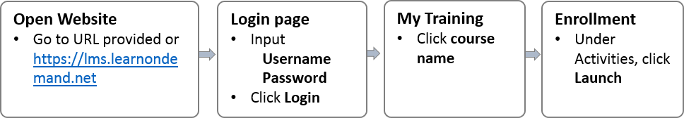

## How Do I Access My Labs For A Class?

Some of our organizations give out lab codes or training keys to unlock access to labs for their users. If have been given a code to access your labs, you should also have received a URL for the site where you will log in.  If you do not have a code or have not been given credentials to log in please contact your learning organization.

To access your labs for a class:

1. go to the **URL provided by your organization** or https://lms.learnondemand.net.

1. Enter your **Username** and **Password** and click the Login button. This will open up your My Training page. 

1. Click on the name of the course you are taking. Under the Activities section, click the Launch button beside the lab you want to launch. 

If you were given a lab access code please see our article [How do I Access My Labs Using A Lab Code?](how-do-i-access-my-labs-using-a-lab-code.md)

