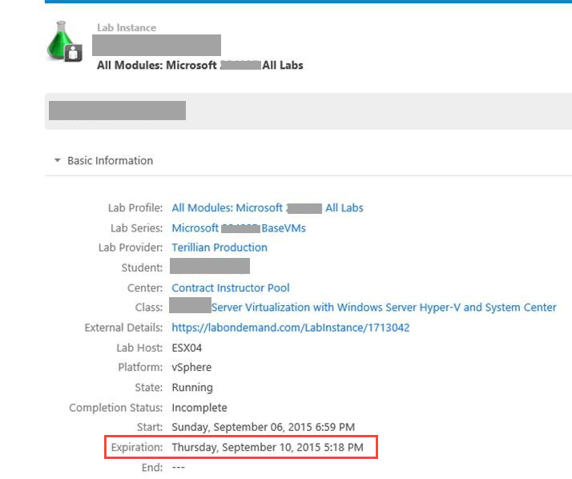

## Why Does My Lab Expire Within A Week When I Am Supposed To Have Access To It For A Longer Time?

Sometimes people are confused when they see that their lab will expire within a few days when they thought they had access to the lab for a much longer period time. The confusion is between your lab access for a class and your saved lab’s expiration.

**Lab access**: This is how long you have access to launch a new instance of your lab from the beginning after your class is over. This can vary between no accessibility to 180 days after the class is finished. If you are an instructor or operations manager, you have access to the course labs at any time.

**Lab expiration**: This is when a lab you have saved will expire. If you have launched a lab and then saved it, you will be given a set amount of time before it is cancelled from the system and you lose all the work you have done in the lab. 

You can prevent your lab from being cancelled by reopening it prior to the expiration date and saving it again to extend the time on it. Regardless of the expiration date set on a saved lab, you are still able to launch that lab fresh from the beginning as long as you are still working within the time frame of your post class lab access.