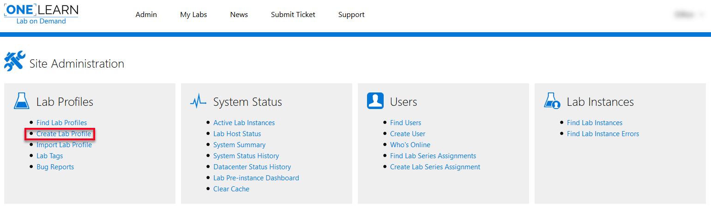

# Create Lab Profile

Labs in Lab on Demand (LOD) are housed in a lab profile. The lab profile is where the settings are configured for the lab. These settings include (but are not limited to): Name, owning organization, expected duration, resource requirements, virtual machines, network configuration, and much more. Lab profiles can exist on their own or they can be part of a Lab Series that contains multiple lab profiles. 

## Table of Contents
1. [Basic Information](#basic-information)
2. [Networks](#networks)
3. [Virtual Machines](#virtual-machines)
4. [Removable Media](#removable-media)
5. [Cloud](#cloud)
6. [Resources](#resources)
7. [Errata](#errata)
8. [Exam](#exam)
9. [Pre-instancing](#pre-instancing)
10. [Storage](#storage)
11. [Launch URLs](#launch-urls)
12. [Tags](#tags)
13. [Advanced](#advanced)

## Creating a Lab Profile

Click **Create Lab Profile** on the Lab Profiles tile on the Site Administration page.

### The following sections walk through each of the tabs located at the top of the Create Lab Profile page.

---

## Basic Information 

1. **Number:** Numbers are used in the title of the lab profile. 
2. **Name:** This will be the display name of the lab profile.
3. **Series:** Select the lab series that the lab profile will be associated with.
4. **Organization:** Select the organization that will own the lab profile and be responsible for maintaining the profile. 
5. **Virtualization:** Select the virtualization platform that the lab profile will use. (Hyper-V, vSphere or none.) Selecting _None_ will cause the lab profile to use the Cloud Client. 
6. **Parent:** A lab can optionally inherit some properties from a parent lab profile. Both the virtual environment (virtual machines, virtual networks, etc) can be inherited, as well as resources and content (manuals, scenario, objective, excercises, tasks, etc). Changes to the parent lab profile will be reflected in instances of this lab.
7. **Storage Reservation Per Instance:** This is the amount of storage that the lab scheduler will ensure is available before an instance of this lab is launched.
8. **Development Status:** Used to show lab profile development status. (In Development, Awaiting Verification, In Verification, Verification Failed, Complete.) Lab profiles in _Complete_ Development Status will be available for use, other development status' will only be available to registered lab developers. 
9. **Expected Duration:** The expected amount of time it will take a user to complete the lab.
10. **Maximum Duration:** The maximum amount of time that a user can spend in the lab.
11. **Language:** The language that the lab UI will be displayed in. This will not change the language displayed in the OS of any virtual machines used unless the virtual machine was configured to display a specific language.
12. **Level:** Sets the Level for the lab; this can be 100, 200, 300, or 400. 
13. **Evaluation:** Click to add an Evaluation to the lab profile. The Evaluation must already be created to add it to the lab profile using this button.

14. **Advertising Campaign:** Used to show introductory content while the lab is loading. This can be a video, powerpoint presentation or anthing accessible by a URL. 

15. **Description:** Used to provide more information about the lab profile. 

16. **Has IDL Content:** Check this box if the lab profile has IDL (Integrated Digital Lab) content.
    - After this box is checked, another option will display, allowing you to select the version of IDL content. 

17. **Introduction Content URL:** The content at this URL will be displayed in a dialog when the lab interface first opens. The content can either be an HTML page or an MP4 video file. The URL must use HTTPS.

18. **Objective:** Used to provide specific information about the lab. It should include a summary of the lab instructions and a list of specific goals that the lab is intended to meet.

19. **Scenario:** Used to establish the context in which the lab tasks are performed or to provide more general background information.

20. **Enabled:** Used to enable or disable the lab profile for use. If the lab is disabled, it will only be accessible to lab developers. 

21. **Enable Bug Reporting:** Allows bug reporting on the lab profile. Bug reports are collected on the lab profile details page by selecting **Edit** in the upper-right corner of the lab profile page. 

22. **Owner Name:** The name of the owner of the lab profile. 

23. **Owner E-mail:** The e-mail address of the owner of the lab profile. 

## Networks

To use network features, such as external internet access or communication between virtual machines, lab profiles must have a network created or inherit networks from a Parent lab profile. 

1. **Name:** Display name of the network.

2. **Description:** Used to provide more information about the network

3. **Type of network:** The type of network to be used by the lab profile. There are four options:

   - Private: private network (no internet access), typically used for communication between virtual machines. 

   - Web Access (NAT): internet accessible with NAT (network address translation)

   - Web Access (Public IP): internet accessible network with a public IP address

   - Preconfigured on lab host: internet accessible network with access provided by the lab host that the lab instance is launched on

4. **Visible to Student:** Designates if the network is visible to users with student access, within the lab environment.

5. **Development Only:** Used to make the network available to lab profile that are currently in development. 

## Virtual Machines

1. **Add Virtual machine:** Click the add a virtual machine to the lab profile. The virtual machine must already be created to add it to the lab profile using this button. 

2. **Create Virtual Machine Profile:** Click to create a virtual machine. This will create a virtual machine, in which the lab author can specify hardware preferences.

3. **Has Virtual machine Pool:** A pool of unique virtual machine profiles can be created, to be issued to individual users. A single pool member will never be used by two different users simultaneously. This is useful for to ensure that a machine or set of machines is unique in the world at any given point in time. **If your virtual machine will be identical for all users, you do not need a pool.** It is important to note that you can only have as many concurrent users as you have pool members. This can greatly reduce the scalability of the lab, so ensure you create a sufficient pool depth to accommodate the peak number of anticipated concurrent users.

## Removable Media

1. **Add Removable Media:** Click to add removable Media to the lab profile. The removable media must already be created to add it to the lab profile using this button.

2. **Create Removable Media:** Click to create removable media. This will create removable media that can be used in the lab. Removable media types include Floppy and Optical.

## Cloud

1. **Add Cloud Credential Pool:** Click to add a Cloud Credential Pool to the lab profile. The pool must already be created to add it to the lab profile using this button.
2. **Cloud Platform:** Select the cloud platform to be used by the lab profile. Select _None_ if you wish to use IDL v1. Selecting a Cloud Platform will allow the lab profile to use the IDL v2 Cloud Client.
3. **Cloud Portal URL:** Enter the URL that the portal window will display. This is used in IDL v2 Cloud Client. Leave this field blank if no Cloud Platform is selected in the previous step. 
4. **Append Lab Date:** When this is enabled, the following lab data will be appended to the URL as URL parameters in _name=value_ format. 
   - labProfileId
   - labInstanceId
   - globalLabInstanceId
   - userId
   - userExternalId (if the lab is launched via API)
   - email
   - firstName
   - lastName
   - tag (if included when launched via API)

## Resources

1 .**Add Resource:** Click to add resource. 

2.**Name:** This will be the display name of the resource.

3.**Type:** Select the type of resource to add. Types of resources include:
   - External link
   - PDF document
   - Word document
   - XPS document
   - HTML document
   - Image
   - Video
   - Other

4. **URL:** Enter the URL of the external link or browse to the file that you wish to upload as a resource for use in the lab.

5. **Display:** Select where the resource will be available for users to access.

6. **Description:** Used to provide more detail about the resource.

7. **Lab Manual:** Check this box to include a link to the lab manual on the Lab Profile page. 

## Errata

The Errata is used to give a message to users working in the lab. The Errata appears in the lab environment, after the lab is launched. The Errata is displayed in a window, over the lab UI and virtual machines. This can be used to notify users of known issues in the lab, helpful tips or it can be used to provide any other information that the lab author wishes to provide. The Errata can be referenced by users at any time during the lab by clicking the Errata link. 

## Exam

1. **Has Exam:** Checking this box enables options 2-5. If the box is unchecked, these options are not applicable. 

2. **Scoring Type:** Select the type of scoring that the lab profile will use. Types of scoring include:
   - Assessment
   - Automated
   - Manual

3. **Passing Score:** Enter the minimum score that users need to achieve to pass the exam.

4. **Show Result:** Check this box if you wish to show exam results.

5. **Report Detail Level:** Select how the exam report details will be generated. Report details include:

   - None

   - Summary

   - Detailed
6. **Add Page:** Click to add a page to the exam. Pages contain questions for the user to select answers.

7. **Name:** Provide a name for the page (optional).

8. **Text:** Enter the text of the question.

9. **Format:** Select the format of the question. Format types include:

   - Multiple choice, only one answer
   - Multiple choice, multiple answers
   - Text response, exact match
   - Text response, regex match

10. **Add Answer:** Enter the answer(s) to the question. Multiple answers should be entered. Select the checkbox next to the correct answer or select multiple boxes if there are multiple correct answers to the question. 

11. **Score Value:** Enter the value that the user should receive for selecting the correct answer. 

12. **Explanation:** Provide an explanation of the answer to the question. 

13. **Reference URL:** Provide a URL that users can reference to better understand the explanation of the answer to the question. 

## Pre-instancing

Pre-instancing enables the lab environment to be prebuilt, prior to users launching the lab. This allows lab authors to schedule the lab environment to be built and ready when the user launches the lab. This greatly reduces the amount of time it takes for the user to get into the lab environment and begin learning.

1. **Enable Pre-instancing:** Check this box to enable pre-instancing on the lab profile. 
2. **Add Schedule:** Click the add the schedule for pre-instancing. 

## Storage

This section specifies where the files for the lab profile should be stored. 

1. **Inherit storage settings from organization:** Checking this box enables the lab profile to inherit storage settings from the organization specified on the [Basic Information](#Basic-information) section.

Unchecking **Inherit storage settings from organization** box will enable additional options.

2. **Storage Loading Priority:** This will set the priority level of loading files into storage. There are multiple levels of priority; *Low, Normal and High*. If there is no priority preference, select _Disabled_. 
3. **Datacenter Availability:** Select the datacenter(s) that the lab profile will be available to launch from. Labs can be launched from the following datacenters:
   - AU East - located in Eastern Australia
   - External - files are stored in an external system and are used by labs that require the IDL v2 Cloud Client.
   - US Central - located in Central United States
   - US East - located in Eastern United States

## Launch URLs

**LTI** (Learning Tools Interoperability) is a standard defined by the IMS Global Learning Consortium that allows learning systems to consume content provided by external tools or services. This standard enables rich integration between different learning services and platforms, combining their strengths to offer more value to students of those learning systems. For more information on Lab on Demand LTI integration, see our guide here: [LTI Guide](https://github.com/LearnOnDemandSystems/guides/blob/master/lti/lod-lti.md).

1. **Scoring Policy:** Select the type of Scoring Policy. Types of Scoring Policy include: _Time Spent_ and _Tasks Complete_.
2. **Scoring Format:** Select the Scoring Format. Types of Scoring Format include: _% Complete_ and _Pass/Fail_.
3. **Time:** Define the amount of time that the Scoring Policy should use.
4. **Allow Anonymous Launches:** Check this box to allow this lab profile to be launched by anonymous users. 
5. **Add Authenticated Launch URL:** Click this to add an Authenticated Launch URL to the lab profile. The URL must already be created to add it to the lab profile. 

## Tags

1. **Add Tag:** Click to add a tag to the lab profile. The Tag must already be created to add it to the lab profile. 

## Advanced

1. **Custom CSS:** CSS markup that will be included in the lab client, making it possible to control the styles of custom content that is added to the lab. This should just be the style definitions, including a style tag is not necessary. 

2. **Custom CSS URL:** A URL to an externally hosted CSS stylesheet. The stylesheet will be referenced in the lab client. **HTTPS is required**.

3. **End Redirect URL:** If this value is set, users will be redirected to the specified URL when the lab ends. This feature isn't used often, but can help a lab fit into an external workflow. 

   For more information on Custom CSS in Lab on Demand, see our guide here: [Custom CSS Guide](create-lab-profile-custom-css).

4. **Max Active Instance:** This sets the amount of concurrent labs that can be launched at a time. Setting to _Unlimited_ allows an unlimited amount of launches of this lab profile at a time. Entering a number limits the amount of concurrent labs to the number specified. Any labs that are attempted to be launched after the limit has been met, will be given an error message and will not be able to launch the lab until the number of labs launched is below the maximum amount.

5. **Show Timer:** Checking this box will enable the lab to display a countdown timer, showing the user how much time they have left to complete the lab. 

6. **Enable Navigation Warning:** A warning will be displayed if the user navigates away from the lab client before the lab is complete.

7. **Show Navigation Bar:** 

8. **Navigation Bar Width:** This sets the width of the navigation bar in the lab UI. Options include:

   - Default (250 pixels)

   - Large (400 pixels)

   - XL (600 pixels)

   - Custom

9. **Show Content Tab:** Checking this box enables the Content tab to be displayed in the lab environment.

10. **Show Machines Tab:** Checking this box enables the Machines tab to be displayed in the lab environment.

11. **Show Support Tab:** Checking this box enables the Support tab to be displayed in the lab environment.

12. **Custom Content Tab label:** Custom label to be used in lab UI, in place of the Content tab.

13. **Custom Machines Tab label:** Custom label to be used in lab UI, in place of the Machines tab.

14. **Custom Support Tab label:** Custom label to be used in lab UI, in place of the Support tab.

15. **Custom Errata Label:** Custom label to be displayed on the [Errata](#Errata).

16. **Enable Type Text:** Enables the lab to use Type Text. Type Text is used to input information into the lab environment with one click.  

17. **Show Virtual machine Power Options:** Checking this box enables virtual machine power options to be available to users.

18. **Require Hyper-V Enhanced Controller:** Checking this box requires the user to use the Hyper-V Enhanced controller to work in the lab. If this box is checked, users will not be able to use any other machine remote controllers. Note that the Hyper-V enhanced controller only allows one user to access the lab at a time. 

19. **Enable Instance Link Sharing:** When enabled, the lab instance URLs can be shared between users. If a user copies the URL from their browser's URL bar, they can send it to another user, or open it in a different browser. Note that most virtual machines only allow one user to access them at a time. This setting does not bypass the connection limitations of virtual machines.

20. **Shared Class Environment:** Shared class environments allow multiple lab instances to be bound together with one or more shared networks and resources. A shared class environment consists of at least two different lab profiles, each serving a particular role. 

    - **Shared Environment:** One lab is configured to serve as the shared environment. Exactly one instance of this lab will run per class. 
    - **Participant:** This is the lab that end-users will launch. There can potentially be more than one lab in this role per class, but they will all connect to the same shared environment instance. 

    Networks within the shared environment lab can be made available to participant labs, making it possible for participants to connect to each other and/or to virtual machines within the shared environment. To enable Shared Class Environment for this lab profile, select one of the options from the drop-down menu; _Shared Environment_ or _Participant_. For more info click here: [Shared Labs Guide](https://github.com/LearnOnDemandSystems/guides/blob/master/sl/sharedlabs.md)

21. **Save/Cancel Options:** 
    - **Allow User to Cancel Labs:** allows the user to cancel the lab at any point
    - **Allow user to Save labs:** allows the user to save the lab in it's current state and return at a later time. Note that saved labs are only saved for 48 hours. Users can extend the saved lab expiration by resuming the lab and saving again. Each save sets the timer back to 48 hours. After 48 hours has passed, the lab progress and components are discarded and cannot be recovered. 
    - **Allow User to Extend Time Remaining:** Allows the user to extend the time remaining in the lab environment. 
    - **Auto-Save incomplete Labs:** Enables the lab to automatically save incomplete labs after a specified amount of time has passed. 

22. **Save/Cancel Labs When Last Console Sync Exceeds:** Amount of time given between console syncs, before the lab will automatically cancel or save. 

23. **Save/Cancel labs when last Activity Exceeds:** Amount of time given of inactivity before the lab will automatically cancel or save.

24. **Activity Required to Enable Auto-Save:** Amount of active time in the lab given before the lab will automatically save.

25. **Minimum Time Given to Saved Labs:** Minimum amount of time that students will have on the lab timer, when they resume a lab. 

26. **Maximum Allowed Snapshots:** Maximum amount of snapshots that are allowed

27. **Life Cycle Actions:** Actions can be defined to occur at certain points in the lab life cycle. For instance, an external service could be called when the lab builds, or send a notification to the user when the lab is resumed. 

28. **Lab Host tags:** Lab host tags are used to specify which Lab Host(s) the lab profile will use when users launch the lab. The Lab Host tag must already be created to add it to the lab profile using this button.

[Back to top](#Create-lab-profile)
