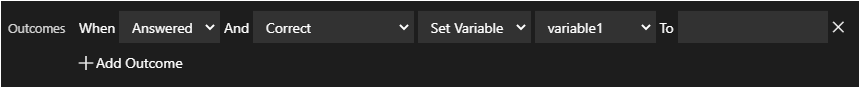

# Activity Based Assessment Outcomes

Activity Based Assessments (ABA) Outcomes offer adaptive learning experienced based on the result of an automated activity or a question activity. This allows lab authors to provide additional guidance based on how a student interacts with an activity in the lab instructions.  For example, an ABA could be configured to direct the lab user to more learning resources if they do not answer an ABA correctly, or they could be directed to a page further in the lab instructions if they do not need the additional learning material. 

## An ABA Outcome consists of an event, condition, action, and target. 

- **Event**: When a question is Answered or Evaluated, or when a script is Evaluated.
- **Conditions**: 
	- Correct
	- Incorrect
	- Correct or Incorrect
	- Answer = (Question only)
	- Score Value =
	- Score Value >
	- Score Value >= 
	- Score Value <
	- Score Value <=
- **Actions**: Can set either a variable or progress the student to a different page within the lab.
- **Target**: The variable to set or page number the student will be directed to.

## Configuring Outcomes 

To configure ABA Outcomes in a lab profile, your lab instructions must have a Question activity or an Automated activity with On-demand Evaluation enabled.

- [Question Activities](#question-activities)
- [Automated Activities](#automated-activities)

### Question Activities

1. Navigate to the lab profile. 

1. Edit the lab instructions. 

1. Open the Activity Editor at the top of the Instructions Editor. 

    

1. Edit the activity you wish to add Outcomes to, or add a new activity. 

1. Scroll to the bottom of the Activity dialog to the Outcomes section. 

1. Click **Add Outcome**. 

1. There are multiple options to configure, to determine what will happen when a lab user interacts with an activity and when that action will executed. 

    

1. The first option to configure is the Event, **When**. The options available are **Answered** and **Evaluated**. 

    - **Answered**: this means the lab user selected or typed an answer in the activity. 
    - **Evaluated**: this means the lab user clicked the on-demand evaluation button on the activity. 
    
1. The next option to configure is the Condition, **And**. Some options available may be grayed out, based on if scoring is enabled in the lab activity. 

    When scoring is **not enabled**, the options available are Correct, Incorrect, Correct or Incorrect, and Answer =. 

    - **Correct**: correct answer.

    - **Incorrect**: incorrect answer.

    - **Correct or Incorrect**: correct or incorrect answer.

    - **Answer =**: answer is equal to a specified value. When this option is selected, a field will be available to specify a value that the answer has to be equal to. 

    When scoring **is enabled**, the options available are the same as when scoring is not enabled, but there are more to choose from. When any of these options are selected, a field will be available to specify a value that the answer has to be equal to. 

    - **Score =**: score value equals a specified value. 

    - **Score >**: score value is greater than a specified value. 

    - **Score > =**: score value is greater or equal to a specified value. 

    - **Score <**: score value is less than the specified value. 

    - **Score <=**: score value is less than or equal to the specified value. 

1. Next, you must set the action that will occur when the lab user answers or evaluates a question, and is correct or incorrect. The options available are **Set Variable** and **Go to Page**. 

    - **Set Variable**: sets a variable that can be used anywhere in the lab instructions.

    - **Go to Page**: directs the user to a specific page in the lab instructions.

1. After selecting Set Variable, select a variable that is already set in the lab instructions or select _New Variable_. 

1. Set the value of the variable in the _To_ field. If you are using an existing variable and enter a value that is different than the value that is set on the existing variable, the value will be replaced with the value entered in the _To_ field.

### Automated Activities

ABA Outcomes are only available on Automated Activities that have On-Demand Evaluation enabled. Once On-Demand Evaluation is enabled on the Activity, the Add Outcomes button will be displayed below each script in the activity. 

1. Navigate to the lab profile. 

1. Edit the lab instructions. 

1. Open the Activity Editor at the top of the Instructions Editor. 

    

1. Edit the activity you wish to add Outcomes to, or add a new activity. 

1. Enable On-Demand Evaluation if it is not enabled already. 

1. Scroll to the bottom of the activity below the Script, to the Outcomes section. If the activity has multiple scripts, there will be an Add Outcomes button under each script. 

1. Click **Add Outcome**. 

1. There are multiple options to configure, to determine what will happen when a lab user interacts with an activity and when that action will execute. 

    

1. The first option to configure is the Condition, **When**. Some options available may be grayed out, based on if scoring is enabled in the lab instructions or not. 

    When scoring is **not enabled**, the options available are Correct, Incorrect, Correct or Incorrect, and Answer =. 

    - **Correct**: correct answer.

    - **Incorrect**: incorrect answer.

    - **Correct or Incorrect**: correct or incorrect answer.

    - **Answer =**: answer is equal to a specified value. When this option is selected, a field will be available to specify a value that the answer has to be equal to. 

    When scoring **is enabled**, the options available are the same as when scoring is not enabled, but there are more to choose from. When any of these options are selected, a field will be available to specify a value that the answer has to be equal to. 

    - **Score =**: score value equals a specified value. 

    - **Score >**: score value is greater than a specified value. 

    - **Score > =**: score value is greater or equal to a specified value. 

    - **Score <**: score value is less than the specified value. 

    - **Score <=**: score value is less than or equal to the specified value. 

1. Next, you must set the action that will occur when the lab user answers or evaluates a question, and is correct or incorrect. The options available are **Set Variable** and **Go to Page**. 

    - **Set Variable**: sets a variable that can be used anywhere in the lab instructions.

    - **Go to Page**: directs the user to a specific page in the lab instructions.

1. After selecting Set Variable, select a variable that is already set in the lab instructions or select _New Variable_. 

1. Set the value of the variable in the _To_ field. If you are using an existing variable and enter a value that is different than the value that is set on the existing variable, the value will be replaced with the value entered in the _To_ field.
