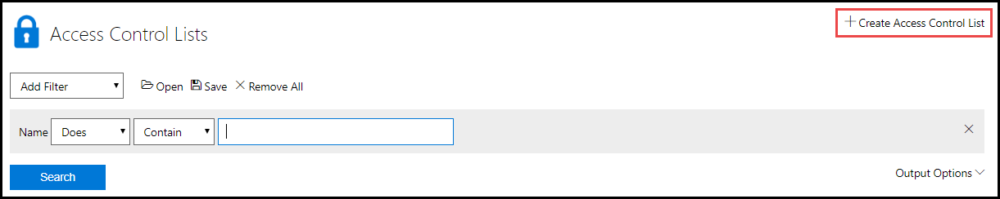

# Custom Access Control Lists

Custom Access Control lists (ACL) are used to restrict and allow domains that can be access by the VM broswer in the lab. This is accomplished using blacklists and whitelists. Domains added to the blacklist will not be resolvable, and domains added to the whitelist will resolve. You can also allow or deny domains based on  expressions. 

<!--

-->
## Creating an Access Control List (ACL)

To create an Access Control List:

1. From the Admin page in Lab on Demand, click **Access Control Lists** on the Virtual Machines tile.  

1. Click **Create Access Control List**.

    

1. Complete the following fields:

    - **Name**: The display name of the ACL.
    - **Description**: description of the ACL.
    - **Organization**: the organization the ACL will be available to.
    - **Parent (optional)**: the parent ACL that will be inherited. 
    - **Enabled**: select to enable this ACL for use. 
    - **Public**: This access control list is marked as public and is available read-only to all organizations.

### Parent Access Control Lists

Access Control Lists can optionally be set to inherit a parent ACL. Any domains on an ACL that is used as a parent ACL, will be added to the child ACL. 

### 

1. Under **Blacklist**:
    - In the **Domains** field, enter any domains you want to dissallow access to in the lab, each on a newline.

    - In the **Expressions** field, enter any regular expressions, each on a newline.

1. Under **Whitelist**:
    - In the **Domains** field, enter any domains you want to allow access to in the lab, each on a newline.

    - In the **Expressions** field, enter any regular expressions, each on a newline.

## Assigning an Access Control List

Access Control lists are assigned to a lab profile, on the Networks tab. Custom Access Control lists are only available with **Web Access (NAT)** network types.

1. Navigate to the lab profile you wish to configure an ACL on. 

1. Click **Edit** in the upper-right, to edit the lab profile. 

1. Click the **Networks** tab

1. On the Web Access (NAT) network you wish to add the ACL to, click **Choose** to select the ACL that will be applied.

1. Click **Save**. 

## Regex Tips

Some of the most frequently used parts of regex syntax:

|Expression|Description|
|---|---|
|.|Matches any single character (use "\." to match a ".").|
|[abc]|Matches one of the characters ([abc] matches a single "a" or "b" or "c")|
|[c-g]|Matches one of the characters in the range ("[c-g]" matches a single "c" or "d" or "e" or "f" or "g".|
||"[a-z0-9]" matches any single letter or digit.|
||"[-/.:?]" matches any single "-" or "/" or "." or ":" or "?".).|
|?|None or one of the preceding ("words?" will match "word" and "words".|
||"[abc]?" matches a single "a" or "b" or "c" or nothing (i.e. "")).|
|*|None or more of the preceding ("words*" will match "word", "words" and "wordsssssss". ".*" will match anything including nothing).|
|+|One or more of the preceding ("xxx+" will match a sequence of 3 or more "x").|
|(expr1\|expr2)|One of the expressions, which in turn may contain a similar construction ("(foo\|bar)" will match "foo" or "bar". "(foo\|bar)? will match "foo" or "bar" or nothing (i.e. "")).|
|$|The end of the line ("(foo\|bar)$" will match "foo" or "bar"only at the end of a line).|
|\x|Disable the special meaning of x where x is one of the special regex characters ".?*+()^$[]{}\"  ("\." will match a single ".", "\\" a single "\" etc.)|

For more information on Expressions, check out the [SquidGuard documentation](https://web.archive.org/web/20180807025620/http://squidguard.org/Doc/expressionlist.html).

For example, a basic expressionlist to allow access (if placed in the whitelist) to the Azure portal and some Azure features: 

`.*\.azure\.net`

`.*\.azure\.com`

`.*\.core\.windows\.net`

[Back to top](#custom-access-control-lists)