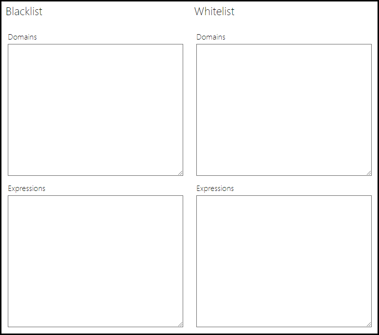

# Custom Access Control Lists

Custom Access Control lists (ACL) are used to restrict and allow domains that can be access by the VM broswer in the lab. This is accomplished using blacklists and whitelists. Domains added to the blacklist will not be resolvable, and domains added to the whitelist will resolve. You can also allow or deny domains based on  expressions. 

## Creating an Access Control List

To create an Access Control List:

1. From the Admin page in Lab on Demand, click **Access Control Lists** on the Virtual Machines tile.  

1. Click **Create Access Control List**.

    

1. Complete the following fields:

    - **Name**: The display name of the ACL.
    - **Description**: description of the ACL.
    - **Organization**: the organization the ACL will be available to.
    - **Parent (optional)**: the parent ACL that will be inherited. 
    - **Enabled**: select to enable this ACL for use. 
    - **Public**: This access control list is marked as public and is available read-only to all organizations.

### Parent Access Control Lists

Access Control Lists can optionally be set to inherit a parent ACL. Any domains on an ACL that is used as a parent ACL, will be added to the child ACL. 

### 

1. Under **Blacklist**:
    - In the **Domains** field, enter any domains you want to dissallow access to in the lab. 

    - In the **Expressions** field, 

1. Under **Whitelist**:
      - In the **Domains** field, enter any domains you want to allow access to in the lab. 

    - In the **Expressions** field,

## Assigning an Access Control List