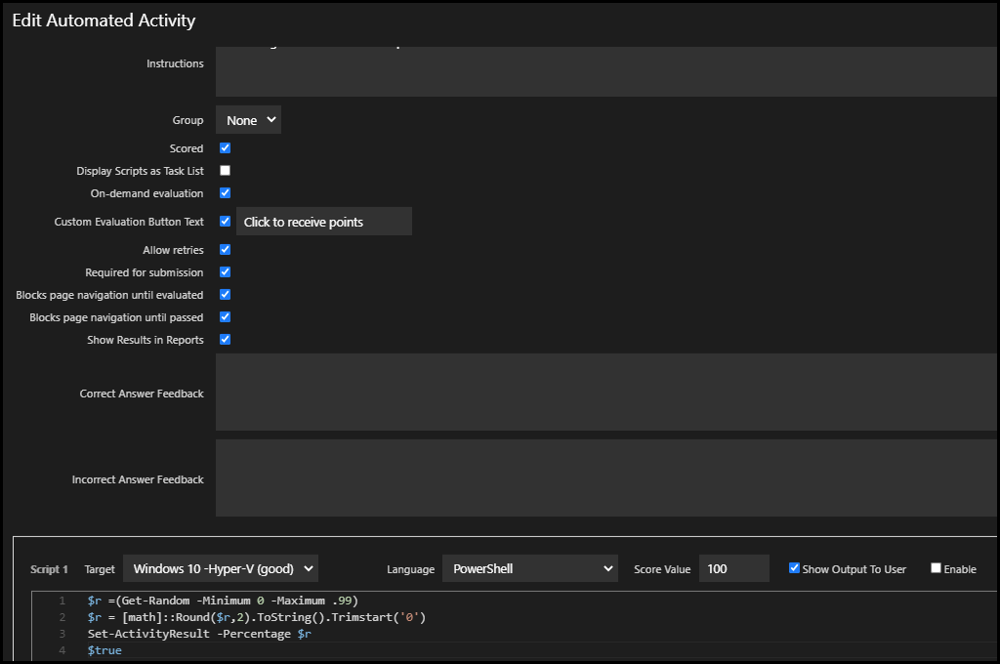
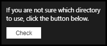
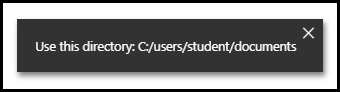
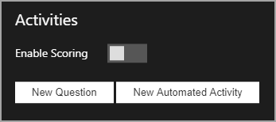
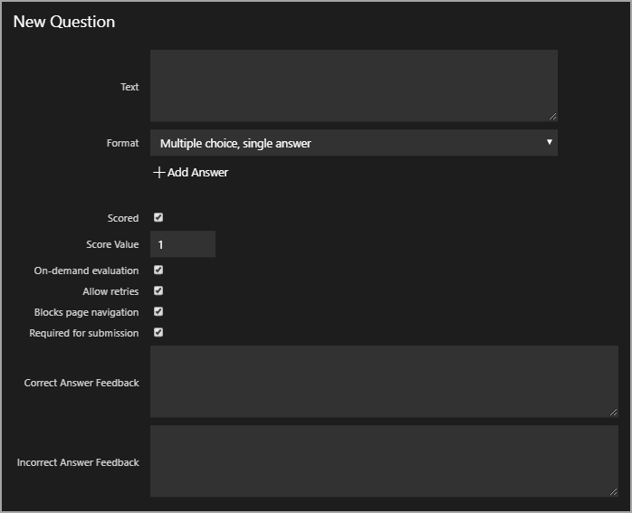
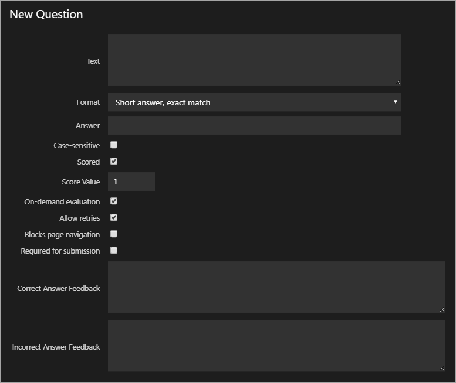
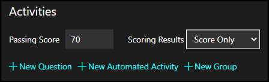
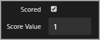
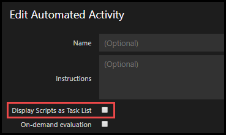
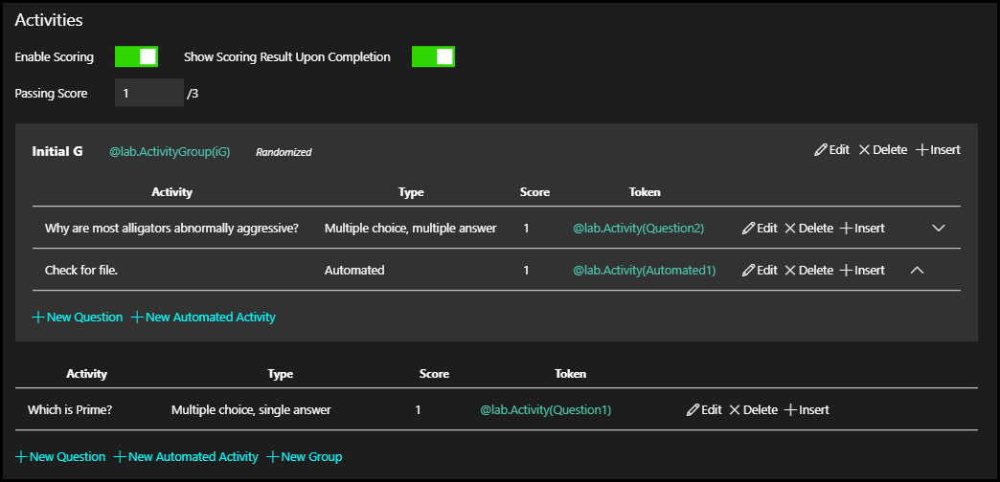

# Activities

 Activities are configured in the lab instructions, using the lab instruction editor. Activities can be modified at anytime, by anyone that has access to edit the lab instructions. When an Activity is created, it is represented in the lab instructions by a Replacement Token. 

Activities fall into two broad categories: Questions and Automated. 
- Questions are simply multiple choice or short answer questions. 
- Automated Activities have a script configured to run against a cloud subscription or virtual machines running on Hyper-V or VMware in the lab.  

> [!KNOWLEDGE] If your lab profile does not use a Cloud Subscription, or if it does not have virtual machines configured, Automated Activities are not available in the Activities menu. 

To get started with Activities:

1. Navigate to your **lab profile**.

1. Click **Edit Instructions**.

1. Click the **Activities icon** to enter the settings Activities menu in your lab instructions. 


Next, you should decide what type of Activity you would like to create -- Question, or an Automated Activity that targets a Cloud Subscription or a virtual machines running on Hyper-V or VMware, with a PowerShell or Shell script. 

Click to go to a specific section, or continue reading to learn more about creating Activities in your lab. 

- [Automated Activities](#automated-activities)
    - [Automated Activity Syntax](#automated-activity-syntax)
    - [Automated Activity Creation](#automated-activity-creation)
    - [Automated Activity Output](#automated-activity-output)
    - [Automated Activity Best Practices and Guidelines](#automated-activity-best-practices-and-guidelines)
    - [Automated Activity Notifications and Variables](#automated-activity-notifications-and-variables)
    - [Example Automated Activities](#example-automated-activities)
- [Questions](#questions)
    - [Multiple Choice Question](#multiple-choice-questions)
    - [Short Answer Question](#short-answer-questions)
- [Scoring](#scoring)
    - [Performance Based Testing](#performance-based-testing)
    - [Scoring Methods](#scoring-methods)
- [Activity Management](#activity-management)

## Automated Activities 

Automated Activities are PowerShell Windows command Shell Shell scripts that target a Cloud Subscription, or virtual machine running on Hyper-V or VMware in the lab. Cloud Subscriptions are targeted by a PowerShell script, and Windows-based virtual machines can be targeted by both PowerShell and Shell. Automated Activities support using @lab replacement tokens in scripts as well. Automated Activities can be used to help make sure the student has configured their lab environment correctly, help the student understand mistakes that are made in their lab, as well as give the student confirmation that they are completing the lab instructions correctly. Automated Activities can also be used to automate any configuration or lab steps that you wish to automate. 

### Automated Activity Syntax

Along with traditional PowerShell, Windows Command Shell, and Bash syntax, there is additional syntax that can be used. 

- Setting Lab Variables: sets a variable that can be recalled in subsequent lab instructions using @lab replacement tokens, as many times as neccessary. 

- Sending Lab Notifications: Sends a a popup notification to the lab, using the text specified in the syntax.

- Scoring: used to determine how much of the score value the lab user will receive for the activity. This can be used to award partial score values for the automated activity. The partial score is dictated by a numerical value in the syntax, that represents the percentage of the score value that will be awarded. For Windows Command Shell and Bash, you can also display a message in the lab instructions with text specified scoring syntax.

#### **PowerShell** 

- **Setting Variables**
    
    `Set-LabVariable -Name firstName -Value John`

    `Set-LabVariable -Name lastName -Value Smith`

- **Sending Lab Notifications**

    `Send-LabNotification -Message "Hello from a script"`

- **Scoring**

    `Set-ActivityResult .5 -Correct`

#### **Windows Command Shell and Bash**

- **Setting Variables**
    
    `set_lab_variable "firstname" "John"`

    `set_lab_variable "lastname" "Smith"`

- **Sending Lab Notifications**

    `send_lab_notification "Hello from a script"`

    `send_lab_notification "I hope you're doing well"`

- **Scoring**

    `set_activity_result .5 "good job!"`

### Automated Activity Creation

1. If you would like the lab to be scored, Click the **switch** next to _Enable Scoring_. If you would not like the lab to be scored, simply leave the **Switch** turned off. 

1. Click **New Automated Activity**.



- **Name**: this will be the title of the automated Activity, and will be displayed in the lab instruction editor, in the activities menu.

- **Instructions**: this is where instructions for the Activity are entered, and will be displayed to students, in the lab instructions. 

- **Scored**: enables the question to be scored. Scoring must be enabled in your lab. [Scoring is covered below in this document](#scoring).

- **Display Scripts as Task List**: enables the script to be displayed as a Task List. This is useful when there is more than one script configured on an Activity. *Display Scripts as Task List* will take the **Text** field from each *Script* created within the activity and insert it in to the Instructions page with a box next to it that has a question mark. This is where users are able to manually run a check against those scripts to see if they are correct or not.  The boxes will then change to Green with a check for correct or Red with an X for incorrect and report any script output associated with them.

    > [!KNOWLEDGE] If **Display Scripts as Task List** is checked, On-Demand Evaluation will no longer be available for this Activity. 

- **On-Demand Evaluation**: enables a button that the user can click to check their answer to a question, or to score their answer if Activities are set to be scored.
 
- **Allow retries**: allows the user to retry a question if they enter or select an incorrect answer. This option is not available when On-Demand Evaluation is disabled. 

- **Required for submission**: requires the student to perform the Activity, to submit their lab for grading.

- **Blocks page navigation**: checking this box prevents the student from navigating to the next page in the lab instructions, unless they have entered or selected an answer to this question. 

- **Correct answer feedback**: this will be displayed to the user upon entering or selecting a correct answer to a question. 

- **Incorrect answer feedback**: this will be displayed to the user upon entering or selecting a incorrect answer to a question. 

- **Script 1**:
    - **Score Value**: the score value the student will recieve for completing the Activity correctly. This score contributes to their overall score in the lab.
    - **Target**: the virtual machine or cloud subscription that the script will target. Cloud subscriptions must be targeted by PowerShell, and virtual machines running on Hyper-V or VMware can be targeted by PowerShell or Windows Command Shell. Linux-based VMs running Hyper-V or VMware can be targeted by Bash.
    - **Language**: the scripting language that will be used. PowerShell, Windows Command Shell, and Bash are supported. Enabling Bash scripting or terminal connections will not take effect on running lab instances, users will have to relaunch their lab.
    - **Script**: enter the script that will be executed. @lab replacement tokens that are used in scripts will be replaced in the lab instructions when the lab is launched.

    - **New Script**: click to add an additional script to this Activity. The new script will be represented by a button, in a Task List. 

    >[!knowledge] @lab Replacement Tokens can be used in Activity scripts, to replace data in the lab instructions that is not known at the time of authoring the lab instructions, by inserting a Replacement Token in the lab instructions where you want data to be replaced in the lab.

    The following two options are **only available if Display Scripts as Task list is checked**, and are located in the section for the script they belong to. This allows you to provide custom feedback on each Automated Activity. 

    - **Correct answer feedback**: you can enter text here, or you can use scripts to generate a response to the student.  

    - **Incorrect answer feedback**: you can enter text here, or you can use scripts to generate a response to the student.  

### Automated Activity Output

You can optionally store automated activity output separately from a script message that the student receives in the lab when they complete the automated activity. This allows you to display a message to the student in the lab, but leave more detailed evidence for reporting or remediation. 

An example, if you wanted to capture a list of all running services in a virtual machine, at a specific point in the lab. You could create an automated that uses PowerShell to target a Windows virtual machine with the following script:

```
Get-Service | Format-List *
Set-ActivityResult -Correct -Message 'You got it!'
```
When the student clicks the button in the lab to trigger the automated activity, the script will capture a list of running services and store them on the lab instance details page, and will display "You got it!" to the student in the lab. 

### Automated Activity Best Practices and Guidelines

- Use Automated Activities in areas of your lab when students are prone to making mistakes. A PowerShell script, such as the example shown below, helps students to make sure their lab is configured appropriately so that they do not get an error when trying to complete steps later in the lab.  

- Provide the student feedback with your scripts where possible, to help them complete the lab instructions correctly. An if/else statement in your script works very well in this situation, to provide unique feedback depending on if the student gave the correct answer or not. 

- If more than one script is configured on an Activity, the scripts will execute in sequential order. If one of your scripts is relying on another script to be completed, make sure you order the scripts appropriately to prevent your Automated Activity from not working correctly. 

- Automated Activities support PowerShell Windows Command Shell, and Bash. Cloud Subscriptions must be targeted by a PowerShell script, and virtual machines running on Hyper-V or VMware can be targeted by PowerShell or Windows Command  Shell. Linux-based VMs running Hyper-V or VMware can be targeted by Bash.

### Automated Activity Notifications and Variables

Automated activity scripts can set a variable and send notifications to the student, to draw attention to some information or to notify the student of the outcome of the script once it is completed. This allows the student to progress through the lab instructions, without waiting for the result from the script. 

You can also use @lab replacement tokens, to replace information in the notification. This allows the lab author to provide more specific information to the student.  

You can set a variable and send a notification using the the variable in the following example. This example uses 2 PowerShell scripts. 

**Script 1**

```
Set-LabVariable -Name Directory -Value C:/users/student/documents
Set-ActivityResult -Correct
```

**Script 2**

```
Send-LabNotification -Message "Use this directory: @lab.Variable(Directory)!"
Set-ActivityResult -Correct
```

_Student view in the lab of automated activity_



_Student view of the notification in the lab_



### Example Automated Activities

^[PowerShell Samples][powershell-samples]

> [powershell-samples]:
>
> !INSTRUCTIONS[][ps-simple-explanation]
>
> !INSTRUCTIONS[][ps-simple-code]
>
> !INSTRUCTIONS[][ps-complex-explanation]
>
> !INSTRUCTIONS[][ps-complex-code]


^[Bash Samples][bash-samples]

> [bash-samples]:
>
> !INSTRUCTIONS[][bash-simple-explanation]
>
> !INSTRUCTIONS[][bash-simple-code]
>
> !INSTRUCTIONS[][bash-complex-explanation]
>
> !INSTRUCTIONS[][bash-complex-code]

## Questions

Activities in your lab can be configured to use the following types of questions:
- Multiple choice
    - Single answer
    - Multiple answers
- Short answer
    - Exact match
    - Regex match

Optionally, you can enable scoring for Questions in your lab. Once scoring is enabled:

- You will be presented with a text field where you can enter the passing score the student will need to achieve in the lab. 
- You can enable scoring only on the questions you wish to be scored. Questions that are not scored, are considered practice or review and do not contribute to the student's overall score in the lab. 
- Each question that is scored is given a score value, and that value is awarded to the student by selecting the correct answer to the question.   
- If Scoring is not enabled, you do not need to decide which questions will be scored and which will not be scored.

### Multiple Choice Questions 

1. If you would like the lab to be scored, Click the switch next to _Enable Scoring_. 

1. Click **New Question**.





- **Text**: This is where the multiple choice question is entered. This will also be the text that is displayed in the Activities editing menu.

- **Format**: the format can be changed by clicking the drop-down menu. Format options for multiple choice include:
    - Multiple choice, single answer:
    - Multiple choice, multiple answer

- **Add Answer**: click to add an answer to the multiple choice question. 

- **Scored**: enables the question to be scored. Scoring must be enabled in your lab. [Scoring is covered below in this document](#scoring).

- **Score Value**: the value the student will receive upon selecting a correct answer.

- **On-Demand Evaluation**: enables a button that the user can click to check their answer to a multiple choice question in the lab, or to score their answer if Activities are set to be scored.
 
- **Allow retries**: allows the user to retry a question if they select an incorrect answer. This option is not available when On-Demand Evaluation is disabled. 

- **Blocks page navigation**: checking this box prevents the student from navigating to the next page in the lab instructions, unless they have selected an answer to this question. 

- **Required for submission**: click to make this multiple choice question required, for the student to submit their lab. 

- **Correct answer feedback**: this will be displayed to the user upon selecting a correct answer to a multiple choice question. 

- **Incorrect answer feedback**: this will be displayed to the user upon selecting a incorrect answer to a multiple choice question. 

### Short Answer Questions

1. If you would like the lab to be scored, Click the switch next to _Enable Scoring_. 

1. Click **New Question**.




- **Text**: This is where the short answer question is entered. This will also be the text that is displayed in the Activities editing menu.

- **Format**: the format can be changed by clicking the drop-down menu. Format options include:
    - Short answer, exact match
    - Short answer, regex match

- **Answer**: the answer to a short answer question.

- **Case-sensitive**: enables case-sensitivity on the students answer to short answer questions. 

- **Scored**: enables the question to be scored. Scoring must be enabled in your lab. [Scoring is covered below in this document](#scoring).

- **Score Value**: the value the student will receive upon entering a correct answer.

- **On-Demand Evaluation**: enables a button that the user can click to check their answer to a short answer question in the lab, or to score their answer if Activities are set to be scored.
 
- **Allow retries**: allows the user to retry a question if they enter an incorrect answer. This option is not available when On-Demand Evaluation is disabled. 

- **Blocks page navigation**: checking this box prevents the student from navigating to the next page in the lab instructions, unless they have entered an answer to this question. 

- **Required for submission**: click to make this short answer question required, for the student to submit their lab. 

- **Correct answer feedback**: this will be displayed to the user upon entering a correct answer to a short answer question. 

- **Incorrect answer feedback**: this will be displayed to the user upon entering a incorrect answer to a short answer question. 

## Scoring

Scoring allows the student to be given a score for each Activity they complete correctly, and those scores contribute to the student's overall score in the lab. As the lab author, you set the passing score for the lab after you enable scoring in the lab. 

> [!KNOWLEDGE] When Scoring is enabled, it is not required to make each question scored. As a lab author, you are free to decide which Activities have a score value associated, and only score the questions that you wish to.

To enable Scoring in your lab:

1. Click the **Activities icon** to enter the settings menu for Activities.

1. Click the **switch** to enable Scoring. 

1. Enter a **passing score** for the lab. You may change this at anytime, as often as you would like. 

    

1. After Scoring is enabled, you will see the Score checkbox available to select on all Activities you have created, while editing that Activity.

1. Click the checkbox to enable scoring, and enter a score for that Activity. 

    

1. The student will be given the score value upon completing the Activity correctly. 

### Scoring Methods

There are two methods to return a scoring result from an automated activity.

- **A binary value**: a value indicating pass or fail. A binary result allows for very simple script authoring. A binary result from a script means that the score value defined in the activity will be used. If the activity is completed correctly, the student will receive the score value defined in the LOD instructions editor for the activity. 
    - If the last value encountered in the script output is a **true** value, then the script will be considered to have **passed** and the student will receive the score value of the activity. 
    - If the last value encountered in the script output is a **false** value, then the script will be considered to have **failed** and the student will not receive the score value of the activity.

- **Explicit Score Value** Set score in the script for more complex scenarios. This method requires knowledge about scripting languages, such as PowerShell or Bash. An explicit value in a script means that the score value for each script is defined in the script itself, or multiple scores can be configured for each part of the script that is completed correctly. The score value is set in the script using [Automated Activity Syntax](#automated-activity-syntax). An explicit score value can be given after each section of the script that should be scored or at the end of a script. 

Additionally, text output (logging) can be configured on a script. Any text output from the script is captured along with the script result. This allows for capture of meaningful information along with the pass/fail result. The captured data will be sent in the `ScriptResponse` line of the API response. 

#### Example Scoring Methods

**Binary example**

When the script returns `$true` in a PowerShell script or `True` in a Bash script, the student will receive the score value configured in the activity in the lab editor. When the script returns a false binary result, the student will receive a score value of 0 for the activity. 

This sample is gauging a file's size on the Windows file system. If the file is less than 1000 bytes the user is successful, otherwise they are unsuccessful.

- PowerShell

    ```PowerShell-linenums
    $result = $false
    $file = (Get-Item C:\Users\LabUser\file.txt).length
    if($file -lt 1000){
        echo "Success, filesize is $file"
        $result = $true
    }
    $result
    ```

- Bash

    ```Bash-linenums
    RESULT=False
    file=$(stat --format=%s /etc/passwd)
    if [ $(echo $file) -lt 1000 ]
    then 
     echo "success, filesize is $file"
     RESULT=True
    fi
    echo $RESULT
    ```

**Explicit score value Example**

When a section of a script is completed correctly, the student is given the score value declared in PowerShell as `Set-ActivityResult` and `set_activity_result` in Bash. In the examples below, the student will receive 5 points for the first part, 2.5 points for the second part or 0 points if they do not complete the first or second part of the script. 

- PowerShell

    ```PowerShell-linenums
    $result = $False
    $hostname = [System.Net.DNS]::GetHostEntry('')
    if ($hostname.HostName -eq "LabVM" -and $hostname.AddressList.IPAddressToString     contains "192.168.1.4"){
         #set_activity_result 1 "Success"
         $result = $True
     }elseif($hostname.AddressList.IPAddressToString -contains "192.168.1.4"){
         #set_activity_result .5 "Partially correct"  
     }else{
         "Value not found"    
     } 
     $result
    ```

- Bash

    ```Bash-linenums
    RESULT=False
    host=$(cat /etc/hosts | grep 192.168.1.2)
    if [[ $(echo $host) == "192.168.1.2 linuxvm"* ]]
    then
     set_activity_result 1 "Success"
     RESULT=True
    elif [[ $(echo $host) == "192.168.1.2"* ]]
    then 
     set_activity_result .5 "Partially correct"
    else 
     echo "value not found"
    fi
    echo $RESULT
    ```

### Partial Scoring

Partial scoring allows a student to receive partial credit for a task in the lab, instead of the score for the question being all or nothing. 

For example, if the lab instructions had a task to create a directory and name it "MyDirectory", and the student created the directory but didn't name it properly -- they could receive partial credit for creating the directory, even though they didn't name it properly. 

Partial scoring is achieved with automated Activities in IDLx. To configure partial scoring for the example above:

1. Edit the **lab instructions**.
1. **Enable scoring** from the Activities menu.
1. **Add** an automated Activity.
1. In the **Script 1** field, enter a PowerShell script to check for the directory the student created.
1. Assign a score value for script 1. This will be the partial score the student will receive if the directory is created. 
1.  Click _New Script_.
1. In the **Script 2** field, enter a PowerShell script to verify the directory is named properly. 
1. Assign a score value for script 2. This will be the partial score the student will receive if the directory is name properly.
1. Alternatively, the score value can be set for the activity using the `Set-ActivityResult` syntax discussed in the previous section. 

### Performance Based Testing 

Labs can be scored with a performance based testing scenario by leaving the _On-demand_ checbox unchecked, when creating automated activities. When activities are configured this way, they are scored when the lab is completed by the student. The score can be obtained by viewing the lab instance details. 



## Activity Management

After Activities are created, they can be modified at any time, using the Activity editing menu. 

To access this menu, simply click the **Activities Icon**




- **Enable Scoring**: this enables Activities to be given a score value that will be given to the student by selecting the correct answer, or completing the Activity correctly. 

- **Activity**: this will display the text you entered as the Name of your Activity. 

- **Type**: this displays the type of Activity. 

- **Score**: this displays the score value of the Activity. This will display _Practice_ for non-scored Activities, and a the score value of the Activity for scored Activities. 

- **Token**: this is the replacement token that is used in lab instructions to represent this Activity in the lab. Simply place this Replacement Token where you would like the Activity to appear in the lab instructions. 

- **Edit**: click this to edit the Activity. 

- **Delete**: click to delete the Activity. Once it is deleted, there is no way to recover the Activity. 

- **Insert**: click to insert the Activity in your current position in the lab instruction editor. 

[Back to Top](#activities)


> [ps-simple-explanation]:
> **Binary**  (Simple Script (Pass/Fail)
> This sample is gauging a file's size on the Windows file system. If the file is less than 1000 bytes the user is successful, otherwise they are unsuccessful.

> [ps-simple-code]:
> ```PowerShell-linenums
> $result = $false
> $file = (Get-Item C:\Users\LabUser\file.txt).length
> if($file -lt 1000){
>     echo "Success, filesize is $file"
>     $result = $true
> }
> $result
> ```

> [ps-complex-explanation]:
> **Explicit score value Example** (Complex Script - Partial Credit/Multiple Conditions)
> This sample actually reads the host entry on a Windows machine, and identifies both the hostname and any IPs associated with it. From there it validates if it has both the correct IP and hostname. With this design the user can get variable scores based on the following:
> 
> - Full credit if both the IP and hostname are found.
> - Partial credit if the IP is found, but not the hostname
> - No credit if the IP is not found

> [ps-complex-code]:
>```PowerShell-linenums
>$result = $False
>$hostname = [System.Net.DNS]::GetHostEntry('')
>if ($hostname.HostName -eq "LabVM" -and $hostname.AddressList.IPAddressToString -contains "192.168.1.4"){
>     #set_activity_result 1 "Success"
>     $result = $True
> }elseif($hostname.AddressList.IPAddressToString -contains "192.168.1.4"){
>     #set_activity_result .5 "Partially correct"  
> }else{
>     "Value not found"    
> } 
> $result
> ```

> [bash-simple-explanation]:
> **Binary**  (Simple Script (Pass/Fail) 
> This sample is gauging a file's size on the linux file system. If the file is less than 1000 bytes the user is successful, otherwise they are unsuccessful.

> [bash-simple-code]:
> ```Bash-linenums
> RESULT=False
> file=$(stat --format=%s /etc/passwd)
> if [ $(echo $file) -lt 1000 ]
> then 
>  echo "success, filesize is $file"
>  RESULT=True
> fi
> echo $RESULT
> ```

> [bash-complex-explanation]:
> **Explicit score value Example** (Complex Script - Partial Credit/Multiple Conditions)
> This sample actually reads the /etc/hosts file on a Linux machine, and searches for a line that contains a specific IP. From there it if the IP has the correct hostname. With this design the user can get variable scores based on the following:
> 
> - Full credit if both the IP and hostname are found.
> - Partial credit if the IP is found, but not the host name
> - No credit if the IP is not found

> [bash-complex-code]:
> ```Bash-linenums
> RESULT=False
> host=$(cat /etc/hosts | grep 192.168.1.2)
> if [[ $(echo $host) == "192.168.1.2 linuxvm"* ]]
> then
>  set_activity_result 1 "Success"
>  RESULT=True
> elif [[ $(echo $host) == "192.168.1.2"* ]]
> then 
>  set_activity_result .5 "Partially correct"
> else 
>  echo "value not found"
> fi
> echo $RESULT
> ```
