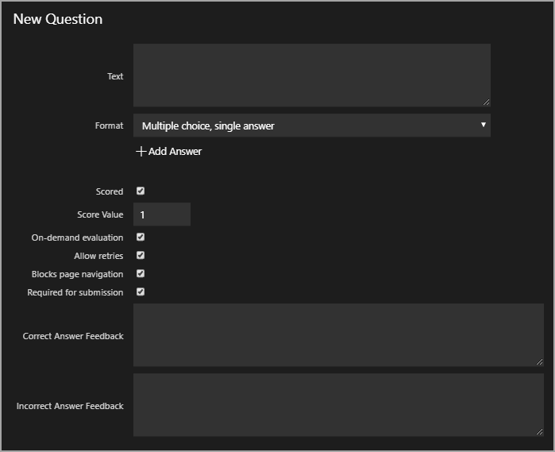

# Activities

 Activities are configured in the lab instructions, using the lab instruction editor. Activities can be modified at anytime, by anyone that has access to edit the lab instructions. When an Activity is created, it is represented in the lab instructions by a Replacement Token. 

There are multiple activity options that can be configured in your lab. Options include: Question, and Automated Activities. 
- Questions are simply multiple choice or short answer questions. 
- Automated Activities have a PowerShell script configured to run against a cloud subscription or virtual machines in the lab.  

> [!KNOWLEDGE] If your lab profile does not use a Cloud Subscription, or if it does not virtual machines configured, Automated Activities are not available in the Activities menu. 

To get started with Activities:

1. Navigate to your **lab profile**.

1. Click **Edit Instructions**.

1. Click the **Activities icon** to enter the settings menu for Activities in your lab instructions. 

1. Next, you should decide what type of Activity you would like to create -- Question, or an Automated Activity that targets a Cloud Subscription or a virtual machine with a PowerShell script. 

Click to go to a specific section, or continue reading to learn more about creating Activities in your lab. 

- [Multiple Choice Question](#multiple-choice-questions)
- [Short Answer Question](#short-answer-questions)
- [Automated Activity](#automated-activity)
- [Edit Activities](#edit-activities)
- [Scoring](#scoring)

## Questions

Activities in your lab can be configured to use the following types of questions:
- Multiple choice
    - Single answer
    - Multiple answers
- Short answer
    - Exact match
    - Regex match

Optionally, you can enable scoring for Questions in your lab. Once scoring is enabled:

- You will be presented with a text field where you can enter the passing score the student will need to achieve in the lab. 
- You can enable scoring only on the questions you wish to be scored. Questions that are not scored, are considered practice or review and do not contribute to the student's overall score in the lab. 
- Each question that is scored is given a score value, and that value is awarded to the student by selecting the correct answer to the question.   
- If Scoring is not enabled, you do not need to decide which questions will be scored.

### Multiple Choice Questions 

1. Click **New Question**.

- **Text**: This is where the multiple choice question is entered. This will also be the text that is displayed in the Activities editing menu.

- **Format**: the format can be changed by clicking the drop-down menu. Format options for multiple choice include:
    - Multiple choice, single answer:
    - Multiple choice, multiple answer

- **Add Answer**: click to add an answer to the multiple choice question. 

- **Scored**: enables the question to be scored. Scoring must be enabled in your lab. Scoring is covered later in this document. 

- **Score Value**: the value the student will receive upon selecting a correct answer.

- **On-Demand Evaluation**: enables a button that the user can click to check their answer to a multiple choice question in the lab, or to score their answer if Activities are set to be scored.
 
- **Allow retries**: allows the user to retry a question if they select an incorrect answer. This option is not available when On-Demand Evaluation is disabled. 

- **Blocks page navigation**: checking this box prevents the student from navigating to the next page in the lab instructions, unless they have selected an answer to this question. 

- **Correct answer feedback**: this will be displayed to the user upon selecting a correct answer to a multiple choice question. 

- **Incorrect answer feedback**: this will be displayed to the user upon selecting a incorrect answer to a multiple choice question. 

### Short Answer Questions

1. Click **New Question**.

- **Text**: This is where the short answer question is entered. This will also be the text that is displayed in the Activities editing menu.

- **Format**: the format can be changed by clicking the drop-down menu. Format options include:
    - Short answer, exact match
    - Short answer, regex match

- **Answer**: the answer to a Short answer question.

- **Case-sensitive**: enables case-sensitivity on the students answer to short answer questions. 

- **Scored**: enables the question to be scored. Scoring must be enabled in your lab. Scoring is covered later in this document. 

- **Score Value**: the value the student will receive upon entering a correct answer.

- **On-Demand Evaluation**: enables a button that the user can click to check their answer to a short answer question in the lab, or to score their answer if Activities are set to be scored.
 
- **Allow retries**: allows the user to retry a question if they enter an incorrect answer. This option is not available when On-Demand Evaluation is disabled. 

- **Blocks page navigation**: checking this box prevents the student from navigating to the next page in the lab instructions, unless they have entered an answer to this question. 

- **Correct answer feedback**: this will be displayed to the user upon entering a correct answer to a short answer question. 

- **Incorrect answer feedback**: this will be displayed to the user upon entering a incorrect answer to a short answer question. 

## Automated Activity

- **Name**: this will be the title of the automated Activity, and will be displayed in the lab instruction editor, in the activities menu. This field is **optional**.

- **Instructions**: this is where instructions for the Activity are entered, and will be displayed to students, in the lab instructions. This field is **optional**.

- **Display Scripts as Task List**: enables the script to be displayed as a Task List. This is useful when there is more than one script configured on an Activity. 

    > [!KNOWLEDGE] If **Display Scripts as Task List** is checked, On-Demand Evaluation will no longer be available for this Activity. 

- **On-Demand Evaluation**: enables a button that the user can click to check their answer to a question, or to score their answer if Activities are set to be scored.
 
- **Allow retries**: allows the user to retry a question if they enter or select an incorrect answer. This option is not available when On-Demand Evaluation is disabled. 

- **Blocks page navigation**: checking this box prevents the student from navigating to the next page in the lab instructions, unless they have entered or selected an answer to this question. 

- **Correct answer feedback**: this will be displayed to the user upon entering or selecting a correct answer to a question. 

- **Incorrect answer feedback**: this will be displayed to the user upon entering or selecting a incorrect answer to a question. 

- **Script 1**:
    - **Target**: the virtual machine that the script will target
    - **Language**: the scripting language that will be used. PowerShell and Shell are supported. 
    - **Script**: enter the script that will be executed.

    - **New Script**: click to add an additional script to this Activity. The new script will be represented by a button, in a Task List. 

    The following two options are **only available if Display Scripts as Task list is checked**, and are located in the section for the script they belong to. 

    - **Correct answer feedback**: you can enter text here, or you can use scripts to generate a response to the student.  

    - **Incorrect answer feedback**: you can enter text here, or you can use scripts to generate a response to the student.  

    > [!KNOWLEDGE] You can provide a hint to students based on the outcome of the script. For example, if the script is to check if a specific directory has been created, you script could output a hint to help the student create the appropriate directory. 

## Scoring

Scoring allows the student to be given a score for each Activity they complete correctly, and those scores contribute to the student's overall score in the lab. As the lab author, you set the passing score for the lab. 

> [!KNOWLEDGE] When Scoring is enabled, it is not required to make each question scored. As a lab author, you are free to decide which Activities have a score value associated, and only score the questions that you wish to.

To enable Scoring in your lab:

1. Click the Activities icon to enter the settings menu for Activities.

1. Click the **switch** to enable Scoring. 

1. Enter a passing score for the lab. You may change this at anytime, as often as you would like. 

1. After Scoring is enabled, you will see the Score checkbox available to select on Activities you have created when editing an Activity, and on all Activities you create going forward. 

1. Click the checkbox to enable scoring, and enter a score for that Activity. 

1. The student will be given the score value upon completing the Activity correctly. 

## Edit Activities

After Activities are created, they can be modified at any time, using the Activity editing menu. 

To access this menu, simply click the **Activities Icon**

- **Enable Scoring**: this enables Activities to be given a score value that will be given to the student by selecting the correct answer, or completing the Activity correctly. 

- **Activity**: this will display the text you entered as the Name of your Activity. 

- **Type**: this displays the type of Activity. 

- **Score**: this displays the score value of the Activity. This will display _Practice_ for non-scored Activities, and a the score value of the Activity for scored Activities. 

- **Token**: this is the replacement token that is used in lab instructions to represent this Activity in the lab. Simply place the Replacement Token where you would like the Activity to appear in the lab instructions. 

- **Edit**: click this to edit the Activity. 

- **Delete**: click to delete the Activity. Once it is deleted, there is no way to recover the Activity. 

- **Insert**: click to insert the Activity in your current position in the lab instruction editor. 

[Back to Top](#activities)

