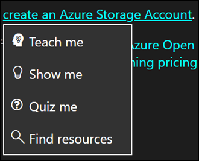

# AI Chat 

## Table of Contents


- [Overview](#overview)
  - [AI Chat menu ](#ai-chat-menu)
  - [Example](#example)
- [Prompt Engineering](#prompt-engineering)
  - [Example with Prompt Engineering:](#example-with-prompt-engineering-)
  - [Basic Prompt Engineering Syntax:](#basic-prompt-engineering-syntax-)
  - [Advanced Prompt Engineering syntax:](#advanced-prompt-engineering-syntax-)
  - [Optional Prompt Engineering Parameters:](#optional-prompt-engineering-parameters)

## Overview 

Lab instructions can use AI to generate a list of options for lab users to select. The AI syntax will render as a link or set of links in the lab instructions, when selected that will cause new instructions content to be generated. The purpose of the AI menu is to wrap text in the instructions that will serve as a topic for new AI feedback and integrations with GPT-4.

## AI Chat menu 

The common usage is to wrap some text that will serve as a topic with a AI IDLx syntax. The text of the link will be the topic (e.g. Azure Storage Accounts). Selecting the link will display a menu with 4 options:

1. **Teach me** - generates a text response designed to teach the learner about the provided topic.
1. **Show me** - generates a list of steps on how to perform the topic. Helpful if the topic text starts with averb. For instance, "Create an Azure Storage Account."
1. **Quiz me** - generates multiple choice questions on the topic. We will attempt to process the response and makeit interactive. So selecting the right answer provides a "Correct" response and selecting an incorrect answerprovides a "Sorry, try again." response. Note this depends on the AI sending back a response we’re able to format.This may not always be the case in V1.
1. **Find resources** - generates a list of links to web resources about the topic.



Selecting one of the menu options will cause a response to be generated and displayed below the current instructions. 

- Responses will have like/dislike buttons. In the future, we will use these to rank multiple responses, allowing us to pick only highly rated response for cached responses. 
    - Disliking a response will remove it from cache, allowing you to regenerate the response by selecting it again in the menu. This will aid in preparing for demos.
- Responses will be displayed in a collapsible box so they can be easily be removed from view.

### Example

An example of AI IDLx syntax would be formatted as: 

```ai[Azure Storage Accounts]```

## Prompt Engineering

The syntax will offer several built-in options used for prompt engineering to the backend API. Every item added needs to be comma separated (see [example](#example-with-prompt-engineering) below).

- **model (optional)**: Controls the model type the AI should be run against. Possible values: text,code,chat. Text uses text processing model. Code uses a codex code generation model. Chat uses GPT model. Default: text.
- **options: (optional)**: A comma-separated list of selection options. These will appear in a dropdown menu when the user clicks on the AI link. Possible values: teach, show, quiz, resources. Use this property to control which of the four options will appear. If this property is not set, all four options will be displayed. If the property is set to an empty string, none of the built-in options will display (useful if you want to use only custom options). Default: teach,show,quiz,resources.
- **custom_options (optional)**: An array of custom selection options. These will appear in the dropdown menu when the user clicks on the AI link. Example: custom_options:["What is e=mc²?", "Who is Albert Einstein?", "What is the speed of light?"] Default: null.
- **use_default_prompts (optional)** By default, the platform creates AI prompts to help ensure we get good, well-formatted responses from the AI. However, the author can to take complete control of the prompts sent to the AI by setting this property to false. The author will need to supply prompts using one or more of the following properties. Default: true.
- **prompt (optional)**: Free form text included as prompt to the AI. e.g. {prompt:"Cover advanced topics."}. This will be included for all AI options (teach, show, quiz, resources, custom etc.). If you want to use different prompts for different selection options, use one of the following option-specific prompt properties. Default: null.
- **teach_prompt (optional)**: Free form text included as the prompt to the AI when the "Teach me" option is selected by the user. Default: null.
- **show_prompt (optional)**: Free form text included as the prompt to the AI when the "Show me" option is selected by the user.  Default: null.
- **quiz_prompt (optional)**: Free form text included as the prompt to the AI when the "Quiz me" option is selected by the user.  Default: null.
- Resources_prompt (optional)**: Free form text included as the prompt to the AI when the "Find Resources" option is selected by the user.  Default: null.
- **custom_prompts(optional)**: An array of free form text to be used for custom prompts. When multiple custom options and custom prompts are specified, the custom prompt at the same array index will be used for a given option. For example:
o	custom_options:["What is e=mc²?", "Who is Albert Einstein?", "What is the speed of light?"], custom_prompts:["Describe Einstein's theory of relativity.", "Provide a brief summary of Albert Einstein's life and why he was important to the study of physics.", "Tell me the speed of light in meters per second."]
o	In this example, if the user selects "What is the speed of light?" (the third custom option), the prompt sent to the AI will be "Tell me the speed of light in meters per second." (the third custom prompt).
- **user_level(optional)**: Nudges the AI to generate responses in simple of advanced phrasing. Possible values: default, simple, advanced. Default: default.
- **num_questions: (optional)**: Only used for "Quiz me" responses. Controls how many questions should be generated. Default: 3.
- **max_tokens (optional)**: controls the maximum number of characters allowed in a response. Default 1000.
- **temperature**: (optional) Range from 0.0 - 1.0. Controls randomness. Lowering the temperature means that the model will produce more repetitive and deterministic responses. Increasing the temperature will result in more unexpected or creative responses. Default: 0.7. 
- **top_p: (optional)**: Range from 0.0 - 1.0. Controls randomness but uses a different method than temperature. Lowering probability will narrow the model’s token selection to likelier tokens. Increasing probability will let the model choose from tokens with both high and low likelihood. Default: 0.95
- **frequency_penalty (optional)**: range from 0.0 to 2.0. Reduce the chance of repeating a token proportionally based on how often it has appeared in the text so far. This decreases the likelihood of repeating the exact same text in a response. Default: 0.5
- **presence_penalty (optional)**: range from 0.0 to 2.0. Reduce the chance of repeating any token that has appeared in the text at all so far. This increases the likelihood of introducing new topics in a response. Default: 0.
- **stop: (optional)**: Make the model end its response at a desired point. Default: <|im_end|>
Responses will be cached so that if the exact same query is run (by the same user or another user), the response will be quick and cost Skillable nothing. 

### Example with Prompt Engineering: 
 
```ai[create an Azure Storage Account] { model:"code", prompt: "Write code in C#. Use Azure.Storage libraries.", options:"teach,show", max_tokens:1000, temperature:.5, top_p:.8 }```

### Basic Prompt Engineering Syntax: 

ai-chat[topic]
- In the backend, the chat interactions will be forced to stay on the provided topic. Any deviation outside the topic should result in a polite message stating that the discussion must stay on topic.
- There will be an optional "id" parameter. This allows the same chat history to be used in multiple instances of the ai-chat element. For instance, a chat could be initiated on page 1 of the lab. Then the chat element could be used again on page 8. If the two chat elements share the same ID, the conversation will be updated in both places, allowing the student to continue the same line of discussion as they progress through the lab. 
- This will use the configured "chat" language model, as set by the "OpenAiChatModelInstanceName" application setting. At the time of writing, this is a GPT-4 large language model.
- The "messages" parameter will be automatically logged and appended to with each chat interaction. This allows the conversation to progress and build over time. If the user leaves the lab (save/resume or simply close/re-launch), the chat history will be maintained.
- If the author supplies a messages parameter, this will serve as an initialization of the chat history. This can be used for adding additional context or constraints on the conversation.
- A new database table will be created to log chat history. This will be stored as long as the lab instance is stored.
- **AiChats**
    - **Id - bigint not null**: Primary Key / Identity
    - **LabInstanceId - bigint not null**: foreign key on LabInstances.Id
    - **ChatId - nvarchar(50)**: either auto-generated or supplied by author via the id parameter
- **AiChatMessages**
    - **Id - bigint not null**: Primary key/ Identity
    - **AiChatId - bigint not null**: foreign key on AiChats.Id
    - **Role**: the role of the entity that posted the message (assistant or user)
    - **Content- nvarchar(max) not null****: the text of a single chat message. This will capture 1) initial messages provided by the author, 2) messages sent by the learner, and 3) messages generated by the AI LLM.
    
### Advanced Prompt Engineering syntax:

ai-chat[topic]{ id: "instructor1", messages: "I am an advanced user. Responses should be highly technical and detailed.", max_tokens:1000, temperature:.5, top_p:.8 }

### Optional Prompt Engineering Parameters:

- **messages**: String array of interactions you want to precede the actual conversation with.  { messages:["I am an advanced user. Responses should be highly technical and detailed.", "Cover advanced topics."] }
- **id**: An ID for the chat. If two ai-chat elements in the same lab instance share the same ID, they will be linked, allowing a conversation to appear in multiple places within the lab instructions.
- **placeholder**: used to set the placeholder text that appears in the chat text box before the user interacts with it. Default: "Ask a question..."
- **user_level**: Nudges the AI to generate responses in simple of advanced phrasing. Possible values: default, simple, advanced. Default: default.
- **max_tokens**: controls the maximum number of characters allowed in a response. Default 1000.
- **temperature**: Range from 0.0 - 1.0. Controls randomness. Lowering the temperature means that the model will produce more repetitive and deterministic responses. Increasing the temperature will result in more unexpected or creative responses. Default: 0.7. 
- **top_p**: Range from 0.0 - 1.0. Controls randomness but uses a different method than temperature. Lowering probability will narrow the model’s token selection to likelier tokens. Increasing probability will let the model choose from tokens with both high and low likelihood. Default: 0.95
- **frequency_penalty**: Range from 0.0 to 2.0. Reduce the chance of repeating a token proportionally based on how often it has appeared in the text so far. This decreases the likelihood of repeating the exact same text in a response. Default: 0.5
- **presence_penalty**: Range from 0.0 to 2.0. Reduce the chance of repeating any token that has appeared in the text at all so far. This increases the likelihood of introducing new topics in a response. Default: 0.
- **stop: (optional)**: Make the model end its response at a desired point. Default: null

