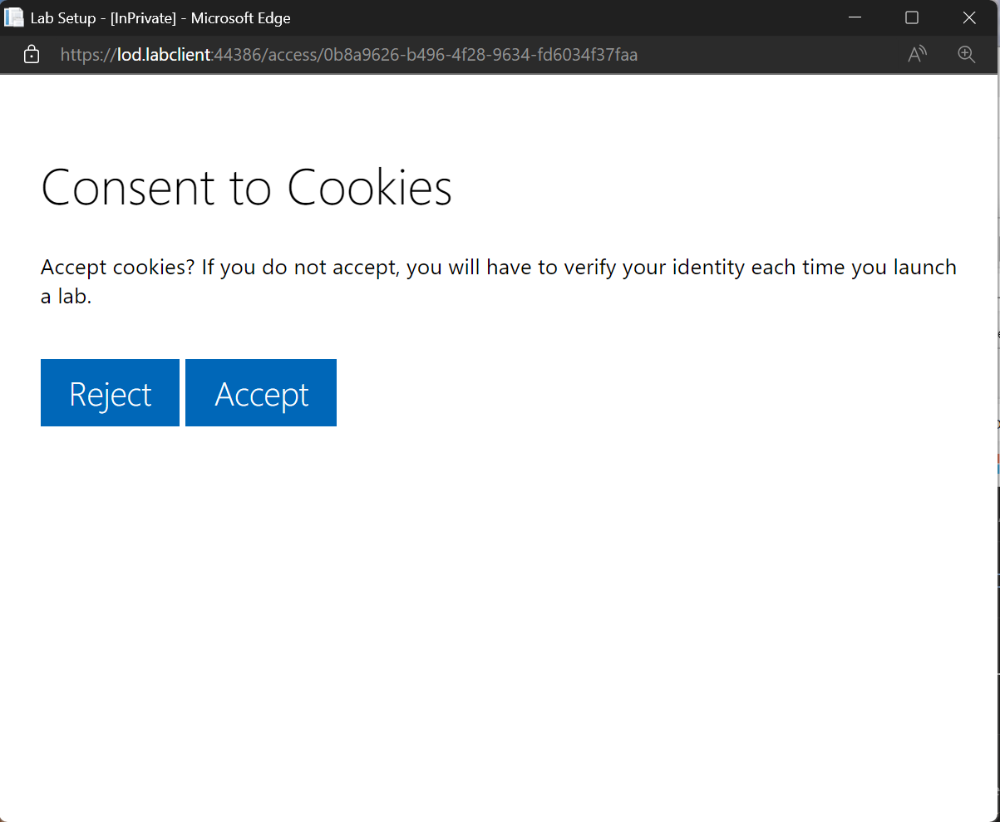
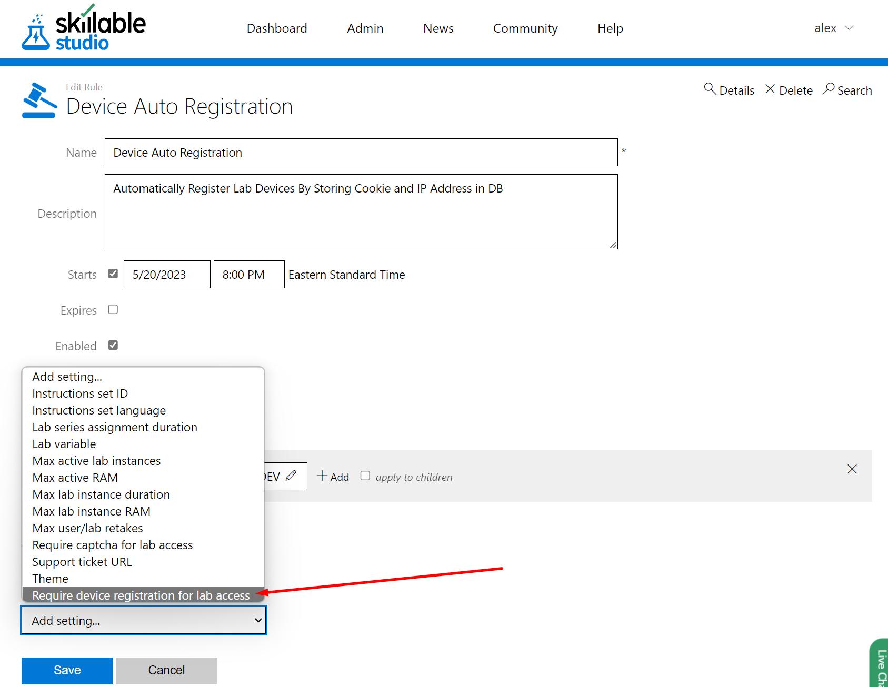

# Require Device Registration for Advanced Lab Access Security

Depending on your implementation and the approach you're using to secure lab access to your target audiences, the lab launch links you're surfacing to your users may be at risk. Not only could this result in the wrong people gaining access to labs on your dime, but if you're using cloud labs you may be opening yourself up to scenarios where bad actors use your labs to gain access to valuable cloud services at your expense. 

## Table of Contents

* [Introduction](#introduction)

* [How it Works](#how-it-works)

* [Device Registration on Initial Lab Launch](#device-registration-on-initial-lab-launch)

* [Prevent Account Sharing or Potential Hijacking](#prevent-account-sharing-or-potential-hijacking)

* [What Data We Store](#what-data-we-store)

* [FAQs](#faqs)

## Introduction

Device Registration is a rule that can be enabled in Skillable's Rules Engine. Depending on how it's configured, you can require your lab users to register their device or perform 2-factor authentication. The rule can be applied to your entire organization, or a subset of lab series or lab profiles.  

## How it Works

### Device Registration on Initial Lab Launch

When a user launches a lab for the first time, the following steps will occur:

* A cookie will be placed in their browser to register their device.
* Their device's IP address and location data will be securely saved in our database.

{600}

### Prevent Account Sharing or Potential Hijacking

With their device registered, any subsequent lab launches from the user's device and location will be seamless. In the event a bad actor attempts to launch a lab using the registered user's credentials, then 2-factor authentication via email verification will be required. 2-factor authentication will also be triggered if the user's location has moved roughly 50 miles from the location of their initial registration. 

* An email containing a verification link will be sent to the email address associated with the user account attempting to launch the lab.
* The verification link will need to be clicked before the lab will be accessible to the user. 

## What Data we Store

To efficiently manage device registration information, we store some user information in our database. We store the following details securely:

1. IP address: The IP address used during the initial lab launch.

2. Location data: Geolocation information associated with the user's IP address.

3. Cookie GUID: The unique identifier generated for the registered device.

##Configuration

Device Registration is enabled and configured in the Skillable Rules Engine. Here, an administrator can enable the rule and apply it to the entire organization, a lab series, lab profile, lab tag, API consumer, or specific customer.

Once enabled, all affected labs will require device registration or 2-factor authentication in order to access them. 

## FAQs

### What happens if a user clears their cookies?

If a user clears their browser cookies and attempts to launch a lab affected by the Device Registration rule, then they will be asked to consent to a new cookie placed in their browser, and if accepted, the cookie will be placed and they can continue their lab launch as normal. If cookies are rejected, then they will be required to perform 2-factor authentication via email verification before they can access the lab. 

### What if a user is using a VPN?

If a user accesses a lab using a VPN, then they will be required to perform 2-factor authentication via email verification each time they launch a lab. 

