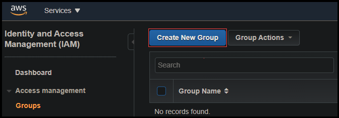
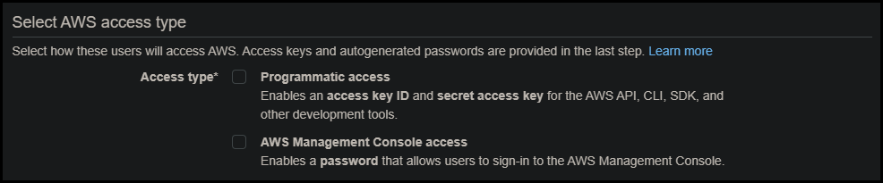
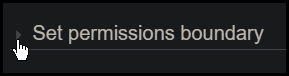

# AWS Permission Boundary 

Permission boundaries are needed in AWS labs where user accounts are created.
Following the principle of least privilege, the permissions boundary ensures that users you create have only the permissions they require to perform lab tasks.  

## Create a Group

IAM users belong to user groups and user groups are assigned policies. 

Create a group: 

1. In the AWS Management Console, go to IAM. 
1. From the IAM dashboard, click on **Groups** from the menu on the left. 
1. Click **Create New Group**. 

    {600}
1. For the **Group Name**, enter a name and then click on **Next Step**. 
1. Click on the **checkbox next to any policies** you wish to apply to the group and then click **Next Step**. 
1. Review the details of the group and click **Create Group**. 

If you need additional groups, repeat the steps above. 

## Create Users and Assign Them to their Respective Group

1. From the IAM dashboard, click on **Users** from the menu on the left.
1. Click Add User.
1. For the **User name**, enter a name for the user.
1. (**Optional**) If you would like additional users created, click **Add another user**. 
    1. For the 2nd User name, enter another name and click on Add another user.
    1. For the 3rd User name, enter another name.
1. Select the checkbox next to AWS Management Console access.

    {800}
1. Click Next: Permissions.
1. Click the checkbox next to the group created in previous steps.
1. Click on the arrow next to Set permissions boundary to expand the available selections.

    {400}
1. Select **Use a permissions boundary** to control the maximum user permissions.
1. In the search box, enter `LODS` and select the policy.
1. Click Next: Tags.
1. Click Next: Review.
1. Click Create User.

