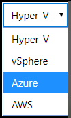

# Create an Azure Hosted Virtual Machine

1. [Overview](#overview)
1. [Azure Set Up](#azure-set-up)
    - [Create the Resource Group Where You Will Store VHDs](#Create-the-resource-group-where-you-will-store-vhds)
    - [Create a storage account inside the new resource group](#Create-a-storage-account-inside-the-new-resource-group)
    - [Uploading a VHD To Azure](#uploading-a-vhd-to-azure)
1. [Lab on Demand Set Up](#lab-on-demand-set-up)
    - [Basic Information](#basic-information)
    - [Hard Disks](#hard-disks)
        - [Map Storage Account in LOD](#map-storage-account-in-lod)
        - [Uploading a VHD to Azure](#uploading-a-vhd-to-azure)
    - [Network Adapters](#network-adapters)
    - [Internal Notes](#internal-notes)

## Overview

This document describes how to upload template virtual hard disks (VHDs) into a Microsoft Azure subscription.

Virtual machines (VM) can be hosted in Azure and used in Lab on Demand (LOD). The virtual hard disk for the VM is stored in an Azure storage account container, and is used by LOD when the lab is launched. 

## Azure Set Up 

To upload template VHDs into a Microsoft Azure subscription using the Microsoft Azure Portal, you must perform the following tasks:

- Create a resource group where you will store VHDs.
- Create a storage account inside of your resource group where template VHDs will be stored in a storage container.
- Create a container inside your storage account.
- Upload each template VHD you want available to your Cloud Slice labs.

### Create the Resource Group Where You Will Store VHDs

To create the resource group where you will store template and deployed virtual hard disks in your Microsoft Azure subscription, navigate to the [Microsoft Azure Portal](https://portal.azure.com), and then do the following:

1. Navigate to the **Resource Groups** section in the Azure portal.
1. Click on **+ Add**. This will open the Create Resource Group blade.
1. Enter a **resource group name** (e.g. cloud-slice-resources) into the Resource group name field. Save this name in a document because you will need it later on.
1. Select the region where you want the resource group to be created in the **Region** field.
1. Click the **Review + Create** button to create the resource group.

###  Create a Storage Account Inside the New Resource Group

Once you have created the resource group for your virtual hard disks, you need to create a storage account where those VHD files will actually be stored in a container. To accomplish this, you must do the following:

1. Navigate to the resource group you created in previous steps, if you are not there already. 
1. Click **+ Add** to add a resource to the resource group. 
1. Search for **Storage** and select the **Storage Accounts** service.
1. Click the **create** button to add a new storage account. This will open the Create storage account blade.
1. Select the **Resource group** drop-down and select the resource group you created in the previous task.
1. Enter a name for your storage account in the **Storage account name** field. This name must be globally unique, so it is a good idea to choose a name that is meaningful to you and that will be unique. Save this name in a document because you will need it later on.
1. Choose the region where you want to store your storage account from the list of regions available in the **Location** drop-down.
1. Click **Review + create** to create the storage account.

### Create Containers Inside of the Blob Service in Your Storage Account

Once you have created a resource group and a storage account within it, you need to create containers inside of the blob service in your storage account to store VHD files and host running virtual machine instances. This can be done from within the Microsoft Azure Portal, by following these steps:

1. Navigate to the storage account that you created in the previous task. This will open the storage account blade.
1. Click on the Containers service in the storage account blade. This will open the container service blade.
1. Click on the **+ container** button to create a new storage container.
1. In the Name field, enter the name that you would like to use for your storage container (e.g. template-vhds for the container for template virtual hard disks, or instance-vhds for the container for running virtual machine instances). Save the name in a document because you will need it later on.
1. Select **Blob** for the **Public access level**. 
1. Click on **OK** to create the container.
1. Repeat these steps to create a second storage container, this time for running virtual machine instances.

### Uploading a VHD To Azure

1. Navigate to the [Azure Portal](https://portal.azure.com) if you are not already at the Azure portal. 

1. Navigate to the storage account you are going to use to store VHD files and host running virtual machine instances. 

1. In the storage account, go to the container where the VHD files will uploaded (template VHD storage). 

1. Click the **upload** button near the top of the page. 

1. Click the **blue folder icon** and select the VHD file that you want to upload.

1. Click **Advanced**.

1. Select the drop-down menu for **Blob type** and change the blob type to **Page blob**.

    >[!alert] If the VHD is uploaded as a _Block Blob_ (default upload setting), the VHD will not be able to be used for a VM in a lab. The VHD must be uploaded as a page blob. 

1. Click the **Upload** button to upload the VHD to the container. 

1. After the VHD uploads, copy the VHD file name and save the name in a document because you will need it later on.

At this point, you should everything set up in Azure and are now ready to configure the VM profile in LOD and add the VM to a lab. 

---

## Lab on Demand Set Up

### Basic Information 

1. Navigate to the **Virtual Machine Profiles** tile, on the LOD Admin page.

1. Click **Create Virtual Machine Profile**. 

1. Select the drop-down menu for **Platform** and select **Azure**. 

    

1. Enter a **Name** for the virtual machine. This will be the display name of the VM.

1. Enter a **Description** for the VM. 

1. If you wish to associate the VM with a **Lab Series**, click **Choose** and select the series. 

1. Select the **Organization** that the VM will be available to. 

1. Select the Machine type. Machine types available correspond to Azure VM SKUs. For more information about Azure machine types, [read here](https://azure.microsoft.com/en-us/pricing/details/virtual-machines/series/).

1. Enter the **Operating System** the VM will use. 

1. Enter the **Username** to log in to the VM. 

1. Enter the **Password** to log in to the VM. 

1. Enter the **Screen Width**. 

1. Enter the **Screen Height**. 

1. Check the **Enabled** box to enable the VM for use. 

1. Check the **Enable Dynamic Screen Resizing** box to enable dynamic screen resizing. 

### Hard Disks

1. **Add a Hard Disk**: enter the name of the hard disk that the VM will use. 

The hard disk should be in **VHD** format and stored in an Azure storage account container. Ensure that hard disk name in the VM profile matches the VHD file name exactly as it appears in your storage account container in Azure. If the hard disk name in the VM profile doesn't match the file name in the Azure container, the VM will fail to launch. 

### Map Storage Account in LOD

The storage account where the VHD is stored needs to be mapped in the cloud subscription that is associated with the lab that will use the VM.

To map the storage account in the subscription:

1. Navigate to the **cloud subscription** in LOD. 

1. Click **Edit** next to the subscription that you want to map. 

1. Click the **Storage** tab of the _Edit Cloud Subscription_ dialog. 

1. Enter the name of each in LOD, to align with the containers in your Azure storage account.

    

    - **Template Storage Account**: Storage account name where template images (VHD files) are copied from during virtual machine deployment. 
 
    - **Template Storage Resource Group**: Resource group name containing the storage account used to copy template images (VHD files) from during virtual machine deployment. 

    - **Template Storage**: Storage container within template storage account used to host source template VHD files for virtual machine deployment. 

    - **Instance Storage Account**: Storage account name where template images (VHD files) are copied to during virtual machine deployment. 

    - **Instance Storage Resource Group**: Resource group name that contains the storage account used for running instance storage. 

    - **Instance Storage**: Storage container within the instance storage account used to host storage for running virtual machines. 

        >[!knowledge] These fields need to be configured for each subscription in the subscription pool. 

1. If you have not created containers in your Azure storage account container, review the [previous section to create containers](#Create-a-storage-account-inside-the-new-resource-group) in the storage account.

### Network Adapters

A network adapter is **required** for all Azure hosted VMs in order for the lab to connect to and display the VM. 

1. **Add Network Adapter**: Click to add a network adapter, and configure adapter settings.

    - **Specify ethernet (MAC) address**: Allows the MAC address to be set to a unique value, or generate a random MAC address.

    - **Is legacy adapter**: Allows the network adapter to operate as a legacy adapter without a Hardware ID.

### Internal Notes

This area is used to record notes, or additional information about the VM. This is useful if the VM has specific configurations, or if there are multiple users/authors that use the VM.
