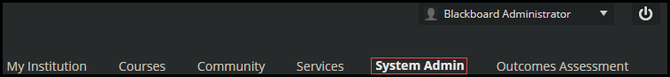
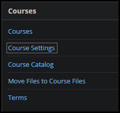
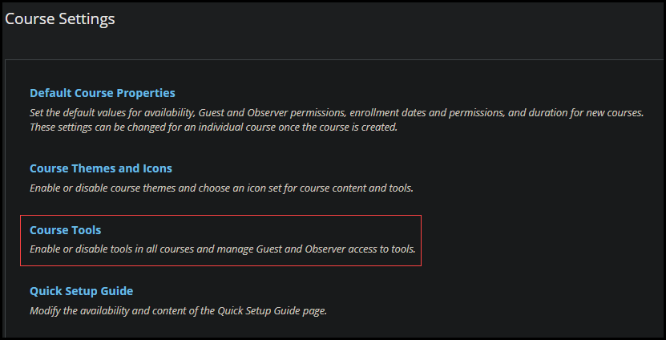
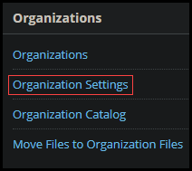
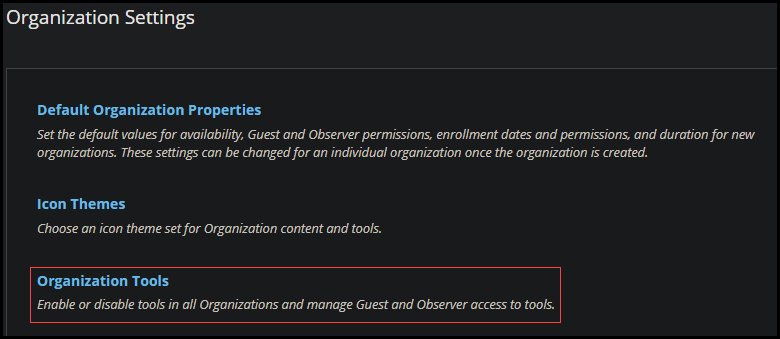
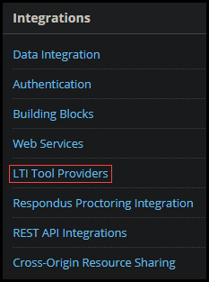
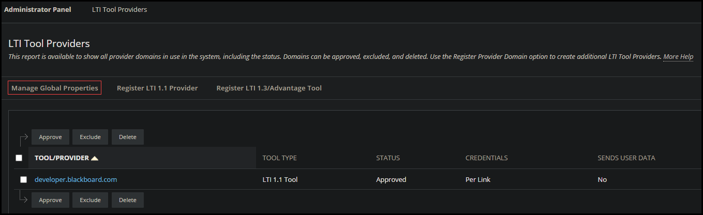
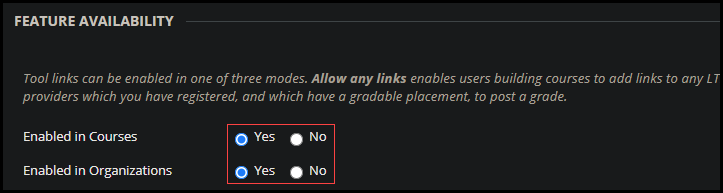
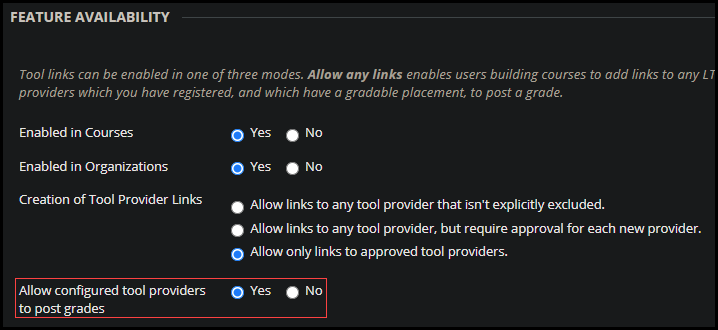

# Blackboard LTI Initialization

When configuring a new instance of Blackboard or using an instance of Blackboard that has not been used for LTI, you must configure the instance for LTI. This process only needs to be completed one time. 

- [Configuration](#configuration)
  - [Course Settings](#course-settings)
  - [Organization Settings](#organization-settings)
  - [LTI Tool Providers](#lti-tool-providers)

 ## Configuration

To configure your Blackboard instance for LTI use: 

1. **Log in** to your Blackboard instance **as an administrator**. 
1. Select **System Admin** in the upper-right corner of the page. 

    
    
Under the System Admin panel, there are two sections, Courses and Organization. LTI tool needs to be enabled for both.

### Course Settings    

1. Select **Course Settings** in the Courses section.

    

1. Select **Course Tools**

    

1. Toggle LTI ON

    

### Organization Settings

1. Select **System Admin** in the upper-right corner of the page.
1. Select **Organization Settings** in the Organizations section.

    

1. Select Organization Tools 

    

1. Select Toggle LTI ON

    

### LTI Tool Providers

1. Select **System Admin** in the upper-right corner of the page.
1. Select **LTI Tool Providers** in the Integrations section.

    

1. Select **Manage Global Properties**. 

    

1. **Enable** for **Courses** and **Organizations**. 

    

1. Select the option to **Allow configured tool providers to post grades**.

    

