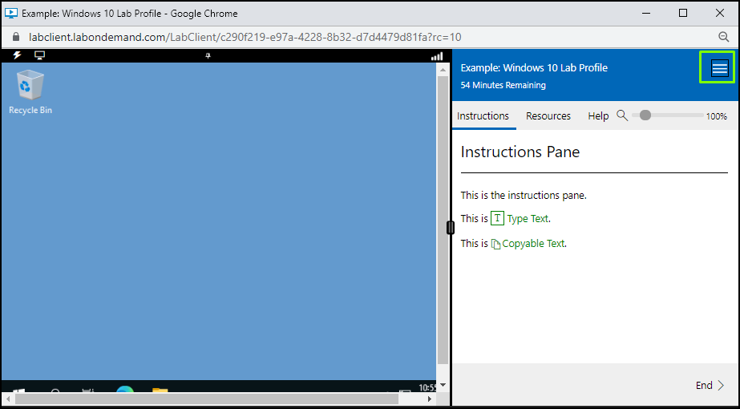
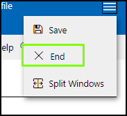

# Cancel a Running Lab

To cancel a running lab, perform the following steps: 

1. Select the **hamburger menu** in the upper-right corner of the lab instructions

    

>[!note] Due to the nature of labs being training environments some labs do not allow the direct option to be ended. If you do not have the "End" option in your lab menu please reach out to your training organization for assistance.

1. Select **End**.

    

    End Lab, Cancel lab, unable to launch lab

    

