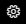
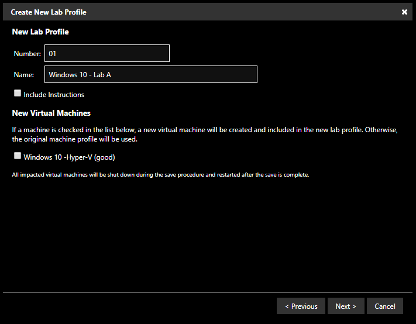
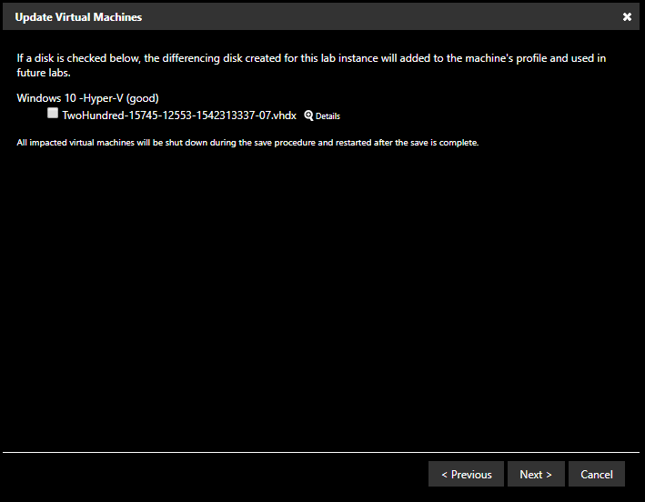
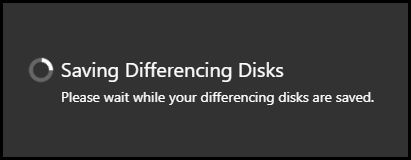

# Capture Differencing Disks

A differencing disk is a virtual hard disk (VHD) that contains changes made to another VHD. The purpose of a differencing disk is to maintain information about changes made, so that they can be revered if needed. Captured differencing disks are stored on the virtual machine (VM) profile.

Capturing differencing disks allows you to permanently persist changes you've made in your virtual machines. The changes will be present for all users that launch this lab in the future. This feature is only available to lab developers and shouldn't be mistaken as a way to temporarily save your lab. If you simply want to save your lab so you can resume it later, please use the Save and Close Lab option in the Exit menu.

## Differencing Disk Capture

To capture a differencing disk:

1. Navigate to the lab profile that uses the VM you want to capture a differencing disk for. 

1. Launch the lab

1. Log in to the VM and make any changes that you would like to persist for each lab instance of the lab. For example, software installations and/or configurations.

1. In the running lab, click the gear icon at the top of the screen and click _Differencing Disks_. {25X25} 

1. A dialog window will appear with two options:

    - **Create a new lab profile including my current differencing disks**: creates a new lab profile with an option to create new virtual machine(s), as well as an option to copy the instructions to the new lab profile.
    
    

    - **Update virtual machines in this lab profile with my current differencing disks**: updates the VMs used in the lab with changes saved during the differencing disk capture.
   
    

1. After selecting an option, click _Next_. 

1. The differencing disk will now begin to capture. 

    

>[!alert] All impacted virtual machines will be shut down during the save procedure and restarted after the save is complete.

<!--
## Differencing Disk Management 

Lab developers have options for managing differencing disks. They can delete, rename or move files associated with the differencing disks.

To manage differencing disk files:

1. From the LOD admin page, click **Manage Storage** on the Storage tile. 

1. Click [insert where to click here] and drill down to the disks and files you wish to manage. 

-->

## Best Practices and Recommendations 

### Reduce Capture Time and Disk Size

- Begin working with a VM that has no differencing disks captured already. 

- Make a checklist of all configuration items you need to accomplish, from installing the OS, to configuring all the software the lab will need to support. 

- Capture a complete configuration. Capturing a diff after every small change made in the lab is inefficient  (unless the only change needed is a small one).

    >[!knowledge] When capturing several differencing disks, this can cause the chain of disks to become very long. Long disk chains can impact I/O performance in the VM. It is recommended to have a maximum of 3 disks per chain, where possible. Capturing the first disk will result in one parent disk and a single child disk. 

- Don't leave the VM running for hours, and then capturing. This will increase the size of the disk and could affect VM performance. 

### Virtual Machine Optimization

- Ensure the base VM is optimized, to reduce the size of captured differencing disks. This can be done by completing as much configuration and/or changes as possible, before capturing the first differencing disk. 

- Optimizing your VM using Virtual Desktop Infrastructure (VDI) principles, guidelines, and tools will help improve the performance of your VM. There are many tools available, to assist in optimization. The most common VDI tools are:

    - [Citrix Optimizer](https://support.citrix.com/article/CTX224676?download)

    - [VMware OS Optimization Tool](https://labs.vmware.com/flings/vmware-os-optimization-tool)

- After installing the operating system and completing software configurations, you should consider using a second differencing disk capture for any files needed in the lab. If you need to add or remove these files later, you will be making changes to a much smaller disk. Additionally, this allows you to use the disk in different lab profiles that may need to use those lab files. 

- Manually shut down the VM before capturing a differencing disk.

    - When capturing a differencing disk, part of the automated process shuts down the VM before capturing the differencing disk. In some scenarios, a processes in Windows (such as Windows updates) could prevent a graceful shutdown of the VM, and cause the disk capture to time out. 

### Manual Captures

- In the rare event of errors during the differencing disk save process it is possible for us to capture the disks manually to update the lab data on the profile, should this happen please reach out to us via our normal Customer Support forms by opening a support ticket here: 

	- https://www.learnondemandsystems.com/customer-support/ 

- Following a manual capture it is necessary to end and relaunch the lab before any further differencing disk saves can be made the lab profile. Failing to do so will result in any further changes to the profile failing until it is relaunched.
