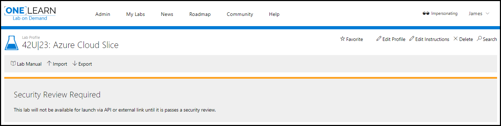
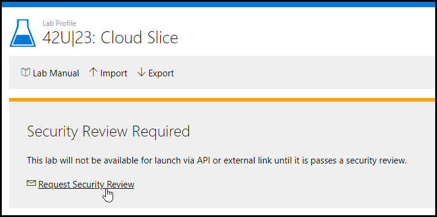
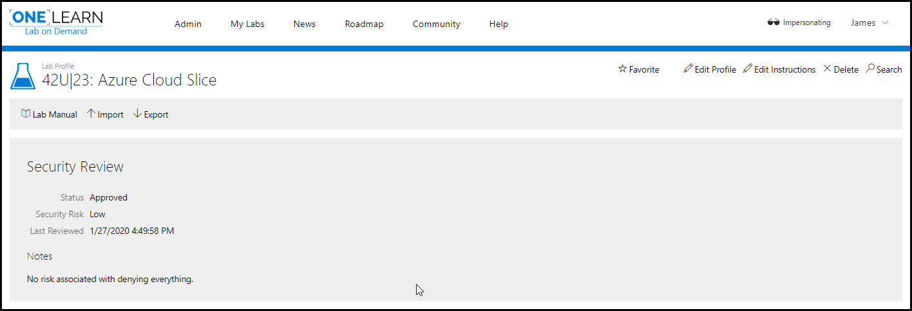
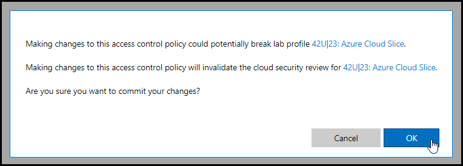
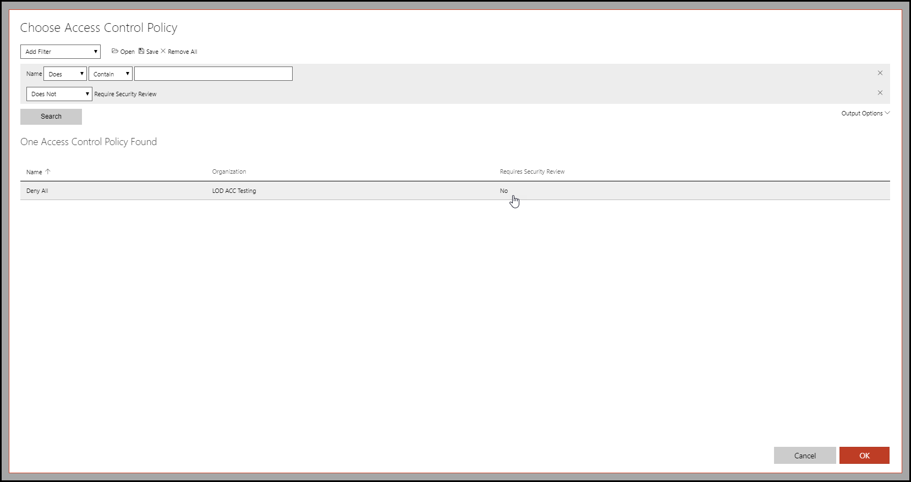

# Cloud Security Review
Lab profiles that use cloud orchestration are subject to a cloud security review. Until a review is completed, the lab cannot be launched via TMS, API, LTI, or other methods outside of the Labondemand interface.

## Which Labs Require a Security Review?

- <h3>AWS</h3>
    Anytime a student is required to build cloud resources in AWS, these resources will need to be explicitly allowed in an Access Control Policy. Once an Access Control Policy is added to the lab profile, a security review will be required.

- <h3>Azure</h3>
    When using Azure, lab profiles containing a resource group and a User account with Contributor or Owner roles will be required to undergo a security review.

## What is a Security Review?

Security reviews evaluate numerous components of cloud slice labs (such as Access Control Policies and Life Cycle Actions), including aspects like the publishing context (where is the lab going to be utilized). These reviews are designed to give the lab a rating of how vulnerable to potential abuse from malicious users it is and to ensure lab owners are aware of these vulnerabilities - aiding in reinforcing the lab if desired.

A lab owner will always be notified of the risk level a lab was evaluated at, whether it was approved for external consumption or not, and the reasons for these desicions upon them being made.

## How can I ensure ahead of time that my lab will pass a security review?

There may be changes to evaluation critera over time, however a living document can be be found [here](./cloud-slice/cloud-security-standards.md) which gives an idea to the major vulnerabilities looked for in security reviews.

## How to Request a Security Review

When creating or editing a lab profile that uses cloud orchestration, the lab profile will display a notice, showing that the lab requires a cloud security review.

Before marking the lab as complete, a security review may be requested, signaling that the lab and [Access Control Policy (ACP)](https://docs.learnondemandsystems.com/lod/create-a-restriction-policy.md) are ready for review. 

Once the review has been completed, the lab profile will show either approved or denied along with a note containing the reasoning. 
Once approved, the lab may be marked as complete and published.

If the lab profile is published before the security review is requested, a security review request will be entered automatically, but the lab will continue to be unavailable until the review is completed and approved.

You may request an additional cloud security review using the link next to the envelope icon in the Security Review area. This link will appear when the status is Pending, Expired, or Denied.

## Security Review Management and Revocation

A lab profile will need to undergo an additional security review if the underlying Access Control Policy(ACP) or Cloud Resource Template is changed or removed from the lab profile. A notification email will be sent to the owner's email address if configured on the lab profile. The lab will be unavailable to launch outside the Labondemand interface until the new security review is approved. When making a change that will impact lab profile(s), the following message will be displayed. 

## Alternatives to Security Review

 In lieu of a security review, lab authors may choose to use a preconfigured Access Control Policy. To find policies that have already been approved, use the filter _Does Not_ - _Require Security Review_. These policies will also show in search results when enabling the _No_ output option, under _Requires Security Review_.

If a student doesn't need to create any new resources after the lab is built, omitting the access control policy will allow the lab to be published and launched without undergoing a security review. To remove the ACP on Labs utilizing Azure, the user permissions must be set to reader.
