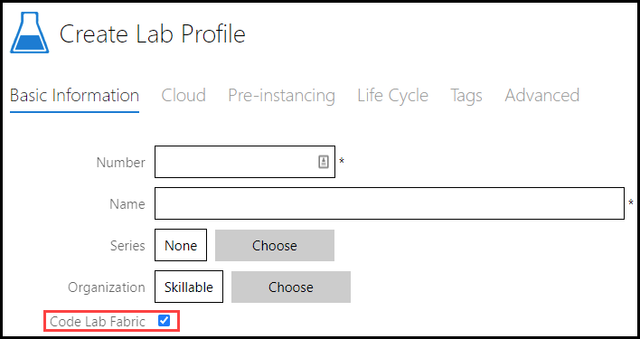
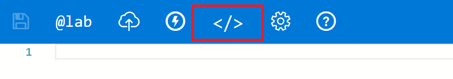
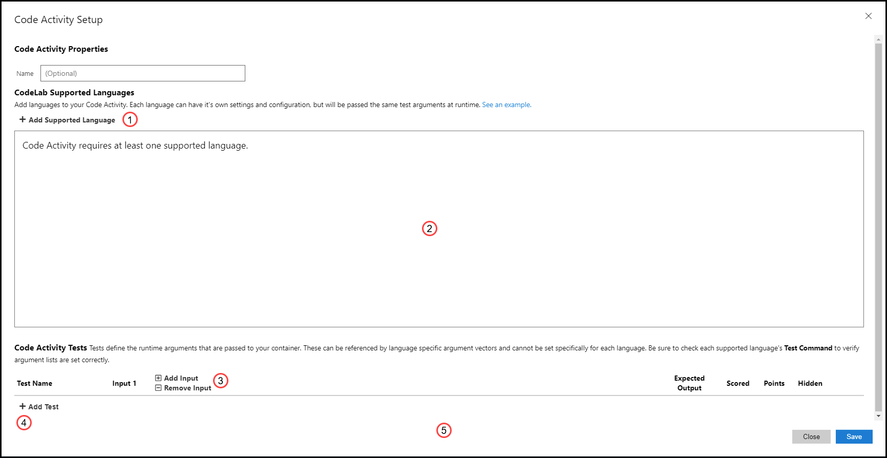
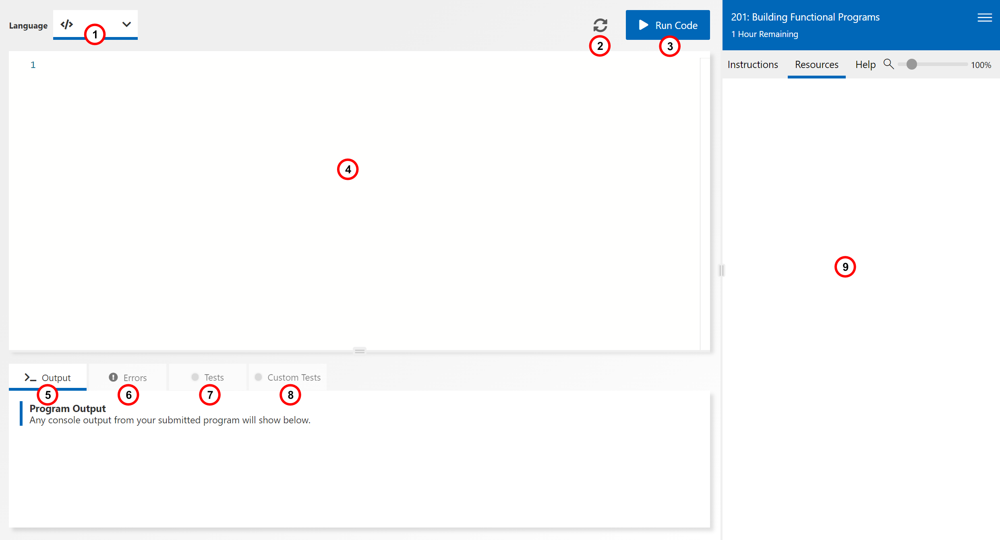
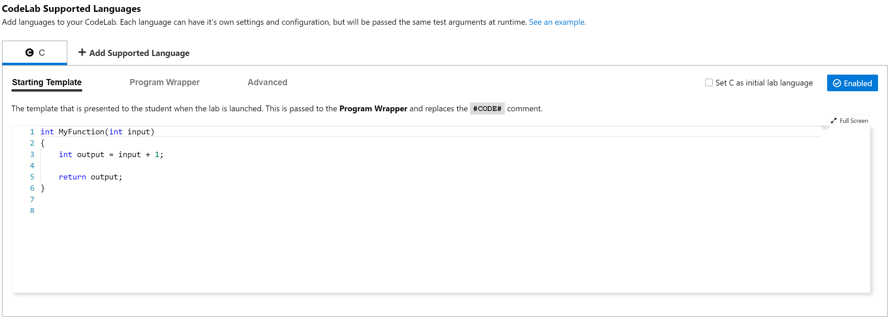
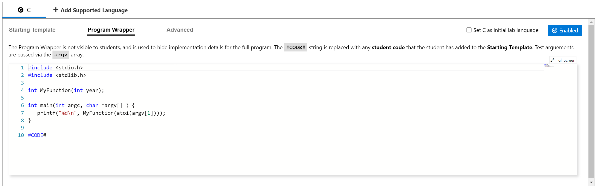
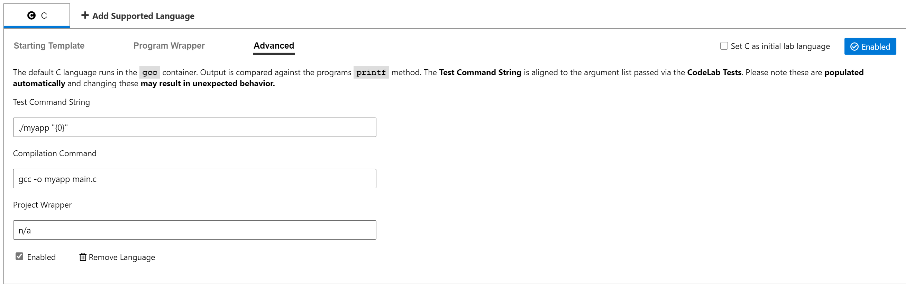
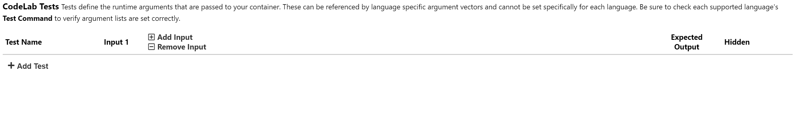
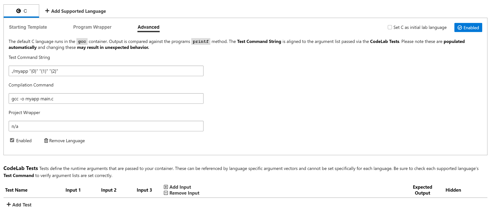
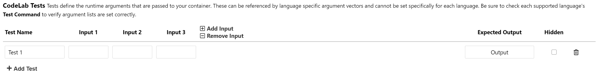

# Code Labs

Code Labs are a lab platform type with a code editor user interface (UI) in the lab client and a backend service calling docker containers to run code. The code is executed in a Code Container, which a language specific docker image with a compiler run time where the code is compiled and evaluated.

- [Starting a Code Lab](#Starting-a-Code-Lab)
- [Code Lab Settings](#Code-Lab-Settings)
- [Code Lab Client](#Code-Lab-Client)
- [Language Settings](#Language-Settings)
    - [Adding a supported language](#Adding-a-supported-language)
    - [Template](#Template)
    - [Program Wrapper](#Program-Wrapper)
    - [Advanced](#Advanced)
- [Tests](#Tests)
    - [Inputs](#Inputs)
    - [Adding Tests](#Adding-Tests)
- [Code Lab Scoring](#code-lab-scoring)
- [Example Code Lab](#Example-Code-Lab)

## Starting a Code Lab

{500}

To enable Code Labs in a Lab Profile, select the Code Lab Fabric checkbox in the initial Lab Profile creation.  This profile will now be set up for using Code Labs.


## Code Lab Settings 

With Code Labs enabled, you will now be able to edit the Code Lab settings by selecting the code icon in the Lab Instructions.

{300}

Selecting the Code Lab icon will launch the Code Labs Settings dialog.

{700}

The Code Lab Settings consist of 5 parts:
 1) Add supported languages to your Code Lab
 2) Manage settings for languages
 3) Add test inputs
 4) Add tests the will run in the Code Lab Client
 5) Manage Code Lab Tests

## Code Lab Client

{700}

The Code Lab client is the student facing side of Code Labs.  The Client is a simplified IDE where students can write their own code, add their own tests, and ultimately submit their code for scoring or testing.

The Code Lab Client consists of 9 parts:

1) The Code Language Selector - Used by the student to choose which language they prefer to use for the Code Lab.  These reflect the languages added to in the Code Lab Settings.
2) Reset - This will reset any student code to the original template set up in Code Lab Settings.
3) Submit - This will run any code entered by the student, and compare the result in Tests and Custom Tests
4) IDE - A simplified IDE.  This will populate with the initial Code Lab Language Template, and students can edit code in this area.
5) Output - All program output will show here.
6) Errors - Any program errors will show here.
7) Tests - All tests added in the Code Lab Settings will show here, and be evaluated on submit.
8) Custom Tests - Students have the ability to add custom tests to each Code Lab.  These will be evaluated on submit.
9) Instructions - Standard Lab Profile instructions.


## Language Settings

{700}

### Adding a Supported Language

A Code Language is a specific programming language. Code labs can have multiple supported languages, but all languages will take the same test inputs.

Once a Supported Language is added to the Code Lab, instructors will have 3 settings areas for adjusting settings.

Languages include:
- C
- C#
- Go
- Java
- PHP
- Python
- R
- Ruby
- Swift

### Template

The Starting Template is the initial code that is presented to a student when a lab is launched.  Usually a blank function, the student writes code inside this empty function template.  This code is then populated in the `#CODE#` area of the **Program Wrapper**.

### Program Wrapper

{700}

The Program Wrapper wraps the students code, and **must contain the string `#CODE#`** which is replaced by the student's code submission. This hides implementation details used to execute the function as part of a full program in the backend LOD service. The Program Wrapper can contains library includes, pass command line arguments to the student's function, and finally print results for comparison against **Tests** and **Custom Tests**.

### Advanced

{700}

- **Test Command String** - A command to run the created program. String.Format is used to replace arguments with test inputs. {0} is input 1, {1} is input 2, etc. The program is executed once per test.

- **Compilation Command** - For compiled languages only, this command is ran to compile source code into an executable.

- **Project Wrapper** - Extra project information as needed per language.


## Tests

{700}

Tests are added to Code Labs and ran once code is submitted from the Code Lab Client.  These can be used to help students as they progress through the lesson, and also to to verify student submissions.  Tests can be hidden from students to verify code functions as expected and is not simply brute-force passes.

{700}

### Inputs

It is important to note that adding an input in the test area **automatically adds an input to the Test Command String in Advanced Settings**.  Test inputs are passed to the program wrapper via argument vectors.  Each language notes the expected argument vector array that the program will use.

**Be sure to pass the correct number or argument vectors to your Program Wrapper and Starting Template**

To add and remove test inputs, simply select the corresponding button.

### Adding Tests

{700}

Simply click the **Add Test** button to add a test to your Code Lab.  You will now be able to give the test a friendly name, add inputs, and give the expected output.

Tests can be hidden from students to verify code functions as expected and is not simply brute-force passes.

## Code Lab Scoring

Code Labs can be scored via API. When scoring a Code lab via API, code must be submitted in the lab or the score returned will be 0.  

Scoring can be executed using the [ScoreActivities API command](https://docs.learnondemandsystems.com/lod/lod-api/lod-api-score-activities.md). 

After the lab has been scored, details about the lab including score results can be obtained using the [Details API command](https://docs.learnondemandsystems.com/lod/lod-api/lod-api-details.md).

# Example Code Lab

## Running the Default Lab

1. Create a new lab and enable the **Code Lab Fabric checkbox** on the Basic Information tab of the lab profile. This enables the Code Fabric button in the lab profile's Edit Instructions and the code editor in the lab client. 

1. Save the new profile.

1. Click Edit Instructions, then click the Code Fabric button `</>` at the top. This dialog contains all the code fabric specific configuration.

1. Click **Add Supported Language** to add the first language to your lab. 

    We will start with c, compiled using gcc:10.2.0. The dialog will contain working default templates for a very simple program that takes a single integer input and adds 1 to it. Look over these fields to get an idea of how your lab will work. 
   - If you want to run the default template, close the Add Code Language dialog now. Add a new test with working values like `TEST1, 1, 2`. 

1. Click Save and launch your lab. 

1. After the lab launches, click "Run Code" and your function will be evaluated, you should get a successful test run.

   >[!knowledge] Please note that this default setup has a completed function "MyFunction" in the Template field. When you create your lab MyFunction will be empty, and the code inside will be written by the student.

## Building Your Lab

1. Now we will start writing our lab. This example will be a Leap Year Calculator which outputs how many leap years have occurred since the given input year. 

1. Go to the menu in your running lab and click **Edit Instructions**, then click the Code Fabric button `</>`.

1. We will start with the Template. This is an empty function the student will see when they first launch their lab.
    
    ```
    int NumLeapYearsSince(int year) {
    }
    ```

1.  Next, we will look at Program Wrapper. The student doesn't see this code. This hides LOD implementation details, which turn a bare function into a working program. 

    > [!alert] Most importantly note the string #CODE# which is replaced by the student's code submission when it's time to compile.
    
    This lab uses the _time.h_ library, so we include it here. We also need to convert command line arguments into integers to pass into the students function, and then print the result of the function with print. This is used to run tests.   
    ```
    #include <stdio.h>
    #include <stdlib.h>
    #include <time.h>
    
    int NumLeapYearsSince(int year);
    
    int main(int argc, char *argv[] ) {
       printf("%d\n", NumLeapYearsSince(atoi(argv[1])));
    }
    
    #CODE#  
    ```

1. **Optional**: We don't need to change any advanced options for this lab, but if you wanted a function that accepted multiple inputs you would need to verify the test string, program wrapper, and template all have the correct argument vectors.


3. Create your tests. 
    - Test Name is for display purposes only. 
    - You can have a variable number of inputs and one output. 
    - The output is compared to what the program outputs to the command line after execution.

    | Test Name | Input 1 | Output |
    | ----------- | ----------- | ----------- |
    | TEST1 | 2000 | 6 |
    | TEST2 | 1600 | 103 |
    | TEST3 | 2020 | 1 |

4. Write instructions for your lab. If you have instructions that are specific to one language, you can use the codeLanguage variable like `:::sectionName(codeLanguage=c)` - this section will only be shown when the specified language is selected. 
    - This example has copyable lines that the student can paste into the code editor where they want.
    - The second page has typetext which when clicked will replace everything in the code editor with a completed, working version of the code.

    ^[Example Leap Year Instructions - Click to expand!](code-lab-example.txt)

1. Return to your running lab and refresh. You will now see your instructions and an empty function. You can submit the code now and observe failed tests and a compilation error - "your function has no return value". 

1. Go to the second page of instructions and insert the solution. 

1. Submit the Code and you will see the results of the tests you created before. Success! 

Congratulations, you've created your first code lab!
