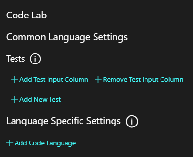
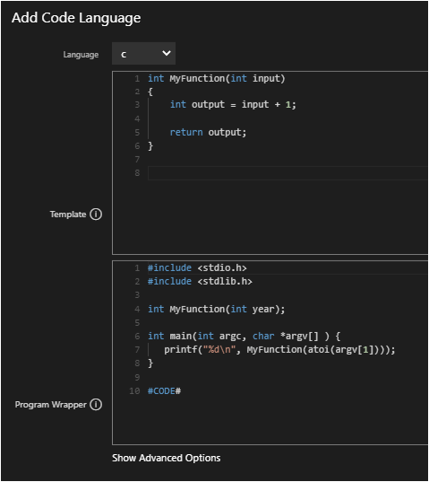
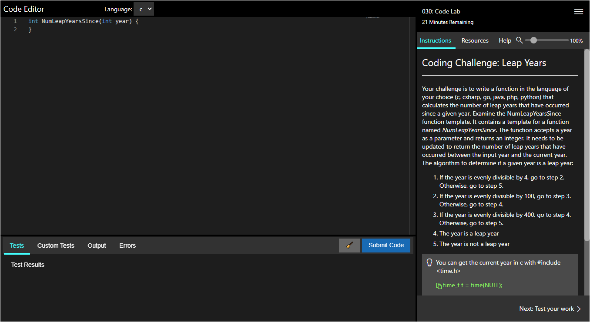

# Code Labs

Code Labs are a lab platform type with a code editor user interface (UI) in the lab client and a backend service calling docker containers to run code. The code is executed in a Code Container, which a language specific docker image with a compiler run time where the code is compiled and evaluated.

- [Code Lab Dialog](#code-lab-dialog)
    - [Common Language Settings](#common-language-settings)
    - [Language Specific Settings](#language-specific-settings)
- [Code Language Dialog](#code-language-dialog)
    - [Add Code Language](#add-code-language)
    - [Advanced Options](#show-advanced-options)
- [Building Your First Code Lab](#building-your-first-code-lab)
    - [Running the Default Lab](#running-the-default-lab)
    - [Building Your Lab](#building-your-lab)
    - [Code Editor in a Launched Lab](#code-editor-in-a-launched-lab)

## Code Lab Dialog

The </> button in Edit Instructions of your lab profile will open the Code Fabric settings. 



### Common Language Settings

Used to test the student's code submission. Inputs are passed in on the command line, and the output of the program is compared to the expected output. If they match, the test passes. Each test is a separate run of the program.

- **Add Test Input Column**: adds an additional input to the code test.
- **Remove Test Input Column**: removes inputs in the order that they were added.
- **Add New Test**: adds a new code test.

### Language Specific Settings

A Code Language is a specific programming language. Code labs can have multiple languages, each language has pieces which need to be defined by the lab author; configuration and templates that are unique for each programming language. Each set is functionally the same, but translated to a different language.

- **Add Code language**: adds a code language.  Clicking this button will open the [Code Language Dialog](#code-language-dialog).

## Code Language Dialog



### Add Code Language 

- **Language**: select the language that you wish to use.

- **Template**: presented to the student when the lab is launched. Usually a blank function, the student writes code inside this empty function template.

- **Program Wrapper**: wraps the students code, **must contain the string `#CODE#`** which is replaced by the student's code submission. Hides implementation details used to execute the function as part of a full program in the backend LOD service. Contains library includes, passing command line arguments to the student's function, and printing output back to console for testing.

### Show Advanced Options

- **Test Command String**: a command to run the created program. String.Format is used to replace arguments with test inputs. {0} is input 1, {1} is input 2, etc. The program is executed once per test.

- **Compilation Command**: for compiled languages only, this command is ran to compile source code into an executable.

- **Project Wrapper**: extra project information.

# Building Your First Code Lab

## Running the Default Lab

1. Create a new lab and enable the **Code Lab Fabric checkbox** on the Basic Information tab of the lab profile. This enables the Code Fabric button in the lab profile's Edit Instructions and the code editor in the lab client. 

1. Save the new profile.

1. Click Edit Instructions, then click the Code Fabric button `</>` at the top. This dialog contains all the code fabric specific configuration.

1. Click **Add Code Language** to add the first language to your lab. 

    We will start with c, compiled using gcc:10.2.0. The dialog will contain working default templates for a very simple program that takes a single integer input and adds 1 to it. Look over these fields to get an idea of how your lab will work. 
   - If you want to run the default template, close the Add Code Language dialog now. Add a new test with working values like `TEST1, 1, 2`. 

1. Click Save and launch your lab. 

1. After the lab launches, click "Submit Code" and your function will be evaluated, you should get a successful test run.

   >[!knowledge] Please note that this default setup has a completed function "MyFunction" in the Template field. When you create your lab MyFunction will be empty, and the code inside will be written by the student.


## Building Your Lab

1. Now we will start writing our lab. This example will be a Leap Year Calculator which outputs how many leap years have occurred since the given input year. 

1. Go to the menu in your running lab and click **Edit Instructions**, then click the Code Fabric button `</>`.

1. Edit the language definition by clicking the pencil next to **Language** c.

1. We will start with the Template. This is an empty function the student will see when they first launch their lab.
    
    ```
    int NumLeapYearsSince(int year) {
    }
    ```

1.  Next, we will look at Program Wrapper. The student doesn't see this code. This hides LOD implementation details, which turn a bare function into a working program. 

    > [!alert] Most importantly note the string #CODE# which is replaced by the student's code submission when it's time to compile.
    
    This lab uses the _time.h_ library, so we include it here. We also need to convert command line arguments into integers to pass into the students function, and then print the result of the function with printf. This is used to run tests.   
    ```
    #include <stdio.h>
    #include <stdlib.h>
    #include <time.h>
    
    int NumLeapYearsSince(int year);
    
    int main(int argc, char *argv[] ) {
       printf("%d\n", NumLeapYearsSince(atoi(argv[1])));
    }
    
    #CODE#  
    ```

1. **Optional**: We don't need to change any advanced options for this lab, but if you wanted a function that accepted multiple inputs you would need to change the Test Command String. The test command uses _String.Format_ to run tests. IE a test with 2 inputs would be "./myapp {0} {1}".

1. Click Close to return to the previous dialog.

3. Create your tests. 
    - Test Name is for display purposes only. 
    - You can have a variable number of inputs and one output. 
    - The output is compared to what the program outputs to the command line after execution.

    | Test Name | Input 1 | Output |
    | ----------- | ----------- | ----------- |
    | TEST1 | 2000 | 6 |
    | TEST2 | 1600 | 103 |
    | TEST3 | 2020 | 1 |

4. Write instructions for your lab. If you have instructions that are specific to one language, you can use the codeLanguage variable like `:::sectionName(codeLanguage=c)` - this section will only be shown when the specified language is selected. 
    - This example has copyable lines that the student can paste into the code editor where they want.
    - The second page has typetext which when clicked will replace everything in the code editor with a completed, working version of the code.

    ^[Example Leap Year Instructions - Click to expand!](code-lab-example.txt)

1. Return to your running lab and refresh. You will now see your instructions and an empty function. You can submit the code now and observe failed tests and a compilation error - "your function has no return value". 

1. Go to the second page of instructions and insert the solution. 

1. Submit the Code and you will see the results of the tests you created before. Success! 

Congratulations, you've created your first code lab!

## Code Editor in a Launched Lab

When the lab is launched, the lab user will see a code editor on the left and instructions on the right. Under the Code Editor, there are multiple sections to show Tests, Custom Tests, Output and Errors. There is also buttons to reset the code and submit the code. 



- **Language**: select the language to use. This drop-down list will be populated with languages based on the language specific settings that were configured during lab authoring. 

- **Tests**: after the student submits their code, this will display the results of the tests that were configured during lab authoring. 

- **Custom Tests**: create custom unit tests. After clicking _Custom Tests_, click _Edit Tests_. The next screen will allow you to configure custom unit tests. Unit Tests are configured with 1 input and 1 output. 

- **Output**: this will display the output of the program's code. This displays the input, expected output, the actual output and if the code is correct or incorrect. 

- **Errors**: this will display any errors that occur as a result of the code written in the code editor. 

- **Score**: after code is submitted, a score will be displayed based on the code that was submitted compared to the test that was configured. 

- **Reset Code**: If the lab user entered any code, this will remove it and reset the code back to the template code that was configured during lab authoring. 

- **Submit Code**: submits the code for evaluation against the tests configured. 

