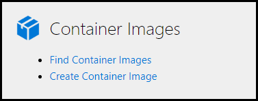
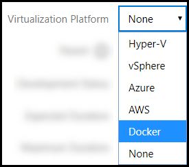

# Container Images

Lab on Demand supports using Docker Container Images in labs. Container images are imported from Docker Hub.

[Check out our video guide for creating Container Images](https://lods.one/containerimagesvideo).

## Create a Container Image in LOD

1. From the LOD Admin page, click **Create Container Image**. 

    

1. Populate the following fields:

    - **Name**: The name of the container image on [Docker Hub](https://hub.docker.com/). The container image name needs to match the name exactly how it appears in Docker Hub. The container image will be imported from Docker Hub, based on the name. 

        > [!KNOWLEDGE] For labs it is recommented that you use a version-specific tag (signified by a colon separator). This helps ensure that the same container image will be used over time. If you do not use a tag, the "latest" tag will be used automatically. This is useful if you intend to always use the latest version of the container, but runs a higher risk of getting out of sync with your lab's instructions and content. 
        >
        > To find tags that are available for the container image you are using, look at the container image page in [Docker Hub](https://hub.docker.com/). It will list any available tags. 
        >
        > It is also possible to specify an image by using a digest. This guarantees that you will use the specified image version. The format for using a digest is `image@sha256:digest`.    

    - **Description**: Add description of the container image or how the image will be used in a lab. 

    - **Organization**: Select the organization that will have permission to edit and use the container image. 

    - **Memory Limit**: Select the maximum amount of memory that the container image will use. 

    - **Command**: Enter any commands that the container needs to function. If no commands are need, simply leave `bash` in the field. 

    - **Environment Variables**: Variables can be set for items such as configuration settings, encryption keys, and external resource addresses. For more information about environment variables, read [Define Environment Variables](https://docs.docker.com/compose/environment-variables/).

    - **Exposed Ports**: The port(s) that will be exposed on the container. Enter on port value per line. Each exposed port will be dynamically  mapped to an external port on the lab host server when the lab is deployed. The external addresses for exposed ports can be obtained in your labs via @lab tokens. 

        For example, an exposed port of 5000 might be referenced as: `@lab.Container(alias).ExposedPort(exposedPortValue).Address`.

        Please note that the external port will most likely **not** be the same as the container's exposed port. The external port is 100% dynamic and not something that can be directly controlled. 

    - **Enabled**: Check the box to enable the container image. 

## Lab Profile Configuration

Container images are configured on lab profiles on the Basic information tab, by selecting Docker as the virtualization platform. 

To configure a container image on a lab profile:

1. Navigate to the lab profile. 

1. On the basic information tab, select Docker as the virtualization platform. 

    

1. After Docker is selected, a new tab will appear for containers. Click the Container tab to continue. 

1. Click **Add Container Image**. 

1. Use the search to find the container image you want to use and click **OK**. 

1. Configure the following options:

    - **Display Name**: The display name of the container image. This is how the container will be displayed in the lab to the student. 

    - **Replacement Token Alias**: The alias that can be used in @lab replacement tokens to target the container image. 

    - **Visible to student**: Allows the container image to be visible to the student. 

    - **Default selection**: Set the lab to focus on the container as the default selection when the lab launches.  

