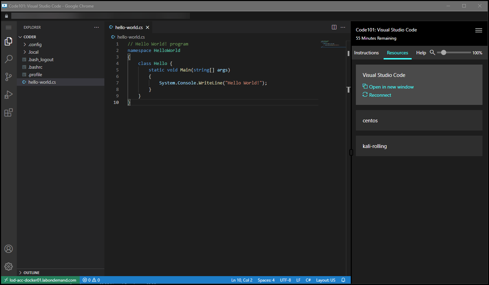
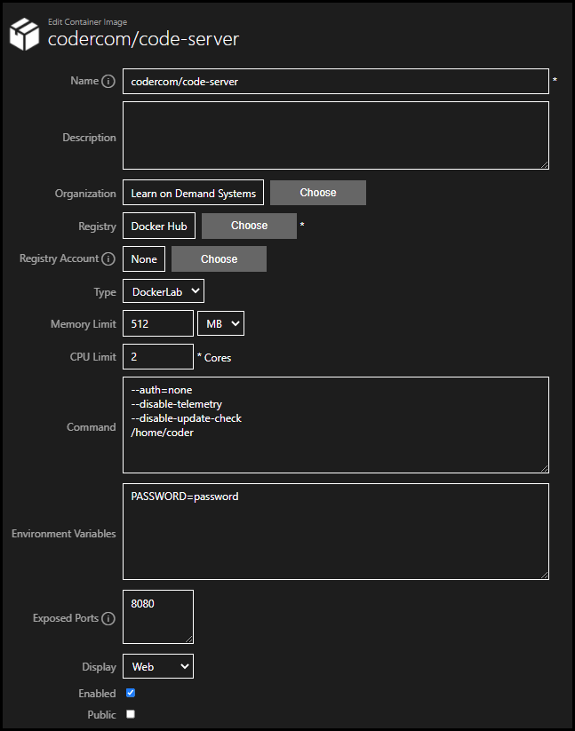

# Container Web Display 

In Lab on Demand (LOD), containers can be configured to expose specific ports. Each exposed port will be dynamically mapped to an external port on the lab host server when the lab is deployed. 

Selecting the Web Display option for the exposed port will allow the container to output through the exposed port and display in a web browser. 

>[!note] Web display of exposed container ports may not work with all container images. The author of the container image must enable port output support in the container image for this to work correctly. 

## Configuring a Container Profile for Web Display 

1. **Navigate to the container** you wish to output the display, or create a new container. 

1. Select **Edit** on the container profile. 

1. Enter any **Commands** that the container will need. Commands may be needed for your container to perform a specific way, or output on an exposed port. Consult the documentation for the author or publisher of your container image for more information. 

1. Enter any **Environment Variables** that the container will need. 

1. Enter the port to expose and output the container display to. The port entered should be the port that the container author suggests using for display output. 

1. Select **Web** on the **Display** option. 

1. **Save** the container profile. 

## Example Configuration

This example configuration uses the [Visual Studio Code in the browser](https://hub.docker.com/r/codercom/code-server) to output Visual Studio Code to port 8080 and display in a web browser.

{800}

1. **Create** a new **container profile**. 

1. In the **Name** field, enter `codercom/code-server`.

1. Select the **Registry** that the container image will use. If you do not have a container registry, choose **Docker Hub**.

1. In the **Commands** field, enter the following commands. Each command should be on a separate line. 

    - `--auth=none`
    - `--disable-telemetry`
    - `--disable-update-check`
    - `/home/coder`

1. Enter the following environmental variables. If there were multiple environment variables, they would need to each be on a separate line. 

    - `PASSWORD=password`

1. Enter the following exposed port: 

    - `8080`

1. Select **Web** on the **Display** option. 

1. Verify your container matches the image below and then select **Save** to save the container image. 

600}

## Related Information 

- [Container Registries](container-registries.md)

- [Containers Images](container-images.md)