# Convert a Generation 1 Hyper-V Virtual Machine to Generation 2

## Table of Conents

- [Capture Disk Changes](#capture-disk-changes)
- [Create New Virtual Machine Profile](#create-new-virtual-machine-profile)
  - [Basic Information](#basic-information)
  - [Hard Disks](#hard-disks)
    - [Add Differencing Disks](#add-differencing-disks)
  - [SCSI Adapters](#scsi-adapters)
- [Attach New VM Profle to a Lab Profile](#attach-new-vm-profle-to-a-lab-profile)

## Capture Disk Changes

1. Launch the lab profile that contains the virtual machine (VM) that you would like to convert from Generation 1 to Generation 2.
1. Log in to the VM. 
1. Right click on the **Start button**, and select **PowerShell (Admin)**.
1. Enter the following command and wait for it to finish 

    > ```PowerShell
    > mbr2gpt.exe /convert /allowFullOS
    > ```

    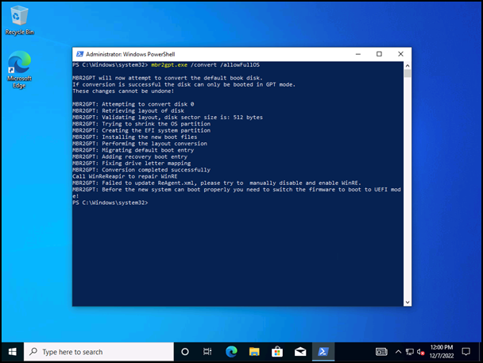

1. Once the command has finished, select the **Menu Icon** in the top right corner of the lab’s window.
1. Select **Save**.

    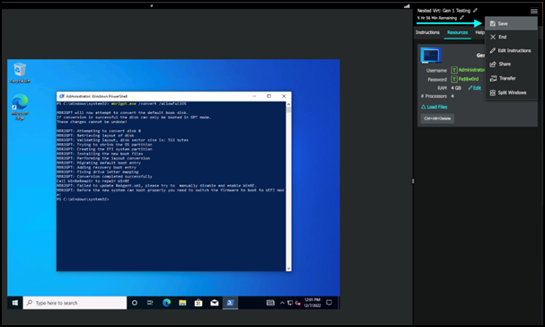

1. Select **Commit my changes and update this lab profile**, and then select **Next**.

    {600}

1. In the Update Lab Profile window: 
    1. Check the box to **Capture disk changes**.
    1. **Enter a note** to describe the changes that you are making to the **lab profile**.
    1. **Select the disk** you want to make the changes to.
    1. **Enter another note** to describe the changes you are making to the **VM Profile**.
    1. choose your storage location (Use Current is default).
    1. select **OK**.

    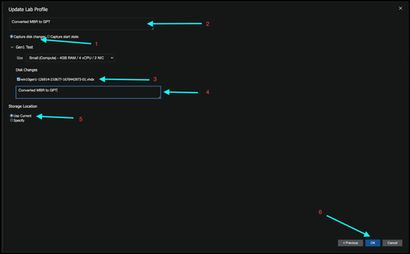

## Create New Virtual Machine Profile 

### Basic Information

1. Once the save has finished, navigate back to the Skillable Studio Site Administration page (Your layout may differ). 

1. In the Virtual Machines section, select **Create Virtual Machine**

    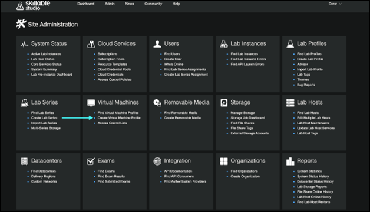

1. On the **Basic Information tab** of the Create Virtual Machine Profile page:
    1. Enter a **Name** for the VM. 
    1. On the Generation field, select Generation 2, and then specify any other settings you may want enabled.
    1. Select the Hard Disks tab.

    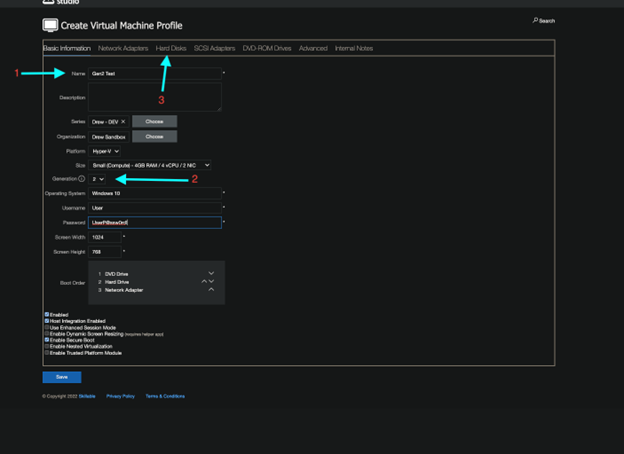

### Hard Disks

On the Hard Disks tab of the Create Virtual Machine Profile page: 
1. Select **+ Add Hard Disk**. 
1. Navigate to the **directory where the vhdx files are** for this VM.
1. Add the **Base Disk**. 
 
>[!Knowledge] This will be the disk that contains the original file name **without** a hyphen followed by trailing numbers and additional hyphens before the _.vhdx_ filetype extension.

 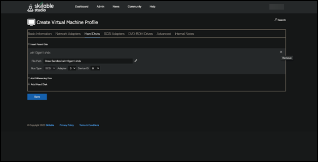

#### Add Differencing Disks 

Next, add each differencing disk one at a time, in sequential order (starting from the disk ending in _-01.vhdx_ to the largest) attached to this base disk. 

1. Select **+ Add Disk**. 
1. Add the first disk. 
1. Repeat the previous step, and add each disk, one at a time, in sequential order. 

The last differencing disk will be the save you captured after running the `mbr2gpt` command, in previous steps.

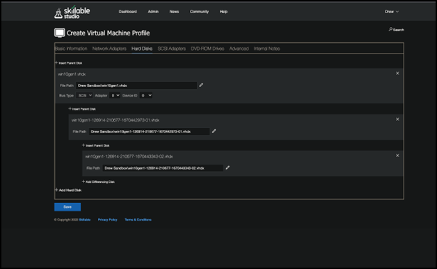

### SCSI Adapters

1. Select the SCSI tab to **ensure that a SCSI adapter is attached to the VM**. If an adapter is attached, select **+Add SCSI Adapter** to add one.
1. Select **Save**, and **enter a note** to describe the changes that you are making to the **VM profile**.

    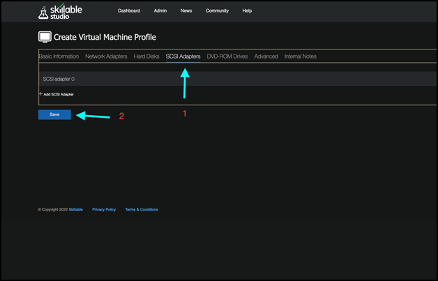

## Attach New VM Profle to a Lab Profile

1. Navigate to the Lab Profile you would like to attach your new Gen 2 Hyper-V VM to. 
1. Select the **Edit Settings link** on the top right corner of the page. 

In the Edit Lab Profile settings page:

 1. Navigate to the **Virtual Machines tab**.
 1. **(Optional)** Select the _X_ in the top right corner of the VM's card to remove unwanted VM(s).
 1. Select **+ Add Virtual Machines** in the bottom left corner.

    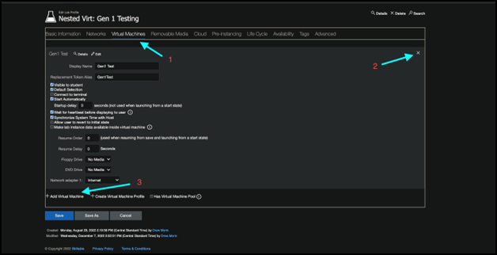

1. Search for the **Generation 2 VM you created in previous steps** and add it to the Lab Profile. 

1. Select Save and leave a note to describe the changes that you are making to the **Lab Profile**.

    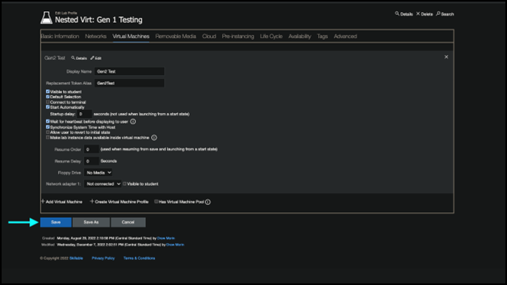

    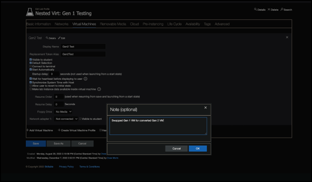

You will now be able to launch the lab containing a Generation 2 Hyper-V VM.
