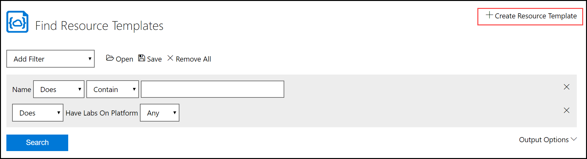

# Create a Resource Template and Configure it into a Resource Group

In the OneLearn Lab on Demand platform (LOD), a Resource Group contains resource templates, restriction policies, and portal user permissions. This document covers creating a Resource template and configuring it into a Resource Group. If you have not created a Restriction Policy or would like to create one, see our guide on [creating a Restriction Policy](create-a-restriction-policy.md). 

## Creating a Resource Template 

To create your first Resource Template in LOD, you must perform the following tasks:

1. Navigate to the Lab on Demand Administration page.

1. Click Cloud Resource Templates on the Cloud Services tile.

1. Click Create Resource Template in the upper-right corner of the page.

    

1. Enter the following values into the Create a Resource Template form:

    |Tab|Field Name|Field Value|
    |--|--|--|
    |**Basic Information**|**Name**|A name of your choosing.|
    ||**Description**|Describe the intentions and goals of the Resource Template.|
    ||**Organizaton**|Select the organization that the Resource Template will be available to.|
    ||**Enabled**|Check the box to enable this Resource Template for use.|
    ||**Template URL**|(optional) Enter the URL where a resource template is stored.|
    ||**Template**|Enter the JSON syntax for the resource template.|

1. Once you have completed the form, click **save**. 

## Configuring a Resource Group

1. Navigate to the lab profile that you wish to configure a Resource Group to.

    >[!knowledge] You can search for your lab profile by doing the following:
    >
    >1. Return to the Lab on Demand Administration page.
    >
    >1. Click Find Lab Profiles to find your lab profile.
    >
    >1. Enter the name of the lab profile into the **Name** field, and change the operator drop down adjacent to it to **Equal**. 
    >
    >1. Click **Search** to find your lab profile.
    >
    >1. In the search results, click the Name of your lab profile to open the Lab Profile details view.

1. Click **Edit Profile** to open the edit view for your lab profile.

1. Select the **Cloud** tab.

1. Scroll down to _Cloud Resource Groups_, then click **Add Resource Group**.

1. Click **Add Resource Template**. 

1. Enter the name of the Resource Template you wish to use. 

1. Click **Search**. 

1. Select your Cloud Resource Template in the list of results, then click **OK**.

    > [!KNOWLEDGE] When you add a Cloud Resource Template to a Cloud Resource Group in a lab profile, if that template has any required parameters, you will automatically be prompted to provide values for those parameters. 

1. Check or uncheck the **Deploy in Background** checkbox.

    > [!KNOWLEDGE] When you do not mark a Cloud Resource Template as deploy in background, the lab will not be available to the student once launched until the resources defined in the Cloud Resource Template are fully provisioned. If your lab provisions resources that are not required at the beginning of the lab, you may want to check this checkbox so that the lab launches more quickly,allowing students to start working in the lab even while resources are being provisioned.

1. If you would like to add a Restriction Policy to the lab profile, click **Add Restriction Policy**. 

1. Enter the name of the Restriction Policy you wish to use. 

1. Click **Search**. 

1. Select your Cloud Resource Template in the list of results, then click **OK**.

1. Click **Save** to save the updated lab profile. 

[Back to top](#create-a-resource-template-and-configure-it-into-a-resource-group)
