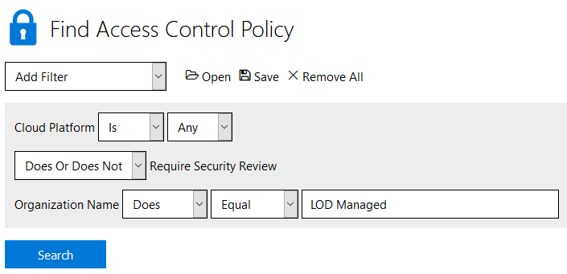

# Access Control Policies (ACP)

An Access Control Policy is used by a cloud provider to limit the resources that can be provisioned within the resource group. This prevents additional cloud costs by preventing users from creating resources that are not relevant to the content and/or outside the scope of the lab.

>[!Note] In LOD, ACPs are attached to a resource group. To add an ACP to a Lab Profile, you will need to [create a resource template and configure a resource group](./create-a-resource-template-and-configure-it-into-a-resource-group.md) first. 

## Finding an Existing ACP

LOD has a library of existing ACPs to make building common cloud labs easier and more secure. To find publicly accessible ACPs:

1. From the **Admin** page, in the **Cloud Services** tile, select **Access Control Policies**.
2. Add the filter **Organization Name**, select **Does** **Equal**, and enter **LOD Managed**
3. You can narrow your search further by filtering for the desired **Cloud Platform** and whether or not the ACP requires a Security Review:



> [!Note] These ACPs are created, maintained, and publicly available by LODS to all developers. While the resouces allowed on these ACPs will not change, the syntax is subject to change depending on cloud security best practices.

You can also search your own Organization's existing ACPs by following the same process and changing the **Organization** filter to your desired Organization. 

## Creating an Access Control Policy in Lab on Demand (LOD)

1. Navigate to the **Cloud Services** tile, on the LOD Admin page.

1. Click **Access Control Policies**.

1. Click **Create Access Control Policy** in the upper-right corner of the page. 

   

1. Enter the following values into the Create an Access Control Policy form:

    |Tab|Field Name|Field Value|
    |--|--|--|
    |**Basic Information**|**Name**|A name of your choosing.|
    ||**Description**|Describe the intentions and goals of the Access Control Policy .|
    ||**Organizaton**|Select the organization that the Access Control Policy  will be available to.|
    ||**Access Control Policy**|Enter the Access Control Policy  here, in JSON format.|
    ||**Enabled**|Check the box to enable this Access Control Policy  for use.|

## ACP Examples

### Azure

By default, Azure allows all resources to be provisioned, unless they denied by an access control policy. 

This example policy below will deny any resources from being provisioned unless it is a "standard_DS3_v2" virtual machine:

```linenums
{
    "if": {
        "allOf": [
            {
                "field": "type",
                "equals": "Microsoft.Compute/virtualMachines"
            },
            {
                "not": {
                    "field": "Microsoft.Compute/virtualMachines/sku.name",
                    "in": [
                        "Standard_DS3_v2"
                    ]
                }
            }
        ]
    },
    "then": {
        "effect": "Deny"
    }
}
```

### AWS

By default, AWS denies all resources from bring provisioned, unless they are allowed by an access control policy. 

The access control policy below will allow all EC2 resources except Virtual Machines. Other AWS services that are not defined will not be available for deployment.

```linenums
{
  "Version": "2012-10-17",
  "Statement": [
    {
      "Action": "ec2:*",
      "Resource": "*",
      "Effect": "Allow"
    },
    {
      "Action": "ec2:RunInstances",
      "Resource": "arn:aws:ec2:*:*:instance/*",
      "Effect": "Deny"
    }
  ]
}
```

## ACP Authoring Resources

**Learn On Demand Systems**: For more in-depth information on how to create your own custom ACPs, our [Lab developer Github](https://github.com/LearnOnDemandSystems/labauthor/tree/master/access-control-policies/) provides examples of various ACPs, as well as guidance on how to create your own.

**Azure**: For more information about the items that can be used in an Azure policy, see [Microsoft Azure Access Control Policy Templates](https://docs.microsoft.com/en-us/azure/azure-policy/json-samples).

**AWS**: To quickly generate a json policy for AWS, check out Amazon's [AWS Policy Generator](https://awspolicygen.s3.amazonaws.com/policygen.html).

## Adding an Access Control Policy to a Cloud Slice Lab

1. Navigate to the Lab Profile to which you are adding the ACP.

    >[!knowledge] You can search for your lab profile by doing the following:
    >
    >1. Return to the Lab on Demand Administration page.
    >
    >1. Select **Find Lab Profiles** to find your lab profile.
    >
    >1. Enter the name of the lab profile into the **Name** field, and change the operator drop down adjacent to it to **Equal**. 
    >
    >1. Select **Search** to find your lab profile.
    >
    >1. In the search results, click the Name of your lab profile to open the Lab Profile details view.

2. Click **Edit Profile** to open the edit view.

3. Select the **Cloud** tab.

4. Scroll down to your resource group, then click **Add Policy** below the **Access Control Policies** heading.

5. Enter the name you gave your Access Control Policy into the **Name** field (see [Creating an ACP](#creating-an-access-control-policy-in-lab-on-demand-lod)).

6. Click **Search** to find your Access Control Policy (see [Finding an Existing ACP](#finding-an-existing-acp)).

7. Select your Access Control Policy in the list of results, then click **OK**.

8. Click **Save** to save the updated lab profile.

With this Access Control Policy in place, lab users will be restricted to creating resources that are defined in the ACP in their Cloud Slice lab.

## Additional Information

> [!Note]Changing the ACP on a Lab Profile or making changes to an ACP itself will invalidate a security review. To learn more about the security review process, check out our [Cloud Security Review Documentation](./cloud-security/cloud-security-review.md).

Or go back to [Cloud Security Home](./cloud-security/cloud-security-home.md).

[Back to top](#access-control-policies-acp)