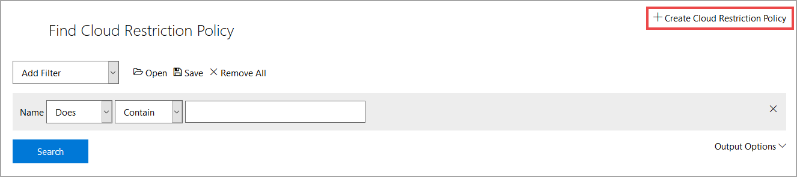

# Create a Restriction Policy

A restriction policy is used by a cloud provider, to limit the resources that can be provisioned by the cloud provider. This helps to prevent additional charges from incurring if students configure something in the Cloud portal that is outside of the scope of the lab. Restriction Policies also help students stay within the goals of the lab.

For more information about the items that can be used in a Restriction Policy, see [Microsoft Azure Restriction Policy Templates](https://docs.microsoft.com/en-us/azure/azure-policy/json-samples).

>[!alert] In LOD, restriction policies are housed inside of a resource group. If you have not created a Resource Group, you will not be able to configure the Restriction Policy to the lab profile until the Resource Group is created and assigned to the lab profile. See our guide for more information about [creating a resource template and configure it into a resource group](create-a-resource-template-and-configure-it-into-a-resource-group.md). 

## Creating a Restrcition Policy in Lab on Demand (LOD)

1. **Navigate** to the **Cloud Services** tile, on the LOD Admin page.

1. Click **Cloud Restriction Policies**.

1. Click **Create Cloud Restriction** Policy in the upper-right corner of the page. 

   

1. Enter the following values into the Create a Restriction Policy form:

    |Tab|Field Name|Field Value|
    |--|--|--|
    |**Basic Information**|**Name**|A name of your choosing.|
    ||**Description**|Describe the intentions and goals of the Restriction Policy.|
    ||**Organizaton**|Select the organization that the Restriction Policy will be available to.|
    ||**Restriction Policy**|Enter the Restriction Policy here, in JSON format.|
    ||**Enabled**|Check the box to enable this Restriction Policy for use.|

1. Enter the following values into the Create a Restriction Policy form:

## Adding a Restriction Policy To a Cloud Slice Lab in LOD

1. Navigate to the lab profile that you wish to add the Restriction Policy to.

    >[!knowledge] You can search for your lab profile by doing the following:
    >
    >1. Return to the Lab on Demand Administration page.
    >
    >1. Click Find Lab Profiles to find your lab profile.
    >
    >1. Enter the name of the lab profile into the **Name** field, and change the operator drop down adjacent to it to **Equal**. 
    >
    >1. Click **Search** to find your lab profile.
    >
    >1. In the search results, click the Name of your lab profile to open the Lab Profile details view.

1. Click **Edit Profile** to open the edit view for your lab profile.

1. Select the **Cloud** tab.

1. Scroll down to your resource group, then click **Add Restriction Policies** below the _Cloud Restriction Policies_ heading.

1. Enter the name you gave your Restriction Policy into the **Name** field, and change the operator drop down adjacent to it to **Equal**. (Restriction Policy created in previous steps)

1. Click **Search** to find your Restriction Policy.

1. Select your Restriction Policy in the list of results, then click **OK**.

1. Click **Save** to save the updated lab profile.

With this Restriction Policy in place, lab users will be restricted from creating resources that are defined in the Restriction Policy, in their Cloud Slice lab.

[Back to top](#create-a-restriction-policy)