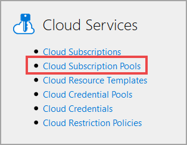
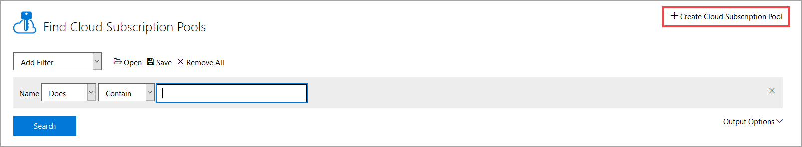

# Create a Cloud Subscription Pool

Cloud Subscription Pools are used by labs to provision Cloud Slices in a load balanced fashion. As users launch a Cloud Slice lab, they will be given access to a slice of one of the available subscriptions in the subscription pool associated with the lab. Even if you are only using one managed Cloud Subscription, you still must create a Cloud Subscription Pool. This setup allows you to add additional subscriptions to your subscription pool later, at which point you will gain the benefits of the load balancing support that the platform provides.

Load balancing evenly distributes Cloud Slices across subscriptions in a Cloud Subscription Pool. When a user launches a Cloud Slice lab, they are provided with a slice of whichever subscription in the pool has the lightest load (the lowest number of users) at the time. This load balancing distributes resource load across all of the subscriptions in the pool, which can help keep resource counts lower, avoiding any maximum limits that the subscriptions in the pool have on specific resource types.

1. To **create a Cloud Subscription**, click on **Cloud Subscription Pools** from the Lab on Demand Administration page. 

1. Next, click **Create Cloud Subscription Pool** in the upper-right corner of the page. 

## Basic Information

1. **Name**: The name of the Cloud Subscription Pool being created.

1. **Description**: The Description should describe the capabilities or the intent of the Subscription Pool.

1. **Organization**: The organization in LOD where the managed Cloud Subscription pool will be used.

1. **Enabled**: This checkbox determines if the Cloud Subscription Pool is enabled or disabled.

1. **Block lab launches when no subscriptions are available**: This checkbox determines if lab launches should be blocked if no subscriptions are available.

1. **Custom subscription unavailable message**: This message will be presented to users if they try to launch a lab and a subscription is unavailable. If this field is blank, the default message will be used.

