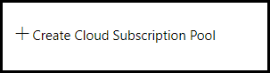

# Create a Cloud Subscription Pool

Cloud Subscription Pools are used by labs to provision Cloud Slices in a load balanced fashion. As users launch a Cloud Slice lab, they will be given access to a slice of one of the available subscriptions in the subscription pool associated with the lab. Even if you are only using one managed Cloud Subscription, you still must create a Cloud Subscription Pool. This setup allows you to add additional subscriptions to your subscription pool later, at which point you will gain the benefits of the load balancing support that the platform provides.

Load balancing evenly distributes Cloud Slices across subscriptions in a Cloud Subscription Pool. When a user launches a Cloud Slice lab, they are provided with a slice of whichever subscription in the pool has the lightest load (the lowest number of users) at the time. This load balancing distributes resource load across all of the subscriptions in the pool, which can help keep resource counts lower, avoiding any maximum limits that the subscriptions in the pool have on specific resource types.

To add a Cloud Subscription Pool to OneLearn Lab on Demand (LOD), perform the following steps:

1. Navigate to the <a href="https://labondemand.com" target="_blank">OneLearn Lab on Demand portal</a> and sign in.

1. Open the **Subscription Pools** section on the Cloud Services tile.

   

1. Click **Create Cloud Subscription Pool** to create a new cloud subscription pool in LOD.

   

1. Select a cloud platform from the **Cloud Platform** drop-down menu. 

1. Select a pool type from the **Pool Type** drop-down menu.

   > Choose Manual for Azure or choose Automated for AWS

1. Select a subscription mode from the **Subscription Mode** drop-down menu. 

   > Choose Shared for Azure or choose Dedicated for AWS

1. Assign values to **Name**, **Organization**, and any optional fields you want to use. 

   |Field Name|Description|
   |----|----|
   |Name&nbsp;(required)|The name of the Cloud Subscription Pool being created.|
   |Description|The Description should describe the capabilities or the intent of the Subscription Pool.|
   |Organization&nbsp;(required)|The organization in LOD where the managed Cloud Subscription pool will be used.|
   |Enabled|This checkbox determines if the Cloud Subscription Pool is enabled or disabled.|
   |Custom&nbsp;subscription&nbsp;unavailable&nbsp;message|This message will be presented to users if they try to launch a lab and a subscription is unavailable. If this field is blank, the default message will be used.|
   |Enable&nbsp;Health&nbsp;Checks&nbsp;|Enable health checks across all subscriptions in this pool. LOD will periodically check the subscription for configuration errors and other potential problems.|
   |Health&nbsp;Check&nbsp;Interval&nbsp;|Health check frequency. The health checks for each subscription will be completed at the specified interval.|
   |Enabled&nbsp;|Enables the subscription pool for use. Unchecking this box will disable the subscription pool.|)

1. On the **Authentication Tab**, assign values to **Tenant Name**, **Application ID**, and **Application Secret**. 

   |Field Name|Description|
   |----|----|
   |**Tenant&nbsp;Name**|The name of the tenant used for deployment of Cloud Slices in your cloud service.|
   |**Application&nbsp;Id**|The identifier that uniquely identifies the client used to manage your cloud service subscription.|
   |**Application&nbsp;Secret**|The secret used to authenticate your client id in your cloud service subscription.|

1. If you are configuring a cloud subscription pool for **AWS**, On the **Automation Tab**, assign values to **Number of Subscriptions** and **Subscription Name Prefix**.

|Field Name|Description|
   |----|----|
   |**Number&nbsp;Of&nbsp;Subscriptions**|For dedicated pools, subscriptions will be automatically created ahead of time. When this hapens, LOD will create up to the number of subscriptions specified here. Please ensure that all limits on your account or subscription (set by the cloud host provider) are greater than or equal to the number entered here. For example, if your subscription limit or account limit is 20, you should not enter more than 20 in this field. |
   |**Subscription&nbsp;Name&nbsp;Prefix**|When subscriptions are created, the name of the subscription or account will start with this text.|

1. Click **Save** to create the Cloud Subscription Pool.

[Back to top](#create-a-cloud-subscription-pool)

<!--
1. To **create a Cloud Subscription**, click on **Cloud Subscription Pools** from the Lab on Demand Administration page. 

1. Next, click **Create Cloud Subscription Pool** in the upper-right corner of the page. 

## Basic Information

1. **Name**: The name of the Cloud Subscription Pool being created.

1. **Description**: The Description should describe the capabilities or the intent of the Subscription Pool.

1. **Organization**: The organization in LOD where the managed Cloud Subscription pool will be used.

1. **Enabled**: This checkbox determines if the Cloud Subscription Pool is enabled or disabled.

1. **Block lab launches when no subscriptions are available**: This checkbox determines if lab launches should be blocked if no subscriptions are available.

1. **Custom subscription unavailable message**: This message will be presented to users if they try to launch a lab and a subscription is unavailable. If this field is blank, the default message will be used.

-->
