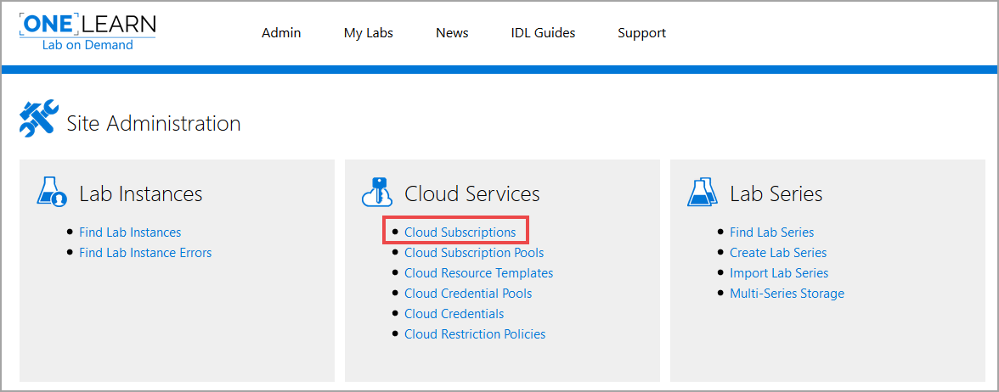

<!--

# Create a Cloud Subscription
Cloud Subscriptions are used to configure labs to utilize cloud environments, including cloud resources. 

1. To **create a Cloud Subscription**, click on **Cloud Subscriptions** from the Lab on Demand Administration page. 

1. Next, click **Create Cloud Subscription** in the upper-right corner of the page. 

## Basic Information

1. **Name**: The name you want to use to identify your managed cloud subscription.

1. **Subscription ID**: The identifier that uniquely identifies the cloud subscription you are managing on the cloud platform where you have enabled Cloud Slice support.

1. **Description**: Text used to describe the managed Cloud Subscription that you are setting up.

1. **Organization**: The organization in LOD where the managed Cloud Subscription will be used.

1. **Cloud Subscription Pool**: Choose the Cloud Subscription Pool you wish to use with the Cloud Subscription.

1. **Onwer Name**: The name of the the Cloud Subscription Owner

1. **Owner E-mail**: The e-mail address of the the Cloud Subscription Owner

1. **Expires After**: The date that the Cloud Subscription will expire.

1. **Enabled**: Indicates whether or not the managed Cloud Subscription is enabled.

## Authentication

1. **Tenant Name**: The name of the tenant used for deployment of Cloud Slices in your cloud service.

1. **Application ID**: The identifier that uniquely identifies the client used to manage your cloud service subscription.

1. **Application Secret**: The secret used to authenticate your client id in your cloud service subscription.

## Storage

1. **Template Storage Account**: The name of a storage account inside of the Template Storage Resource Group where the template VHDs may be found. 

1. **Template Storage Resource Group**: The name of a Cloud Resource Group in the managed Cloud Subscription that contains template VHDs that you would like to copy into a lab during its deployment.

1. **Template Storage**: The name of a container in the Template Storage Account where the template VHDs may be found.

1. **Instance Storage Account**: The name of a storage account inside of the Instance Storage Resource Group where template VHDs will be copied when a Cloud Slice lab configured to use those template VHDs is deployed.  You may use the same storage account as the one used for the Template Storage Account field.

1. **Instance Storeage Resources Group**: The name of a Cloud Resource Group in the Cloud Slice where template VHDs will be copied when a Cloud Slice lab configured to use those template VHDs is deployed. You may use the same resource group as the one used for the Template Storage Resource Group field.

1. **Instance Storage**: The name of a container in the Instance Storage Account where template VHDs will be copied when a Cloud Slice lab configured to use those template VHDs is deployed.

-->
