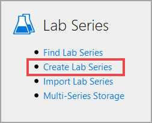

# Create Lab Series

Lab Profiles in Lab on Demand (LOD) can be housed in a lab Series. The Lab Series contains Lab Profiles, settings for the Lab Series, as well as 

he lab profile is where the settings are configured for the lab. These settings include (but are not limited to): Name, owning organization, expected duration, resource requirements, virtual machines, network configuration, and much more. Lab profiles can exist on their own or they can be part of a Lab Series that contains multiple lab profiles. 

To create a Lab series, click **Create Lab Series** on the Lab Series tile, on the Site Administration page.

## Basic Informaiton 

1. **Name**: This is the display name of the Lab Series

1. **Description**: Provide a description of the Lab Series. This can include the goals and objectives of the Lab Series, a list of Lab Profiles in the Lab Series, or other information to describe the Lab Series. 

1. **Organization**: Select the Organization that will be the Owner of the Lab Series. 

1. **Advertising Campaign**: Select and Advertising Campaign, to use at the beginning of labs in the Lab Series.The Advertising Campaign must already be created to add it to the Lab Series using this button.

1. **Vendor**: This is used for an organization to create a Lab Series for another organization to use. Enter the name of the organization that will have access to use the Lab Series.

1. **Vendor Part #**: This is used for an organization to create a Lab Series for another organization, for a specific use, such as certifation preparation, etc. Enter the description or name of the specific use in this field. 

1. **# of Training Days**: The expected number of days for end users to use any of the lab profiles within the lab series. This does not restrict users from using labs after the expected number of days, it is used to determine resources consumption of the labs.

1. **Enabled**: Check this box to enable the Lab Series. If this box is left unchecked, the Lab Series will not be available to users.

## Concurrency Limits

1. **Max RAM Usage**: The maximum amount of RAM that can be used in the Lab Series, across all lab launches. Once this limit is reached, users will not be able to launch labs until another user closes their lab.

1. **Max Active Instances**: The maximum amount of lab instances that can be launched from the Lab Series. Once this limit is reached, users will not be able to launch labs until another user closes their lab.

## Lab Host Tags

1. **Add Lab Host Tag**: Lab host tags are used to specify which Lab Host(s) the lab profile will use when users launch the lab. The Lab Host tag must already be created to add it to the lab profile using this button.

## Publish

1. Select the organization(s) to publish the Lab Series to. This will make the Lab Series available to the Organization(s) that are chosen.

TEST 2

|Action|Icon|
|--|--|
| **Find** |  | 
| **Create** |  |       
| **Edit** |  |         
| **Delete** |  |      
| **Favorite on** |  |  
| **Favorite off** |  |

Test 3 

