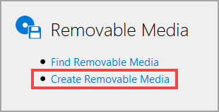

# Create Removeable Media

Removeable Media is used in lab environments, to supplement lab instrucitons. Removeable Media is used in the form of DVDs, or Floppy disks.

To create removeable media, click **Create Removeable Media** on the Removeable Media tile, on the Site Administration page.

## Basic Information

1. **Name**: This is the display name of the Removeable Media. It is helpful to name media with unique names, in the event that multiple removeable media items are used in the same lab.

1. **Description**: If there are multiples of the same media type used in a lab, it is helpful to provide a detailed description, to be able to tell which removeable media to use.

1. **Series**: Select the Lab Series that the removeable media will be associated with. Any lab profile in the lab series will be able to utilize the removeable media.  

1. **Organization**: Select the organization that the removeable media will be available to. 

1. **Type**: Select the type of removeable media; Optical (DVD) or Floppy disk.

1. **Path**: **Microsoft** (Hyper-V) or **VMWare vSphere** (ESXi)

_We don't recommend sharing removable media profiles between vendor platforms. However, if you need this removable media to be available to both Microsoft-based and VMware-based platforms, you will need to ensure that the file resides in the same relative location for both vendors._

