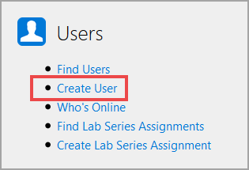

# Create a User Profile

Users log in to OneLearn Lab on Demand to launch, author and develop labs, as well as other components that are used to create a lab. 

## Basic Information 

1. From the Admin page, click **Create User** on the **Users** tile.

1. **Upload Image** (optional): Upload an image to use as the user profile picture.

1. **First Name**: The first name of the user.

1. **Last Name**: The last name of the user.

1. **Email**: The email address of the user.

1. **Username**: Create a unique username that the user will use to log in.

1. **Password**: Create a password that the user will use to log in. Passwords must be a minimum of 8 characters.

1. **Confirm Password**: Re-type the password to confirm the password was entered correctly. 

1. **Organization**: Select the organization that the user belongs to. 

1. **API Consumer**: Select the API consumer that will be used when the user launches labs.

1. **Time Zone**: Select the time zone of the user. This will be used to display time in the user's time zone. 

1. **Delivery Region**: Select the region where the user's labs will launch from. This can be set to a specific region or inherit from the organization that the user belongs to. 

1. **Max Active Labs**: Set the maximum number of labs that the user can actively have running at a time. 

1. **Max Saved Labs**: Set the maximum number of labs that the user can save at a time. If the user reaches the maximum number of saved labs, they will not be able to save another lab until one of the saved labs is cancelled. 

1. **Max RAM Usage**: Maximum amount of RAM that the user can use to launch labs. 

## Roles

Roles are used to allow or restrict users from performing certain actions in the OneLearn Lab on Demand platform.

1. **Assing Role**: Click to assign a role to the user. Roles must already be created to add it to the lab profile using this button.

    - Multiple roles can be added, if needed. 
    
|Icon|Use|
|--|--|
| Find |  | 
| Create |  |       
| Edit |  |         
| Delete |  |      
| Favorite on |  |  
| Favorite off |  |

<!-- The below styling is to make the icon glyphs render properly-->

