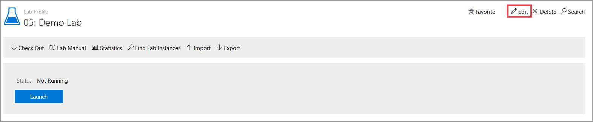
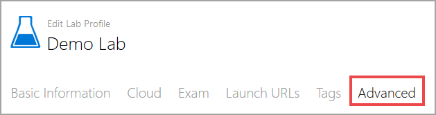
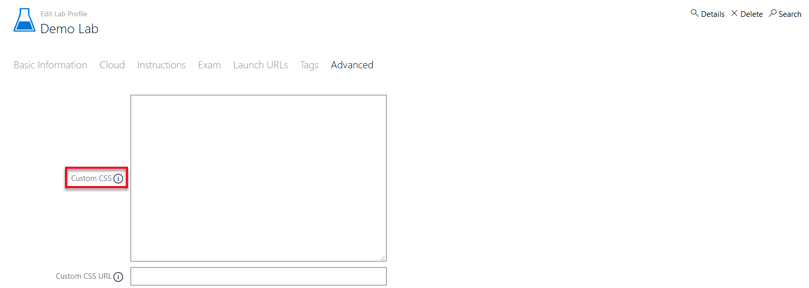
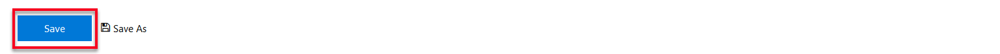

# Custom CSS Guide


Lab on Demand supports the use of custom CSS in lab profiles that are authored using software such as IDL Studio. This will allow the lab author to apply custom styling to the instructions in the lab, including font size and font color. Custom CSS syntax can be entered directly in the lab profile or stored in a file on a web server that allows access to the file via a URL.

### Adding Custom CSS

1. From the lab profile page, click **Edit** in the upper-right corner.

   

2. Next, click **Advanced** 

   

3. Custom CSS syntax can be entered directly into this text field. CSS markup that will be included in the lab client, making it possible to control the styles of the custom content added to the lab. This should just be the style definitions, including a style tag is not necessary. 

   

4. Custom CSS can also be stored in a stylesheet on an externally hosted web server and accessed via a URL. The stylesheet will be referenced in the lab client, making it possible to control the styles of the custom content added to the lab. Enter the URL in this field to apply custom CSS style to the lab profile. This method is useful if the same custom CSS should be applied to multiple lab profiles. This allows the custom CSS to be managed by on stylesheet and then the changes are applied to each lab profile that has the URL configured.

    **Note:** HTTPS is required for the URL to be accessed and applied to the lab profile. 

   

5. After custom CSS has been added directly to the lab profile or by URL, scroll the bottom of the page and click **Save** to apply the changes to the lab profile. 

   


### Custom CSS Examples

The following customizations can only be done using CSS.

- Exercise title when displaying introduction/completion message

```css
.ui-dialog-title{
   font-size: 18px
}
```

- Nextbutton when displaying introduction/completion message 

```css
.ui-button-text {
   font-size: 18px
}
```

- Done button (for tasks) 

```css
#done {
   font-size: 18px
}
```

---

The following customizations can be done globally using CSS or individually within the appropriate text editor/section in markdown.

- Exercise introduction/completion message body 

```css
#modalContent {
   font-size: 18px
}
```

- Task title that appears above the knowledge, etc. buttons

```css
#taskTitle {
   font-size: 18px
}
```

- Task text that appears at the bottom of the window
```css
#taskText {
   color: yellow;
   font-size: 18px
}
```
