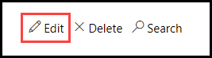
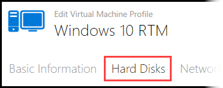
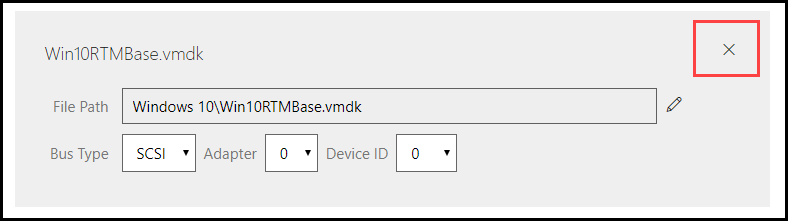

# Rollback Differencing Disks

A differencing disk is a virtual hard disk (VHD) that stores changes made on the virtual machine in the lab. The purpose of differencing disks is to contain the changes to the virtual disk since the previous differencing disk. This captures the current configuration in the lab, and if needed it allows changes to be made such as rolling back to a previous configuration or deleting disks.  

## Delete or Rollback to a Previous Disk

In Lab on Demand (LOD), to rollback to a previous differencing disk, you must delete any disks that were added after the disk you wish to roll back to.

1. In LOD, navigate to the VM profile you wish to change the disks on.
1. Click **Edit** on the VM Profile.

    

1. Click **Hard Disks** tab

    

1. Click the **X** next to the last disk to remove it.

    

>[!knowledge] If you're rolling disks back on a set of VMs that all belong to the same domain, make sure you roll each VM Profile back to the same point, otherwise you may run intoTrust Relationship errors between the virtual machines.

-----
## Adding a Deleted Disk Back to the VM Profile

When a disk is deleted from the VM profile, it is not deleted permanently. It is still available in storage. Once it is deleted from storage, it is permanently deleted and cannot be recovered. If you would like to add a disk back to the VM profile, you must manually add it back. 

To add a disk back to a VM profile, do the following:

1. From the VM Profile page, click **Edit**.
1. Scroll to the bottom of the disk chain and click **Add Differencing Disk**. 
1. Click **Use an existing virftual hard disk file**. 
1. Navigate to the **virtual hard disk** that you wish to add to the VM profile, and click **OK**.
1. If you receive any warnings after clicking OK, please read the warning carefully, as the disk you are attempting to use may cause issues with your VM profile. 
1. Click **Save**.

>[!alert] **It is highly recommended to leave a detailed note about the changes that were made**. This note will be on the VM profile details page, and available to you or any other lab developer that works on this VM. If a note is not saved, there may not be a way to determine what changes were made previously. You may also leave a note on the VM profile, without making any changes. You can do this from the VM details page, by clicking **New Note** in the Notes section.