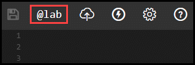
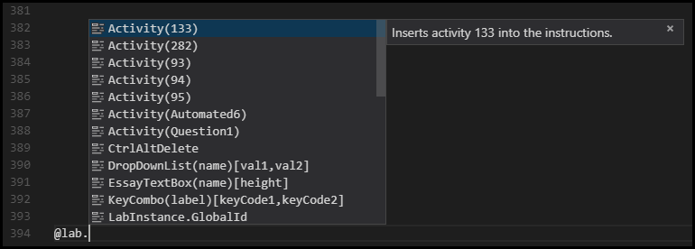
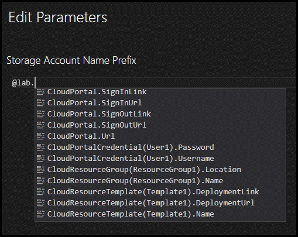

# Replacement Tokens

Replacement Tokens are used to replace text with a variable that is unknown at the time of authoring the lab. The value of these variables may not be generated or created until the lab is launched by the student. These can include usernames, passwords, user first name, user last name, running lab instance ID number, cloud platform information, virtual machines, etc. Replacement tokens use the syntax &commat;lab.replacementTokenName. 

> [!KNOWLEDGE] Some replacement tokens may not be available in your lab, depending on the lab's configuration. I.E. Cloud related tokens are not available in labs that do not use cloud orchestration, and virtualization related tokens are not available in labs that only use a cloud-based configuration. 

## Table of Contents 

-  [Using Replacement Tokens in Lab Instructions](#using-replacement-tokens-in-lab-instructions)
-  [Using Replacement Tokens in a Cloud Resource Template](#using-replacement-tokens-in-a-cloud-resource-template)
    + [Using Replacement Tokens as Cloud Resource Template Parameters](#using-replacement-tokens-as-cloud-resource-template-parameters)
-  [Available Replacement tokens](#replacement-tokens)

## Using Replacement Tokens in Lab Instructions

You can see the list of all &commat;lab replacement tokens available to your lab by editing the instructions, and clicking on the &commat;lab button. Any replacement tokens that are applicable to your lab configuration, will be shown. 

   

Alternatively, while editing the lab instructions, you can type &commat;lab anywhere in the lab instructions, and all available replacement tokens will be displayed and selectable, with a description of each replacement token. 

   

## Using Replacement Tokens in a Cloud Resource Template

Each Cloud Resource Template is associated with a raw template document that defines the collection of resources that will be deployed in the cloud. Replacement tokens can be used inside of the raw templates itself, or as parameter values to the Cloud Resource Templates or in lab instructions, to provide some dynamic values that help keep resource names unique. 

To use replacement tokens inside a Cloud Resource Template, insert the &commat;lab replacement token(s) in to your raw template document where you want them to be used. 

> [!KNOWLEDGE] Using replacement tokens as Cloud Resource Template parameters is a best practice, and highly preferred over using replacement tokens directly inside of raw template documents. This helps help keep resource names unique. 

### Using Replacement Tokens as Cloud Resource Template Parameters 

When you are assigning parameter values for a Cloud Resource template, you can provide specific values, or you can apply &commat;lab replacement tokens. To apply a Replacement Token, in the parameter value field, enter _&commat;lab,_ and then press the period key. The moment you type the period you will be presented with all available replacement tokens for your lab, based on how the lab is configured.  

   

## Available Replacement tokens

The table below lists the replacement tokens that are available to use in Skillable Studio. 

> [!KNOWLEDGE] Some replacement tokens may not be available in your lab, depending on the lab's configuration. I.E. Cloud related tokens are not available in labs that do not use cloud orchestration, and virtualization related tokens are not available in labs that only use a cloud-based configuration. 

   > |Lab Replacement Token|Description|
   > |--|--|
   >|`@lab.Activity(Automated1)`|Inserts activity Automated1 into the instructions.|
   >|`@lab.Activity(Question1)`|Inserts activity Question1 into the instructions.|
   >|`@lab.LabInstance.Id`|The unique ID of the running lab instance.|
   >|`@lab.LabInstance.GlobalId`|The globally unique ID of the running lab instance.|
   >|`@lab.LabInstance.StartDate`|The UTC start date of the running lab instance. Format: **yyyyMMdd**|
   >|`@lab.LabProfile.Id`|The unique ID of the lab profile.|
   >|`@lab.User.Id`|The unique ID of user running the lab.|
   >|`@lab.User.FirstName`|The first name of the user running the lab.|
   >|`@lab.User.LastName`|The last name of the user running the lab.|
   >|`@lab.User.Email`|The e-mail address of the user running the lab.|
   >|`@lab.User.ExternalId`|The external ID of the user running the lab (if launched via    API).|
   >|`@lab.User.Organization.Id`|The ID of the organization the user belongs to.|
   >|`@lab.User.Organization.Name`|The name of the organization the user belongs to.|
   >|`@lab.Tag`|The tag associated with the lab instance (if specified when launched via    API).|
   >|`@lab.CtrlAltDelete`|Sends Ctrl+Alt+Delete to the currently active virtual machine.|
   >|`@lab.VirtualMachine(VirtualMachineName).SelectLink`|A link to select the VirtualMachineName virtual machine.|
   >|`@lab.VirtualMachine(VirtualMachineName).Username`|Username for signing into the VirtualMachineName virtual machine.|
   >|`@lab.VirtualMachine(VirtualMachineName).Password`|Password for signing into the VirtualMachineName virtual machine.|
   >|`@lab.VirtualMachine(VirtualMachineName).Console`|Inline console for the VirtualMachineName virtual machine.|
   >|`@lab.OpticalMedia(1).LoadLink`|A link to load optical media on the active virtual machine.|
   >|`@lab.FloppyMedia(1).LoadLink`|A link to load floppy media on the active virtual machine.|
   >|`@lab.Container(containerName).InstanceName`|The instance name for container (containerName).|
   >|`@lab.Container(containerName).Terminal`|Terminal for (containerName)|
   >|`@lab.Container(containerName).ExpostedPort(portValue).Address`|The address for the exposed port (portValue) on container (containerName).|
   >|`@lab.Container(containerName).ExpostedPort(portValue).HostName`|	The host name for the exposed port (portValue) on container (containerName).|
   >|`@lab.Container(containerName).ExpostedPort(portValue).HostPort`|The host port for the exposed port (portValue) on container (containerName).|
   >|`@lab.Container(alias).WebDisplayUrl`  | The web display URL for container (alias).|
   >|`@lab.Container(alias).WebDisplayPath` | The web display path (folder portion of the URL) for container (alias).|
   >|`@lab.CloudSubscription.Id`|The unique ID of the subscription the lab is launched against.|
   >|`@lab.CloudSubscription.Name`|The name of the subscription the lab is launched against.|
   >|`@lab.CloudSubscription.TenantName`|The tenant name of the subscription the lab is launched against.|
   >|`@lab.CloudResourceGroup(1).Name`|The instance name of the ResourceGroup1 resource group.|
   >|`@lab.CloudResourceGroup(StackName).Name`|The instance name of the (StackName) resource group. This applies to AWS only|
   >|`@lab.CloudResourceGroup(StackName).Location`|The cloud platform region/location where (StackName) resources are deployed.|
   >|`@lab.CloudResourceTemplate(Template1).Name`|The instance name of the VNET resource.|
   >|`@lab.CloudResourceTemplate(Template1).DeploymentLink`|A deployment link for the VNET resource.|
   >|`@lab.CloudResourceTemplate(Template1).DeploymentUrl`|A deployment URL for the VNET resource (rendered as text, not a link).|
   >|`@lab.CloudResourceTemplate(Template1).Parameters[complex-VNETName]`|The value sent for the complex-VNETName parameter when creating the VNET resource.|
   >|`@lab.CloudPortalCredential(User1).Username`|The username of the User1 cloud portal user account.|
   >|`@lab.CloudPortalCredential(User1).Password`|The password of the User1 cloud portal user account.|
   >|`@lab.CloudCredential(PoolName).Username`|The Username assigned from the PoolName credential pool.|
   >|`@lab.CloudCredential(PoolName).Password`|The Password assigned from the PoolName credential pool.|
   >|`@lab.CloudCredential(PoolName).TenantName`|The TenantName assigned from the PoolName credential pool.|
   >|`@lab.CloudCredential(PoolName).TenantPrefix`|The TenantPrefix assigned from the   PoolName credential pool.|
   >|`@lab.CloudPortal.Link`|A link to the cloud portal.|
   >|`@lab.CloudPortal.Url`|The cloud portal URL (rendered as text, not a link).|
   >|`@lab.CloudPortal.SignInLink`|A cloud portal sign-in link.|
   >|`@lab.CloudPortal.SignInUrl`|The cloud portal sign-in URL (rendered as text, not a link).|
   >|`@lab.CloudPortal.SignOutLink`|A cloud portal sign-out link.|
   >|`@lab.CloudPortal.SignOutUrl`|The cloud portal sign-out URL (rendered as text, not a link).|
   >|`@lab.TextBox(name)`|A text box that allows the user to set the value of a named    variable. This variable value can then be displayed elsewhere using @lab.Variable(name).|
   >|`@lab.MaskedTextBox(name)`|A text box with hidden contents used for passwords.|
   >|`@lab.DropDownList(name)[val1,val2]`|A dropdown list that allows the user to set the value of a named variable. This variable value can then be displayed elsewhere using @lab.Variable(name).|
   >|`@lab.KeyCombo(label)[key combo]`|Generates a button that sends a combination of key codes to the active VM.|
   >|`@lab.EssayTextBox(name)[height]`	|A larger essay style text box that can hold up to 5000 characters. **Height in number of lines declared by [height] is optional**. This variable value can then be displayed elsewhere using `@lab.Variable(name)`.|
   >|`@lab.LanguageName`| The name of the language used in the instruction set. Example: English.
   >|`@lab.LanguageCode`| The language code of the language used in the instruction set. Example: en.
   >|`@lab.LanguageName`| The region code of the language used in the instruction set. Example: en/US.