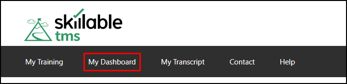
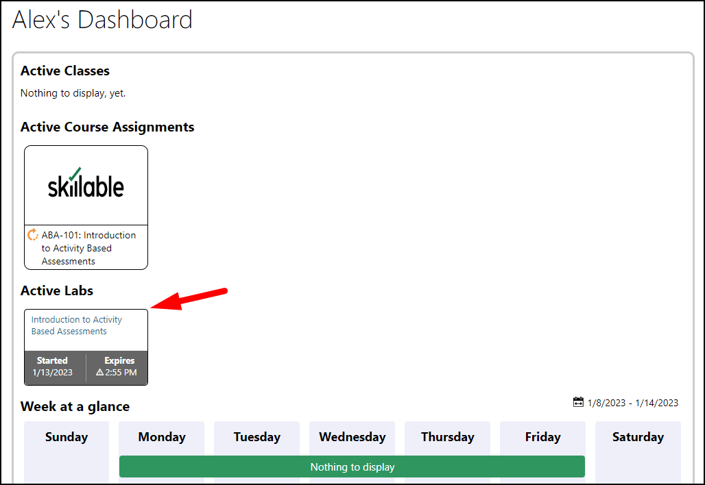

# Find a Running Lab 

If a lab instance window is closed by mistake, the lab may still be running.

To find a running lab:

1. Navigate to your _My Dashboard_ Page in Skillable TMS.

{600}

1. On the Dashboard page you should see lists of your training, course assignments and running labs. 

{600}

1. Selecting the name of the running lab will reopen the lab interface in a new window, allowing you to continue with the lab. If there are not any labs displayed in the _Active Labs_ section, the lab may have ended due to the lab timer expiring, or the lab may have been automatically saved due to inactivity. 

1. If the lab was automatically saved, you can resume it by repeating the previous steps. 

<!--search terms-->

<b>lab dashboard</b>
<b>running</b>
<b>resume lab</b>
<b>find lab</b>

