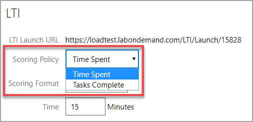
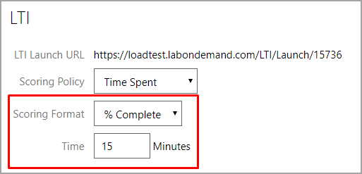
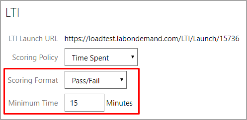
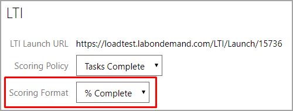

# How to get scoring results from LOD via LTI Outcomes

In LTI, the learning system being used by a student is referred to as the LTI Consumer, and the external tool or service that is being integrated into that learning system is referred to as the LTI Provider. This LTI support is what allows external course authors to integrate rich Lab on Demand content directly into their learning solution. Since LTI is a standard protocol, Lab on Demand content can be integrated into any learning system that supports the LTI standard as an LTI Consumer.

To integrate content from an LTI Provider into an LTI Consumer, the following information is required:

- LTI Client Key – this is the account identifier for the LTI Provider, which allows LTI Consumers to identify the account needed to access LTI Provider content; for OneLearn Lab on Demand, this is referred to as the LTI Key
- LTI Client Secret – this is the password/passcode used to authenticate to the LTI Provider account; for OneLearn Lab on Demand, this is referred to as the LTI Secret
- Content URI – this is the URI that exposes the content to be integrated into the LTI Consumer training materials; for OneLearn Lab on Demand, this is referred to as the LTI Launch URL

If you are an existing customer of Learn on Demand Systems and you want to launch your labs via LTI, request the LTI Key and LTI Secret for your lab(s) from support@learnondemandsystems.com.

Once you have these pieces of information in hand, you can begin integrating your Lab on Demand lab into an external course.

## LTI Scoring

LTI Scoring allows the lab to be scored based on the LTI scoring policy in the lab profile. The LTI scoring policy is configured on the Launch URLs tab of the lab profile. 

There are multiple options available for LTI Scoring. These can be changed at anytime from the lab profile, if necessary.

Click the **Advanced** tab of your lab profile to get started.

You will see either one or two options in the **Scoring Policy** drop-down menu, depending on whether or not the lab has IDL content: **Time Spent** (always present) or **Tasks Complete** (only present for labs that have IDL content).

- You can see these options in the screenshot below.

  

If you select **Time Spent**, the scoring will be based on how much time the student spends in the lab. The **Scoring Format** can be:

- **% Complete**, with the **Time** a student needs to spend in the lab to receive a score of 100%.

  

- **Pass/Fail**, with the **Minimum Time** a student needs to spend in the lab to pass the lab.

  

If you have IDL Content in the lab and select **Tasks Complete**, the scoring will be based on the number of tasks the student marks as complete by clicking **Done** on the task. The **Scoring Format** can be:

- **% Complete**, where the score is the exact percentage of the tasks the student marks complete.

  

- **Pass/Fail** with **Minimum Tasks Complete**, which represents the percentage of tasks the student needs to mark complete (click **Done**) to pass the lab.

  