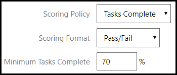

# Get Scoring Results From LOD via LTI Outcomes

Learning Tools Interoperability (LTI), the learning system being used by a student is referred to as the **LTI Consumer**, and the external tool or service that is being integrated into that learning system is referred to as the **LTI Provider**. This LTI support is what allows external course authors to integrate rich Lab on Demand content directly into their learning solution. Since LTI is a standard protocol, Lab on Demand content can be integrated into any learning system that supports the LTI standard as an LTI Consumer.

To integrate content from an **LTI Provider** into an **LTI Consumer**, the following information is required:

- **LTI Client Key** – this is the account identifier for the LTI Provider, which allows LTI Consumers to identify the account needed to access LTI Provider content; for OneLearn Lab on Demand, this is referred to as the LTI Key
- **LTI Client Secret** – this is the password/passcode used to authenticate to the LTI Provider account; for OneLearn Lab on Demand, this is referred to as the LTI Secret
- **Content URL** – this is the URL that exposes the content to be integrated into the LTI Consumer training materials; for OneLearn Lab on Demand, this is referred to as the LTI Launch URL

If you are an existing customer of Learn on Demand Systems and you want to launch your labs via LTI, request the LTI Key and LTI Secret for your lab(s) from [support@learnondemandsystems.com](mailto:support@learnondemandsystems.com).

Once you have these pieces of information in hand, you can begin integrating your Lab on Demand lab into an external course.

## LTI Scoring

LTI Scoring allows the lab to be scored based on the LTI scoring policy in the lab profile. There are 2 components to configure in LOD for LTI scoring; **Scoring Policy** and **Scoring Format**. 

To get started click the **Advanced** tab of your lab profile and scroll down to the **LTI** section.

- You will see either one or two options in the **Scoring Policy** drop-down menu, depending on whether or not the lab has IDL content: 
    - **Time Spent** (always present)  
    - **Tasks Complete** (only present for labs that have IDL content).

        

### Time Spent Scoring Policy

- If you select **Time Spent** scoring policy, the scoring will be based on how much time the student spends in the lab. 

    The **Scoring Format** has two options:

    1. **% Complete**, and the **Time** a student needs to spend in the lab, to receive a score of 100%.

        

    1. **Pass/Fail** and the **Minimum Time** a student needs to spend in the lab to pass the lab.

        

### Tasks Complete Scoring Policy

- If you have IDLx or IDL (legacy) Content in the lab and select **Tasks Complete**, the scoring will be based on the number of tasks the student marks as complete by clicking the **task checkbox** in IDLx content, or by clicking **Done** on the task in IDL (legacy) content. 

    The **Scoring Format** has two options:

    1. **% Complete**, where the score is the exact percentage of the tasks the student marks complete.

        

    1. **Pass/Fail** with **Minimum Tasks Complete**, which represents the percentage of tasks the student needs to mark complete to pass the lab.

        

Once you have finished configuring LTI scoring, click **Save**. 

>[!knowledge] These options can be changed at any time if necessary, by editing the lab profile and repeating the above steps. Any running labs will need to be relaunched to reflect the new configuration. 

## Integrating Content

Content can be integrated with various LMS systems (LTI Consumer). Below are some examples of how to use LTI with some popular systems. Scoring results can be obtained from the LTI Consumer that you chosen to integrated content into.

- [Blackboard](https://help.blackboard.com/Learn/Administrator/SaaS/Integrations/Learning_Tools_Interoperability)

- [edX](../guides/lti/lod-lti.md)

- [Moodle](https://docs.moodle.org/35/en/LTI_and_Moodle)

> ### Looking for more information?
>
>If you're looking for more information, or have questions, check out the resources available to you on our [Contact Us](/contact-us.md) page.

[Back to top](#get-scoring-results-from-lod-via-lti-outcomes)