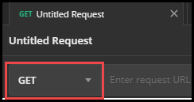

# API Consumer Usage and Best Practices

1. [How to Make an API Request](#how-to-make-an-api-request)
    - [API Request Format](#api-request-format)
    - [API Testing Tools](#api-testing-tools)
1. [API Consumer Best Practices](#api-consumer-best-practices)
    - [API Workflow](#api-workflow)
    - [Do Not Use Strict Mapping](#do-not-use-strict-mapping)
    - [Window Manipulation](#how-to-make-an-api-request)

<!--
## How to Use and Set Up an API Consumer in Lab on Demand

To obtain API Consumer access, please [submit a support ticket](https://lod.one/help) for assistance.

If you already have API Consumer access, and would like to use an API consumer with Lab on Demand (LOD), you must configure the API on the lab profile, lab series, and the organization profile that will be used with API calls. For more information on how the API can be used, have a look at our [API Documentation](lod-api/lod-api-main.md). 

- **Lab Series**: The lab series must be published to the API consumer that will be used. By publishing a lab series to an API Consumer, that API Consumer will be able to launch any current and future lab profiles that belong to that series.

- **Lab Profile**: A lab profile must be associated with a lab series.

- **Organization Profile**: The API Consumer needs to be made available to the organization that will use it. This should be the same organization that the lab series and lab profile belong to. 

### Lab Series

The lab series must be published to the API consumer that will be used. By publishing a lab series to an API Consumer, that API Consumer will be able to launch any current and future lab profiles that belong to that series. 

To publish the Lab Series, please contact our Support team at https://lod.one/help.

### Lab Profile

A lab profile must be associated with a lab series, to use the lab profile with an API.

To associate your lab profile with a lab series:

1. Navigate to the **lab profile** you wish to use.
1. Click **Edit profile**.
1. One the **Basic Information** tab, click the Choose button next to Lab Series.
1. Enter the **name** of the lab series you wish to associate the lab profile with, and click **Search**. 
1. Select the lab series and click **Ok**.
1. Click **Save**.

### Organization Profile

The API Consumer needs to be made available to the organization that will use it. This should be the same organization that the lab series and lab profile belong to. 

To make the API Consumer available, please contact our Support team at https://lod.one/help.

Your API Consumer is now setup and is ready to use. If you would like to view the various ways you can interact with LOD via API, have a look at our [API Documentation](lod-api/lod-api-main.md).

-->

## How to Make an API Request

Only lab profiles with a development status of **Complete** are consumable via API. 

- Requests are not case sensitive. Requests can use either **GET** or **Post**. 

    - **GET**: used to request data from a specified resource.

    - **POST**: used to send data to a server to create/update a resource.

### API Request Format

API requests use Methods and Parameters in the URL.

A typical API request would look like:

`https://labondemand.com/api/v3/[method]?[parameters]`

>[!knowledge] A request to launch a lab will look like:
>
>`https://labondemand.com/api/v3/launch?labid=100&userid=555&firstname=Joe&lastname=Smith&email=joe.smith@email.com`
>
>
>
>**launch** is the **method**.
>
>**labid**, **userid**, **firstname**, **lastname** and **email** are the >**parameters**.
>
>- **labid**: this is the lab ID of the lab that is to be launched. The ID can be >found in the URL while viewing the lab profile in LOD. 
>
>- **userid**: the user ID you use to identify the user in your external system.
>
>- **firstname**: the first name of the user that the lab launch will be associated with. 
>
>- **lastname**: the last name of the user that the lab launch will be associated with. 
>
>- **email**: the email address on the user profile of the user that the lab launch will be associated with. 

### API Testing Tools

If you want to test your API requests before implementing them, you can do so using an API testing tool. There are many tools available for testing an API request. One of the most common tool used is Postman, and is available on Windows, macOS and Linux (x32/x64).

In this guide, we will walk through the steps to use the _Launch_ APi request, to launch a specified lab for a specified user.

To launch a lab via an API request in Postman:

1. Download [Postman](https://www.getpostman.com/downloads/).

1. **Launch the installer** and install Postman.

1. **Open** Postman.

1. Click the **+ (plus) icon** in postman to create a new request. 

    

1. Click **Request** in the dialog that pops up.

1. Ensure that **GET** is selected. 

    

1. Copy the example API request below from the [Launch API request documentation](https://docs.learnondemandsystems.com/lod/lod-api/lod-api-launch.md):

    - `https://labondemand.com/api/v3/launch?labid=100&userid=555&firstname=Joe&lastname=Smith&email=joe.smith@email.com`

1. Paste the URL into Postman.

    

1. You'll see that Postman parses the URL and displays query parameters in the appropriate field in the **Value** column.

    

1. Replace the text in the **value** column, with data that corresponds to the **key** column. I.E. replace _100_ with the lab ID of the lab that is to be launched.

    

1. Next, **Headers** need to be configured with the API key, to authenticate and use the API consumer. The API key is found in LOD, or it can be obtained from your organization. 

    

1. Click **Show** and copy the API key. 

1. In Postman, click the **Headers** tab.

    

1. Enter the **API Key** in the **Value** Column.

1. Enter `api_key` in the **key** column. 

    

1. The API request now has all required information to successfully launch a lab. Click **Send** to submit the API request.

    

1. The lab will now launch for the specified user. Postman will return a JSON response with information about the result of the API request. The information in the response corresponds with the information on the Launch API details documentation. 

    

    - **Result**: 1 = success.

    - **URL**: the URL to the lab instance.

    - **LabInstanceID**: 148562 = the lab instance ID.

    - **Expires**: when the lab will expire (in Unix epoch time).

    - **ExpiresTime**: when the lab will expire (in Unix epoch time).

    - **EstimatedReadySeconds**: the estimated amount of seconds it will take for the lab to be ready for use.

    - **Error**: in the event of an error, this will contain a detailed error message.

    - **Status**: 1 = success.

## API Consumer Best Practices

### API Workflow

As a best practice the API key should **never** be exposed to client side code. Below is a sample workflow for using and integrating API calls. The sample assumes that the client side has a button or page that the student clicks to launch a lab via API. 

1. Student clicks a button that initiates the API call. 

1. An ajax call is made to the customer-owned service, or learning management system.

1. The customer-owned service makes a Launch API call and receives the lab URL from Lab on Demand. 

1. The ajax call returns to the browser and includes the lab URL.

1. Client-side code redirects to the URL or spawns a new window and directs the new window at the lab URL. 

>[!knowledge] Spawning a new window is preferred for the following reasons:
> - It allows for the browser window to be resized to the ideal size for the student's machine. Resizing can't be done in a redirect, as browser's do not allow resizing of user-opened windows. 
> - The student is able to maintain the page they launched the lab from. It is best practice to launch the lab in its own window, so the student can navigate to the page the lab was launched from if needed. 

### Do not use Strict Mapping

We advise against using strict mapping of API objects. We will add new API objects, but we will not remove any API objects that are already in place. If API objects are strictly mapped, your API integration may not work properly when new API objects are added.

### Window Manipulation

If you launch a lab in a new window using JavaScript, Lab on Demand (LOD) will resize the lab window after it is launched. 

To launch a lab in a new window, use the following JavaScript:
    
`window.open(labUrl, "lab", "width=800,height=600,status=0,resizable=1,toolbar=0,menubar=0,location=0,scrollbars=0");`

This tells the browser to open a new window with dimensions of 800x600. After a new window is opened, LOD will resize the window appropriately for the lab type that is being launched (Virtualization or Cloud Slice). Since the initial window dimensions were set by a script, future scripts are permitted to change those dimensions (resize the window). 

>[!alert] Windows spawned in any other context are only resizable by the user. If you open the window using an HTML link, or simply redirect the current window to the lab URL, LOD will be prevented from resizing the window.

- **Cloud Slice** labs consist of two windows; the resource portal and lab console. 
- **Virtualization** based labs consist of one window; the virtual machine and the lab console. 
    - Lab console: on the right side of the screen, housing the instructions and any lab resources. 
    - Resource portal: on the left side of the screen, housing the cloud platform or the virtual machine(s) that the lab utilizes. 

[Back to top](#api-consumer-usage-and-best-practices)
