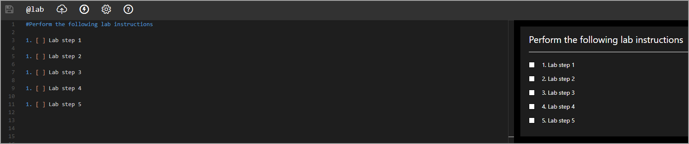

# IDLx Lab Instruction Editor Overview

**Resource Portal (left Window)**: used to write lab instructions, using Markdown, HTML, or a combination of both. 

 **Lab Console (right window)**: Lab instructions will be displayed how they will be when lab users launch the lab. 

### Top row icon explanation from left to right:

- **Disk icon:** Click to save current progress; this is not necessary if autosave is enabled.
- **&commat;lab:** Replacement Tokens are used to create a placeholder for dynamic text that will be added to the lab when it is launched. This is helpful if you do not know the information at the time of authoring the lab, but would like specific information to be inserted later when the user is in the lab. Examples of this are usernames, passwords, unique ID numbers, etc.
- **Upload:** Used to upload files or images to the lab.
- **Activities:** Activities Menu
    - Question Activities
    - Automated Activities
- **Gear icon:** Lab Instruction Editor Settings Menu.
    - Word wrap: enables work wrap.
    - Preview: enables preview of how your lab instructions will render in a lab.
    - Sync Preview Location: syncs your cursor location in lab instructions with the Preview.
    - Autosave: enables the lab instructions to autosave
    - Theme: select a theme for the lab instruction editor.
    - Editor zoom: adjusts the zoom level on the instruction editor.
    - Preview zoom: adjusts the zoom level on the preview pane of the instruction editor. 
    - Track Task Progress: enables the percentage of completed tasks to be reflected on the lab instance page, as well as the class page if the lab is part of an active class. 
    - Auto-check previous tasks: when this is enabled and a task is completed, all previous tasks will be automatically checked. 
- **Qustion Mark icon (markdown help):** displays common Markdown syntax, used for reference while writing lab instructions. Clicking the *Learn More* button will display more information that may be helpful with authoring your lab.