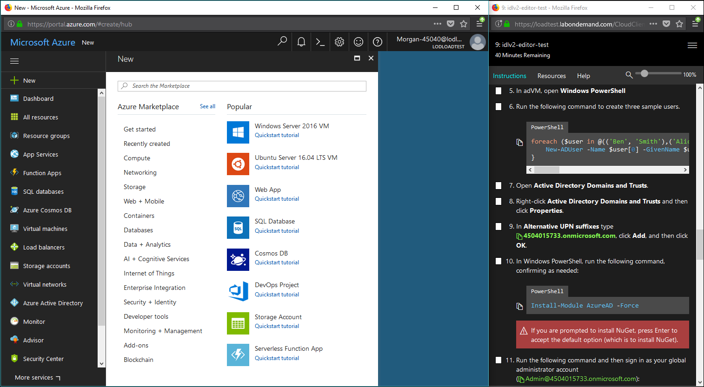

# IDLx Lab Interface Overview

The lab client is divided into two main parts: the **Lab Console**, and the **Resource Portal**.

## Lab Console 

 In the screenshot above, you see a sample lab showing a portion of the **instructions** for the lab and the title of the lab module as well as the amount of time remaining, at the top of the Lab Console. Adjacent to the Instructions tab in the Lab Console are two additional tabs; **Resources** and **Help**. 
- **Instructions**: All instructions written in idl-md will be rendered in the Instructions tab.

- **Resources**: The Resources tab allows the user to select a resource that they want to view (such as a cloud portal, a managed virtual machine, or a URL). Users can also insert/remove optical media into managed virtual machines from the Resources tab.

- **Help**: The Help tab allows users to change the theme of the Lab Client, or change the Machine Remote Controller (if the lab has managed VMs). It also provides users with the ID of their lab instance along with other relevant details (depending on the type of lab launched), and links to view a FAQ, submit a support request, or report a bug.

There are additional functions in the Lab Console:  

- **Zoom**: This allows the user to adjust the zoom level of the lab instructions to make the text larger or smaller. 

- **Save/Exit menu**: This menu is represented by three horizontal lines, in the upper-right corner of the Lab Console. This menu allows the lab to be saved (if saving is enabled on the lab by the lab author), or end the lab. This menu also allows lab authors to edit the lab instructions.

## Resource Portal

This window will show users whatever resource they are currently viewing in the lab. Resources shown may be cloud portals, managed virtual machine desktops, videos, images, or any URL that you want displayed in the **Resource Portal**. Users can change what is shown in the portal by clicking on the resource in the Resources tab in the **Lab Console**, or they can click on links in the instructions to change what is shown in the portal if the author included links to do so using Markdown syntax.
